## The bar

In a Souls level, an enemy is placed the way a note is placed in a bar of music: at a
specific spot, facing a specific way, at a specific distance from the last one, because of
what the player will be doing and looking at when they arrive. Placement is the level
designer's instrument for turning a small roster into a hundred different problems. The
same Naga levy is a warm-up on open ground, a real fight on a ledge, and a genuine threat
when it is between you and a crossbowman.

Two rules carry most of the weight. **The sightline rule**: the player must be able to see
an enemy, and take a decision about it, from a position where the enemy cannot yet reach
them. **The fair-ambush rule**: an ambush is legitimate only if it leaves a mark — a
corpse, a scuff, a suspicious alcove, an unexplained lit brazier — that a careful player
could have read. Souls ambushes are famously survivable on a second run and famously not
random.

Around all of it sits the **bonfire loop**: the unit of pacing. From a rest, the player
should face a legible arc — a warm-up, a build, a peak, and a resolution that is either a
new bonfire or a shortcut back to the old one. Density inside that arc is budgeted, not
sprinkled, and the runback after a death is a designed object with a cost ceiling.

Per ARBITRATION S5, bonfire rest respawns ordinary enemies; per S7, bonfires are not a
teleport network. The loop is therefore something the player physically walks, repeatedly,
and it must survive that repetition.

## The reference artifact

### A. Units and definitions

| Term | Definition |
|---|---|
| **Traversal minute (TM)** | one minute of movement along the critical path at reference walk speed **2.0 m·s⁻¹** (**120 m per TM**), measured with zero combat and zero pauses. ~~3.4 m·s⁻¹ / 204 m per TM~~ — **AMENDED wave 0 (corpus-audit)**: walk speed is owned by `RI-WLD01` §Movement speeds and fixed by ARBITRATION **S17** at 2.0 m·s⁻¹; this item may not define a second one. See §H. |
| **Critical path** | the shortest route from bonfire A to the loop's terminal (bonfire B or the shortcut back to A) that a player who knows the level would take |
| **Encounter** | a set of enemy instances whose aggro is coupled (RI-AI01 §B propagation) and which the player must resolve or evade as one problem |
| **Encounter volume** | the convex region containing an encounter's enemies plus 6 m |
| **Bonfire loop** | bonfire → critical path → terminal (next bonfire, or a permanent shortcut back) |
| **Reveal distance `d_rev`** | distance from the player, along the critical path, at which an enemy first becomes visible (unoccluded, within the player's 70° FOV at gameplay camera) |
| **Threat distance `d_thr`** | distance at which that enemy could first land a hit given its aggro state, speed, and reach |
| **Sightline margin** | `d_rev − d_thr`, in metres, and its time equivalent at the enemy's approach speed |

### B. The sightline rule

| # | Rule | Value |
|---|---|---|
| SL1 | Minimum sightline margin, non-ambush enemy | `d_rev − d_thr ≥ 6.0 m`, and ≥ 1.6 s at the enemy's sprint speed |
| SL2 | Minimum margin, RANGED / CASTER | `≥ 12.0 m` (the player must see the shooter before the first projectile) |
| SL3 | Minimum margin, POISE_MONSTER / ELITE | `≥ 10.0 m` — big things must be seen from far |
| SL4 | First-of-archetype placement | `≥ 14.0 m`, solo, lit, with retreat (RI-AI05 §D introduction rule) |
| SL5 | Retreat availability | for ≥ 70% of encounters, a player can back out along the path they entered by and break aggro (RI-AI01 T25) without passing another encounter |
| SL6 | No blind drops onto enemies | a fall of > 2 m must not land the player within 8 m of an unaggroed enemy unless that enemy is visible from the ledge before the drop |
| SL7 | No aggro through geometry | verified by RI-AI01 M1's LOS requirement; a critic re-checks it per placement |
| SL8 | Encounter separation | ≥ 18 m between the boundaries of adjacent encounter volumes, so that fighting one does not automatically pull the next — **except** where a chained pull is the authored point, which must be flagged (`chain_pull: true`) and capped at 2 per loop |

### C. The fair-ambush rule

| # | Rule | Value |
|---|---|---|
| AM1 | Ambush density | ≤ 1 per **2.55 TM** (~~1.5 TM~~, re-derived at 120 m/TM), and ≤ 3 per bonfire loop |
| AM2 | Pre-tell required | every ambush position must carry ≥ 1 authored environmental cue visible ≥ 8 m before trigger (corpse, dropped weapon, scratch marks, disturbed water, an item placed as bait, an unexplained light) |
| AM3 | Cue legibility | the cue must be identifiable in a still frame taken at the trigger-minus-8 m position at gameplay camera and lighting — verified as a blind panel |
| AM4 | Never lethal on first contact | an ambush's opening attack may not exceed severity S2 (≤ 35% refHP) and may not be a grab |
| AM5 | Escape exists | the ambush position must leave ≥ 1 exit that does not require killing the ambusher |
| AM6 | No stacked ambush | an ambush may not trigger a second ambush; an ambush may not be a gank duo of 2 ambushers |
| AM7 | Reveal on repeat | after the first trigger, the ambusher's idle position must be visible from `d_rev ≥ 6 m` on subsequent runs (i.e. it does not re-hide) |

### D. Density budget

> **AMENDED wave 0 (corpus-audit).** Every per-TM figure below was re-derived when the
> traversal minute was corrected from 204 m to 120 m (§A, §H). **The physical densities are
> unchanged** — an enemy per metre of critical path is exactly what it was; only the unit it
> is quoted in moved. Original 204 m values are kept in the struck-through column so the
> derivation is auditable. Counts, ratios, fractions and metre distances are dimensionless
> in TM and did **not** change.

| Metric | Target | Hard range | Was (at 204 m/TM) |
|---|---|---|---|
| Enemy instances per TM | **1.65** | 1.05 – 2.45 | ~~2.8 / 1.8 – 4.2~~ |
| Encounters per TM | **0.88** | 0.59 – 1.29 | ~~1.5 / 1.0 – 2.2~~ |
| Enemies per encounter (mean) | 1.9 | 1.4 – 2.6 | unchanged (dimensionless) |
| Traversal minutes per bonfire loop | **8.5** | 5.95 – 11.90 | ~~5.0 / 3.5 – 7.0~~ |
| Enemies per bonfire loop | **14** | 9 – 22 | unchanged (a count) |
| Encounters per bonfire loop | **8** | 6 – 12 | unchanged (a count) |
| Solo : grouped encounter ratio | **55 : 45** | 45:55 – 65:35 | unchanged (a ratio) |
| Gank duos per loop (RI-AI05 A10) | 1 | 0 – 2 | unchanged |
| Ambushes per loop | 1–2 | 0 – 3 | unchanged |
| ELITE encounters per loop | 0 or 1 | ≤ 1 | unchanged |
| Fraction of encounters evadable without combat | **0.35** | 0.25 – 0.50 | unchanged (a fraction) |
| Longest stretch with zero enemies | 1.02 TM | ≤ 1.70 TM | ~~0.6 / ≤ 1.0~~ |
| Longest stretch with zero *rest* (no enemy-free 15 s) | — | ≤ 2.04 TM | ~~≤ 1.2~~ |

Region modifiers applied to "enemy instances per TM" (RI-AI05 §D regions):

| Region | Multiplier | Effective enemies/TM | Was (204 m/TM) |
|---|---|---|---|
| R1 | 0.85 | 1.40 | ~~2.4~~ |
| R2 | 1.00 | 1.65 | ~~2.8~~ |
| R3 | 1.05 | 1.73 | ~~2.9~~ |
| R4 | 1.10 | 1.82 | ~~3.1~~ |
| R5 | 1.00 | 1.65 (density falls, lethality rises) | ~~2.8~~ |

R5's return to baseline is deliberate: late-game difficulty comes from archetype mix
(RI-AI05 §D) and geometry, not from more bodies.

### E. Loop shape — the four-beat contract

Every bonfire loop must be decomposable into four beats along the critical path.

| Beat | Fraction of loop TM | Content | Purpose |
|---|---|---|---|
| **B1 Warm-up** | 0.15 – 0.25 | 1–2 solo encounters of the region's most common archetype, open ground, high sightline margin | re-establish rhythm after a rest; safe place to learn |
| **B2 Build** | 0.30 – 0.40 | 3–5 encounters, first grouped encounter, first geometry constraint (ledge, stair, water), 0–1 ambush | introduce this loop's specific problem |
| **B3 Peak** | 0.20 – 0.30 | the loop's hardest encounter: gank duo, or an elite, or a grouped encounter on bad ground; a visible landmark | the thing the player will die to |
| **B4 Resolution** | 0.15 – 0.25 | 1–2 encounters at most, then the terminal (bonfire or shortcut) visible from ≥ 15 m away | let the player breathe and see the reward |

Rules: B3 must never be immediately adjacent to the terminal (≥ **0.68 TM** of B4 between them
— ~~0.4 TM~~, re-derived at 120 m/TM; the physical separation, ≈ 82 m, is unchanged —
so the player does not die *at* the finish line repeatedly). B1's first encounter must be
≥ 25 m from the bonfire, so resting is not immediately contested.

### F. The runback contract

Applies to any death, not only boss deaths (bosses additionally bound by RI-AI06 §D).

| # | Rule | Value |
|---|---|---|
| RB1 | Runback time to the point of death | ≤ 1.4 × the traversal time of the loop segment, walking, knowing the route |
| RB2 | Runback enemies, mandatory (unavoidable) | ≤ 2 for a mid-loop death; ≤ 1 for a boss fog gate (RI-AI06 F2 is stricter) |
| RB3 | Runback survivability | ≥ 95% survival at region reference build, optimal route, no combat |
| RB4 | Shortcut cadence | ≥ 1 permanent shortcut per 2 bonfire loops; a shortcut opens **from the far side** and permanently |
| RB5 | Shortcut discovery | the far side of a shortcut must be visible (locked door, unreachable ladder, one-way drop) from the near side at first pass, so the player anticipates it |
| RB6 | Bloodstain recoverability | the bloodstain position must be reachable without killing any respawned enemy in ≥ 80% of death positions |
| RB7 | No runback through a boss arena | never |
| RB8 | Respawn integrity | rest respawns ordinary enemies (ARBITRATION S5); named NPCs, merchants and quest actors never respawn and are never placed inside an encounter volume |

### G. Worked example — **R3 loop 2: "Drowned Stair → Choir Gate"** (Xanmeer)

Region R3 (refHP 950). Critical path 1 040 m ⇒ **8.67 TM** (~~5.1 TM at 204 m~~; the path is
the same 1 040 m). Terminal: Vakka-Zhil fog gate
(RI-AI06 §E) plus a root-ladder shortcut back to Drowned Stair.

```mermaid
graph LR
  BF["🔥 Drowned Stair"] --> E1
  E1["E1 · 1× INFANTRY<br/>flooded terrace · d_rev 22m"] --> E2
  E2["E2 · 1× INFANTRY<br/>colonnade · d_rev 17m"] --> E3
  E3["E3 · 3× SWARM<br/>open plaza · d_rev 26m"] --> E4
  E4["E4 · 1× RANGED (high)<br/>+ 1× INFANTRY (low)<br/>GANK · d_rev 19m"] --> E5
  E5["E5 · AMBUSHER<br/>collapsed arch · cue: 2 corpses"] --> E6
  E6["E6 · 1× TURTLE<br/>stair chokepoint · d_rev 14m"] --> E7
  E7["E7 · 1× POISE_MONSTER<br/>+ 2× SWARM<br/>sunken court · d_rev 24m"] --> E8
  E8["E8 · 1× CASTER (elevated)<br/>+ 1× TURTLE<br/>GANK · d_rev 21m"] --> SC
  SC["🪜 root-ladder shortcut<br/>(opens on first arrival)"] --> FG
  FG["🌫️ Choir Gate"]
```

| Enc | Beat | Comp | Count | Solo? | `d_rev` | `d_thr` | Margin | Evadable? | Geometry | Notes |
|---|---|---|---|---|---|---|---|---|---|---|
| E1 | B1 | INFANTRY | 1 | yes | 22 m | 8 m | 14 m | yes | open terrace, ankle water | 31 m from bonfire ✓ |
| E2 | B1 | INFANTRY | 1 | yes | 17 m | 8 m | 9 m | yes | colonnade, pillars | teaches pillar LOS |
| E3 | B2 | SWARM ×3 | 3 | no | 26 m | 9 m | 17 m | no | open plaza | arc-control question |
| E4 | B2 | RANGED + INFANTRY | 2 | no | 19 m | 7 m (melee) / 22 m (shot) | 12 m vs shooter ✓ SL2 | partly | shooter on a 4 m ledge | gank duo #1 |
| E5 | B2 | AMBUSHER | 1 | yes | trigger at 4 m | 2 m | — | yes (SL/AM5) | collapsed arch | cue: 2 corpses + dropped spear at 11 m ✓ AM2 |
| E6 | B3 approach | TURTLE | 1 | yes | 14 m | 6 m | 8 m | no | stair chokepoint | guard-break question on bad ground |
| E7 | **B3** | POISE_MONSTER + SWARM ×2 | 3 | no | 24 m | 10 m | 14 m ✓ SL3 | no | sunken court, 2 exits | the loop's peak |
| E8 | B4 | CASTER + TURTLE | 2 | no | 21 m | 18 m (spell) | ✓ SL2 | yes | caster on a root buttress | gank duo #2 |

**Budget check**

| Metric | This loop | Target / range | Verdict |
|---|---|---|---|
| Traversal minutes | 8.67 | 5.95 – 11.90 | ✓ |
| Enemy instances | 14 | 9 – 22 | ✓ |
| Enemies per TM | 1.62 | 1.05 – 2.45 (R3 target 1.73) | ✓ |
| Encounters | 8 | 6 – 12 | ✓ |
| Encounters per TM | 0.92 | 0.59 – 1.29 | ✓ |
| Solo : grouped | 4 : 4 = 50 : 50 | 45:55 – 65:35 | ✓ |
| Gank duos | 2 | 0 – 2 | ✓ (at ceiling) |
| Ambushes | 1 | 0 – 3 | ✓ |
| Elites | 0 | ≤ 1 | ✓ (this loop's peak is a composition, not an elite) |
| Evadable fraction | 4/8 = 0.50 | 0.25 – 0.50 | ✓ (at ceiling) |
| Longest enemy-free stretch | 0.94 TM (E8 → fog gate, ≈ 112 m) | ≤ 1.70 TM | ✓ |
| B1/B2/B3/B4 TM fractions | 0.20 / 0.36 / 0.26 / 0.18 | within all bands | ✓ (fractions, unaffected) |
| B3 → terminal separation | 0.75 TM (≈ 90 m) | ≥ 0.68 TM | ✓ |
| Boss runback (RI-AI06 F1) | 41 s walking, 3 enemies, 2 avoidable | ≤ 60 s, ≤ 4, ≥ 2 | ✓ |

## Comparison method

Harness: the enemy trace (RI-AI01 §A) plus two static dumps the level pipeline must emit:

**placement dump** — one row per authored enemy instance:
`{eid, archetype, region, loop_id, encounter_id, group_id, pos, facing, patrol_route,
 ambush_flag, ambush_cue_ids, chain_pull, first_appearance_index}`

**topology dump** — `{loop_id, bonfire_pos, terminal_pos, critical_path_polyline,
 path_length_m, shortcut_ids, encounter_volumes[], occluders[]}`

If either dump is absent, every check below scores 0 (fail-closed).

**M1 — Density census (headline).**
For each bonfire loop: `TM = path_length_m / 120` (**AMENDED wave 0**; ~~/ 204~~). Count enemy instances and encounters
along the critical path (an enemy counts if its encounter volume intersects a 12 m corridor
around the path).
- Compute enemies/TM, encounters/TM, mean enemies per encounter, solo:grouped ratio.
- **PASS** if every metric is inside §D's hard range and enemies/TM is within **±0.35** of the
  region target (~~±0.6~~, re-derived at 120 m/TM).
- **Headline number: enemy instances per traversal minute; fail if outside 1.05 – 2.45**
  (~~1.8 – 4.2~~ at the superseded 204 m/TM).
- **FAIL** if solo-encounter fraction < 0.45 (a level of nothing but groups is a level with
  no place to learn a single enemy) or > 0.65 (no compositional difficulty at all).

**M2 — Sightline margin (automated, per enemy).**
For each non-ambush enemy: sample the critical path at 0.5 m intervals approaching the
encounter. At each sample, raycast from the player camera position (gameplay height and
FOV) to the enemy's chest node.
- `d_rev` = path distance at the first unoccluded, in-FOV sample.
- `d_thr` = the enemy's aggro radius `R` if it would aggro at that point, else the distance
  at which its fastest gap-closer + sprint reaches the player in ≤ 1.0 s.
- **PASS** if the SL1–SL4 margins hold for ≥ 95% of enemies, 100% for SL4 first-appearances.
- **FAIL** if median margin < 4 m across the level, or if any RANGED/CASTER has margin < 8 m.

**M3 — Ambush fairness.**
For each `ambush_flag == true` instance: assert ≥ 1 `ambush_cue_id` exists, is within the
level, and is visible (raycast, in-FOV) from the trigger-minus-8 m path position.
- Render a still at that position and present it in a blind panel: 20 stills, half from
  ambush approaches and half from non-ambush stretches. Ask the critic "is there an ambush
  ahead?".
- **PASS** if cue presence is 100% and blind-panel discrimination ≥ 65%.
- **FAIL** if discrimination ≈ chance (50% ± 5) — the cues are decorative.
- Also assert AM4 (opening attack severity ≤ S2, not a grab) from the statblocks, and AM1
  density.

**M4 — Chain-pull audit.**
Run a scripted "loud player" (sprint the whole loop, no stealth). From the trace, for each
encounter, record how many enemies from *other* `encounter_id`s enter AGGRO within 8 s.
- **PASS** if unflagged chain pulls (encounters pulling ≥ 1 enemy from another encounter)
  occur in ≤ 10% of encounters, and flagged `chain_pull` encounters number ≤ 2 per loop.
- **FAIL** if a single sprint through the loop can aggro ≥ 8 enemies simultaneously — the
  level has no encounter structure, only a population.

**M5 — Evadability.**
Script a "runner" that sprints the critical path, never attacks, and uses no consumables.
Run 20× per loop at region reference build.
- Compute the fraction of encounters resolved without combat, and the runner's survival.
- **PASS** if evadable fraction ∈ [0.25, 0.50] and runner survival ∈ [15%, 60%].
- **FAIL** if runner survival > 80% (the level can be ignored entirely) or < 5% (there is
  no runback strategy and the runback contract is unsatisfiable).

**M6 — Beat structure.** From the topology dump plus encounter positions, segment the path
into quartiles by the §E fractions and compute per-beat encounter count, mean archetype
threat weight (use RI-AI05 souls yield as the threat proxy), and geometry constraint flags.
- **PASS** if the threat-weight series is non-monotonic with its maximum in B3, and B4's
  weight ≤ 0.6 × B3's.
- **FAIL** if threat weight is flat (±15%) across all four beats — no pacing, just a
  uniform sprinkle — or if the maximum is in B4 (dying at the finish line).

**M7 — Runback contract.** For each of 20 sampled death positions per loop (generated by
scripting the player to die at each encounter), compute: walking time from the bonfire to
the death position, mandatory enemy count on the optimal route, and 20 scripted no-combat
runback survival trials.
- **PASS** if RB1–RB3 hold for ≥ 90% of sampled positions and 100% of boss fog gates.
- **FAIL** if any sampled runback exceeds 1.4× segment traversal time by more than 50%.
- Assert RB6: from each death position, is the bloodstain reachable without killing a
  respawned enemy? **PASS** at ≥ 80%.

**M8 — Shortcut cadence and anticipation.** From the topology dump: count shortcuts per
loop; for each, raycast from the near-side first-pass position to the shortcut's far-side
marker.
- **PASS** if ≥ 1 shortcut per 2 loops, all shortcuts permanent (assert by re-running the
  loop after a rest and checking the shortcut state flag), and ≥ 80% visible from the near
  side on first pass (RB5).

**M9 — Respawn integrity (ARBITRATION S5/S6).** Rest at the bonfire, then re-walk the loop.
- **PASS** if every `ambush_flag == false` ordinary enemy is restored to its authored `pos`
  and `facing` (within 0.5 m / 5°), every ambusher is now visible at `d_rev ≥ 6 m` (AM7),
  and zero named NPCs / merchants / quest actors were respawned or are inside any encounter
  volume.
- **Any respawned named NPC is an automatic fail** of the piece.

**M10 — First-appearance placement.** Cross-check with RI-AI05 M4 using
`first_appearance_index`: assert solo, non-ambush, `d_rev ≥ 14 m`, ≥ 2 exits, lit.
- **Any violation is a hard fail.**

## Scoring

| Check | Weight |
|---|---|
| M1 density census | 4 |
| M2 sightline margin | 5 |
| M3 ambush fairness | 4 |
| M4 chain-pull audit | 3 |
| M5 evadability | 2 |
| M6 beat structure | 3 |
| M7 runback contract | 4 |
| M8 shortcut cadence | 2 |
| M9 respawn integrity | 3 |

Each 0/1/2 × weight. Max 60.

| Total | Verdict |
|---|---|
| 53–60 | Meets the bar |
| 40–52 | Below bar — named remedy required |
| ≤ 39 | Loses outright |

**Hard fails regardless of total:**
- M9: any respawned named NPC / merchant / quest actor (ARBITRATION S5, AR-2).
- M10: any archetype first-appearance in an ambush or a group.
- M2: median sightline margin < 4 m across a level.
- M4: a single sprint aggroing ≥ 8 enemies at once.
- M3: any ambush with zero authored cue, or an ambush opening at severity ≥ S3, or an
  ambush grab.
- Placement or topology dump absent (fail-closed).

Blind pair: give the critic two unlabelled loop tables (ours, and §G) with archetype names
replaced by role letters and positions replaced by path-distance and `d_rev`. It states
which loop it believes was authored beat-by-beat and which was sprinkled, before reveal.

**Native → ladder anchors — the row mandated by `SCORING.md` §1.2 (BAR-CRITIQUE-01 W7).**
Added wave-1-prep to close BAR-CRITIQUE-02 **C1**; derived from this item's own bands above.
**No threshold in this item was changed.**

| Ladder | 4 | 6 | 8 |
|---|---|---|---|
| Native | 40 / 60 | 46 / 60 | 54 / 60 |

**Aggregation (a property of this item, not of the critic):** weighted-sum — each check 0/1/2 x weight, max 60.

## How we lose

1. **Enemies scattered by a spawner.** A radius, a count, and `Math.random()` positions.
   Every metric in §D lands somewhere plausible by accident, and every metric in §B fails:
   there is no `d_rev`, no facing, no relationship between an enemy and the geometry it
   stands on. This is the default in a Three.js project and it is invisible in a screenshot.
2. **Uniform sprinkle.** Enemies placed evenly along the path because that is what "level
   populated" looks like in an editor. M6's threat-weight series is flat; there is no peak,
   no warm-up, no breath, and the level has no shape at 5-minute scale even though every
   individual fight is fine.
3. **No sightlines because there are no occluders.** Or the opposite: the level is all
   corners, so every enemy is a surprise and `d_rev ≈ d_thr` everywhere. M2's median-margin
   check catches both, and the second one will be defended as "atmospheric".
4. **Aggro leaks and the level pulls as one blob.** No encounter volumes, no propagation
   caps, so the first shout wakes the wing and the player fights 11 enemies in a corridor.
   M4. The team will read this as "the level is hard" rather than "the level has no
   encounter structure".
5. **Cheap ambushes.** Enemies dropped from ceilings, spawned behind the player, or teleported
   in on a trigger volume, with no cue and no counterplay. AM2/AM4/M3. Spawning an enemy
   *behind* a player who has already passed is the specific version that will be argued for
   as "tense" and it must be refused: it violates SL1 with a margin of zero.
6. **Ambush cue that is not readable.** A corpse is placed, but there are corpses everywhere
   as set dressing, so the signal-to-noise is nil. M3's blind panel measures exactly this,
   and a discrimination score at chance is the correct fail.
7. **Runback punishment.** Bonfire placed for map convenience rather than pacing, so a death
   at the loop's peak costs 3 minutes and four mandatory fights. Players stop experimenting
   and start playing safe, which makes the combat worse for reasons the combat is not
   responsible for. RB1–RB3, M7.
8. **Shortcut opens on boss death.** The shortcut exists but unlocks after it is useful,
   which is the exact inversion of its purpose. RB4/RI-AI06 F4.
9. **Shortcut with no anticipation.** The lift appears from nowhere; the player never saw the
   locked door from the other side, so the loop never closes emotionally. RB5, M8.
10. **Density inflation as difficulty.** R4 is R2 with twice as many enemies per metre.
    Enemies/TM climbs past 2.95 (~~5~~ at the superseded 204 m/TM), encounters merge, and the
    level becomes attrition. §D's hard
    range and the region multipliers exist so a critic can point at a number rather than
    argue taste. Note this is the encounter-scale version of the health-sponge failure and
    it will be committed by the same instinct.
11. **Nothing is evadable.** Every encounter is a mandatory arena with closed doors, so no
    runback strategy exists, every death costs the full loop, and the level cannot be
    learned in pieces. M5's runner-survival floor.
12. **Everything is evadable.** The opposite: the critical path is a clean corridor and every
    enemy can be jogged past, so the level's population is decorative and the souls economy
    in RI-AI05 §E never materialises. M5's runner-survival ceiling.
13. **Named NPCs inside encounter volumes.** The merchant is standing four metres from a
    patrol; a stray arrow aggros him; he dies; a quest thread is severed by placement rather
    than by player choice. ARBITRATION S5 and S10 both bear on this; M9 makes it a hard fail.
14. **Placement authored without walking it.** The most common real cause of every failure
    above. The remedy is procedural in the method: M2/M5/M7 all *walk the path* in the
    harness, which is the automated substitute for the designer's own feet.
15. **Respawn drift.** After a rest, enemies come back at slightly different positions or
    facings (because they were placed by a spawner, see 1), so the loop is never twice the
    same and the player cannot build route knowledge. M9's 0.5 m / 5° tolerance.
16. **The loop is one long corridor with no terminal in sight.** B4's "terminal visible from
    ≥ 15 m" clause exists because the reward for finishing a loop must be *seen* before it is
    reached; otherwise the player's mental model is an endless level rather than a series of
    closed arcs.

## Provenance note

`provenance: constructed`. The traversal-minute unit, the **120 m/TM** reference
(~~204 m/TM~~, see §H), every density
figure, the sightline margins, the fair-ambush rules, the four-beat contract, the runback
budgets, and all tolerances are **defined for this project**. No published source states
"enemies per traversal minute" for any FromSoftware level; the metric is ours and its value
is that it is computable from a placement dump and a path polyline.

Grounding is `canonical-recall` (confidence: medium) of Dark Souls level structure: bonfires
spaced at a few minutes of travel; a legible escalation within each stretch; ambushes that
are memorable but survivable on repeat and reliably marked by environmental storytelling;
a mix of solo and grouped placements with grouped ones concentrated at the hard moments;
and the possibility of running past most of a level, which is what makes runbacks tractable.

Community and craft sources corroborate the qualitative rules rather than the numbers. The
Level Design Book's Undead Burg study observes that Dark Souls deliberately leaves ambushers
*exposed* rather than hidden, on the principle that an ambush is fair if the player is smart
enough to read it — which is precisely rule AM2
([book.leveldesignbook.com/studies/sp/undead-burg](https://book.leveldesignbook.com/studies/sp/undead-burg)).
The same body of craft writing identifies the loop-back shortcut — a door that is one-way
locked on first encounter and becomes a permanent connection from the far side — as Dark
Souls' signature level-design contribution, which is rules RB4/RB5, and frames encounter
pacing as a sequence of rooms each with entry-read / engagement / exit, which is the
ancestor of §E's four-beat contract. `provenance: community-data` applies to those three
qualitative claims specifically; every number attached to them is constructed.

Cross-dependencies: RI-AI05 owns the archetype mix per region and the introduction rule that
M10 re-checks here. RI-AI01 owns aggro propagation, which M4 measures. RI-AI06 owns the boss
runback, which is stricter than §F and wins where they overlap. ~~The 3.4 m·s⁻¹ reference walk
speed is a placeholder owned by the frame-data / movement item; if it changes, the 204 m/TM
constant is recomputed and every density figure in §D is re-derived, not re-argued.~~
**AMENDED wave 0 (corpus-audit):** the placeholder was resolved. Reference walk speed is
**2.0 m·s⁻¹**, owned by `RI-WLD01` and fixed by ARBITRATION **S17**; registered in
`corpus/00-doctrine/constants.json` as `world.walk_speed_mps`. The clause above was honoured
exactly as written — the 120 m/TM constant was recomputed and every density figure in §D
re-derived rather than re-argued. See §H.

### H. Amendment record — the traversal-minute correction (wave 0, corpus-audit)

This item originally defined its own reference walk speed of 3.4 m·s⁻¹, giving 204 m per
traversal minute. `RI-WLD01` §Movement speeds and ARBITRATION **S17** independently fix walk
speed at **2.0 m·s⁻¹**, giving **120 m** per traversal minute. The two definitions were
**70% apart**, and because the traversal minute is the denominator of every density, beat and
sightline figure here — and is consumed by `RI-WLD02`, `RI-AI06` and `RI-PRG06` — the
divergence silently corrupted every downstream number.

**Ruling: 2.0 m·s⁻¹ / 120 m per TM.** Reasons, in order of weight:

1. **S17 is a seam ruling**, and ARBITRATION §5 puts seam rulings above any individual item's
   comparison method. A reference item may not define a constant a seam ruling already fixes.
2. **RI-WLD01 owns the movement-speed table** (walk 2.0, jog 3.2, sprint 5.0, swim 1.1,
   tide-wade 1.3 m·s⁻¹). 3.4 m·s⁻¹ is not in it — it is not the walk, not the jog, not the
   sprint. It was an unowned number.
3. **This item's own provenance note licensed the recomputation** in advance.
4. RI-WLD02 already computes at 120 m/min, so the corrected TM makes the two density items
   commensurable for the first time.

**What changed:** only labels and units. Every physical quantity — enemies per metre,
encounters per metre, metres of separation, counts per loop, ratios and fractions — is
**bit-identical to what this item asserted before the amendment.** A level that passed §D at
204 m/TM passes §D at 120 m/TM. Conversion applied: per-TM rates × 120/204 = ×0.5882;
TM-lengths × 204/120 = ×1.70; counts, ratios, fractions and metre distances unchanged.

**Consumers that must re-read this section:** `RI-WLD02` (density per minute — now
commensurable, no edit needed), `RI-AI06` (boss runback, quoted in seconds — unaffected),
`RI-PRG06` (enemy budget — see CORPUS-COHERENCE-01 §2 for the 576-enemy reconciliation).
