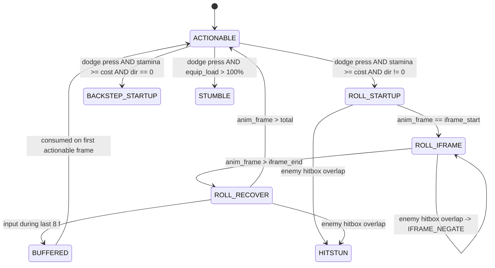

## The bar

The roll is the single most-executed action in a Souls fight and the one the player's hands
learn first. "Good" means: pressing dodge produces a **fixed-length animation with a fixed,
frame-counted window of invulnerability that begins a few frames after the press and ends
well before the animation does**, so that a roll is a *commitment* — you can be hit at the
start of it and you can be hit at the end of it, and the skill of the game is placing the
middle of it on top of the enemy's weapon. The player must be able to feel, without being
told, that heavier armour makes the window smaller and the recovery longer, and that
crossing the fat-roll threshold is a cliff, not a slope. A roll that is invulnerable for its
whole duration is a dash; a roll whose invulnerability is a boolean set on animation start
and cleared on animation end is not a Souls roll at all; a roll that can be interrupted or
re-issued mid-animation deletes the entire risk model.

## The reference artifact

### A. Upstream models (what the two games actually do)

| Property | Dark Souls 1 (PTDE/Remastered) | Dark Souls 3 |
|---|---|---|
| Equip-load breakpoints | **25%** (fast) / **50%** (mid) / **100%** (fat) | **30%** (light) / **70%** (medium) / **100%** (heavy/fat) |
| i-frames, light roll | 11 | 13 |
| i-frames, medium roll | 11 (more ending lag) | 13 |
| i-frames, heavy/fat roll | ~11 nominal but effectively negated by instability + lag | 12 |
| Ninja-flip (Dark Wood Grain Ring, ≤25%) | 13, instability frames removed | n/a |
| Roll stamina cost | fixed, moderate | low; chainable ~10× on a full bar |
| Community verdict | i-frames are stingy, recovery is the differentiator | i-frames are generous, cost is too cheap |

Both models are legitimate. **Neither is ours.**

### B. `ES-ROLL/1` — the canonical model for this game (BINDING)

We take **DS3's 30% / 70% breakpoints** (they read better on a stat sheet and give a real
middle tier) with **DS1's stinginess about what a roll buys you** (fewer i-frames than DS3,
a real recovery tail, a stamina cost you can run out of). Frames are at a fixed 60 Hz
simulation step. Frame indices are 1-based and inclusive.

| Tier | Equip load | Startup (vulnerable) | **i-frames** | Recovery (vulnerable) | Total | Stamina | Ground distance | Speed of animation |
|---|---|---|---|---|---|---|---|---|
| `LIGHT` | ≤ **30.00%** | f1–f2 (2) | **f3–f15 (13)** | f16–f26 (11) | **26 f (433 ms)** | **22** | 5.20 m | 1.00× |
| `MEDIUM` | 30.01–**70.00%** | f1–f2 (2) | **f3–f13 (11)** | f14–f30 (17) | **30 f (500 ms)** | **26** | 4.40 m | 1.00× |
| `HEAVY` (fat roll) | 70.01–**100.00%** | f1–f3 (3) | **f4–f8 (5)** | f9–f44 (36) | **44 f (733 ms)** | **34** | 2.60 m | 0.72× |
| `OVERLOADED` | > 100.00% | — | **0** | — | **60 f** stumble | **40** | 1.10 m | 0.55× |

Backstep (dodge input with no directional input):

| Tier | Startup | i-frames | Recovery | Total | Stamina | Distance |
|---|---|---|---|---|---|---|
| `LIGHT` / `MEDIUM` | f1–f2 | **f3–f6 (4)** | f7–f21 | 21 f | 14 | 2.30 m |
| `HEAVY` | f1–f3 | **0** | f4–f30 | 30 f | 20 | 1.60 m |
| `OVERLOADED` | — | 0 | — | 40 f | 26 | 0.70 m |

**The fat-roll threshold is 70.00%.** At 70.00% the player has 11 i-frames and a 30-frame
roll. At 70.01% they have 5 i-frames and a 44-frame roll. This discontinuity is deliberate
and must be audible/visible: the roll animation changes clip, the footfall gains a thud, and
the equip-load readout in the menu changes colour. `OVERLOADED` additionally forbids
sprinting and jump-attacks.

### C. Rules that are as binding as the numbers

1. **Invulnerability is a frame window, never a flag with a timer.** The simulation asks
   "is `anim_frame ∈ [iframe_start, iframe_end]`?" every fixed step. There is no
   `setTimeout`, no `invulnerable = true; ... invulnerable = false`, no seconds-based
   comparison anywhere on this path.
2. **I-frames grant *hit-negation*, not *hitbox removal*.** The player's hurtbox continues
   to exist and continues to be swept and tested (RI-CMB04); the overlap is detected, an
   `IFRAME_NEGATE` event is emitted, and damage/poise/status are all zeroed. This matters
   because the trace must be able to prove the dodge was *timed*, not *spatial*.
3. **A roll is uncancellable.** From press to the final recovery frame, no input changes the
   outcome. There is no roll→roll cancel, no roll→attack cancel, no turning mid-roll beyond
   the direction chosen at frame 1.
4. **Direction is latched at frame 1** from the movement-stick vector at the moment of the
   press (under lock-on, see RI-CMB06). Stick movement during frames 2–26 is ignored.
5. **Root motion is authoritative.** The 5.20 m of a `LIGHT` roll comes from the animation
   clip's root track, not from `velocity × dt`. The character controller consumes the root
   delta and resolves it against collision; it never adds its own translation.
6. **Input buffer = 8 frames.** A dodge press during the last 8 frames of any animation is
   stored and fires on the first frame the character is actionable. A press earlier than
   that is **dropped**, not queued. Exactly one action may be buffered at a time; a later
   press overwrites the buffer.
7. **Insufficient stamina drops the input.** If `stamina < cost` on the frame the roll would
   start, nothing happens — no partial roll, no queued roll, no debt. (See RI-CMB03; this is
   the rule that produces the `no_stamina` drops in the RI-CMB07 exemplar.)
8. **Equip load is evaluated once, at the frame of the press**, from
   `carried_equipment_weight / max_equip_load`. Changing gear mid-roll cannot change the
   roll in flight.

### D. State machine (roll subgraph)

Note the two `HITSTUN` edges and the absence of a third. Being hit on frames 1–2 or 16–26 of
a `LIGHT` roll is the entire cost model of dodging.

### E. Derived quantities a critic should recompute rather than trust

| Quantity | `LIGHT` | `MEDIUM` | `HEAVY` |
|---|---|---|---|
| Invulnerable fraction of animation | 13/26 = **0.500** | 11/30 = **0.367** | 5/44 = **0.114** |
| Vulnerable frames after i-frames end | 11 | 17 | 36 |
| Max rolls on a full 120 bar (no regen) | 5 | 4 | 3 |
| Widest enemy active window fully negated | 13 f | 11 f | 5 f |
| Rolls/second if chained back-to-back | 2.31 | 2.00 | 1.36 |

Tolerances for all frame counts in §B: **±0 frames**. These are integers in a fixed-step
simulation; "close enough" is not a category. Distances: **±0.15 m**. Stamina costs: **±0**.

## Comparison method

Script: **`corpus/80-methods/m-cmb01-roll-iframes.mjs`**

Harness assumption: headless Node + Three.js sim, fixed 60 Hz step, seeded, driven by a
scripted input file (frame-indexed button/stick events), emitting the `es-combat-trace/1`
JSONL defined in RI-CMB07.

**M1 — Animation census.** For each of the 4 tiers × {8 roll directions, backstep}:
1. Set equip load to the tier's midpoint (15%, 50%, 85%, 120%).
2. Inject a dodge input on a known frame with the enemy disabled.
3. From the trace, extract `total` = frames from press to the first `ACTIONABLE` frame,
   and the contiguous run of frames with `p.invuln == 1`.
4. Report `startup = first_invuln_frame − press_frame`, `iframes = run length`,
   `recovery = total − startup − iframes`.
- **FAIL** if any value differs from §B by ≥1 frame.
- **FAIL** if `iframes` is not a single contiguous run.
- **FAIL** if `total` varies by more than 0 frames across the 8 directions.

**M2 — I-frame boundary probe (the real test).** For each tier, for each offset
`k ∈ [−6, +34]` relative to the dodge press:
1. Reset to a seeded state, player at fixed distance, enemy scripted to activate a 1-frame
   hitbox exactly on frame `press + k`.
2. Run 60 frames. Record `hit = (player hp decreased)`.
3. Build the vector `H[k]`.
- The transition from `hit` to `no-hit` must occur **exactly** at `k = startup` and back at
  `k = startup + iframes`.
- **FAIL** on any hole (a `hit` inside the invulnerable run) or any leak (a `no-hit`
  outside it). This is the check a naive implementation fails.
- Report the measured window as `[k_first_negated, k_last_negated]` and diff against §B.

**M3 — Root-motion / skate check.** With a scripted roll on flat ground, sample world
position every frame. Compute `d[i] = |pos[i] − pos[i−1]|`.
- Fit `d[i]` against the animation clip's root-track delta for the same frame.
- **FAIL** if `max |d_sim − d_clip| > 0.02 m` on any frame (this catches velocity-integrated
  movement pretending to be root motion).
- **FAIL** if `d[i]` is constant across the animation (a constant per-frame delta is a
  translate, not root motion — a real roll's speed curve is front-loaded).
- Report total displacement and diff against §B (±0.15 m).

**M4 — Uncancellability.** Inject dodge, then on each frame `k ∈ [1, total]` inject every
other action input (attack, dodge, block, sprint, heal, item).
- **FAIL** if any input before `total − 8` changes the frame on which `ACTIONABLE` returns.
- **FAIL** if any input before `total − 8` is later observed to execute (i.e. it was queued
  rather than dropped).
- Verify buffer: an input on frame `total − 3` must execute on frame `total + 1`, ±0.

**M5 — Threshold cliff.** Sweep equip load `29.0% → 31.0%` and `69.0% → 71.0%` in 0.1%
steps, running M1 at each.
- **FAIL** if the i-frame count changes anywhere other than at exactly 30.00→30.01 and
  70.00→70.01.
- **FAIL** if any interpolation is observed (an i-frame count of 12 at 60% load means
  someone lerped a design cliff into a ramp).

## Scoring

Per-check scoring, then a gate.

| Check | Weight | Pass condition |
|---|---|---|
| M1 animation census | 20 | All 4 tiers exact to the frame |
| M2 i-frame boundary probe | 35 | Zero holes, zero leaks, boundaries exact |
| M3 root motion | 20 | Per-frame delta matches clip; non-constant curve |
| M4 uncancellability + buffer | 15 | No cancel, no queue, buffer exactly 8 f |
| M5 threshold cliff | 10 | Discontinuity at exactly 30.00% / 70.00% |

Score = sum of passed weights, 0–100.

- **≥ 90** — parity. The roll is a Souls roll.
- **70–89** — playable, gap named, remediable within a wave.
- **< 70** — **we lose.**
- **Automatic fail regardless of score** (these are AR-1 Souls-leakage violations):
  - i-frames implemented as a boolean + `setTimeout`/seconds rather than a frame window;
  - any dodge-chance, agility-roll, or skill-modified evasion (Morrowind leakage into the
    fight — S1 of ARBITRATION);
  - roll displacement produced by `velocity × dt` rather than root motion;
  - a roll that can be cancelled into another action before its final frame;
  - i-frames that scale with anything other than the four equip-load tiers (no ring, no
    stat, no difficulty setting alters the window in this corpus).

**Blind pair procedure:** give the critic two i-frame probe vectors `H[k]` from M2 with
no labels — one from our build, one generated from §B — and ask which describes a game with
a learnable dodge. If the critic picks ours, re-run with the tolerance halved and re-examine.

## How we lose

Written in advance, pessimistically. A naive browser Three.js implementation will do these:

1. **The boolean-flag roll.** `isRolling = true` on press, `false` on animation end, and
   damage skipped whenever `isRolling`. Result: 26 i-frames instead of 13, a roll that
   beats everything, and a game with no dodge skill. This is the single most likely failure
   and M2 exists to catch it.
2. **The seconds-based window.** `if (rollTime > 0.05 && rollTime < 0.25)` — which drifts
   with frame rate, gives 13 i-frames at 60 Hz and 26 at 120 Hz, and is untestable. Every
   number in this item is a frame count for exactly this reason.
3. **The skate.** `mesh.position.add(dir.multiplyScalar(speed * dt))` with a roll animation
   playing on top. The feet slide, the roll covers the wrong distance, and the distance
   changes with frame rate. Three.js's `AnimationMixer` does not apply root motion by
   default — you have to extract the root track and drive the controller with it, and the
   default path is exactly the wrong one.
4. **Constant-velocity roll.** Even with root motion nominally wired, if the clip is
   authored with a linear root track the roll has no lunge; it reads as a slide. M3's
   non-constant-curve check catches this.
5. **The cancel leak.** An input queue that stores *every* press during the animation and
   flushes them all on the actionable frame, producing roll→roll→roll on a single mashed
   input and a player who is never actionable and never vulnerable.
6. **The lerped cliff.** Someone will make i-frames a function of equip-load percentage
   (`iframes = lerp(13, 5, load)`) because it "feels smoother". It deletes the build
   decision that equip load exists to create.
7. **Stamina check at the wrong time.** Checking stamina at the *end* of the roll rather
   than the start, or allowing a roll at 1 stamina and going negative. The exemplar trace
   in RI-CMB07 contains an input dropped for exactly this reason; if our trace never drops
   an input, our stamina gate is not real.
8. **Frame-rate-coupled simulation.** Running combat in `requestAnimationFrame` with a
   variable `dt`. On a 144 Hz monitor the roll becomes a different move. The fix (fixed 60 Hz
   accumulator with render interpolation) has to be in place before any of this is
   measurable at all — if it isn't, this entire item scores 0 by default.
9. **Directional roll under lock-on resolved in world space rather than camera/target
   space**, so "roll left" rolls toward a fixed compass direction. Owned by RI-CMB06 but it
   surfaces here first, as an M1 direction-variance failure.

## Provenance note

- §A (upstream DS1/DS3 numbers): `community-data`, confidence **medium**. The 25%/50%
  DS1 breakpoints, the 11 i-frames for standard DS1 rolls, the 13 for the ninja-flip, and
  the 30%/70% DS3 breakpoints with 13/13/12 i-frames come from community wiki and forum
  reporting, not from our own frame-stepping. Sources:
  [Rolling — Dark Souls Remastered Wiki](https://dark-souls-remastered.fandom.com/wiki/Rolling),
  [Equip Load — Dark Souls Wiki (Fextralife)](https://darksouls.wiki.fextralife.com/Equip+Load),
  [Dark Souls 3 weight thresholds — TheGamer](https://www.thegamer.com/dark-souls-3-weight-ratio-dodge-roll/),
  [DS3 invincibility frames — Steam community](https://steamcommunity.com/app/374320/discussions/0/1733217528121996749/).
  Community frame counts for these games are contested and version-dependent; treat ±1
  frame of uncertainty on every §A cell. **They are context, not our bar.**
- The brief that commissioned this item described the DS1 breakpoints as 30%/70%. That is a
  conflation: 30%/70% are DS3's. DS1's are 25%/50%. Both are recorded above and neither is
  binding.
- §B, §C, §D, §E (`ES-ROLL/1`, all rules, all derived values): `provenance: constructed`,
  confidence **high**. We defined these. They are binding precisely because we can measure
  them exactly, which is more than can be said for any recalled number. The `LIGHT` tier
  values (13 i-frames, 26 f total, 22 stamina) are the ones used by the RI-CMB07 exemplar
  trace and any change here invalidates that artifact.
