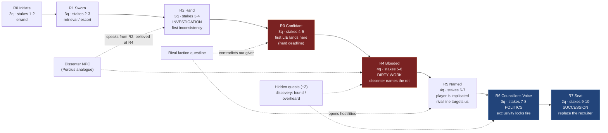

## The bar

A Morrowind faction questline is not a list of jobs that get harder. It is a **ladder into an
institution**, and the shape of the ladder is: *the faction uses you before it trusts you, trusts you
before it shows you itself, and shows you itself only once you are implicated*. Rank 0–1 is errands
that establish the faction's texture and geography. Rank 2–3 is investigation, where the player is
first given discretion. Rank 4–5 is dirty work — the first quest whose stated purpose is not its real
purpose, and the first point at which a member of the same faction tells the player their own guild is
rotten. Rank 6 is politics: the player is no longer solving problems, they are *choosing sides inside
the faction*. Rank 7 is rival-faction conflict, where the questline collides with another questline the
player may also be inside. Rank 8+ is succession — the player takes the seat, usually over the body or
career of the person who recruited them. The bar we must hit is that a critic, reading only our quest
titles and stage tables with faction names stripped, can identify which rank band each quest belongs to
**and can name the quest where the faction's corruption first becomes visible**. If the corruption
reveal is not locatable, we have written a job board, not a faction.

## The reference artifact

### Table A — Observed Morrowind faction lines (the source shape)

| Faction | Ranks (index range) | Approx. quests | Rank-band where "dirty work" starts | Corruption reveal | Nature of the reveal |
|---|---|---|---|---|---|
| Fighters Guild | 10 (0 Associate → 9 Master) | ~31 | ~R4 | R3–R5 | Guildmaster Sjoring Hard-Heart is running the Guild as Camonna Tong muscle; ex-guildmaster **Percius Mercius** in Ald'ruhn will tell you so and offer alternate resolutions to the orders you are given [1][5] |
| Thieves Guild | 10 (0 Toad → 9 Master Thief) | ~23 quest entries [2] | ~R2 | R2–R4 | The Guild is at war with the Camonna Tong and with the Fighters Guild leadership; your Fighters Guild contract may be *you* |
| House Hlaalu | 9–10 (0 Hireling → Grandmaster) | ~26 | ~R3 | R4–R6 | House advancement is inseparable from bribery, Camonna Tong contacts and Imperial collaboration; the stronghold requirement makes the player a landholder in a corrupt economy |
| House Redoran | 9–10 | ~29 | ~R4 | R5–R7 | Honour-culture questline whose honourable acts serve a faction that is losing; Councillor politics decided by duel and assassination |
| House Telvanni | 9–10 | ~25 | ~R2 | R2 (immediate) | Telvanni never hides it. Corruption reveal is *inverted*: the faction is openly amoral from rank 2, and the surprise is that it is honest about it |
| Tribunal Temple | 8–9 | ~22 | ~R4 | R5–R7 | The Temple imprisons and tortures the **Dissident Priests** for asking whether the Tribunal's power is divine or sorcerous; the Temple hid the truth from its own followers [4] |
| Morag Tong | 8–9 | ~30 incl. repeatable writs | R0 (the whole line is killing) | R5–R7 | Legal assassination is a state instrument; the line ends in a war with the Dark Brotherhood that is really Imperial politics [6] |
| Imperial Legion | 9–10 | ~21 | ~R3 | R3–R5 | The Legion's local order (e.g. pressuring the widow Vabdas for a deed after her husband's death) is unjust, and refusing it is the correct play |

Whole-game scale for calibration: **Morrowind base game ≈ 427 quests**, Tribunal 39, Bloodmoon 58, total ≈ 524 [3].

### Table B — The normalised escalation template (constructed, 8 ranks, this is what we build to)

| Rank | Rank band name | Quests | Dominant `task_kind` | Personal stakes (1–10) | Discretion granted | Faction-corruption knowledge | Rival pressure |
|---:|---|---:|---|---:|---|---|---|
| 0 | Initiate | 2 | `errand`, `delivery` | 1–2 | none — explicit orders | none | none |
| 1 | Sworn | 3 | `errand`, `retrieval`, `escort` | 2–3 | route choice only | none | a rumour that the faction has enemies |
| 2 | Hand | 3 | `investigation`, `retrieval` | 3–4 | *who to believe* | first inconsistency (an order that does not match the stated reason) | a rival faction NPC speaks to the player, unprompted |
| 3 | Confidant | 3 | `investigation`, `theft`, `moral_dilemma` | 4–5 | *whether to report truthfully* | **first deceitful quest lands here at the latest** (see RI-QST02 D1/D2) | rival faction offers the player a competing account |
| 4 | Blooded | 4 | `dirty_work`, `theft`, `extermination` | 5–6 | choice of resolution method | an in-faction dissenter (our Percius analogue) names the rot and offers alternates | the player's actions here can permanently lock a rival faction |
| 5 | Named | 4 | `dirty_work`, `politics` | 6–7 | choose which superior to serve | the corruption is now *the player's* — they profited from it | open conflict; rival questline quests now target the player's own faction |
| 6 | Councillor's Voice | 3 | `politics`, `rival_conflict` | 7–8 | choose the faction's direction | the player can expose, conceal, or inherit the rot | the exclusive-membership walls close (see RI-QST03) |
| 7 | Seat | 2 | `succession` | 9–10 | remove or succeed the recruiter | the player becomes the thing the dissenter warned about, or dismantles it | the player's faction's stance toward every rival is now set by the player |
| — | Hidden | +2 | `weird`, `hidden` | varies | discovered, never offered | may reveal the whole line was a front | — |
| **Total** | | **26** | | | | | |

### Escalation curve (targets, constructed)



### Quantitative targets (constructed, binding)

| Metric | Target | Hard fail |
|---|---|---|
| Ranks per joinable faction | 8 (index 0–7) | < 6 |
| Quests per faction line (incl. 2 hidden) | 24–28 | < 18 |
| Joinable factions at ship | 4 | < 3 |
| Total faction quests | 96–112 | < 72 |
| Mean quests per rank | 3.0 | < 2.0 |
| Rank at which stakes first ≥ 5 | 4 | > 5 or < 2 |
| Rank of first quest with `deceit != null` | ≤ 3 | > 4 |
| Rank of first `task_kind: dirty_work` | 4 (±1) | > 6 |
| Rank of first `task_kind: politics` | 5–6 | absent |
| Rank of first `task_kind: succession` | 7 | absent |
| Quests whose `consequences.faction_reputation` touches a **rival** faction | ≥ 6 per line | < 3 |
| Monotonic non-decreasing mean `stakes` by rank | required | any rank band whose mean stakes drops ≥ 2 vs the band below |

## Comparison method

All metrics are computed statically from `game/src/data/quests/*.json`, each of which MUST validate
against `corpus/30-quests/quest.schema.json`.

1. **Validate** every file first; a schema failure voids the run:
   ```
   npx ajv-cli validate -s corpus/30-quests/quest.schema.json \
       -d "game/src/data/quests/*.json" --spec=draft2020 --strict=false
   ```
2. **Quests per rank, per faction:**
   ```
   jq -s 'map(select(.category=="faction"))
          | group_by(.faction)[]
          | {faction: .[0].faction,
             total: length,
             per_rank: (group_by(.rank_gate.min_rank)
                        | map({rank: .[0].rank_gate.min_rank, n: length}))}' \
      game/src/data/quests/*.json
   ```
   Fail if any faction has `total < 18`, if any rank 0–7 has `n == 0`, or if mean `n < 2.0`.
3. **Escalation monotonicity:**
   ```
   jq -s 'map(select(.category=="faction"))
          | group_by(.faction)[]
          | {faction: .[0].faction,
             curve: (group_by(.rank_gate.min_rank)
                     | map({rank: .[0].rank_gate.min_rank,
                            mean_stakes: ((map(.stakes)|add) / length)}))}' \
      game/src/data/quests/*.json
   ```
   Fail if `mean_stakes` at rank *n+1* is more than 2.0 below rank *n*.
4. **Task-kind ordering:** for each faction compute the minimum `rank_gate.min_rank` at which each of
   `dirty_work`, `politics`, `succession` first appears:
   ```
   jq -s 'map(select(.category=="faction"))|group_by(.faction)[]
          | {faction:.[0].faction,
             first: (map({k:.task_kind, r:.rank_gate.min_rank})
                     | group_by(.k) | map({kind:.[0].k, first_rank:(map(.r)|min)}))}' \
      game/src/data/quests/*.json
   ```
   Fail per the target table above.
5. **Corruption reveal location:** first faction quest with `deceit != null`:
   ```
   jq -s 'map(select(.category=="faction" and .deceit != null))
          | group_by(.faction)[] | {faction:.[0].faction,
                                    first_deceit_rank:(map(.rank_gate.min_rank)|min)}' \
      game/src/data/quests/*.json
   ```
   Fail if `> 4` or if a faction is absent from the output entirely.
6. **Rival contradiction count:**
   ```
   jq -s 'map(select(.category=="faction"))|group_by(.faction)[]
          | {faction:.[0].faction,
             rival_touching: (map(select(
                 (.consequences.faction_reputation // {})
                 | to_entries | map(.key) | any(. != $f))) | length)}' \
      --arg f "" game/src/data/quests/*.json
   ```
   (Practically: count quests whose `faction_reputation` object has ≥ 2 keys.) Fail if < 3 per line.
7. **Blind test:** hand a critic the 26 quest titles + `task_kind` + `stakes` of one of our lines with
   the faction name and all proper nouns redacted, alongside the same extraction for a real Morrowind
   line. The critic assigns each quest to a rank band and names the corruption-reveal quest, for both,
   before the reveal.

## Scoring

Score 0–10, computed as the mean of six sub-scores, then hard-gated.

| Sub-score | 10 | 5 | 0 |
|---|---|---|---|
| Rank ladder depth | 8 ranks, all populated | 6 ranks, 1 empty | ≤ 4 ranks or rank-gating absent |
| Quest volume per line | ≥ 24 | 18–23 | < 18 |
| Task-kind progression | all six kinds appear in the right order | order right, one kind missing | all quests are one or two kinds |
| Stakes curve | monotonic, spans 1→10 | monotonic, spans 1→6 | flat |
| Corruption reveal | present, ≤ R3, and has an in-faction dissenter NPC with alternate resolutions | present but late or without a dissenter | absent |
| Rival contradiction | ≥ 6 quests move rival reputation; rival line names ours as antagonist | 3–5 | 0 |

**Hard fails, regardless of mean:**
- Any faction line where every quest is honest (`deceit == null` throughout) → **fail**.
- Any faction advancement gated on character level rather than skill+attribute+reputation → **fail**
  (this is also an AR-2 Morrowind-leakage failure per ARBITRATION §3).
- Mean quests per rank < 2.0 → **fail**.
- A line with no `succession` quest → capped at 4/10; the ladder does not terminate in the player
  becoming the institution.

"We lose" = score < 6, or any hard fail.

## How we lose

Written pessimistically, in advance. These are the specific shapes our questlines will drift into:

- **The job board.** 26 quests that are all `retrieval` and `extermination` with the numbers going up.
  `stakes` filled in as a decoration rather than reflecting anything, so the curve is monotonic on
  paper and flat in play. A critic checks this by reading three quests from R1 and three from R6 and
  asking whether the *kind of decision* differs. It won't.
- **Escalation by enemy HP.** We escalate the difficulty of the fight instead of the stakes of the
  choice. Rank 7 is "kill the big one" rather than "decide what this institution is for". This also
  violates the arbitration boundary in spirit — the escalation should live *outside* the fight.
- **The honest guild.** Every giver tells the truth, because writing a lie means writing the reveal
  channel, the rival's competing account, and the alternate resolution — three times the work. We will
  ship one deceitful quest per line, at rank 6, too late to recontextualise anything.
- **No dissenter.** We write the corruption as a document the player finds instead of as a *person*
  who has been arguing about it for twenty years and will help them. Percius Mercius is a character with
  a career and a grudge, not a note in a chest.
- **Ranks as a gold sink.** We implement 8 ranks and then gate them on quest count alone, dropping the
  skill+attribute+reputation triad because it makes the line feel "blocked". That is Skyrim, not
  Morrowind, and it is a hard fail per RI-QST03.
- **Factions that never contradict.** Four lines that run in parallel and never collide, so the player
  can complete all four with no cost. The moment a critic can 100% every faction in one save, the
  escalation is decorative.
- **Late-line collapse.** R6 and R7 exist in the design doc and ship as two quests that are actually
  one quest with a boss. The succession beat — the recruiter's fate — is cut for scope, which deletes
  the entire point of the ladder.
- **Uniform quests-per-rank.** 3/3/3/3/3/3/3/3. Real lines are lumpy; the flat distribution is the
  signature of a spreadsheet rather than a story.

## Provenance note

- **Table A** is `community-data` where cited and `canonical-recall` otherwise. Verified by web search
  this session: the Fighters Guild ↔ Thieves Guild ↔ Camonna Tong conflict and the role of **Percius
  Mercius** as the in-guild dissenter offering alternate resolutions [1][5]; the Thieves Guild's ~23
  catalogued quests [2]; whole-game quest totals of 427/39/58 = 524 [3]; the Dissident Priests' dispute
  that the Temple hid the truth and that the Ordinators used abduction and torture [4]; Great House
  single-membership exclusivity and Morag Tong's role against the Dark Brotherhood [6]; House Hlaalu's
  favoured skills, the "two or three quests per rank" rule of thumb, and the Kinsman stronghold
  requirement [7].
- **Rank counts and rank names** are `canonical-recall`, `confidence: medium`. Search returns for the
  Fighters Guild listed eight ranks (Associate → Guardian) in a truncated snippet [1]; recall says the
  ladder continues to Champion and Master for ten indices (0–9). Treat "8–10" as the honest range. Our
  own target of 8 ranks is `constructed` and is not an attempt to match either figure exactly.
- **Per-faction quest counts** other than the Thieves Guild's 23 are `canonical-recall` and should be
  read as ±5. They are used only to establish the order of magnitude (20–30 quests per line), which is
  the load-bearing figure.
- **Table B, the escalation curve, and every number in "Quantitative targets"** are `constructed` for
  this project. Per CORPUS-CONTRACT §3 they are as binding as measured numbers, because they are
  measurable by the jq expressions above and the Morrowind figures are not.
- One documented Morrowind *defect* we explicitly do not copy: search results note that Fighters Guild
  quests award no faction reputation [1], which makes that line's advancement gating incoherent. Our
  contract requires every faction quest to carry a non-empty `consequences.faction_reputation`.

**Sources**
[1] [Morrowind:Fighters Guild — UESP](https://en.uesp.net/wiki/Morrowind:Fighters_Guild) ·
[2] [Morrowind:Thieves Guild Quests — UESP](https://en.uesp.net/wiki/Morrowind:Thieves_Guild_Quests) ·
[3] [Morrowind talk:Quests — UESP](https://en.uesp.net/wiki/Morrowind_talk:Quests) ·
[4] [Lore:Dissident Priests — UESP](https://en.uesp.net/wiki/Lore:Dissident_Priests) ·
[5] [How to avoid the Morrowind Fighters Guild/Thieves Guild trap — UESP Forums](https://forums.uesp.net/viewtopic.php?f=5&t=41596) ·
[6] [Morrowind:Morag Tong — UESP](https://en.uesp.net/wiki/Morrowind:Morag_Tong) ·
[7] [Morrowind:House Hlaalu — UESP](https://en.uesp.net/wiki/Morrowind:House_Hlaalu)

Direct page fetches to uesp.net, elderscrolls.fandom.com and wikipedia.org were refused by this
session's egress policy (HTTP 403 at the proxy). All cited content therefore comes from search-result
summaries of those pages, not from the pages themselves; confidence is capped at `medium` accordingly.
A future wave with unrestricted fetch should re-derive Table A and raise it to `high`.
