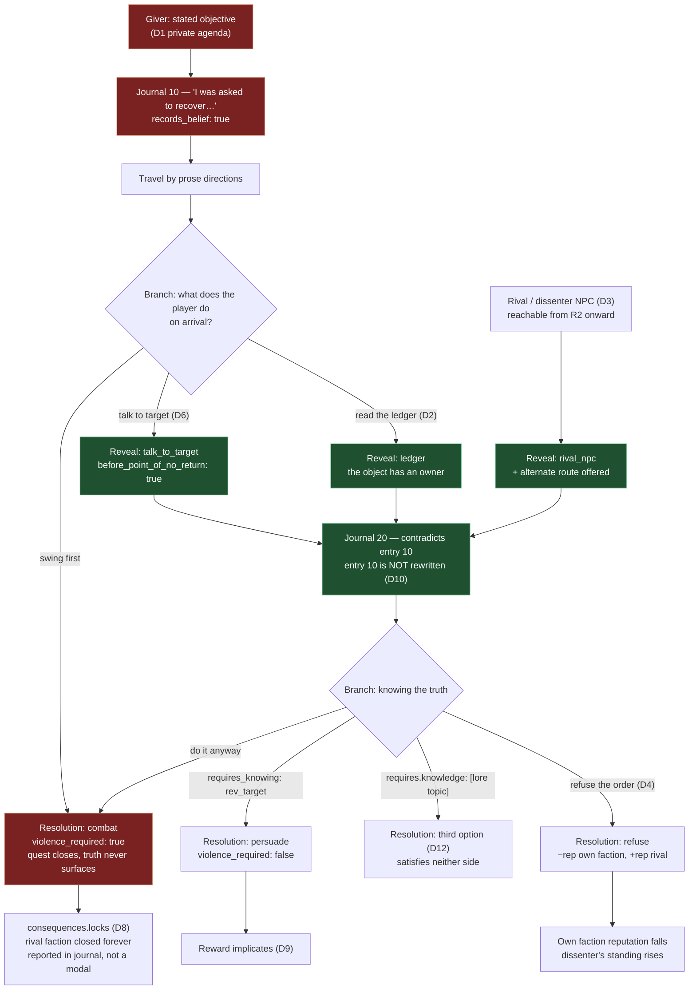

## The bar

The defining property of Morrowind's quest design is that **the quest interface is not a source of
truth**. The giver has an agenda. The journal records what the player *believed*. The rival who
approaches you in the street is frequently correct. "Recover this item" is often a euphemism, and the
target of a kill order will, if you talk to them first, tell you something that changes what the order
means. None of this is a twist ending; it is a persistent epistemic condition. The bar is that a player
who takes every instruction at face value can complete our game, and a player who does not takes a
*materially different route through it*, and both are supported. Concretely: at minimum **1 in 5 of our
quests must carry a lie**, every lie must have at least one discovery channel reachable *before* the
point of no return, and at least one of our factions must be written as the antagonist of another
faction's questline without either being wrong. Below is the catalogue of twelve patterns, each with a
structure, a Morrowind instance, and a test a critic can run against our quest files.

## The reference artifact

### Deceit pattern catalogue, D1–D12

Ids are load-bearing: `deceit.patterns[]` in `corpus/30-quests/quest.schema.json` accepts exactly
`D1`–`D12`.

---

**D1 — The Private Agenda Giver**
*Structure.* The giver's institutional role and personal interest diverge. The task is real, the
justification is not. The player advances the giver's private position while believing they advance the
faction's.
*Morrowind.* Sjoring Hard-Heart, Fighters Guild guildmaster in Vivec, issues Guild contracts that serve
the Camonna Tong. The orders are legitimate Guild business on their face [1][5].
*Test.* `deceit.patterns` contains `D1` and `giver.honest == false` and
`deceit.actual_objective` names a beneficiary that is **not** the faction named in `faction`.
A quest where `stated_objective` and `actual_objective` differ only in tone fails the test.

**D2 — The Retrieval That Is A Theft**
*Structure.* The verb in the instruction is "recover", "collect", "reclaim", or "fetch". The object has
a rightful owner who is not the giver. The player learns this only from the object's context — a ledger,
the owner, or the room it sits in.
*Morrowind.* The Fighters Guild "Code Book" job: framed as guild business, it is a burglary against the
Thieves Guild, and completing it forecloses ever joining them [5].
*Test.* Quest has `task_kind: "retrieval"` in the giver's framing but a resolution with
`method: "steal"`, **or** `deceit.patterns` contains `D2` and `deceit.revealed_by[].channel` includes
one of `ledger|environment|talk_to_target`. Fail if the only reveal is `later_quest`.

**D3 — The Rival Who Is Telling The Truth**
*Structure.* A named NPC, usually senior, usually within the same faction, contradicts the giver. They
are hostile-coded by presentation (a demoted rival, a heretic, an enemy faction) and *correct* by
content. They also offer a concrete alternate resolution, not just an opinion.
*Morrowind.* Percius Mercius, the deposed former Fighters Guild master in Ald'ruhn. Bring him a
conflicting order and he supplies a way to satisfy it without doing the thing you were told to do [1][5].
Mehra Milo and the Dissident Priests occupy the same slot for the Temple [4].
*Test.* For each faction, at least one NPC id appears as `deceit.revealed_by[].source` with
`channel: "rival_npc"` on **≥ 3 distinct quests**, and at least 2 of those quests have a resolution
whose `requires_knowing` cites that reveal. A dissenter who only talks is not a dissenter; they must
unlock a branch.

**D4 — The Order You Should Refuse**
*Structure.* A lawful instruction from a legitimate authority that is unjust on inspection. Refusal is
implemented as a first-class resolution with its own outcome and its own cost — not as "abandon quest".
*Morrowind.* The Imperial Legion sends you to obtain a land deed from the widow Vabdas, whose husband
the Legion's own project killed. Investigating and refusing is the correct route and is supported.
*Test.* `resolutions[].method` includes `"refuse"`, that resolution has a non-empty `outcome` and a
negative entry in `consequences.faction_reputation`, and it is **not** listed in `failure_states`.
Refusal must be a way to win, not a way to lose. Target: ≥ 8 quests game-wide with a `refuse`
resolution.

**D5 — The Faction That Is The Villain From Another Chair**
*Structure.* Faction A's questline names Faction B as the problem, and Faction B's questline names
Faction A, and both accounts are internally sound. The player who joins both experiences a
contradiction the game does not resolve for them.
*Morrowind.* Fighters Guild ↔ Thieves Guild, mediated by the Camonna Tong [1][5]. Temple ↔ Dissident
Priests [4]. Morag Tong ↔ Dark Brotherhood [6]. Great House ↔ Great House.
*Test.* Build the directed graph of `consequences.faction_reputation` deltas: an edge A→B exists when a
quest owned by A applies a negative delta to B. **At least two 2-cycles (A→B and B→A) must exist**, and
in each cycle both directions must have ≥ 2 quests. Fail if the graph is a tree (one faction hated by
all, hating none) — that is a designated villain, not a contradiction.

**D6 — The Target Who Talks**
*Structure.* A kill order names an NPC. That NPC has real dialogue topics with content that
recontextualises the order. Reaching them *before* the killing blow opens a resolution that is otherwise
absent from the quest.
*Morrowind.* Repeatedly across Morag Tong writs and Guild contracts: the writ target has topics, has a
version of events, sometimes has a counter-offer. The design is that lock-on-and-swing is the *cheapest*
route, not the only one.
*Test.* For every quest with `kill_required_npcs` non-empty **or** a `combat` resolution against a named
NPC: assert there exists a resolution with `requires_knowing` referencing a `revealed_by` entry whose
`channel == "talk_to_target"`. Game-wide target: ≥ 60% of named-target kill quests satisfy this.
Hard fail at < 30%.

**D7 — The Prophecy That May Be A Fabrication**
*Structure.* The player's own mandate is presented as destiny and is simultaneously legible as
manufacture. The game never adjudicates. Supporting text exists on both sides and the player's handler
concedes the doubt out loud.
*Morrowind.* The Nerevarine prophecy. Caius Cosades is an Imperial spymaster running the player as an
asset; the Empire has an interest in producing an Incarnate; the prophecies are also real [8].
*Test.* The main quest must contain ≥ 2 quests where `deceit.patterns` includes `D7`, and there must
exist at least one in-world text (`revealed_by.channel == "book"`) arguing the mandate is constructed
and one arguing it is genuine, with `never_revealed: true` on the adjudication. If our lore files
resolve the question, we have failed this pattern.

**D8 — The Door That Closes Behind You**
*Structure.* Completing a quest permanently forecloses content the player did not know existed. The
foreclosure is diegetic (the other faction now knows what you did) and is *reported* in the journal, not
in a UI warning.
*Morrowind.* Complete the Code Book job before joining the Thieves Guild and you can never join them —
and nothing warns you in advance [5].
*Test.* `consequences.locks` is non-empty on ≥ 6 quests game-wide; for each, a journal entry with
`state: "success"` mentions the consequence in first person. Fail if any lock is delivered only via a
modal/UI string, or if `locks` is empty across the whole game.

**D9 — The Reward That Implicates You**
*Structure.* Payment is in something that marks the player: stolen goods, a title from a compromised
patron, a property with a history, an ally who is a liability.
*Morrowind.* House strongholds — Kinsman rank requires you to *build* one [7], making you a landholder
inside the House's economy of favours; Hlaalu advancement in particular is inseparable from bribery and
Camonna Tong contact.
*Test.* ≥ 4 quests where a `rewards[]` entry has `type` in `{item, property, ally}` and the same quest
has `deceit != null`; the reward's `id` must also appear in some other quest's
`deceit.revealed_by[].source` or in `opens_by.prerequisite_quests` of a later quest that turns on it.

**D10 — The Journal That Records A Belief**
*Structure.* The journal is authored by the player character in the first person and states what they
concluded at the time. A later entry contradicts an earlier one. The earlier entry is never rewritten.
*Morrowind.* Standard throughout: entries read "I was told…", "It seems…", "If I understood him
correctly…". The journal is a diary, not a task list.
*Test.* ≥ 15% of all journal entries carry `records_belief: true`; every quest with `deceit != null`
carries ≥ 1 such entry at an index *below* the index at which the truth surfaces. Additionally, no
journal `text` may contain an imperative task-list construction ("Go to", "Kill the", "Return to") as its
opening clause — a regex check, see Comparison method.

**D11 — The Sympathetic Antagonist**
*Structure.* The faction or figure the game has spent thirty hours framing as the enemy is given, near
the end, a coherent account in which they are the reasonable party. It is delivered as argument, in
dialogue, at length, with the player able to press on it.
*Morrowind.* Dagoth Ur's conversation before the fight — an offer, a grievance, and a critique of the
Tribunal that the player has by then acquired independent reason to credit [4][8].
*Test.* The final act contains ≥ 1 quest where the antagonist NPC has a dialogue node reachable
*before* the killing blow, exposed in the quest file as a `revealed_by` with
`channel: "talk_to_target"` and a resolution with `method` in `{persuade, refuse, betray, confess}`
gated on `requires_knowing`. Fail if the antagonist's justification exists only in a codex entry or a
post-mortem cutscene.

**D12 — The Third Option Nobody Mentions**
*Structure.* The quest is presented as binary (side A or side B). A third resolution exists that
satisfies neither party's framing and is discoverable only by lateral action — reading a ledger, telling
one side about the other, bringing a specific item, or knowing a piece of lore.
*Morrowind.* Percius-mediated Fighters Guild jobs resolved without the killing [5]; assorted disputes
settled by producing a document or by persuading a third party who was never mentioned.
*Test.* ≥ 25% of quests have `resolutions.length >= 3`, and among those, ≥ 1 resolution has non-empty
`requires.knowledge` or non-empty `requires_knowing` — i.e. it is unavailable to a player who did not
learn something. Fail if every quest's third option is just "kill them instead".

---

### The deceit-bearing quest graph (canonical shape)



### Coverage targets (constructed, binding)

| Metric | Target | Hard fail |
|---|---|---|
| Quests with `deceit != null` | ≥ 20% of all quests | < 10% |
| Distinct patterns used across the game | ≥ 10 of 12 | < 6 |
| Patterns used in *each* faction line | ≥ 4 distinct | < 2 |
| Deceitful quests with ≥ 1 reveal where `before_point_of_no_return == true` | 100% | any quest at 0 |
| Deceitful quests with ≥ 2 independent reveal channels | ≥ 60% | < 30% |
| Quests with `deceit.never_revealed == true` | ≤ 8% of deceitful quests | > 15% |
| Named-target kill quests satisfying D6 | ≥ 60% | < 30% |
| Quests with a `refuse` resolution | ≥ 8 game-wide | < 3 |
| Rival-reputation 2-cycles between factions (D5) | ≥ 2 | 0 |
| Quests with `consequences.locks` non-empty (D8) | ≥ 6 | 0 |
| Journal entries with `records_belief: true` | ≥ 15% of all entries | < 5% |

## Comparison method

Run against `game/src/data/quests/*.json` after schema validation (see RI-QST04).

1. **Deceit rate and pattern spread:**
   ```
   jq -s '{total: length,
           deceitful: (map(select(.deceit != null)) | length),
           rate: ((map(select(.deceit != null))|length) / length),
           patterns: (map(.deceit.patterns // []) | add | group_by(.)
                      | map({p: .[0], n: length}) | sort_by(.p))}' \
      game/src/data/quests/*.json
   ```
   Fail if `rate < 0.10`; below target if `< 0.20`; fail if fewer than 6 distinct patterns.
2. **Reachable-reveal invariant (the single most important check):**
   ```
   jq -s 'map(select(.deceit != null)
          | select([.deceit.revealed_by[] | select(.before_point_of_no_return)] | length == 0)
          | .id)' game/src/data/quests/*.json
   ```
   Must return `[]`. Any id in this list is a lie the player can never act on — **hard fail**.
3. **Channel independence:**
   ```
   jq -s 'map(select(.deceit != null)
          | {id, channels: ([.deceit.revealed_by[].channel] | unique | length)})
          | {ge2: (map(select(.channels >= 2)) | length), total: length}' \
      game/src/data/quests/*.json
   ```
4. **D6 — target who talks:**
   ```
   jq -s 'map(select((.kill_required_npcs // []) | length > 0))
          | {n: length,
             talkable: (map(select([.deceit.revealed_by[]? | select(.channel=="talk_to_target")] | length > 0)) | length)}' \
      game/src/data/quests/*.json
   ```
5. **D4 — refusal as a win state:**
   ```
   jq -s 'map(select([.resolutions[] | select(.method=="refuse")] | length > 0) | .id)' \
      game/src/data/quests/*.json
   ```
   Then assert for each that no `failure_states[].id` equals the refuse resolution's id.
6. **D5 — faction contradiction graph:** emit edges and look for 2-cycles.
   ```
   jq -s -r '[ .[] | select(.faction != null) | . as $q | $q.faction as $f
               | (($q.consequences.faction_reputation // {}) | to_entries[])
               | select(.value < 0 and .key != $f)
               | "\($f) -> \(.key)" ] | sort | unique[]' game/src/data/quests/*.json
   ```
   Manually (or with a two-line script) confirm ≥ 2 pairs appear in both directions.
7. **D10 — journal voice:** an entry whose text opens with an imperative is an objective marker in prose
   clothing (also an ARBITRATION AR-2 violation).
   ```
   jq -s -r '[.[] | .id as $q | .journal[] | select(.text | test("^\\s*(Go|Kill|Return|Travel|Find|Bring|Speak|Collect|Retrieve)\\b"; "i")) | "\($q):\(.index)"] | .[]' \
      game/src/data/quests/*.json
   ```
   Must return nothing. Then:
   ```
   jq -s '{entries: ([.[].journal[]] | length),
           belief: ([.[].journal[] | select(.records_belief)] | length)}' \
      game/src/data/quests/*.json
   ```
8. **Blind read (blind_pair: yes).** Give a critic six unlabelled quest briefs: three real Morrowind
   quest summaries containing a lie, three of ours. Ask: *for each, what is the giver not telling you,
   and how could the player have found out?* Record how many of ours the critic can answer. If the
   critic answers all three Morrowind items and fewer than two of ours, our deceit is decorative.

## Scoring

| Band | Condition |
|---|---|
| 9–10 | Deceit rate ≥ 20%, ≥ 10 patterns, 100% reachable reveals, ≥ 60% multi-channel, D5 cycles ≥ 2, blind critic recovers the lie in ≥ 2 of 3 of our quests |
| 7–8 | Deceit rate ≥ 15%, ≥ 8 patterns, 100% reachable reveals, D5 cycles ≥ 1 |
| 5–6 | Deceit rate ≥ 10%, ≥ 6 patterns, reveals reachable, no faction contradiction |
| 3–4 | Lies exist but reveals are late, single-channel, or the lie changes no resolution |
| 0–2 | Every giver is honest, or lies are cosmetic (the "twist" does not alter a single available resolution) |

**Hard fails:**
- Any quest with `deceit != null` and zero reveals reachable before the point of no return.
- Zero quests with a `refuse` resolution.
- Zero `consequences.locks` across the entire game — nothing the player does costs them anything.
- A "deceit" that is purely narrative: `deceit != null` but `resolutions.length == 1`. Learning the
  truth must open a door, otherwise it is flavour text. Critics should run
  `jq -s 'map(select(.deceit != null and (.resolutions|length) < 2) | .id)'` and treat a non-empty
  result as fail.

## How we lose

- **Twist-as-decoration.** We mark quests `deceit: {...}` and write a nice paragraph, but the quest has
  one resolution. The player discovers they were used and then does the thing anyway because there is no
  other button. This is the single most likely failure and the jq one-liner above catches it.
- **Reveals that arrive after the door shuts.** The letter explaining what you actually did is on the
  corpse of the person you were sent to kill. Technically a reveal; mechanically a receipt. Our
  `before_point_of_no_return` flag exists precisely because we will be tempted to do this and to
  self-report it as satisfied.
- **The honest guild.** Writing a lie costs three assets: the reveal, the dissenter, the alternate
  resolution. Under schedule pressure we will cut the dissenter first, then the alternate, and be left
  with narration.
- **One designated villain.** We give every faction a negative reputation edge pointing at one bad
  faction, producing a tree instead of cycles. Then no faction is ever wrong about anything except the
  villain, and joining two factions costs nothing. D5 dies quietly.
- **Kill targets with no mouth.** Every named target is a hostile spawn with an aggro radius. D6 becomes
  impossible not by choice but because nobody wrote dialogue for a creature the player is expected to
  fight. This is where the arbitration boundary bites: Souls owns the fight, but the NPC must be
  approachable *before* `COMBAT` is entered, and topic lists are locked once it is (ARBITRATION S13).
  If our targets are pre-aggroed, D6 is architecturally dead.
- **Journals that read like objective markers.** "Go to the Hist grove and retrieve the seed." That is a
  quest marker rendered as text and an AR-2 auto-fail. The regex check exists because we will do this on
  at least a dozen entries and not notice.
- **Retconning the journal.** Someone will "fix" the contradiction between entry 10 and entry 20 by
  editing entry 10. That deletes D10 entirely. Entry 10 being wrong is the feature.
- **Adjudicating the prophecy.** Our lore files will settle whether the mandate is genuine because
  ambiguity feels like a loose end. D7 requires the loose end to be permanent.
- **Sympathy delivered as a codex.** The antagonist's case ends up in a readable found after the fight
  rather than in their mouth before it. D11 becomes lore instead of a confrontation.

## Provenance note

- **Pattern structures (the "Structure" lines) are `constructed`** — this taxonomy does not exist
  upstream; it is our abstraction over observed Morrowind behaviour. The pattern *ids* D1–D12 are
  normative for this project and are referenced by `quest.schema.json`.
- **Morrowind examples** are mixed:
  - `community-data`, verified by search this session: Sjoring Hard-Heart running the Fighters Guild
    toward the Camonna Tong and Percius Mercius supplying alternate resolutions to conflicting orders
    [1][5]; the Code Book job permanently foreclosing Thieves Guild membership [5]; the Dissident
    Priests' charge that the Temple hid the truth and used abduction and torture [4]; Morag Tong vs Dark
    Brotherhood as a questline [6]; the alternate "back path" main-quest route and the
    "thread of prophecy is severed" message [8].
  - `canonical-recall`, `confidence: medium`: the widow Vabdas Imperial Legion quest (D4); Morag Tong
    writ targets having substantive dialogue (D6); Dagoth Ur's pre-fight argument (D11); Caius Cosades
    as an Imperial spymaster with an institutional interest in producing an Incarnate (D7). These are
    recalled specifics and are labelled as such; a critic finding them misremembered should correct the
    example without discarding the pattern, which stands on its structure.
- **All coverage targets are `constructed`** and binding per CORPUS-CONTRACT §3.
- Direct fetches to uesp.net and elderscrolls.fandom.com were refused by egress policy (403 at proxy);
  citations point at pages whose *search summaries* were read, not the pages themselves.

**Sources**
[1] [Morrowind:Fighters Guild — UESP](https://en.uesp.net/wiki/Morrowind:Fighters_Guild) ·
[4] [Lore:Dissident Priests — UESP](https://en.uesp.net/wiki/Lore:Dissident_Priests) ·
[5] [How to avoid the Morrowind Fighters Guild/Thieves Guild trap — UESP Forums](https://forums.uesp.net/viewtopic.php?f=5&t=41596) ·
[6] [Morrowind:Morag Tong — UESP](https://en.uesp.net/wiki/Morrowind:Morag_Tong) ·
[8] [Morrowind talk:Alternate Endings — UESP](https://en.uesp.net/wiki/Morrowind_talk:Alternate_Endings)
