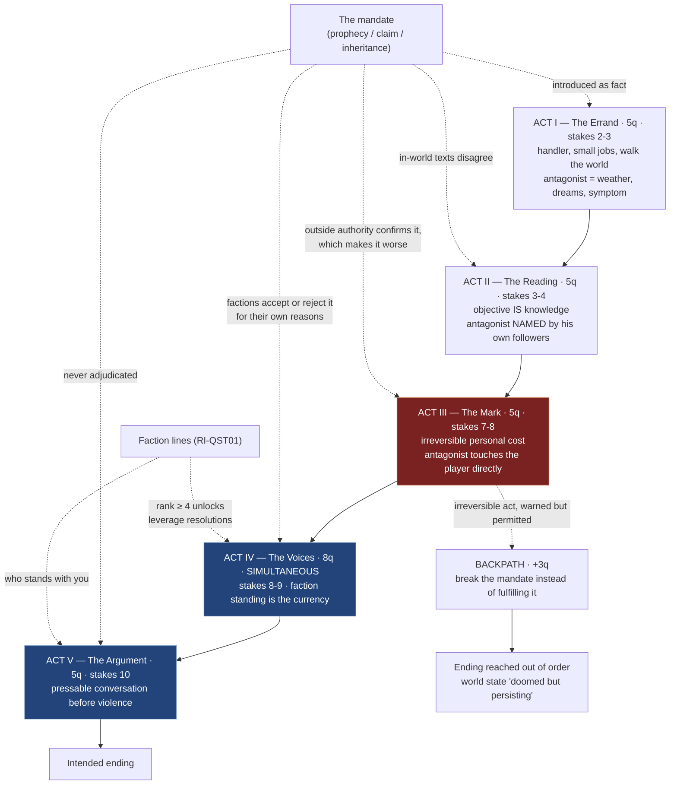

## The bar

Morrowind's main quest is the most-copied and least-understood structure in the series, because its
distinguishing features all look like flaws. It **starts slow and small**: the player is an Imperial
asset running errands for a spymaster, not a chosen one. Its middle is **bureaucratic research** — the
player is sent to *read, ask, and cross-reference*, and the quest objective is literally to become
informed. Its mandate is a **prophecy that is legible as a fabrication**, admitted as such by the
handler, and never adjudicated. Its fourth act is **politics**: the world's factions must individually
be persuaded, and the player's accumulated standing is the currency. Its final act collapses all of that
into **one conversation with one person who makes a good argument**. And it can be done **wrong** — the
backpath exists, breaking the prophecy rather than fulfilling it, and the game lets you [8].

The bar for our original Black Marsh main quest is not to retell this. It is to match the *shape*: five
acts, a slow start whose stakes are personal-small, a research middle where the objective is knowledge,
a mandate the player has grounds to doubt, an act where faction standing is spent as leverage, an
antagonist who has been present since Act I and becomes sympathetic in Act V, and at least one route
that reaches an ending by breaking the intended path.

## The reference artifact

### A. Morrowind's main quest, extracted as beats

| Act | Beats (Morrowind) | Quests | Kind of work | Player's stakes | Antagonist presence |
|---:|---|---:|---|---|---|
| I — The Asset | Released from the prison ship; report to Caius Cosades; a run of small errands and a package delivery; join a faction "for cover" | ~5 | errand, delivery | Low. You are being paid and handled. You are not important | Dreams. Ambient. No name attached yet |
| II — The Reading | The four informants: Antabolis, Gra-Muzgob, the Vivec informants, Zainsubani. Research the Nerevarine prophecies and the Sixth House [12] | ~5 | investigation | Low-mid. The stakes are the Empire's, not yours | Named. Sixth House propaganda; the antagonist's followers speak for him |
| III — The Body | Sixth House base; contract corprus; the Corprus cure at Tel Fyr; Mehra Milo and the Lost Prophecies; the Path of the Incarnate [12] | ~5 | investigation → trial | **Personal.** You are infected; the disease is his. Immunity is the pivot | Direct. The antagonist has marked the player's body |
| IV — The Politics | Three Hortator votes (Telvanni, Redoran, Hlaalu) and four Nerevarine acclamations (Urshilaku, Ahemmusa, Zainab, Erabenimsun), then Hortator and Nerevarine — all available simultaneously [12] | ~8 | politics, rival_conflict | High. Your standing is the resource | Offstage; his agents interfere |
| V — The Argument | Vivec; Wraithguard; Sunder and Keening; Red Mountain; the conversation; the Heart | ~5 | succession / confrontation | Total | Present, articulate, and correct about several things |
| — | **Backpath:** kill Vivec, obtain Wraithguard via Yagrum Bagarn, finish without the prophecy [8] | — | — | — | — |
| **Total** | | **≈28** | | | |

Structural facts that make it work:

1. **Act IV is simultaneous, not sequential.** Seven quests open at once and the player sequences them
   [12]. This is what makes the act feel like politics rather than a corridor.
2. **The prophecy is falsifiable in-fiction.** The Empire has a motive to manufacture an Incarnate; the
   handler is a spymaster; the in-world texts disagree with each other. The game never rules.
3. **The mandate is confirmed by an outside authority mid-run** (Azura at the Cavern of the Incarnate),
   which raises rather than settles the question of who is using whom.
4. **Killing the wrong person is not a game over.** It produces "the thread of prophecy is severed…
   persist in the doomed world you have created" and a harder, still-completable state [8]
   (ARBITRATION S10).
5. **The final act is a conversation.** The antagonist's case is delivered in person, before violence,
   with the player able to press on it.

### B. The template our original main quest must match (constructed, binding)

| Act | Name | Quests | Dominant `task_kind` | Player stakes (1–10) | Faction leverage | Antagonist | Required structural feature |
|---:|---|---:|---|---:|---|---|---|
| I | **The Errand** | 5 | `errand`, `delivery`, `investigation` | 2–3 | none; player is told to join *a* faction for cover | present as **atmosphere only** — a phenomenon, a symptom, a recurring dream/vision; unnamed | Act I must contain ≥ 1 quest whose real purpose is to make the player walk the world and learn its geography, with `directions` prose only |
| II | **The Reading** | 5 | `investigation` | 3–4 | none | **named**, by his own followers, in his own words (a captured text, a convert who is not lying) | ≥ 3 of 5 quests resolve by acquiring *information* — `rewards[].type == "information"` — not an object |
| III | **The Mark** | 5 | `investigation`, `pilgrimage`, `moral_dilemma` | 7–8 | first faction favour called in | **direct contact**: the antagonist alters the player's body/mind/standing irreversibly | Exactly one irreversible personal cost, recorded as a permanent world flag and a permanent stat/condition |
| IV | **The Voices** | 8 | `politics`, `rival_conflict` | 8–9 | **the leverage act**: rank, reputation and past quest outcomes are spent as currency | offstage; his agents contest each vote | All 8 quests open **simultaneously**; ≥ 4 have a resolution gated on `requires.faction_rank`; each has ≥ 3 resolutions (bribe / persuade / expose / serve) |
| V | **The Argument** | 5 | `succession` | 10 | player's faction standing determines who stands with them | **sympathetic**: a long, pressable, pre-violence conversation in which he is right about at least two things the player has independently verified | ≥ 1 non-violent resolution; the antagonist's case must cite ≥ 2 world facts the player learned in Acts II–III |
| — | **Backpath** | +3 | `betray` | — | — | — | A route that reaches an ending by breaking the intended path, requiring ≥ 1 irreversible act the game warns about but permits |
| **Total** | | **28 (+3)** | | | | | |

### Beat graph



### C. Timing targets (constructed)

| Beat | Must occur by | Must not occur before |
|---|---|---|
| Antagonist perceptible (unnamed) | Act I quest 2 | — |
| Antagonist named | Act II quest 2 | Act I quest 4 |
| Player's mandate first doubted **in dialogue by an ally** | Act II quest 4 | Act I quest 3 |
| First irreversible personal cost | Act III quest 4 | Act II quest 1 |
| First faction-rank-gated main quest resolution | Act IV quest 1 | Act II quest 1 |
| Antagonist's justification first stated in his own voice | Act V quest 1 | Act II quest 3 |
| Backpath becomes reachable | Act III end | Act II end |
| Point of no return | Act V quest 4 | — |

Additional hard requirements:
- **Main quest completable while locked out of every faction**, at higher cost (more gold, harder
  checks, fewer allies in Act V). Faction membership is leverage, never a gate.
- **≥ 2 quests in Acts II–III whose only reward is `information`.** Knowing is a reward.
- **Act I stakes must be ≤ 3.** If Act I opens with the world ending, we have written Skyrim.
- **The mandate must never be adjudicated** — no quest, book, or NPC may state definitively whether it
  is genuine (RI-QST02 D7, `never_revealed: true`).

## Comparison method

```bash
# Act shape: counts, stakes curve, task kinds.
jq -s 'map(select(.category=="main")) | group_by(.act)
       | map({act: .[0].act, n: length,
              mean_stakes: ((map(.stakes)|add)/length),
              kinds: ([.[].task_kind]|unique)})' game/src/data/quests/*.json
```
Assert: 5 acts; counts 5/5/5/8/5 (±1 per act, total ≥ 24); mean stakes strictly increasing across acts
with Act I ≤ 3.5 and Act V ≥ 9.

```bash
# Act IV simultaneity: all Act IV quests must have identical prerequisites (the Act III closer),
# i.e. none of them may list another Act IV quest as a prerequisite.
jq -s -r 'map(select(.category=="main" and .act==4)) as $iv
       | ($iv|map(.id)) as $ids
       | $iv[] | . as $q | (.opens_by.prerequisite_quests // [])[] as $p
       | select($ids | index($p))
       | "\($q.id): Act IV quest is sequenced behind \($p) — act is a corridor, not a campaign"' \
   game/src/data/quests/*.json
```
Must return empty.

```bash
# Act IV leverage: resolutions gated on faction rank.
jq -s 'map(select(.category=="main" and .act==4))
       | {n: length,
          rank_gated: (map(select([.resolutions[]|select(.requires.faction_rank != null)]|length>0))|length),
          mean_resolutions: ((map(.resolutions|length)|add)/length)}' game/src/data/quests/*.json
```
Assert `rank_gated >= 4` and `mean_resolutions >= 3.0`.

```bash
# Information-as-reward in the research middle.
jq -s 'map(select(.category=="main" and (.act==2 or .act==3)))
       | map(select([.rewards[]|select(.type=="information")]|length>0)) | length' \
   game/src/data/quests/*.json
```
Assert `>= 3` for Act II alone and `>= 5` across Acts II–III.

```bash
# The mandate is never adjudicated (D7).
jq -s 'map(select(.category=="main" and ((.deceit.patterns // []) | index("D7"))))
       | {n: length, unresolved: (map(select(.deceit.never_revealed == true))|length)}' \
   game/src/data/quests/*.json
```
Assert `n >= 2` and `unresolved >= 1`.

```bash
# Act V: sympathetic antagonist and a non-violent path.
jq -s 'map(select(.category=="main" and .act==5))
       | {talkable: (map(select([.deceit.revealed_by[]? | select(.channel=="talk_to_target")]|length>0))|length),
          nonviolent: (map(select([.resolutions[]|select(.violence_required==false)]|length>0))|length)}' \
   game/src/data/quests/*.json
```
Assert both `>= 1`.

```bash
# Backpath exists and is reachable from Act III.
jq -s 'map(select(.category=="main" and ((.notes // "") | test("backpath"; "i"))))
       | map({id, act, irreversible: ([.branches[]?|select(.irreversible)]|length)})' \
   game/src/data/quests/*.json
```
Assert ≥ 3 quests, at least one with `irreversible >= 1`, and that the ending world flag reached by this
route differs from the intended one.

```bash
# Faction-independence: the main quest must not hard-gate on faction membership.
jq -s -r 'map(select(.category=="main"))[] | select(.rank_gate != null)
       | "\(.id): main quest hard-gated on faction rank \(.rank_gate.faction) \(.rank_gate.min_rank)"' \
   game/src/data/quests/*.json
```
Must return empty — rank appears in `resolutions[].requires.faction_rank` (leverage), never in
`rank_gate` (a wall).

**Blind test:** give a critic the act-by-act beat table for our main quest and for Morrowind's, both
with proper nouns stripped, and ask which one is the 2002 game. Also ask them to name, for each, the act
in which the player first has something personal at stake. If ours is identifiable by having high stakes
in Act I, we have failed the slow start.

## Scoring

| Band | Condition |
|---|---|
| 9–10 | 5 acts / ≥24 quests, stakes monotonic from ≤3 to 10, Act II is genuinely research (≥3 information rewards), Act III lands an irreversible personal cost, Act IV is simultaneous + rank-leveraged + ≥3 resolutions each, Act V has a pressable sympathetic antagonist, backpath implemented, mandate unadjudicated |
| 7–8 | All acts present and shaped; backpath exists but is thin; Act IV partially sequenced |
| 5–6 | Five acts, correct escalation, but Act II is fetch-quests wearing research clothes and Act IV is a corridor |
| 3–4 | Linear chain of set pieces; faction standing irrelevant; antagonist appears in Act V |
| 0–2 | Chosen-one opening; single path; antagonist is evil and says so |

**Hard fails:** high stakes in Act I (mean > 4); Act IV sequenced rather than simultaneous; the mandate
adjudicated by the game; no backpath; the antagonist unkillable-until-scripted with no pre-fight
conversation; any main quest with `rank_gate` set (faction membership as a wall).

## How we lose

- **We open big.** Act I becomes "the world is ending, here is your destiny", because a slow start
  reads as a weak start in a pitch. The stakes curve check is the defence and the mean-stakes number in
  Act I is the tell.
- **The research act becomes fetch quests.** "Talk to four people" is implemented as four walk-and-click
  interactions with no reading, no contradiction between the accounts, and no reward except a journal
  tick. The information-reward check exists because the *reward being knowledge* is the whole
  distinguishing feature, and it is the first thing that gets converted into a sword.
- **Act IV becomes a corridor.** Eight simultaneous political quests are hard to test, so someone
  sequences them "temporarily". Then the act is a list, faction standing is decoration, and the one
  place where the whole game's faction system pays off is gone.
- **Leverage becomes a gate.** Rather than making rank a *route* through Act IV, we require rank 5 in a
  house to proceed. That locks out non-joiners, contradicts RI-QST03's exclusivity (you cannot join
  them all), and makes the main quest incompletable in some saves.
- **The antagonist is evil.** Writing a sympathetic antagonist means writing an argument we half-agree
  with and then not rebutting it. We will instead write a villain with a tragic backstory, which is not
  the same thing, and put his case in a book found after the fight.
- **The mandate is confirmed.** Somebody adds a lore entry establishing the prophecy is real, because
  ambiguity feels unfinished. D7 dies in one commit.
- **No backpath.** Three extra quests and a second ending state for a route most players never take is
  the easiest cut in the project. Cutting it removes the property that the game can be done *wrong*,
  which is a large fraction of why Morrowind's main quest is remembered.
- **The irreversible cost gets a cure.** Act III's permanent mark is softened in playtesting because
  players dislike permanent debuffs. Then Act III has no pivot and the antagonist never actually touched
  the player.
- **Act V is a boss room.** The conversation is a cutscene, the topic list is locked because `COMBAT` is
  already active (ARBITRATION S13), and there is no non-violent resolution. Note this is *not* a
  Souls-leakage violation — Souls rightly owns the fight — but the conversation must happen **before**
  the fight begins, in Morrowind's jurisdiction, and the encounter must be authored so that it can.

## Provenance note

- **Section A beats** are `community-data` for the quest names and Act IV simultaneity: the main quest
  stage list (Report to Caius Cosades, the four informant quests, Sixth House Base, Corprus Cure, Mehra
  Milo and the Lost Prophecies, The Path of the Incarnate, the three Hortator and four Nerevarine
  quests, Hortator and Nerevarine, Getting Sunder, Getting Keening) and the statement that after The
  Path of the Incarnate "all seven Become Hortator and Become Nerevarine quests are simultaneously
  available" [12]; the backpath (kill Vivec, obtain Wraithguard via Yagrum Bagarn, complete without the
  standard tools) and the "thread of prophecy is severed / persist in the doomed world you have created"
  message [8].
- **Act boundaries, the ~5/5/5/8/5 quest split, and the ≈28 total are `derived`** — Morrowind does not
  label acts; this is my segmentation of the beat list, `confidence: medium`. The *ordering* of the
  beats is well attested [12]; the grouping into five acts is analytical.
- **Caius Cosades as an Imperial spymaster running the player as an asset, the Empire's motive to
  manufacture an Incarnate, Azura's confirmation at the Cavern of the Incarnate, and the Dagoth Ur
  pre-fight conversation are `canonical-recall`, `confidence: medium`.** They are load-bearing for
  section B's template but section B stands on its own as a `constructed` specification regardless.
- **Section B and C are entirely `constructed`** and binding. Our main quest must be original Black
  Marsh content; nothing in section B names or reuses Morrowind material.
- Direct fetches to uesp.net / fandom were refused by egress policy (403 at proxy); cited content comes
  from search summaries of those pages.

**Sources**
[8] [Morrowind talk:Alternate Endings — UESP](https://en.uesp.net/wiki/Morrowind_talk:Alternate_Endings) ·
[12] [Morrowind:Main Quest — UESP](https://en.uesp.net/wiki/Morrowind:Main_Quest)
