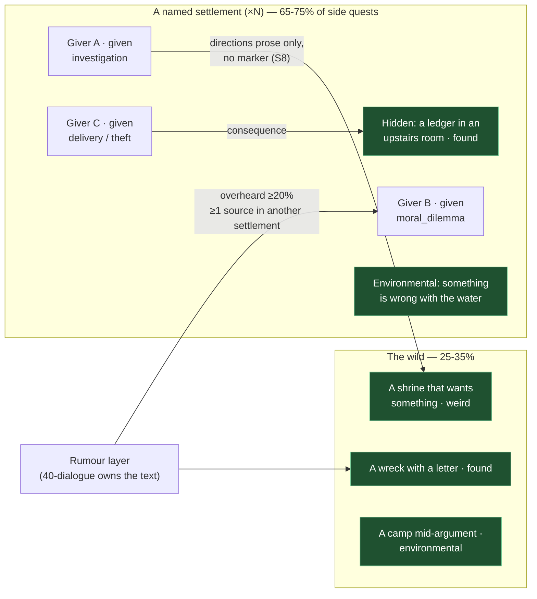

## The bar

Morrowind's side content is textured rather than curated. It is not a set of well-made optional
storylines; it is a *sediment* of small obligations, rumours, arguments, debts and inexplicable requests
lying across the world at a density that makes walking anywhere productive. Three properties matter.
**Distribution:** the type mix is wide — fetch and kill are present but do not dominate, and there is a
persistent minority of quests that are simply strange, with no genre. **Attachment:** most side quests
belong to a settlement and to a person in it, not to a location on a map; a minority live out in the
wild and belong to the place itself. **Discovery:** a substantial fraction are not offered at all. They
surface because someone in a tavern three towns away mentioned something, because a book named a place,
or because the player found a body with a letter. There is no marker and no exclamation point
(ARBITRATION S8); the only quest log is the journal, and it only contains what you already know. The bar
is a target count and a target *mix*, both statically checkable, plus a floor on the number of quests
that cannot be found by walking into a building and clicking on everyone.

## The reference artifact

### A. Morrowind's side-quest population (derived)

Base game ≈ 427 quests total [3]. Subtracting the main quest (~28) and the joinable-faction lines
(~260 across Fighters, Mages, Thieves, Imperial Legion, Imperial Cult, Temple, Morag Tong and the three
Great Houses) leaves roughly **~139 miscellaneous / settlement / wild quests** — about **33% of all
quests are side content**, distributed across ~30 named settlements and the open landscape.

Estimated type mix in that population (`derived`, `confidence: low` — segment reasoning, not a census):

| Type | Est. share | Character |
|---|---:|---|
| Fetch / retrieve an object | ~16% | usually with a complication attached |
| Deliver / carry a message | ~10% | the excuse to cross the map |
| Investigate / find out what happened | ~17% | the highest-value slot |
| Kill / clear | ~15% | often a named creature or a person with a grievance |
| Escort / protect | ~5% | rare, and rarely enjoyable |
| Moral dilemma / arbitrate a dispute | ~12% | two people, two accounts |
| Theft / burglary / smuggling | ~10% | |
| Pilgrimage / ritual / observance | ~5% | |
| **Purely weird** (no genre, no template) | ~10% | the signature: a man who wants you to jump off a tower; a scrib who owes a debt; a request whose purpose is never explained |

### B. Our targets (constructed, binding)

Scaled to a world of **N named settlements** (N is owned by `corpus/50-world/`; targets below are
per-settlement so they compose with whatever N turns out to be). Assuming N ≈ 14 for the ship target:

| Metric | Target | Hard fail |
|---|---:|---:|
| Side quests total | **≥ 5.5 × N** (≈ 80 at N=14) | < 3 × N |
| Side quests as share of all quests | 35–45% | < 20% |
| Side quests attached to a settlement | 65–75% | < 50% |
| Side quests belonging to the wild (a ruin, a grove, a wreck, a road) | 25–35% | < 15% |
| Named settlements with ≥ 4 side quests | 100% | any settlement < 2 |
| Named settlements with ≥ 1 `discovery: "hidden"` or `"found"` quest | ≥ 70% | < 40% |
| Distinct givers per settlement | ≥ 3 | < 2 (one quest-dispenser NPC per town) |

**Type mix targets** (share of side quests; a band, not a point):

| `task_kind` | Target band | Hard fail |
|---|---:|---:|
| `investigation` | 15–22% | < 10% |
| `retrieval` | 12–20% | > 30% |
| `extermination` | 10–18% | > 25% |
| `moral_dilemma` | 10–16% | < 6% |
| `delivery` | 8–14% | > 20% |
| `theft` | 8–14% | — |
| `weird` | **8–14%** | **< 5%** |
| `escort` | 3–7% | > 12% |
| `pilgrimage` | 3–7% | — |
| Single most common kind | ≤ 22% of all side quests | > 35% |

**Discovery mix targets** — this is the one that encodes "no markers, listen instead":

| `discovery` | Target | Hard fail |
|---|---:|---:|
| `given` (an NPC offers it via a topic) | 50–60% | > 75% |
| `overheard` (surfaced only by another NPC's rumour) | **≥ 20%** | < 10% |
| `found` (a book, a letter, a ledger, a corpse) | **≥ 12%** | < 6% |
| `environmental` (the world state is the prompt; no text at all) | ≥ 5% | 0 |
| `consequence` (opened by how another quest ended) | ≥ 3% | 0 |
| **Non-`given` total** | **≥ 40%** | < 25% |

Supporting requirements:

- Every `overheard` quest declares ≥ 2 `opens_by.overheard_from` NPCs, and **at least one of them must
  live in a different settlement from the giver.** Rumours travel; that is what makes the world feel
  connected and what makes walking pay.
- Every side quest has non-empty `directions` prose (RI-QST04), because there are no markers.
- ≥ 30% of side quests carry a `consequences.faction_reputation` entry — the world's small business is
  not politically inert.
- ≥ 15% of side quests have `deceit != null` (RI-QST02 applies to side content too, at a lower rate than
  faction lines).
- The **weird** quota is a hard floor and is deliberately unspecifiable further. A `weird` quest is one
  whose `task_kind` cannot be honestly recorded as anything else: the objective is strange, the
  motivation is not explained, and the reward may be inappropriate to the effort in either direction.

### Density map (shape, not content)



## Comparison method

```bash
# Volume and share.
jq -s '{total: length,
        side: (map(select(.category=="side" or .category=="hidden"))|length),
        share: ((map(select(.category=="side" or .category=="hidden"))|length)/length*100)}' \
   game/src/data/quests/*.json

# Type mix.
jq -s 'map(select(.category=="side" or .category=="hidden")) | length as $n
       | group_by(.task_kind)
       | map({kind: .[0].task_kind, n: length, pct: (length/$n*100)})
       | sort_by(-.pct)' game/src/data/quests/*.json

# Discovery mix — the marker-free check.
jq -s 'map(select(.category=="side" or .category=="hidden")) | length as $n
       | {mix: (group_by(.discovery) | map({d: .[0].discovery, pct: (length/$n*100)})),
          non_given_pct: ((map(select(.discovery != "given"))|length)/$n*100)}' \
   game/src/data/quests/*.json

# Overheard quests must have >=2 sources, >=1 in a different settlement.
# (requires npc->settlement lookup from game/src/data/npcs/*.json)
jq -s -r '.[] | select(.discovery=="overheard")
   | select(((.opens_by.overheard_from // [])|length) < 2)
   | "\(.id): overheard quest with fewer than 2 rumour sources"' game/src/data/quests/*.json

# Per-settlement density (giver.location must resolve to a settlement id).
jq -s 'map(select(.category=="side" or .category=="hidden"))
       | group_by(.giver.location)
       | map({place: .[0].giver.location, n: length,
              givers: ([.[].giver.npc_id]|unique|length),
              hidden: (map(select(.discovery=="found" or .discovery=="environmental" or .category=="hidden"))|length)})
       | sort_by(.n)' game/src/data/quests/*.json

# Weird floor.
jq -s 'map(select((.category=="side" or .category=="hidden")))
       | {n: length, weird: (map(select(.task_kind=="weird"))|length),
          pct: ((map(select(.task_kind=="weird"))|length)/length*100)}' \
   game/src/data/quests/*.json

# Directions present on 100% (no-marker invariant).
jq -s -r '.[] | select((.directions // "")|length < 20) | "\(.id): no prose directions"' \
   game/src/data/quests/*.json
```

Assert against section B. The per-settlement query must show **no settlement with n < 2** and
**no settlement whose `givers` == 1**.

**Manual check a critic must also run (30 minutes, in-engine):** start a fresh save, walk into the
second-largest settlement, speak to every NPC once, and count how many quests you have. Then read every
book and letter in the town and speak to everyone again. If the second number is not at least 25% higher
than the first, the `found`/`overheard` layer is not doing its job regardless of what the data says.

## Scoring

| Band | Condition |
|---|---|
| 9–10 | ≥ 5.5×N side quests, every type band met including weird ≥ 8%, non-`given` discovery ≥ 40%, every settlement ≥ 4 quests from ≥ 3 givers, rumours cross settlement boundaries |
| 7–8 | ≥ 4×N side quests, type mix within bands with one exception, non-`given` ≥ 30% |
| 5–6 | ≥ 3×N quests, mix dominated by two types, non-`given` 15–25% |
| 3–4 | Fetch and kill are > 50% combined; almost everything is `given`; weird content absent |
| 0–2 | Side quests are a radiant-style template with swapped nouns, or there are fewer than 2×N |

**Hard fails:** `weird` < 5%; non-`given` discovery < 25%; any quest without `directions`; any settlement
with fewer than 2 side quests; a single `task_kind` above 35%.

**Native → ladder anchors — the row mandated by `SCORING.md` §1.2 (BAR-CRITIQUE-01 W7).**
Added wave-1-prep to close BAR-CRITIQUE-02 **C1**; derived from this item's own bands above.
**No threshold in this item was changed.**

| Ladder | 4 | 6 | 8 |
|---|---|---|---|
| Native | 4 / 10 | 6 / 10 | 8 / 10 |

**Aggregation (a property of this item, not of the critic):** band.

## How we lose

- **Fetch and kill eat everything.** They are the two quest types that need no new systems. Every other
  type requires something — arbitration needs two NPCs with opposed accounts, weird needs a designer
  willing to not explain themselves. Under pressure the mix collapses to 60% retrieval/extermination
  and the "distribution" is a spreadsheet nobody enforced.
- **The weird quota is the first cut.** It is the least defensible line item in a schedule and the most
  distinctive property of the reference. A game with 0% weird is legible as generic fantasy in about
  twenty minutes of play, and no other metric in this corpus detects that.
- **Everything is `given`.** Implementing `overheard` requires a rumour system that seeds topics on NPCs
  who have nothing to do with the quest, and `found` requires books that carry data. Both are cross-area
  dependencies (40-dialogue, 60-lore). They will slip, and 95% of quests will be handed over a counter.
- **One quest-dispenser per town.** Every settlement has a mayor-analogue who holds all four quests, so
  the town has one voice instead of three. The `givers` count in the per-settlement query is the
  detector.
- **Rumours that do not travel.** `overheard_from` is populated with NPCs standing in the same room as
  the giver, which is not a rumour, it is a hint. The cross-settlement requirement exists for this.
- **The wild is empty.** All content is inside settlements because settlements are where the NPCs are,
  and authoring a quest that belongs to a place with no people means authoring environmental
  storytelling. Then walking between towns is transit rather than content, which also undermines the
  no-fast-travel ruling (S7) — long walks are only defensible if the walk is populated.
- **Markers sneak back in.** A single `directions: ""` shipped with "we'll add a waypoint for now"
  becomes the pattern. AR-2 auto-fail, and the check is one line.
- **Quests with no consequences.** Side quests set no reputation, unlock nothing, and lock nothing, so
  the world's small business is inert and the player correctly learns to ignore it.
- **Density by duplication.** We hit ≥ 5.5×N by writing the same three quests fourteen times with
  different nouns. The type-mix check passes; the game is still a template. The only real defence is the
  manual walk-in check and a critic reading five random side quests end to end.

## Provenance note

- The base-game total of **427 quests is `community-data`** [3]. The subtraction of ~28 main + ~260
  faction quests to yield ~139 side quests is **`derived`** from the per-faction estimates in RI-QST01,
  most of which are themselves `canonical-recall` at ±5. Treat "roughly a third of Morrowind's quests are
  side content" as the load-bearing claim and the exact figure as soft.
- The **type-mix percentages in section A are my estimate**, `derived`, `confidence: low`. They are not
  a census and must not be cited as one. A future wave with Construction Set access should tabulate
  every non-faction quest by type; that would move section A to `measured`.
- The observation that Morrowind side quests are frequently surfaced by rumour rather than offered, that
  there are no markers, and that a persistent minority of quests are simply strange, is
  `canonical-recall`, `confidence: medium-high` — it is a structural property of the dialogue/journal
  system rather than a numeric claim.
- **Every target in section B is `constructed`** and binding per CORPUS-CONTRACT §3, including the weird
  floor, which is the single number in this file most likely to be argued down and most important to
  hold.
- Direct page fetches were refused by this session's egress policy (403 at proxy).

**Sources**
[3] [Morrowind talk:Quests — UESP](https://en.uesp.net/wiki/Morrowind_talk:Quests)
