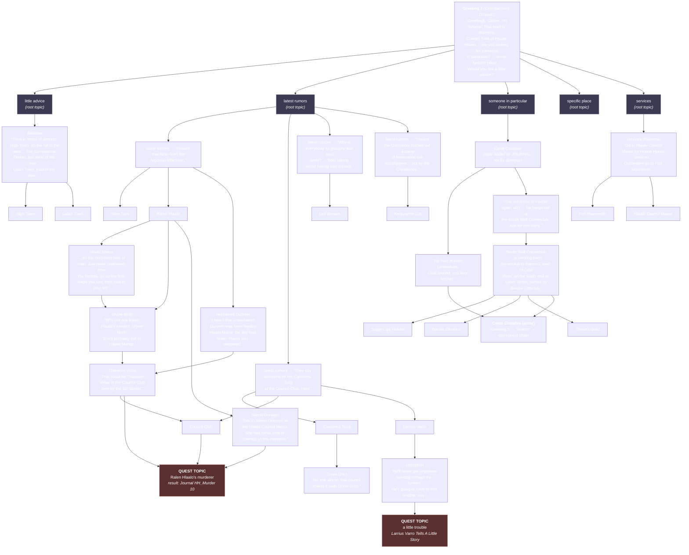

## The bar

Morrowind dialogue is not a conversation tree. It is a **global keyword index** that every
NPC is a filtered view onto. A topic exists once, engine-wide; a hundred NPCs may have a
hundred different answers to it, and the engine picks one by walking a filter list and
taking the **first entry whose whole predicate conjunction passes**. Topics are *discovered*
— they are added to your list because some other NPC's answer text mentioned them and the
entry's result script called `AddTopic`. That single fact is what makes the world feel like
it exists independently of you: you learn a name in a bar, and the name becomes a key that
fits a hundred locks you have not found yet. The bar is that our dialogue database, dumped
as a directed graph, has the same *shape* as Morrowind's: a small root set of ~9 topics you
start with, a majority of nodes reachable only through another node's prose, a mean
out-degree above 2, real depth (6+ hops from greeting to a quest resolution topic), and
zero orphans. If a critic dumps our graph and it is a star — greeting in the middle, every
topic one hop out, every topic a quest — we have built a quest menu with a Morrowind skin
and we have failed.

## The reference artifact

### A. The formal model

**Topic record** (`DIAL`): a unique keyword string, one of four types — `Topic`,
`Greeting`, `Voice`, `Journal`. Topic and Greeting are the dialogue graph; Journal is
RI-DLG05; Voice is combat/idle barks (and under ARBITRATION S13 is Souls-authoritative
inside the fight — enemies shout, they do not converse).

**Response record** (`INFO`): belongs to exactly one topic, and carries
`(filter predicate stack, response text, result script)`.

**Combat lockout (ARBITRATION seam S13 — Souls-authoritative).** `Topic` and `Greeting` are
**unavailable while `COMBAT` is active**. The entire topic graph is a peacetime structure.
Hostile actors emit `Voice` records only — shouts, taunts, alarm calls — which are *not*
nodes in this graph, have no `AddTopic` edges, and never open a dialogue window. There is no
"talk him down mid-swing" affordance, no dialogue-triggered fight pause, and no persuasion
UI reachable from a combat state (RI-DLG04 §How we lose repeats this). De-escalation happens
*before* the first frame of hostile intent or *after* de-aggro — never during.

**Filter predicate stack** — the conjunction that must fully pass. Morrowind's fields, in
the order the Construction Set exposes them:

| # | Field | Domain | Note |
|---|---|---|---|
| 1 | Actor ID | one named NPC | the "only this person answers this way" override |
| 2 | Race | 10 playable races | speaker's race, not the player's |
| 3 | Class | ~70 classes | `Ordinator`, `Pauper`, `Savant`, `Publican`, `Slave`… |
| 4 | Faction | 20+ factions | speaker's faction |
| 5 | NPC Rank | int | speaker's rank in that faction |
| 6 | Cell | cell-name **prefix match** | `Balmora` matches `Balmora, South Wall Cornerclub` |
| 7 | PC Faction | faction | the *player's* faction |
| 8 | PC Rank | int | the player's rank |
| 9 | Sex | M/F | speaker's |
| 10 | Disposition | int, **minimum** | speaker's derived disposition ≥ N (see RI-DLG04) |
| 11–16 | up to 6 Function/Variable conditions | `Journal <id> >= n`, `Item`, `Dead`, `Global`, `Local`, `Not Local`, `PC Level`, `Health%`, `Reputation`, `Rank`, `Choice` | this is where quest state lives |

**Selection rule — first-match-wins in authored file order.** The engine walks the topic's
INFO list top to bottom and returns the first entry whose *entire* conjunction passes.
It does **not** score specificity. Ordering is authored, not computed. That is a design
liability Morrowind lived with and we must not: our implementation keeps first-match-wins
semantics (it is what makes overriding cheap) but MUST expose a lint that flags any INFO
whose filter set is a strict superset of an earlier INFO's in the same topic — that entry
is unreachable and is a **corpus bug**, not a style choice.

> **AMENDED BY `ARBITRATION.md` S37, wave 1 — the rule above is upheld, and one sentence of it
> was a false statement of fact.**
>
> ~~"our implementation keeps first-match-wins semantics"~~ — **this was not true of the tree.**
> `game/src/character/converse.js` `infoFor()` scored specificity
> (`score = 8·actorMatch + 2·cell + 4·requires + (1 + d/100) + 0.5·forbids`, strict maximum,
> with authored order surviving only as the tie-break) until S37. Found by the W1-17 round-1
> critic. Measured at `63f41ef`: the two algorithms answer **1,906,688 of 1,460,324,864
> resolutions differently — 37 (speaker, topic) pairs across 8 topics** — and under the scoring
> rule authored order decided **0.018% of resolutions, in one topic**, which is why the reorder
> tool, the unreachable-INFO lint below and the shadow audit were all built on a rule nothing
> enforced.
>
> **S37 rules that the ENGINE yields, not this clause.** Dialogue is outside the fight and
> `ARBITRATION` §1 gives it to Morrowind, so §5 precedence 1 settles it. The struck sentence is
> restored as a **requirement** rather than a description: `infoFor()` returns the first
> admissible INFO in authored order and does not score. The reference implementation — which is
> the whole of the diff — is `tools/dialogue/arbiter-reference-reader.mjs`.
>
> **Two consequences bind every author and builder touching this data.**
>
> 1. **Authored order is content.** 18.242% of resolutions across 64 topics change if the order
>    changes. Moving an INFO within a file changes what people say; re-run the census.
> 2. **The merge order must be declared.** `buildTopicIndex()` merges same-id topic records
>    across files and concatenates them in `readdirSync().sort()` order, and **92 of 468 topic
>    ids are declared in more than one file, holding 488 of the 1,280 INFOs**. For 38% of this
>    corpus "authored file order" is a directory listing, which is not authoring. S37 requires
>    that order be declared in the corpus — the per-file `group` tag plus a manifest, or a
>    `priority` on the topic record. Until it is, the load order is a latent defect.
>
> Checkable: **`node tools/dialogue/arbiter-order-divergence.mjs --gate`**, which calls the
> running `infoFor()` rather than modelling it. Red at `63f41ef` (58 mismatches over 42,456
> resolutions, 8 topics); green against the reference reader; `--self-test` runs four arms and
> has been watched going red on purpose (exit 2).

**Greeting selection.** Greetings are not one topic. They are ten topics, `Greeting 0`
through `Greeting 9`, evaluated in ascending numeric order, first-match-wins within each.
The number is a *priority class*, not a disposition band:

| Class | Owns | Example condition |
|---|---|---|
| Greeting 0 | scripted/forced states | chargen, imprisoned, forced dialogue |
| Greeting 1 | hostility & crime | attacking, bounty, "Halt! You have violated the law!" |
| Greeting 2–3 | rare global states | disease/vampirism/were-state, faction expulsion |
| Greeting 4–5 | quest-state greetings | "the job's done?" — filtered on `Journal` index |
| Greeting 6 | faction/service greetings | guild steward, trainer, merchant openers |
| Greeting 7 | **settlement-local greetings** | filtered on `Cell` — the town's own voice |
| Greeting 8 | class/race/disposition generic | the disposition banding lives mostly here |
| Greeting 9 | last-resort catch-all | must never be empty |

Disposition banding is expressed by stacking several INFOs in the same class with
descending `Disposition ≥` minima. RI-DLG03 gives the required bands and counts.

**Result script.** The response text is inert; the result script is what edits the world:
`AddTopic "specific place"`, `Journal A1_1_FindSpymaster 10`, `ModDisposition`,
`ModPCFacRep`, `AddItem`, `SetFight`. **The `AddTopic` calls in the result scripts are the
edges of the graph.** This is the single most important structural fact in this file.

**Root set.** The player begins with exactly nine topics, granted at character creation
(verified against a community modding source that enumerates them):

```
duties · background · specific place · someone in particular
services · my trade · little secret · latest rumors · little advice
```

Everything else in the game — 2,060 topics total, per a community count — is reached by
being *told about it*.

### B. A worked settlement topic web — Balmora

Node text below is **verbatim Morrowind response text** taken from a community extraction
of `Morrowind.esm` dialogue (see Provenance). Topics filtered `Cell = Balmora` are the
town's local layer; the rest are global topics whose Balmora-filtered answer is local.



Note three properties the picture makes visible and that a critic must find in ours:

1. **`Nine-Toes` is reached only through a rumour.** Nothing points at him from a greeting,
   a map, or a marker. If you never ask for rumours in Balmora, the murder quest does not
   exist for you.
2. **Two independent paths converge on the same quest node** (`Uryne Nirith → Thanelen
   Velas` and `red-haired Dunmer → Thanelen Velas`). Convergence is what stops a topic web
   from being a tree.
3. **A journal entry adds a topic** (`Caius Cosades`). The journal is a node source, not
   just a log. See RI-DLG05.

### C. Machine-readable edge list (excerpt) — the format our dump must produce

```
# topic_graph.tsv  —  src_topic \t dst_topic \t via \t scope
GREETING7_BALMORA	little advice	greeting_text	settlement:Balmora
GREETING7_BALMORA	someone in particular	greeting_text	settlement:Balmora
latest rumors	Nine-Toes	AddTopic	settlement:Balmora
latest rumors	Ralen Hlaalo	AddTopic	settlement:Balmora
Ralen Hlaalo	Uryne Nirith	AddTopic	settlement:Balmora
Ralen Hlaalo	Hlaalo Manor	AddTopic	settlement:Balmora
Ralen Hlaalo	Nileno Dorvayn	AddTopic	settlement:Balmora
Uryne Nirith	Thanelen Velas	AddTopic	settlement:Balmora
red-haired Dunmer	Thanelen Velas	AddTopic	settlement:Balmora
Thanelen Velas	Ralen Hlaalo's murderer	AddTopic	settlement:Balmora
JOURNAL:A1_1_FindSpymaster:1	Caius Cosades	AddTopic	global
Caius Cosades	South Wall Cornerclub	AddTopic	settlement:Balmora
```

### D. Quantitative shape — Morrowind measured/derived, and our targets

| Metric | Morrowind | Our target | Fail below |
|---|---|---|---|
| Total topic nodes, game-wide | **2,060** (community count) | ≥ 400 | 250 |
| Root topics (granted at start) | **9** | 7–10 | <6 or >14 |
| Topics answerable in one mid-size settlement | ~55–75 (derived) | ≥ 55 | 35 |
| Topics with a *settlement-local* answer | Balmora: **153 distinct local entries** across ~45 topics (measured) | ≥ 30 topics | 18 |
| Mean out-degree (AddTopic edges per topic that has any) | ~2.2 (derived) | ≥ 2.0 | 1.5 |
| Fraction of topics with out-degree 0 (leaves) | ~55% (derived) | ≤ 50% | >65% |
| Fraction of topics reachable **only** via another topic's text | ~99.6% (2051/2060) | ≥ 90% | <75% |
| Max depth, greeting → quest-resolution topic | ≥ 6 | ≥ 6 | 4 |
| Median depth from greeting | 3 | ≥ 3 | 2 |
| Orphans (in-degree 0, not a root, not journal-added) | 0 by intent | **0** | ≥1 = fail |
| Unreachable INFOs (filter ⊃ an earlier INFO's in same topic) | >0 (a known MW bug class) | **0** | ≥1 = fail |
| Convergence rate (nodes with in-degree ≥ 2) | ~25% (derived) | ≥ 20% | <10% |
| Quest-bearing topic nodes / total topic nodes | ~8% (derived) | ≤ 15% | >30% ("quest menu") |

**S37 note on the `Orphans` and `Unreachable INFOs` rows.** The step-4 superset test is sound
under first-match-wins and is **neither sound nor complete against a scoring reader**: a strictly
narrower later INFO *outscores* its predecessor and is perfectly reachable, while a genuine shadow
under scoring is a **tie** the superset test never sees. Both rows were therefore unenforceable
for the whole of wave 1 and neither may be read as having passed. Measured at `63f41ef`, INFOs no
player can hear from any speaker: **8** under the scoring reader that shipped, **14** under this
item's own rule. That six-INFO difference is a corpus bug under this row, and the repair is to
reorder the files — never to re-score the reader.

## Comparison method

A fresh agent runs this without prior context.

**Step 1 — Dump our graph.**
```
node tools/corpus/dump-dialogue-graph.mjs --out /tmp/ours.tsv --settlement <NAME>
```
The dump must emit `topic_graph.tsv` in the §C format, plus `topics.tsv`
(`topic \t n_infos \t is_root \t added_by_journal`) and `infos.tsv`
(`topic \t info_id \t filter_json \t words \t result_script`).

**Step 2 — Compute topology.** Any graph library; the numbers required are exactly the
left column of §D:
```python
import networkx as nx, csv
E=[r for r in csv.reader(open('/tmp/ours.tsv'),delimiter='\t') if r and not r[0].startswith('#')]
G=nx.DiGraph(); G.add_edges_from((a,b) for a,b,*_ in E)
roots={"duties","background","specific place","someone in particular",
       "services","my trade","little secret","latest rumors","little advice"}
print("nodes", G.number_of_nodes(), "edges", G.number_of_edges())
nz=[d for _,d in G.out_degree() if d>0]
print("mean out-degree (non-leaf)", sum(nz)/len(nz))
print("leaf fraction", sum(1 for _,d in G.out_degree() if d==0)/G.number_of_nodes())
print("orphans", [n for n,d in G.in_degree() if d==0 and n not in roots and not n.startswith("GREETING") and not n.startswith("JOURNAL")])
print("convergence", sum(1 for _,d in G.in_degree() if d>=2)/G.number_of_nodes())
src=[n for n in G if n.startswith("GREETING")]
depth={}
for s in src:
    for n,d in nx.single_source_shortest_path_length(G,s).items():
        depth[n]=min(depth.get(n,99),d)
import statistics; print("median depth",statistics.median(depth.values()),"max depth",max(depth.values()))
print("unreachable-from-greeting", sorted(set(G)-set(depth)))
```

**Step 3 — Reachability audit (the one that catches fakes).** For the named settlement,
enumerate its quests. For each, compute the shortest path from any greeting node to the
quest-bearing topic **using only edges whose `scope` is that settlement or `global`**. A
quest whose shortest path length is ≤ 1 is a **menu quest**: the NPC offered it in the
greeting. Report `menu_quest_fraction`. Morrowind's Balmora reference: the murder quest is
depth 3–4 from greeting; the Caius chain is depth 2 *and only because the journal seeded
the topic*.

**Step 4 — Unreachable-INFO lint.** For each topic, for each pair (i<j) of INFOs in
authored order, if `filter[j] ⊇ filter[i]` (every constraint in i is present and equal or
weaker in j) then j is unreachable. Emit the list. Required output: empty.

**Step 4b — Selection-rule conformance (`ARBITRATION` S37). Run this BEFORE step 4, because
step 4 is meaningless if it fails.**
```
node tools/dialogue/arbiter-order-divergence.mjs --gate
```
The gate calls the running `infoFor()` and asserts it returns the **first admissible INFO in
authored order** for every (topic, speaker, player-admissibility class). Exit 0 is required.
A non-zero exit means the reader is not implementing this item's §A selection rule, and **step
4's lint, `order-infos.mjs`, `shadow-audit.mjs` and the two §D rows above are all measuring a
rule the game does not run** — that was the wave-1 state and it is what S37 exists to stop
recurring. `--self-test` (four arms) must pass before the gate's result is quoted.

**Step 5 — Combat lockout conformance (seam S13).** Three checks, all required:
```
a) Static:  every dialogue record is typed. Assert  count(type == 'voice' AND edges > 0) == 0
            and  count(type IN ('topic','greeting') AND speaker_can_be_hostile AND
                       reachable_while_state=='COMBAT') == 0.
b) Runtime: node tools/corpus/probe-combat-dialogue.mjs
            — enter COMBAT with a hostile actor, then fire every dialogue-open input
              (interact key, topic hotkey, persuasion action) for 300 frames.
            Required: zero dialogue windows opened, zero topic lists returned,
              zero frames where world simulation is paused by a dialogue call.
c) Trace:   grep the combat trace for any `AddTopic`, `ModDisposition` or `Journal`
            call originating from a `voice` record.  Required: none.
```
Any hit is an **AR-1 Souls-leakage fail** under ARBITRATION §3 and fails the piece
regardless of score. Conversely, a *named quest actor* who is not hostile must remain fully
conversable while a fight is happening elsewhere in the cell — the lockout is per-actor
combat state, not a global mode.

**Step 6 — Blind topology pairing** (`blind_pair: yes`). Render our graph and the Balmora
reference graph in §B as two unlabeled Graphviz PNGs at identical layout settings with all
node *labels replaced by `T1…Tn`*. Show a judge both and ask the exact question in RI-DLG07
§Protocol, adapted: *"One of these two dialogue graphs comes from a game widely regarded as
the high-water mark of NPC dialogue design. Which one, and name the three structural
features that decided it."*

## Scoring

Score each row of §D as pass (1) / fail (0) against the "Our target" column; the "Fail
below" column is the hard floor.

- **12/13 or better, no hard-floor breach** → PASS.
- **Any hard-floor breach** → FAIL regardless of total.
- **Any orphan, or any unreachable INFO** → FAIL, automatic, no score.
- **Any combat-lockout breach (step 5)** → FAIL, automatic, filed as AR-1 Souls leakage.
- **`menu_quest_fraction` > 0.30** → FAIL and file it as an AR-2 Morrowind-leakage
  violation under ARBITRATION §3: a quest offered in a greeting is an objective marker
  wearing a hat.
- **Blind topology pairing:** if the judge picks ours, per CORPUS-CONTRACT §6 that is a
  signal to distrust the critic; it must re-run step 3 with the harsher lens and record
  both picks.

We lose if the graph is wide and flat: 200 topics, all depth 1, mean out-degree 0.3,
every quest hanging directly off a greeting. That is a menu.

**Native → ladder anchors — the row mandated by `SCORING.md` §1.2 (BAR-CRITIQUE-01 W7).**
Added wave-1-prep to close BAR-CRITIQUE-02 **C1**; derived from this item's own bands above.
**No threshold in this item was changed.**

| Ladder | 4 | 6 | 8 |
|---|---|---|---|
| Native | 8 / 13 rows | 10 / 13 rows | 12 / 13 rows |

**Aggregation (a property of this item, not of the critic):** count of passing §D rows, gated — any hard-floor breach, orphan, unreachable INFO, combat-lockout breach or menu_quest_fraction > 0.30 fails the item outright regardless of count.

## How we lose

- **The star graph.** Every NPC's greeting lists every topic they can answer, so depth is
  always 1 and nothing is ever *discovered*. Symptom: `median depth == 1`.
- **Topics that are just quests.** `quest_topic_fraction > 0.30`. The topic list becomes a
  to-do list; there is no "Balmora", no "outlander", no "bad dreams", no lore node that
  pays nothing and exists only because the world does.
- **No settlement layer.** All topics are global; `Cell`-filtered entries = 0. Then every
  town answers "specific place" identically and Balmora is a texture swap. This is the
  failure RI-DLG02 measures in words and RI-DLG03 measures in rumours.
- **AddTopic never fires.** Topics get granted in bulk at quest start instead of being
  seeded by prose. The graph has nodes and no edges; `mean out-degree ≈ 0`.
- **One INFO per topic.** No filter stack at all — every NPC gives the same answer to
  "Camonna Tong". Symptom: `mean INFOs per topic < 1.5`. Morrowind's Balmora layer alone
  has multiple race-, class- and faction-filtered answers to the *same* murder question
  (Argonian: "I am sure he is not the murderer." / Dunmer: "I heard that Nine-Toes the
  Argonian killed him." / Khajiit: "%Name has heard nothing of the murder.").
- **Filters that are decoration.** The filter fields exist in the schema but every INFO
  leaves them blank, so first-match-wins always returns entry 0. Symptom: the
  unreachable-INFO lint returns hundreds of hits.
- **A reader that repairs the author's ordering.** The subtler form of the row above, and the
  one that actually happened (S37): the filters are authored and read, the lint is written and
  run, and the *reader* quietly sorts by a computed specificity score, so an INFO in the wrong
  place is silently promoted instead of being caught. Symptom: the unreachable-INFO lint returns
  **zero** hits, the reorder tool changes **zero** answers, and both are true because neither is
  connected to anything. Instrument: `tools/dialogue/arbiter-order-divergence.mjs --gate`.
- **Convergence 0.** A pure tree. Every fact has exactly one route in, so missing one
  conversation permanently locks content instead of routing round it.
- **Dialogue survives into the fight.** An enemy who can be opened as a topic list mid-swing,
  a persuasion button on a hostile actor, or a `Voice` shout that quietly calls `AddTopic`.
  Seam S13 is Souls-authoritative and this is an AR-1 fail — but it is a *tempting* failure,
  because "talk the boss down" is a good idea in a game that is not this one. It belongs
  before aggro or after de-aggro, never inside.
- **Over-correcting the lockout.** Making dialogue globally unavailable whenever *anything*
  in the cell is fighting, so a shopkeeper goes mute because a rat is loose two rooms away.
  The lockout is per-actor combat state.
- **Depth achieved by padding.** Six hops where hops 2–5 are "yes?", "go on", "tell me
  more". A judge reading the path text will see it instantly; step 3 must print the path's
  response text, not just its length.

## Provenance note

- The **filter field list, first-match-wins semantics, `Greeting 0–9` priority classes and
  result-script/`AddTopic` mechanism** are `canonical-recall` from the Morrowind
  Construction Set, cross-checked against the OpenMW dialogue implementation. Confidence
  **medium** on the exact per-class semantics of Greeting 2–5 (these are authored
  conventions, not engine law); **high** on the structure.
- The **nine root topics** are `community-data`, read from the `defaultTopics` table in the
  Chargen Scenarios MWSE mod, which re-grants the vanilla chargen topic set:
  <https://github.com/jhaakma/chargenScenarios> (`.../modules/chargenController.lua`).
- The **2,060 total topic count** is `community-data` from the "Add All Dialogue Topics
  Script" mod description ("runs the AddTopic Command 2060 times, once for every Topic"):
  <https://www.nexusmods.com/morrowind/mods/57089>. Treat as ±3%.
- All **verbatim Morrowind response text** in §B is `community-data`: it comes from the
  Morrowind Voices project's extraction of `Morrowind.esm` dialogue records
  (<https://github.com/Kezyma/Morrowind-Voices>, `Progress/Archive/Morrowind Generic.csv`,
  rows with cell filter `Balmora`). Wording is the game's, not recalled; the *pairing of a
  line to a topic name* is my reconstruction, because the extraction preserves the response
  text and its filters but not the parent `DIAL` name. Confidence **high** on the text,
  **medium** on the topic labels.
- The **edges** in §B are `derived`: reconstructed from what each response's text names.
  Morrowind's actual `AddTopic` calls are in result scripts the extraction does not carry.
  The *shape* is faithful; individual edges may be off by one.
- All targets in the right-hand columns of §D are `constructed` — defined for this project.
  They are binding anyway (CORPUS-CONTRACT §3).
