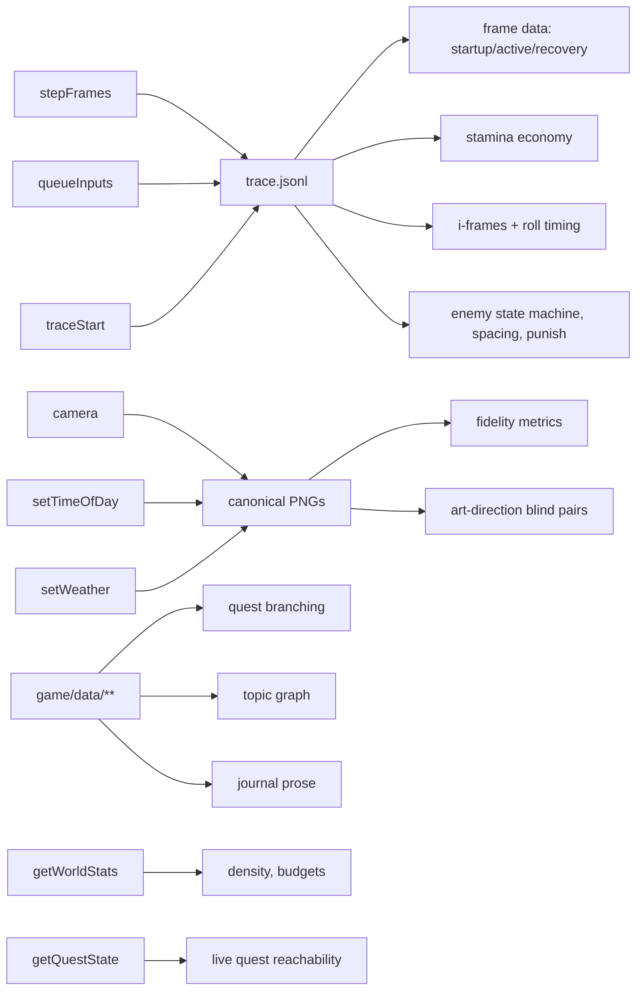

## The bar

The game exposes exactly one automation seam, `window.__HARNESS`, and that seam is wide
enough that every scored claim in this corpus reduces to (a) a per-frame record, (b) a
pixel buffer at a named camera pose, or (c) a static data file — and narrow enough that no
critic ever needs to read gameplay source to take a number. A correct implementation lets
a fresh agent with no context boot the game headless, seed it, drive it with a scripted
input timeline, dump a frame-exact trace, pose the camera at a canonical viewpoint, and
read out world and quest state, using nothing but documented calls. An incorrect
implementation forces critics to infer behaviour from code, which converts every verdict
into an opinion and quietly voids the entire measurement programme. **The API is a
deliverable of the game, not of the harness**: `tools/` is already written and waiting for
it (`corpus/80-methods/HARNESS.md`).

## The reference artifact

The full contract is `HARNESS.md` §3. The scored surface is this table. "Tier" decides
what happens when the method is absent; "probe" is the exact call a critic makes.

| # | Method | Tier | Probe | Correct response |
|---|---|---|---|---|
| A01 | `version` | mandatory | read property | integer `1` |
| A02 | `ready()` | expected | `await ready()` | resolves `true` within 60 s |
| A03 | `getBuildInfo()` | expected | call | `{name, version, commit, builtAt, harnessVersion, fixedStepHz: 60, dataRoot}` |
| A04 | `setSeed(n)` | mandatory | `setSeed(1337)` | returns `1337`; affects a later `loadState` |
| A05 | `getSeed()` | expected | call | echoes the last `setSeed` |
| A06 | `reset(opts)` | expected | `reset({seed:9})` | `{ok:true, frame:0, seed:9}` |
| A07 | `loadState(s)` | mandatory for world/quest | `loadState('arena_flat')` | world present, frame reset, no exception |
| A08 | `saveState()` | optional | call | JSON round-trips through `loadState` |
| A09 | `setMode(m)` | expected | `setMode('harness')` | internal rAF stops advancing the sim |
| A10 | `stepFrames(n)` | mandatory | `stepFrames(60)` | `{frame: prev+60, t_ms: frame*16.666…}` |
| A11 | `getFrame()` | expected | call | integer, monotonic, +1 per step |
| A12 | `queueInputs(script)` | mandatory | see HARNESS.md §4 | returns event count; frames relative to call |
| A13 | `clearInputs()` | expected | call | all buttons released, axes zeroed |
| A14 | `snapshot()` | mandatory | call | one complete §5 frame record |
| A15 | `traceStart(opts)` | mandatory | call | begins per-frame recording |
| A16 | `traceDrain()` | expected | call | returns and clears buffered records |
| A17 | `traceStop()` | mandatory | call | returns remaining records, stops recording |
| A18 | `teleport(x,z,opts)` | mandatory for world | `teleport(0,0)` | player at `[0,*,0]` on the next snapshot |
| A19 | `spawn(id,x,z,opts)` | expected | `spawn('inf_trash',0,7,{as:'e0'})` | returns `'e0'`; entity in next frame's `enemies[]` |
| A20 | `despawn(eid)` | expected | call | entity gone from `enemies[]` |
| A21 | `aggro(eid)` | expected | call | `alert_state` becomes `AGGRO` without waiting on perception |
| A22 | `lockOn(eid)` | expected | call | `player.locked_on == eid` |
| A23 | `setTimeOfDay(h)` | mandatory for visual | `setTimeOfDay(1.0)` | sky/sun state changes, deterministically |
| A24 | `setWeather(id)` | mandatory for visual | `setWeather('storm')` | named weather state, no random transitions |
| A25 | `camera(pose)` | mandatory for visual | `camera({pos,look,fov})` | camera exactly at the pose on the next render |
| A26 | `listAnchors()` | expected | call | the named anchors in `viewpoints.json` |
| A27 | `setUIVisible(v)` | optional | `setUIVisible(false)` | HUD absent from screenshots |
| A28 | `listEntities()` | optional | call | `[{eid, archetype, pos, hp}]` |
| A29 | `getPlayerStats()` | optional | call | full player block |
| A30 | `getWorldStats()` | mandatory for world | call | `{regions, settlements, pois, interiors, npcs, areaKm2, drawCalls, triangles, textureMB}` |
| A31 | `getQuestState()` | mandatory for quests | call | `{active[], completed[], journal[], flags{}, topicsKnown[]}` |
| A32 | `renderFrame()` | expected | call | forces a render of current sim state |
| A33 | `screenshot()` | optional | call | `data:image/png;base64,…` |

### The measurability map — what each API tier unlocks



### The negative surface — claims a critic may NOT make through this seam

| Claim | Why it is inadmissible |
|---|---|
| "Runs at N FPS" | This machine is SwiftShader software rendering. Frame rate here measures the CI box, not the game. Use `drawCalls`/`triangles`/`textureMB` instead. |
| "Input feels responsive" | The real input path is bypassed in harness mode by design (R4). Input latency is not measurable here. |
| "The code does X" | Source is not evidence (`RI-MTH04`). Only artifacts are. |
| "Audio is/isn't good" | No audio capture path exists. If audio must be judged, that is a new amendment, not an improvisation. |
| "It feels like Souls" | Not a measurement. Decompose into trace-computable quantities or hand it to a blind pair (`RI-MTH03`). |
| Anything read from a private variable | If the API does not expose it, the critic files an amendment (CORPUS-CONTRACT §5). |

## Comparison method

Run against the real game, not the stub:

```bash
node tools/harness/smoke.mjs                    # environment gate; must exit 0 first
node tools/harness/run-headless.mjs --scenario smoke --json
```

**M1 — Presence and tier.** For every row A01–A33, evaluate in-page
`typeof window.__HARNESS[m] === 'function'` (or the property read for `version`).
Record present/absent per method. `tools/lib/browser.mjs::requireMethods` already
fail-closes on the mandatory set and exits `11`.

**M2 — Probe behaviour.** For each present method, run the probe in the table and check
the "correct response" column. A method that exists but returns `undefined`, or that
swallows a bad argument and returns a plausible object, counts as **absent and lying** —
worse than absent (see §Scoring).

**M3 — Step exactness.** `getFrame()` → `stepFrames(137)` → `getFrame()`.
Difference must be exactly 137. Then `snapshot().t_ms` must equal `frame * (1000/60)`
within 0.01 ms. Any other value means the sim is not on a fixed 60 Hz integer clock (R2).

**M4 — Loop suspension.** Call `stepFrames(1)`, wait 500 ms of wall clock without calling
anything, call `getFrame()`. It must be unchanged. If the frame advanced, the internal
loop is still driving the simulation (R3 violation) and every trace is machine-dependent.

**M5 — Input relativity.** After a 30-frame warm-up, `queueInputs([{f:0,press:['light']}])`
then `stepFrames(1)`. The resulting frame's `input.pressed` must contain `light`. If the
press is dropped, frames are being interpreted as absolute and every scenario silently
loses its opening inputs.

**M6 — Argument rejection.** `queueInputs([{f:0,press:['banana']}])` must throw.
`stepFrames(-1)` must throw or be a no-op returning the same frame. `spawn('nope',0,0)`
must throw rather than returning a phantom eid. Fail-closed beats fail-quiet.

**M7 — Camera exactness.** `camera({pos:[10,2,10],look:[0,1,0],fov:55})`, then
`renderFrame()`, then read back the camera state. Position error must be < 1e-3 m and the
same pose twice must produce byte-identical PNGs (`sha256` of `page.screenshot()`).

Record the whole probe run as `reports/runs/<runId>/api-probe.json`.

## Scoring

Per method: **2** = present and probe-correct, **1** = present but degraded (wrong return
shape, tolerated bad input), **0** = absent, **−2** = present and *lying* (returns a
plausible value that does not correspond to reality — e.g. `stepFrames` that returns
`frame+n` without simulating, `camera()` that returns the pose but does not move).

Weight by tier: mandatory ×3, tier-mandatory (visual/world/quest) ×2, expected ×1,
optional ×0.5. Max weighted score = 100 (normalised).

| Weighted % | Verdict |
|---|---|
| ≥ 90 and all mandatory = 2 | Meets the bar |
| 70–89 | Below bar — named remedy required, affected items score 0 not "unknown" |
| < 70 | Loses outright |

**Hard fails, independent of score — any one voids the piece:**

- Any mandatory method (A01, A04, A10, A12, A14, A15, A17) absent → exit 11 → *nothing*
  in `corpus/10-combat/` is scoreable and the wave cannot be graded.
- M3 fails (frames are not exact integers at 60 Hz) → every frame-data item is void.
- M4 fails (loop keeps running) → every trace is machine-dependent; `RI-MTH02` cannot pass.
- Any method scoring −2. A lying API is not a bug, it is a fabricated measurement, and it
  is treated under `RI-MTH04` as measurement fraud.
- `getWorldStats()` or `getQuestState()` returning hard-coded values that do not change
  when the world does (probe: compare across two different `loadState` targets).

**We lose** when a critic writes "could not measure — API absent" in more than two
dimensions. At that point the harness owner has failed, not the gameplay builder.

**Native → ladder anchors — the row mandated by `SCORING.md` §1.2 (BAR-CRITIQUE-01 W7).**
Added wave-1-prep to close BAR-CRITIQUE-02 **C1**; derived from this item's own bands above.
**No threshold in this item was changed.**

| Ladder | 4 | 6 | 8 |
|---|---|---|---|
| Native | 70 / 100 | 80 / 100 | 92 / 100 |

**Aggregation (a property of this item, not of the critic):** weighted-sum, normalised to 100; mandatory checks x1.0, optional x0.5.

## How we lose

Concrete, expected failure modes, written in advance:

1. **The API is added last, as a shim.** `stepFrames` calls the existing rAF-driven update
   once with whatever `deltaTime` was lying around. M3/M4 catch it; every frame-data number
   afterwards is noise.
2. **`stepFrames` renders every frame.** A 3600-frame trace takes 15 minutes on
   SwiftShader and critics quietly reduce their sample sizes to compensate. The contract is
   render *once at the end* of a batch.
3. **`camera()` fights the gameplay camera.** The pose is applied and then overwritten by
   the follow-cam on the next update, so every canonical screenshot is subtly different.
   M7's byte-identical check catches this and it will be the most annoying bug to fix.
4. **Input frames interpreted as absolute.** Warm-up frames eat the opening inputs; the
   `{f:0}` movement event never fires; combat scenarios start with the player standing
   still and every attack lands out of range. M5 exists solely because this bug is nearly
   invisible in aggregate statistics.
5. **`snapshot()` returns a different shape from the trace records.** Two subtly different
   schemas appear, and `trace-stats.mjs` silently reads `undefined`. The trace record and
   `snapshot()` must be produced by the same function.
6. **Enemies are not in `enemies[]` when they are dead/dormant.** Windows straddling a
   death are truncated and punish-window statistics silently drop samples. Dead entities
   stay in the array with `state: "DEAD"` until despawned.
7. **`getWorldStats()` is hard-coded** to the numbers the builder hoped for. The
   cross-`loadState` probe exists for exactly this.
8. **`aggro()`/`spawn()` are missing**, so the only way to set up a fight is to walk the
   player there for 40 s of simulated time, and every AI scenario becomes 10× longer and
   flakier.
9. **The API exists but throws on the second call** (state not re-entrant), so a critic can
   take one measurement per browser launch and quietly stops taking repeats.
10. **`version` never bumped** while the shape changes underneath, so tools silently
    misread fields. The version integer is cheap; drift is not.

## Provenance note

`provenance: constructed`. This surface is **defined for this project**. It is not a port
of any existing game's debug API. It was designed against, and is implemented by, the
worked reference implementation at `tools/harness/stub/index.html`, and every probe in the
Comparison method has been executed against that stub on this machine — so the probes are
known-runnable, even though the game they will eventually judge does not exist yet.

Its shape is informed by common practice in automated game testing (headless browser +
fixed-step + scripted input + state dump). The specific method list, tiers and tolerances
are ours, and are binding because a constructed bar we can measure beats a real API we
cannot.
