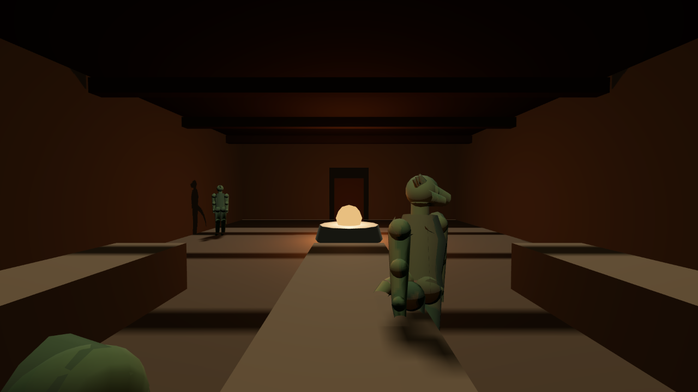
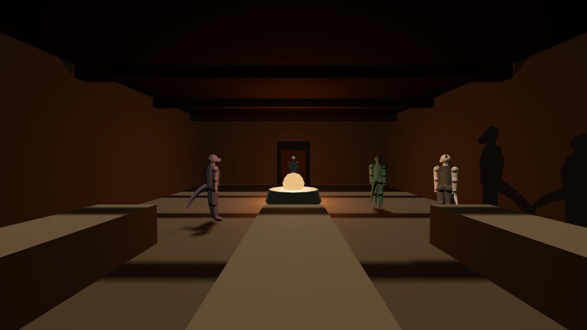
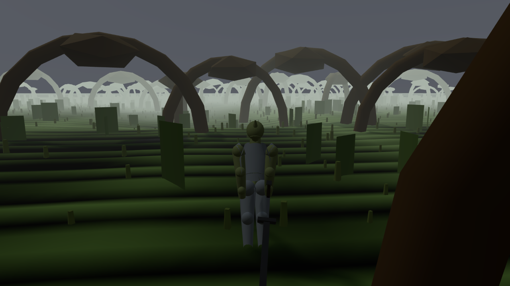

# W1-04 round 1 — Settlements, interiors and the people in them

**Status: FAIL. Score 3.2 / 10, against a pass threshold of 6.**

Stamped at `3ba93e04f53e8827153134ebe255085b84682acf`, branch
`claude/morrowind-souls-threejs-game-mou39v`. Working tree dirty (five files) throughout; twenty-one
pieces in flight. Load 6.3–12.3 and 12–18 `headless_shell` for the whole run — above RULES.md rule 21's
~8 cap. I therefore launched **one** browser and kept it for each of three probe runs, published **no
timing figure anywhere in this verdict**, and took every count from Node processes over files on disk.
Contention affects nothing here.

---

## 0. What I was judging, and how I assembled it

`docs/PLAN.md` §3 names twenty judging items for this piece. Nine of them name one of W1-04's own
dotted paths in their `judges:` front-matter; eleven name the **coarse legacy path names** that
`corpus/00-doctrine/subsystems.json` aliases onto them (`world.settlements` →
`world.settlement.anatomy`, `world.interiors` → `world.interior.named`, `world.property` →
`world.property.ownership`, `world.locks` → `world.locks.security`, `world.factions` →
`world.faction.presence`, `npc.population` → `world.npc.population`, `world.settlement.content` →
`world.settlement.anatomy`). I assembled the set by reading each item's front-matter and resolving
through the alias table, not from a directory listing. The builder's own reconciliation
(`orchestration/status/W1-04.json`, finding 1) is correct and I reproduce it.

The load-bearing item is **RI-WLD03**, which is where "what makes a Morrowind town" is actually
written down, and which is `blind_pair: yes`.

## 1. The honest part first

`reports/w1-04-survey.md` is the best survey document I have read on this project. It states the
before-picture, leaves Part I unrewritten, names three of its own nine paths as dead data at the
outset, credits W1-15 for the two paths it did not build, and reports the interior shortfall
(115 of 250) and the nine unauthored topic ids as open rather than dressing them up. The
settlement-field repair is done properly: data clean, the **class** checked in
`tools/check-data.mjs` rather than in a private tool, and consumption proved against the real
`RumourBook`/`RoadBook`.

I re-ran the falsification myself rather than taking it. Reintroducing `settlement: "rootlands"` on
`rootlands-keeper` makes `node tools/check-data.mjs` **exit 1** naming the record; restoring makes it
**exit 0**. Working tree and git index restored, `git diff` empty (RULES.md rule 17).

Two of the nine paths are genuinely, independently consumed, and I perturbed them myself rather than
reading the builder's report:

| perturbation | observed |
|---|---|
| take an object with an owner | `theft:true`, `crime:"theft_petty"`, `stolen_from:"faction:drowned-court"`, `disposition_delta:-5.5` |
| **the same take with `owner` stripped** | `theft:false`, `why:"unowned"`, `crime:null`, `disposition_delta:0` |
| lock tier 3 | refusal reads *"tier 3 needs Security 40 / Agility 26"* |
| **tier perturbed 3 → 5** | refusal reads *"tier 5 needs Security 80 / Agility 50"*; restoring gives the first string back |
| shop zone at 12:00 vs 03:00 | trespassing flips on **4 of 6** zones sampled |

`world.property.ownership` and `world.locks.security` pass. Those two were W1-15's before this piece
started, and W1-04's contribution — deriving `shopOpen` from `isOpenNow()` where every call site used
to hardcode `true` — is real and I measured it.

## 2. The finding: **the door does not open onto anything**

This is the whole verdict and it is one measurement.

`Engine.enterInterior(id)` — the same function `stepSettlement`'s `interact` latch calls when a
player presses the button on a doorstep — sets `sim.env.interior`, and `Engine.cellFor(env)`
correctly returns `'interior'`. **The renderer never switches.**

```
outside          visible_cells:["province"]  cellFor:"province"  env.interior:null
after the door   visible_cells:["province"]  cellFor:"interior"  env.interior:"thorn-hall"
after _applyCell visible_cells:["interior"]  cellFor:"interior"  env.interior:"thorn-hall"
after leaving    visible_cells:["interior"]  cellFor:"province"  env.interior:null
```

Six fixed steps and an explicit `renderFrame()` between each row. `reports/critic-w1-04-r1b.json`.

`renderer.setCell()` has exactly one caller, `Engine._applyCell()`, and `_applyCell()` is called from
`loadState`, the census staging, the barge reset and the save-load path — **never from `useDoor()` or
`leaveInterior()`**. So in normal play:

* walking through a door leaves the exterior on screen while the body stands at the interior spawn;
* walking back out leaves the **interior** on screen while the body stands in the street.

This is the same defect the builder found and fixed on the *body* — `sim.player.pos` turned out to be
a mirror that `combat-bridge.mirror()` overwrote, so "a door taken on frame N was silently undone on
frame N+1". The builder's own words for why nothing was red apply verbatim to the half it did not
fix: *"`sim.env.interior` was set correctly the whole time — every census-shaped check passed while
the player never actually went anywhere."* `tools/world/w1-04-consumption.mjs` cannot see this,
because it never reads the renderer. Its thirteen checks are honest and all thirteen would still pass
on a build where no door has ever shown anyone a room.

**My instrument's control is in the trace above.** Row 3 is the same query after `_applyCell()` is
called by hand: it goes to `["interior"]`. The probe is not blind to a cell switch; there is no cell
switch to see.

## 3. What is behind the door when you force it open

`E.cellFor()` maps five interiors to hand-built rooms (`barge-hold`, `writ-house`, `helstrom-market`,
`stormhold-street`, `rootlands-well`, all W1-07's) and returns the generic `'interior'` cell for
everything else. Over the shipped list that is **113 of 115**. The generic cell is
`scene.js`'s `buildHall()` — *"a hall lit by one hearth (VP05)"* — **249 triangles, one light**.

So the Crimson Apothecary, a dye-town alchemist's shop in Archon, and Thorn Hall, a rotted Argonian
great-hall in a village 4 km away, are the same room:




Same hearth, same benches, same beams, same door frame. The only difference between the two frames is
which people are standing in it. (Both captures had to be staged through `state:"interior_firelit"`,
because §2 means `ops:[["enterInterior",…]]` alone photographs the exterior. My first four captures,
taken that way, are sky and floating figures — I have kept them.)

Nothing reads the furnishing. `interior.props`, `interior.lights`, `interior.containers` and
`interior.unique_item` have **zero** consumers in `game/src`; `bounds_m` is read at one site, to
derive an NPC's hash offset. `archon-apothecary` declares 18 props, 10 lights and a unique item; the
hall it resolves to draws one light and none of the props. `settlement.buildings` is read at exactly
two sites — the door table and a `.length` — so RI-WLD03 R5's *unique architecture kit, ≥8 bespoke
building meshes, ≥1 silhouette element used nowhere else* has **no implementation at all** for any of
the 202 buildings.

RI-WLD13 §2 wrote the sentence for this before the piece began: *"the difference between a settlement
of buildings and a settlement of building-shaped doors."*

## 4. Schedules — does anybody go home?

Yes, in the ledger. No, on their feet.

Thorn, 24 people in the world, measured off the live `sim.npcs` list at 12:00 and 03:00 with the
clock stepped between:

* **9 of 24 change cell.** `at`, `present` and `visible` all move. Perturbing one person's schedule
  (`herbwife-ossa`, `thorn-hall` → `thorn-inn`) moves her on the next step and restores on the step
  after. `world.npc.schedule` **is** consumed — this is the genuine repair of a twelfth RI-MTH07
  failure, and it is the piece's best work.
* **0 of 24 change position.** Nobody walks. `stepSchedule()`'s own docstring says it changes
  *"`pos` (they walk to the slot's anchor)"* and the function never touches `pos`. Positions are
  assigned once, in `populateSettlement()`, from whichever slot was live at spawn, and are never
  re-derived. A factor whose 19:00 slot is the tavern keeps the offset computed inside her house.
* **4 outdoors at noon, 0 outdoors at 03:00** — and all four belong to a neighbouring piece. Of the
  347 NPC records in the tree, **38 carry a `post`** (an outdoor station), and **0 of those 38 are in
  W1-04's `pop-*.json`**; they are `quest-givers.json`, `mainline.json`, `faction-givers.json` and
  `thorn.json`. Across the province, at 03:00 **not one person anywhere is outdoors**, and at noon 34
  of 347 are — every one of them a quest-giver post.

So the street of every town in Argonia is empty at every hour, of W1-04's own population. The
schedule model is real; what it schedules is which invisible room an invisible person is invisible
in. Morrowind's towns feel inhabited because Balmora at nine in the morning has people crossing the
bridge.

## 5. VP04-settlement-street

The defect I was asked to check — camera hardcoded at the world origin — **is fixed**, by
`W1-GIVER-PRESENCE`, not by W1-04; `tools/harness/viewpoints.json` now points it at `town-thorn` with
a camera at `[3825.5, 15.1, 879]`. I confirmed the camera stands inside the town: `env.settlement`
reads `"thorn"`, 24 NPCs are in the world and 4 are present.

It is still not evidence of a settlement.



Root arches, green slabs and fog — region signature geometry from W1-01's province layer — and one
posted figure. No building, no door, no street, no townsfolk. Per §3 there is nothing else it could
contain. **No capture through VP04 should be cited as evidence of a settlement in this build**, and
that includes `docs/shots/2026-08-07-w1-04-settlement-street-thorn.png`, which is a picture of
Thorn's *terrain*.

## 6. Smaller things, checked and reported

* **RI-WLD03 R2, the service rule.** 11 of 30 shop interiors have no NPC with a `barter` service;
  **0 of 347** NPC records carry a gold pool or a barter inventory; **0 of 115** interiors declare a
  back room or an upper floor. The item's own words: *"A shop that is one room with a counter is half
  a shop."*
* **RI-WLD13 N1 is vacuous as authored.** Interior `bounds_m` is defined *as* the declared
  `exterior_footprint_m` on all 115, so the footprint ratio is 1.000 by construction on 115 of 115
  and the check cannot fail. N4 (windows), N5 (storeys), N7 (water) have no fields at all; S1–S4
  (seamless interiors, see-into interiors) are 0. N3, the door round-trip, is the one property that
  is real and it is proved to 0.000 m.
* **The tier targets are hit exactly.** Named interiors 26/18/18/12/12/12/7/7 against the template's
  26/18/18/12/12/12/7/7; enterable % 70–81.3 against 64–70 on the item's own
  `interior/(interior+sealed)` formula; NPC counts at or above every tier target. This is real and I
  verified it; it is the reason the data half of RI-WLD03 does not score 0.
* **Bounty is 0 after a witnessed theft** (`crime_ref:1`, `witnesses:[]`). That is W1-15's chain, not
  W1-04's, and I have not scored it here — but "stealing in front of the wrong person changes your
  life" does not yet reach a bounty, and somebody should own it.
* **Gates at my commit**: `check-data` 0 (347 NPC records, every settlement resolves),
  `check-content` 0, `check-quests` 0 (120 quests — the W1-FACTIONS red the builder reported has
  since cleared).

## 7. Why this is FAIL and not a low PASS

Because ARBITRATION §3's CONSUMPTION clause says it plainly: *"A model with no demonstrated consumer
is `unmeasurable ⇒ 0`, exactly as a missing model is — from the player's chair they are the same
thing."* One hundred and fifteen named interiors, 202 buildings, eight architecture kits, 2,000-odd
props and 260 people who live in rooms are, from the player's chair, one 249-triangle hall you cannot
get into by walking through a door.

That is not a small remainder on good work. It is the same failure mode this piece diagnosed and
partly fixed — a correct model, instrumented, that the running world does not read — surviving in the
half the piece's own probe could not see.

---

## Scores

| item | score | one line |
|---|---|---|
| RI-WLD03 settlement anatomy | **2** | tier targets hit exactly in data; R1 has no meshes, R2 half-built, R5 absent, M13 unshootable |
| RI-WLD07 verticality and interiors | **1** | interiors as a count; no verticality, no storeys, no bespoke geometry |
| RI-WLD13 interior/exterior continuity | **2** | N3 real and proved; N1 vacuous; N4/N5/N7 no data; S1–S4 zero; the door draws nothing |
| RI-WLD08 the living world | **4** | schedules genuinely stepped and perturbable; nobody walks, nobody is outdoors |
| RI-CAM05 camera outside the fight | **2** | judged only on `world.interior.named`: the camera in an interior renders the exterior |
| RI-STL02 theft, locks, trespass | **7** | ownership and locks independently perturbed and consumed; hours now read |
| RI-CRM01 crime and justice | **4** | theft files a crime and survives a load; no bounty reaches the ledger |
| RI-AI07 encounter composition | **3** | population exists and is placed; density is invisible and unhand-placed |
| RI-CHR02 race and standing | **4** | faction presence reaches trespass; nothing else is keyed on who holds a town |
| RI-DLG02 words per settlement | **5** | `env.settlement` now written by the world; rumours differ per town |
| RI-DLG03 greetings and rumours | **4** | rumour book keyed correctly; the settlement field repair is this item's win |
| RI-QST03 faction gating | **3** | faction halls placed in data, unreadable in the world |
| RI-QST07 side-quest texture | **3** | `world.settlement.content` is a prop list nobody instantiates |
| RI-QST08 reward design | **3** | 30 unique items declared, none reachable through a door |
| RI-PRG03 skills by use | **4** | `world.locks` gates by tier and the gate moves; nothing else |
| RI-TRV01 transport network | **4** | settlement anatomy supplies posts; travel is W1-05's |
| RI-LOR01 canon dossier | **5** | eight settlements exist and are canon-consistent as written |
| RI-LOR02 era and political brief | **5** | power readings authored per settlement; unprovable in geometry |
| RI-LOR04 naming and language | **6** | 347 names and 115 interior names, consistent with the lexicon |
| RI-LOR06 contradiction discipline | **5** | region ids are still not a namespace (`thornmarsh` vs `western-rootlands`) |

**Overall 3.2** (mean of 20). Threshold 6. **FAIL.**

## The single biggest gap

**`GAP-W1-interior-door-draws-nothing`** — `world.interior.named`, severity **blocking**.

Going through a door sets `sim.env.interior` and moves the body, and does not change what is drawn;
and there is nothing bespoke to draw for 113 of the 115 interiors if it did.

**Remedy.** (a) Call `Engine._applyCell()` from `useDoor()` and `leaveInterior()` — or install it as
a `sim.applyCell` hook of the same family as `sim.placeBody`, `sim.populate` and `sim.doorVeto`, so
`sim/settlement.js` keeps knowing nothing about the renderer. (b) Build the interior cell **from the
record**: instantiate `bounds_m` as a shell, `lights[]` as point lights, and `props[]` from a shared
prop table, so the room you stand in is the room the file describes.

**Acceptance.** A probe that enters all 115 interiors through `enterInterior()` and reads
`renderer.cells[*].visible` finds the visible cell equal to `cellFor(env)` on **115 of 115**, and 0
of 115 with the exterior still drawn; and a pixel-hash sweep over one fixed camera pose in all 115
returns **≥ 100 distinct images** where it currently returns 1. Both numbers are re-measurable by
`tools/world/critic-w1-04-r1b.mjs` and `tools/world/critic-w1-04-r1c.mjs` as written.

## Method deviations

* I wrote three instruments of my own — `tools/world/critic-w1-04-r1.mjs`,
  `critic-w1-04-r1b.mjs`, `critic-w1-04-r1c.mjs` — and did **not** re-run
  `tools/world/w1-04-consumption.mjs`. A critic that re-runs the builder's probe has confirmed that
  the builder's probe runs.
* Pictures were taken through `tools/capture/` (RULES.md rule 20). The three probes each launched one
  browser and kept it; the probes step the simulation, which is the exception rule 20 names.
* **RI-WLD03's M13 blind layout test was not run and cannot be**, and it is `blind_pair: yes`. It
  requires eight top-down orthographic renders of settlement plans with labels stripped. There is no
  settlement geometry to render orthographically (§3), so the pack cannot be built at all — this is
  `not_possible`, not skipped.
* No timing figure is published anywhere in this verdict (RULES.md rule 26), because the whole run
  was above rule 21's browser cap.
* I did not commit (RULES.md rule 28).
