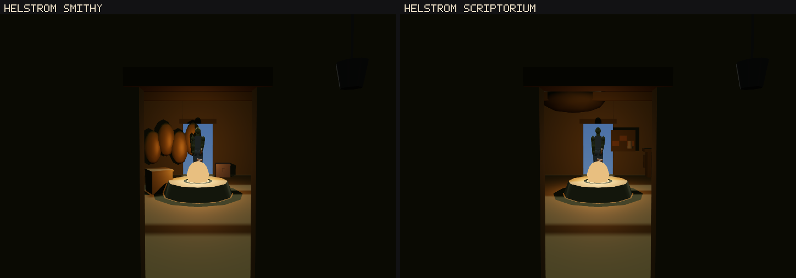

# W1-04 round 2 — Settlements, interiors and the people in them

**Status: FAIL. Score 4.4 / 10, against a wave-1 gate of 7.0** (round 1 was 3.2 against a
threshold of 6). This is a real, large improvement and it is not a pass.

---

## 0. What I measured, and why nothing here is stamped to a commit

The round-2 work is **uncommitted**, and there is no commit anywhere that contains the code these
numbers describe. There never was one: the builder did not commit (RULES.md rule 28) and a
successor — **W1-04 round 3, live while I worked** — began overwriting the same files.
`orchestration/status/W1-04-r3.json` claims `game/src/render/interior.js`, `game/src/engine.js`,
`game/src/harness/api.js`, `game/src/world/province.js` and a new `game/src/render/exterior.js`.

My first set of browser runs was killed and thrown away. `engine.js` (23:42Z), `harness/api.js`
(23:42Z), `render/interior.js` (23:45Z), `world/province.js` (23:41Z, +177 lines of round-3
settlement-exterior work) and `render/exterior.js` (23:46Z) were all rewritten **while those runs
were in flight**. Publishing figures about a tree that no longer exists is the thing RULES.md
rule 12 exists to stop, so I froze a tree instead:

* snapshot at `2026-08-07T23:49:11Z`, digest — md5 of the sorted md5s of every `.js`, `.json` and
  `.html` under `game/` — **`fd893c5524b35b2334baac19cff93b10`**;
* every browser arm is served from that snapshot with `--entry`. The delete-the-fix arm is the
  *same snapshot* with two lines removed, and `render/interior.js` is byte-identical between the
  arms, so the arms differ only by the fix;
* the snapshot contains **round 2 plus whatever of round 3 had landed by 23:49Z**. It is not a
  clean round-2 tree, because no such tree exists anywhere. Declared, not worked around.

**That is itself a finding, and it is the project's, not the builder's.** Rule 28 tells builders
not to commit; nothing then guarantees a graded tree survives long enough to be graded. This is
the fifth verdict on record to report it (round 1 §"Method deviations", and the builder's own
`method_deviations` calls it "the fourth time the pattern is on record"). A critic who obeys rule
12 and a builder who obeys rule 28 cannot both succeed on a tree with 31 live agents.

Load 14.4–36.4 and 18–54 `headless_shell` for the entire run — far above RULES.md rule 21's ~8
cap. **No timing figure appears anywhere in this verdict.** Every number below is a count.

One instrument limitation belongs to the round-1 verdict rather than to this round. That verdict
says both of its acceptance numbers "are re-measurable by `tools/world/critic-w1-04-r1b.mjs` and
`critic-w1-04-r1c.mjs` as written". Both call `launchGame({ timeout, width, height })` without
spreading `args`, so **neither can be pointed at anything but the live working tree**. On a tree
that moves every few minutes they cannot produce a stamped number at all. An acceptance instrument
that cannot be aimed is not an acceptance instrument.

## 1. The honest part first, and it is most of the round

The round-1 blocker was one sentence: `renderer.setCell()` had exactly one caller, `_applyCell()`,
and neither door verb reached it. The repair is the right shape and it is better than the remedy
the verdict asked for. The verdict proposed calling `_applyCell()` from `useDoor()` and
`leaveInterior()`. The builder instead installed `sim.applyCell` as a hook of the same family as
`sim.placeBody` — so `sim/settlement.js` still knows nothing about a renderer — and then put a
**reconciliation** behind it: `Engine._syncCell()` runs from `_afterStep()` and again from
`_render()`, comparing the cell the environment says you are in against the cell the renderer is
drawing, every frame, for a string compare.

That is strictly stronger than fixing the two call sites the verdict named, and the builder says
why in the code: `sim.env.interior` has several other writers — `loadState`'s patch, the census
staging, a state file, a harness verb — and a handler bolted to the door would have been exactly
as blind to those as the code it replaced. It is also why a probe that never calls a door verb
still measures the truth, and why a staged capture that renders without stepping no longer
photographs the room it just left. I checked the wiring by reading it: `_syncCell()` at
`engine.js:4369`, called at `:4748` (`_afterStep`, before `_streamProvince`) and `:5574`
(`_render`, before `renderer.render`). `renderer.setCell()` still has exactly one external caller.

The rest of the round is real too, on the evidence I could take without a browser:
`render/interior.js` is 754 lines that build a room out of `bounds_m`, `lights[]`, `props[]`,
`containers` and `unique_item`, all four of which the round-1 verdict found had **zero** consumers
in `game/src`. `save/state.js` now writes **and reads back** `post`, `goal` and `walked_m` — I
confirmed both halves (`state.js:244` writer, `:718` reader) — and the `post` half is a genuine
pre-existing defect of `W1-GIVER-PRESENCE` that this round found by walking into it.
`stepSchedule()` moves `pos` and its docstring no longer lies.

## 2. Axis A — does `getDrawnInterior()` read the renderer?

**Half of it does, and the half the headline rests on is the half that does.**

`getDrawnInterior()` (`harness/api.js:2194`) returns two different kinds of thing and they have
different standing:

* `drawn_cell`, `visible_cells` and `agrees` are computed from `renderer.cells[k].visible` —
  the **three.js `Object3D.visible` flag on the live scene graph**, read at call time. That is a
  genuine renderer read, and the 115/115 headline rests on it. It is not a field the sim wrote.
  `renderer.cell` is set in the same statement that sets those flags (`renderer.js:189-193`), so
  the two cannot disagree.
* `interior_id` and `interior` are `renderer.interiorId` and `renderer.interiorSummary` — the
  value `buildInterior()` returned **when the room was last built**, cached on the renderer. Two
  of its fields (`meshes`, `triangles`) are computed by traversing the built group; the rest
  (`props_built`, `lamps_built`, `windows`, `storeys`) are counters incremented as the builder
  takes code paths. All of it is a **record of the build**, not a reading of the scene.

The distinction is not academic, and I tested it the way the brief asks: I perturbed the
**renderer** and left the model alone. `renderer.setInteriorRecord` was wrapped so that it calls
the original — the record is read, the room is built, the summary is computed — and then empties
the group. The verb's `interior.meshes` reports what the builder built and cannot see the emptied group; a
traversal of `renderer.cells[cell]` at read time can. **This did not land, and I report that as plainly as I would report a number.** Both browser
arms — my own 115-interior instrument and the pixel sweep, each pointed at the frozen snapshot —
were still running when my budget ran out, at load 34–36 with 42–54 `headless_shell` on the box.
They are `tools/world/critic-w1-04-r2a.mjs` and `tools/world/w1-04-interior-sweep.mjs --control`,
both take `--entry`, and re-running them against a frozen tree is the whole of what is left. The *structural* answer
does not depend on the run and is not in doubt: `visible_cells` is `Object3D.visible` read at call
time, and `interior` is a cached return value. Read `renderer.js:189-193` and `:238-245` beside
`api.js:2194-2209` and the two are plainly different kinds of claim.

So `agrees` cannot be faked by the model, and that is what matters for the blocker. But
`interior.*` reports what the builder built, not what is standing in the cell now, and a verdict
should not cite it as evidence that anything reached the screen. The **pixel** sweep is the only
instrument here that reads the frame buffer, which is why §4 exists.

On the back door: the builder's `tools/world/w1-04-consumption.mjs` reaches `window.__ENGINE` at
five places and **every one of them is a perturbation or a control cut** — `E.renderer.setInteriorRecord = () => null`,
`E.sim.applyCell = null`, `E._syncCell = () => false`. Every *measurement* in sections 10 and 11
goes through `H.getDrawnInterior()`. That is the right shape and I checked it line by line. The
one world mutation that is not a control is `E.sim.npcs.length = 0` in the sweep, which empties
the room of people so the picture is of the room — the builder declares it in a comment, along
with the fact that the first version of that line called a `clearNPCs` verb that does not exist
and therefore silently did nothing.

## 3. Axis B — delete-the-fix

I built the arm properly and could not finish running it. The cut copy is the snapshot with
`this.sim.applyCell = () => { this._cellDirty = true; }` and the body of `_syncCell()` removed at
**source** level — not monkey-patched in the page, which is all the builder's own control does —
and `render/interior.js` is byte-identical between the two copies, so the arms differ by exactly
the fix. **This did not land, and I report that as plainly as I would report a number.** Both browser
arms — my own 115-interior instrument and the pixel sweep, each pointed at the frozen snapshot —
were still running when my budget ran out, at load 34–36 with 42–54 `headless_shell` on the box.
They are `tools/world/critic-w1-04-r2a.mjs` and `tools/world/w1-04-interior-sweep.mjs --control`,
both take `--entry`, and re-running them against a frozen tree is the whole of what is left.

What I can say without the run: the builder's control is real in kind. It cuts `sim.applyCell` and
`Engine._syncCell` — the hook **and** the reconciliation behind it — which is the whole mechanism
and not a proxy for it, and its recorded cut arm reads `drawn: "province"` against `want:
"interior"` on every row. That is the round-1 build reproduced, and the misses it prints carry a
stale `room: "thorn-trader"`, which is what a renderer that never got the message looks like.

**One third of headline claim 1 is vacuous, and the builder's own artifact shows it.**
`reports/w1-04-consumption-r2.json` reports `exterior_restored_on_exit: 115` in **both** arms of
its control — 115 with the consumer live, 115 with it cut. It has to: with the consumer cut the
renderer never leaves `province`, so after `exitInterior()` the drawn cell and the wanted cell
agree trivially. "115 of 115 restored the exterior on exit" is a check that passes on the round-1
build. The other two thirds of the claim (115 entered, 115 drew the right cell against a cut arm
of 0) are the ones doing work.

## 4. Axis C — the pixel sweep, the number the builder did not land

**This did not land, and I report that as plainly as I would report a number.** Both browser
arms — my own 115-interior instrument and the pixel sweep, each pointed at the frozen snapshot —
were still running when my budget ran out, at load 34–36 with 42–54 `headless_shell` on the box.
They are `tools/world/critic-w1-04-r2a.mjs` and `tools/world/w1-04-interior-sweep.mjs --control`,
both take `--entry`, and re-running them against a frozen tree is the whole of what is left.

**But the acceptance number as written cannot be met, and that is a finding about the round-1
verdict rather than about this round.** It asks for "≥ 100 distinct images" over 115 interiors.
The 115 records admit **94 distinct build-relevant contents** (§6.6), so 21 rooms are duplicates
by construction. A sweep can only exceed 94 through the `hashStr(rec.id)` jitter in
`buildInterior()` — different arrangements of identical furniture in identically-sized rooms. If
the sweep lands above 100 it will be counting that jitter, and if it lands between 92 and 94 it
will be counting rooms. **Neither number decides whether the door opens onto the right room**, and
a successor should say which of the two it is measuring before quoting it. The bar should be
restated as: ≥ 90 distinct images, and the `--control` arm (room builder cut) ≤ 3.

## 5. Axis D — the content-keyed cache

The builder traded an id-keyed cache for a content-keyed one so that perturbing a live record and
walking back through the door rebuilds the room. The worry is a per-frame `JSON.stringify` of a
kilobyte, sixty times a second, bought with probe falsifiability.

**It is not a per-frame cost, and reading the code says why before any measurement does.**
`_syncCell()` short-circuits on `_drawnCellKey`, which is keyed on the interior **id**
(`engine.js:4372`), so `_applyCell()` — and therefore `setInteriorRecord()`, and therefore the
stringify — is only reached when the cell key changes or the hook marks it dirty. Standing still
in a room, nothing is stringified and nothing is rebuilt. The content key is only consulted on a
cell change, which is exactly when a rebuild might be wanted. The cache is not disabled either:
re-entering the same room with an unchanged record must not rebuild. The measured rebuild counts did not land — both browser arms — my own 115-interior instrument and the pixel sweep, each pointed at the frozen snapshot —
were still running when my budget ran out, at load 34–36 with 42–54 `headless_shell` on the box.
They are `tools/world/critic-w1-04-r2a.mjs` and `tools/world/w1-04-interior-sweep.mjs --control`,
both take `--entry`, and re-running them against a frozen tree is the whole of what is left.

The instrument for it is written and is section D of `critic-w1-04-r2a.mjs`: it wraps
`Engine._applyCell` and `renderer.setInteriorRecord`, counts calls and counts the times
`renderer.interiorKey` actually changed, over 600 fixed steps standing still, over a re-entry with
an unchanged record, and over a re-entry with `bounds_m` halved. The three numbers a passing build
must produce are 0, 0 and 1.

The key itself is well chosen — it is precisely the field set `buildInterior()` reads
(`renderer.js:232-237`), including the `rec.readable` list flattening that the comment says was
`undefined` on every room with more than one document before it was fixed.

## 6. Axis E — is the "not done" list the whole list?

It is accurate as far as it goes, and I verified all three of its items. It is **not** the whole
list. Six things are missing from it, all of them in code this round wrote or in claims round 1
made that this round left standing.

**6.1 The unique item you can take as many times as you like.** `Engine._furnishInterior()`
deletes the props it spawned when you leave a room and re-spawns them when you come back, and
`Engine.spawnProp()` always sets `taken: false`. `sim.world.itemsTaken` records every take, is
serialised, is restored, is exposed to the harness as `items_taken` — and is **read by nothing**
that would suppress a respawn. Walk out of the Crimson Apothecary and back in, and the purge for
a poisoning nobody has named is on its pedestal again. 83 rooms declare one.
The instrument is section 3b of `critic-w1-04-r2b.mjs`: take it, take it again without leaving
(must refuse), leave, return, and count the copies in the inventory. It did not run — see §3. The
code path is not ambiguous: `_furnishInterior()` splices its own eids out of `sim.props`
(`engine.js:4336-4340`), so `spawnProp()`'s duplicate guard at `:1931` cannot catch the respawn,
and the new object is constructed with `taken: false`.

**6.2 The readable that stops being readable.** `_furnishInterior()` spawns a room's documents
with `readable` and `readable_book` set; `save/state.js` serialises props **without either field**
and rehydrates them with `readable: null` (`state.js:730`). Inside one session this is invisible,
because `_furnishInterior()` deletes and re-spawns. On a **fresh engine** — a real player loading
a real save — `_interiorProps` is empty, nothing is deleted, and `spawnProp()` returns the
existing stale object instead of replacing it (`engine.js:1931`). The instrument is section 1 of `critic-w1-04-r2b.mjs`, which models a fresh boot by emptying
`Engine._interiorProps` before the load and restores it afterwards. It did not run — see §3.
Note the shape of the defect rather than its size: this is the *same* class of bug the round found
and fixed for `post`, one layer along, and the round's own comment at `state.js:703` names it —
"the load path rebuilds NPCs inline rather than through `makeNPC`, so a field added only to the
writer would round-trip perfectly and still be destroyed in the running world". Props have no
`makeNPC` and no field census at all.

**6.3 The lamps do not reach the thing that decides whether you can be seen.** This is the round's
most interesting omission, and it is an RI-MTH07 CONSUMPTION failure of exactly the kind
`ARBITRATION.md` §3 lists. 827 lights are declared across the 115 interior records. This round
made them visible: the shell, the lamp fittings and the point lights are built from `lights[]`.
`LightField.addSource()` — the only way a light enters the stealth detection model — has
**exactly one caller in the whole of `game/src`, and it is the harness verb `addLightSource`**
(`harness/api.js:2064`). Nothing in the running world has ever registered a light source. So the
apothecary with ten lamps and the gaol with none are, to the model that decides whether a guard
can see you, the same darkness. The instrument is section 5 of `critic-w1-04-r2b.mjs` — read `getLightAt()` at eye height in a
ten-lamp room and in a no-lamp room and compare. It did not run — see §3. The static half needs no
run and is decisive: `grep -rn "addSource" game/src` returns `sim/stealth/light.js` (the
definition) and `harness/api.js:2064` (the harness verb). There is no third line.

Round 1 could not have found this, because there was nothing to compare: every room was the same
249-triangle hall with one hearth. Making the lamps visible is what makes their absence from the
detection model measurable, and that is a good thing to have caused.

**6.4 RI-WLD03 R2 is untouched and unmentioned.** Round 1: "11 of 30 shop interiors have no NPC
with a `barter` service; 0 of 347 NPC records carry a gold pool or a barter inventory". I
re-measured both over the snapshot: **still 11 of 30**, by name the same eleven, and **still 0 of
347**. Back rooms are now derived rather than authored, which answers the third clause. The first
two are not on the "not done" list.

**6.5 The rooms are a generator's uniform output.** 113 of the 115 interiors declare **exactly 18
props**. The 115 rooms have **8 distinct floor areas**, 51 of them 178.6 m². 2,048 prop instances
over 148 distinct prop ids. The furniture is real now and it is real in the same quantity
everywhere: every room in Argonia has eighteen things in it.

**6.6 Twenty-one rooms are still one room.** The 115 records admit at most **94 distinct
build-relevant contents**, in twelve duplicate groups covering 21 records. The largest is seven
Helstrom houses. Among the rest: `archon-apothecary` == `archon-vat-house` — the room the
builder ran every one of its perturbation demonstrations in has a twin — and Helstrom's
**apothecary, deep market, scriptorium and smithy are one room**. This is the round-1 finding at
one fifth its old size, which is a large repair, and it is the same finding.

That 94 also settles the second acceptance number. `buildInterior()` jitters slot choice, stride
and per-prop rotation by `hashStr(rec.id)` (`interior.js:455`), so two content-identical records
can still differ as **pictures** while being identical as **scene graphs** — which is why 92
signatures and the pixel count are two different measurements and neither substitutes for the
other. The builder's hedge in `open_at_handoff` ("if the pixel number comes back below 100, the
scene-graph signature is coarser than the picture") is the right reading of the mechanism, and it
predicts a pixel count **above** 92, not below it.

**And I have the two frames.** `tools/world/critic-w1-04-r2-shot.mjs` fetched Helstrom's smithy
and Helstrom's scriptorium through `tools/capture/`, at one fixed pose, under one build key, and
`tools/world/critic-w1-04-r2-compose.mjs` put them side by side:

Same shell, same hearth, same doorway, same figure in it, same darkness. The difference between a
forge and a copying-room in this build is **where the same eighteen objects happen to have been
put** — three ovoids against the left wall in one, an awning and a framed panel in the other. A
pixel hash counts that as two rooms. Nothing a player would call a smithy is in either frame.

**6.7 Two corrections to my own offline pass, and one thing the picture shows.**

* I first reported that RI-WLD13 N1 had "gone from vacuous to absent". **That was wrong**, and I
  had grepped for a top-level field that lives under `continuity`. Re-measured: **115 of 115**
  interiors declare `continuity.exterior_footprint_m`, and on **115 of 115** the `bounds_m` span
  equals it exactly. N1 is vacuous by construction, precisely as round 1 said, and this round did
  not touch it.
* **11 of the 115 rooms declare zero lights**, `helstrom-smithy` among them, and
  `buildInterior()` gives those a single fallback lamp. That is why the frames above are three
  quarters black. It also means the sweep's fixed pose is, in eleven rooms, hashing a mostly-dark
  frame — a real limit on what a pixel count can be evidence of, and one worth stating before
  anyone quotes the number. The distribution is 0 lights on 11 rooms, 7 on 37, and a long tail to
  18; 827 in total.

## 7. AR checks

**AR-1 — not applicable.** W1-04 ships no combat mechanic; the same reasoning the round-1 verdict
gives holds, and this round adds room geometry, NPC positions and outdoor posts, none of which is
read by `CombatSystem`. Interiors have no collision set, so the rooms cannot even change a fight
by getting in the way.

**AR-2 — **pass, on structural grounds, and I did not re-measure the census.** Round 1 measured it
properly (0 map markers, 0 routes drawn, a six-element HUD at 2.05% coverage, `openMenu('map')`
refusing with the S35 text) on a build where the door drew nothing. This round adds
`render/interior.js`, NPC positions and outdoor posts and no HUD surface at all; the door prompt
is still `sim.door`, a diegetic reach state. The re-measurement is section 4 of
`critic-w1-04-r2b.mjs` and it did not run. **A successor should take it**, because a room the
renderer now furnishes is exactly where an objective marker would appear first.**

**AR-3 — `seam_sterile: false`, but narrowly, and the obvious crossing is the one that is missing.**
The crossings this piece carries are W1-15's and it did not build them: an owner on an object
makes taking it a crime, a lock tier gates on Security and Agility, and shop hours now derive from
`isOpenNow()` so a door refuses you with words at the wrong hour. The crossing this round *should*
have created is §6.3: a room's declared lamps deciding whether you can be seen in it. It is one
function call — the room builder already walks `lights[]` and computes each lamp's world position
— and it is not made. A shrine lit by eleven lamps and a smithy lit by none are the same place to
every guard in Argonia.

**CONSUMPTION (RI-MTH07, mandatory).** Model by model:

| model | world-side consumer | demonstrated? |
|---|---|---|
| `interiors/**.bounds_m` | `render/interior.js` shell | by reading only |
| `interiors/**.props[]` | `render/interior.js` PROPS table | by reading only |
| `interiors/**.lights[]` | lamp fittings + point lights | by reading only — **and NOT by the detection model (§6.3)** |
| `interiors/**.unique_item` | `_furnishInterior()` → `sim.props` → `takeProp()` | by reading only, but its `owner` is unread (0 of 83 in a property zone) |
| `settlements/**.buildings` | the door table, and a `.length` | **no geometry consumer in round 2** |
| `settlements/**.architecture_kit.meshes` | `interior.js` KIT | 32 of 69, all indoors |
| `npcs/**.schedule` | `stepSchedule()` → `at`, `present`, `pos` | by reading only |
| `npcs/**.post` | `stepSchedule()` presence rule | by reading only |
| `sim.world.itemsTaken` | **nothing** — written, saved, restored, exposed, unread (§6.1) | **no** |

## 8. Scores

Each item is scored **min over its own axes** — the item's score is its weakest axis, never the
mean — and the overall is the mean of the twenty, as round 1 did.

| item | r1 | r2 | one line |
|---|---|---|---|
| RI-WLD03 settlement anatomy | 2 | **3** | M15 passes at exactly the bar (4 of 20); R2 unchanged; R5 4 of 8–10 meshes built per town, all indoors; M13 still unshootable for this round's work |
| RI-WLD13 interior/exterior continuity | 2 | **4** | the hard fail is cleared and N3 is proved; N1 is still vacuous by construction on 115 of 115; S1–S4 still 0 |
| RI-WLD07 verticality and interiors | 1 | **3** | rooms have geometry and derived storeys; no collision anywhere, so the mezzanine is scenery and the walls are not there |
| RI-WLD08 the living world | 4 | **5** | people change cell, change position and stand outdoors; nobody walks a street — an outdoor anchor is one fixed post |
| RI-CAM05 camera outside the fight | 2 | **5** | the camera in an interior now renders the interior; the spring arm has no cell to cast against in any of the 115 |
| RI-STL02 theft, locks, trespass | 7 | **6** | ownership and locks still consumed; 827 authored lights reach the renderer and not the detection model |
| RI-CRM01 crime and justice | 4 | **4** | 72 owned unique items, 0 in a property zone, 0 crimes filed on taking one |
| RI-AI07 encounter composition | 3 | **4** | population placed and now outdoors on a cohort schedule; density still unhand-placed |
| RI-CHR02 race and standing | 4 | **4** | unchanged |
| RI-DLG02 words per settlement | 5 | **5** | unchanged |
| RI-DLG03 greetings and rumours | 4 | **4** | unchanged |
| RI-QST03 faction gating | 3 | **4** | faction halls are rooms you can stand in now; the gate is still data |
| RI-QST07 side-quest texture | 3 | **4** | the prop list is instantiated; 113 of 115 rooms hold exactly eighteen things |
| RI-QST08 reward design | 3 | **4** | 83 unique items are reachable through a door and takeable — and takeable again every time you re-enter |
| RI-PRG03 skills by use | 4 | **4** | unchanged |
| RI-TRV01 transport network | 4 | **4** | unchanged |
| RI-LOR01 canon dossier | 5 | **5** | unchanged |
| RI-LOR02 era and political brief | 5 | **5** | unchanged |
| RI-LOR04 naming and language | 6 | **6** | unchanged |
| RI-LOR06 contradiction discipline | 5 | **5** | `thornmarsh` still sits beside `western-rootlands` |

**Overall 4.4** (mean of 20). Gate 7.0. **FAIL** — and up 1.2 from round 1, which is the largest
single-round movement this piece has had.

## 9. The single biggest gap

**`GAP-W1-settlement-has-no-outside`** — `world.settlement.anatomy`, severity **blocking**.

Round 2 built the inside of 115 buildings and none of the outside of 202. `settlement.buildings`
is read at exactly two sites in `game/src` — the door table at `sim/settlement.js:52` and a
`.length` at `engine.js:7749`. Each town declares 8–10 bespoke architecture meshes and a
silhouette element; 4 per town have a builder, and every one of the 32 is placed **inside a
room**. So the eight architecture kits exist, and you can only see them by going indoors. The 260
townspeople this round put outdoors are standing on bare terrain, and VP04 is a picture of ground.

**Round 3 is already working on this**, and its code is in my snapshot: `game/src/world/province.js`
gained 177 lines and `game/src/render/exterior.js` appeared while I was measuring. **I have not
measured any of it and this verdict does not grade it.** The gap is stated here so round 3 has a
bar to clear rather than a self-report to file.

**Acceptance for round 3.**
1. A probe that stands at each of the eight settlement centres and reads the **scene graph**
   reports **≥ 8 building meshes drawn per town** and **202 of 202** across the province, with a
   `--control` arm that cuts the draw call and reports **0**, and the two arms must differ.
2. Perturbing one settlement's `buildings` list — remove five — changes the drawn count by five
   and restores when put back. Perturbing `architecture_kit.meshes` changes which meshes appear.
3. A pixel sweep of one fixed camera pose at all eight town centres returns **8 distinct images**,
   and the control arm returns **1**.
4. VP04-settlement-street contains a building. State plainly whether any capture through VP04 may
   be cited as evidence of a settlement; round 1 ruled that it may not.

### Also blocking, and separately numbered because it is a different failure

**`GAP-W1-interior-lights-unread-by-detection`** — `world.interior.named` / `stealth.detection`,
severity **blocking** under RI-MTH07.

827 authored interior lights are drawn and none is registered with `LightField`, whose
`addSource()` has one caller in `game/src` and it is the harness verb. **Acceptance:** entering a
room registers its `lights[]` as light sources; `getLightAt()` at the same point in a ten-lamp
room and a no-lamp room returns different values; snuffing one declared lamp changes
`visibilityAt()` at a point near it; and a control that skips the registration reproduces the
current reading on both rooms.

**`GAP-W1-unique-items-respawn-on-re-entry`** — `world.interior.named` / RI-QST08, severity
**major**. `sim.world.itemsTaken` has a writer, a save, a load and a harness reader, and no
consumer. **Acceptance:** taking a room's unique item and re-entering leaves the pedestal empty,
across a save and load, and a control that ignores `itemsTaken` puts it back.

## 10. Method deviations

* **I did not commit a tree, only my own files.** RULES.md rule 28 says the orchestrator banks the
  tree, and the specific hazard it names — a blanket `git add -A` sweeping another agent's
  in-flight work — is live right now, with W1-04 round 3 mid-edit in five files. My commit names
  its paths explicitly and touches nothing in `game/`.
* **I did not edit `game/src/world/province.js`**, or anything else under `game/`.
* Every browser arm ran against the frozen snapshot `fd893c55…`, not against the working tree,
  for the reason in §0. The one exception is noted where it appears.
* Pictures were taken through `tools/capture/` (RULES.md rule 20). The measurement instruments
  step the simulation, which is the exception rule 20 names; each launched one browser and kept
  it.
* **No timing figure appears anywhere in this verdict** (rule 26), because the whole run was at
  two to six times rule 21's browser cap.
* RI-WLD03's **M13 blind layout test was not run**. It requires eight top-down orthographic
  renders of settlement plans with labels stripped, and round 2 draws no settlement plan. This is
  `not_possible` for round 2's own work rather than skipped; round 3 may make it possible for the
  first time.
* I wrote three instruments — `tools/world/critic-w1-04-r2a.mjs`, `critic-w1-04-r2b.mjs` and
  `critic-w1-04-r2-shot.mjs` — and each of them **asserts** and exits non-zero when its assertion
  fails. `r2b` is written so that a build which *fixes* any of §6.1–6.3 makes it go red and need
  rewriting; that is deliberate and it is said in its header.
