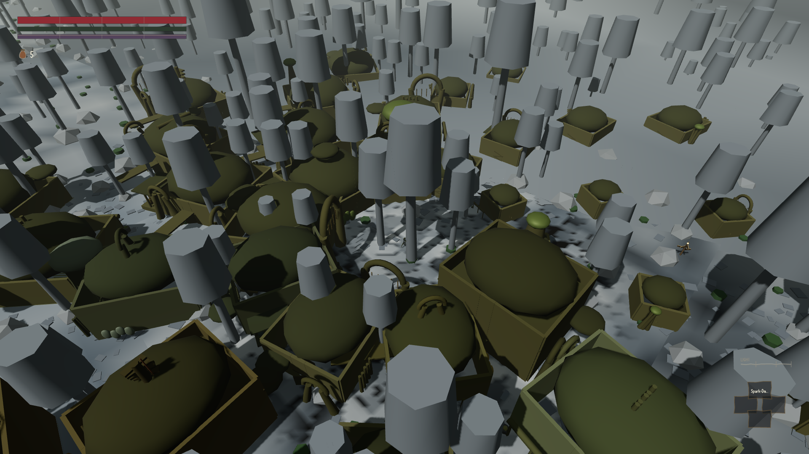
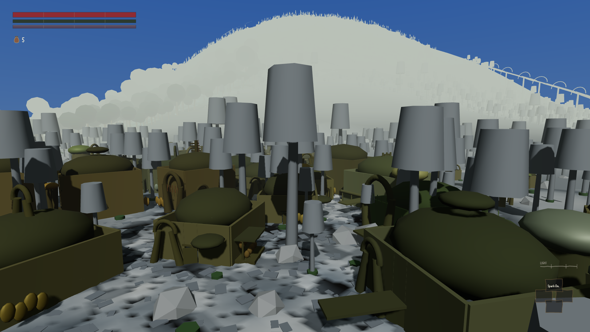
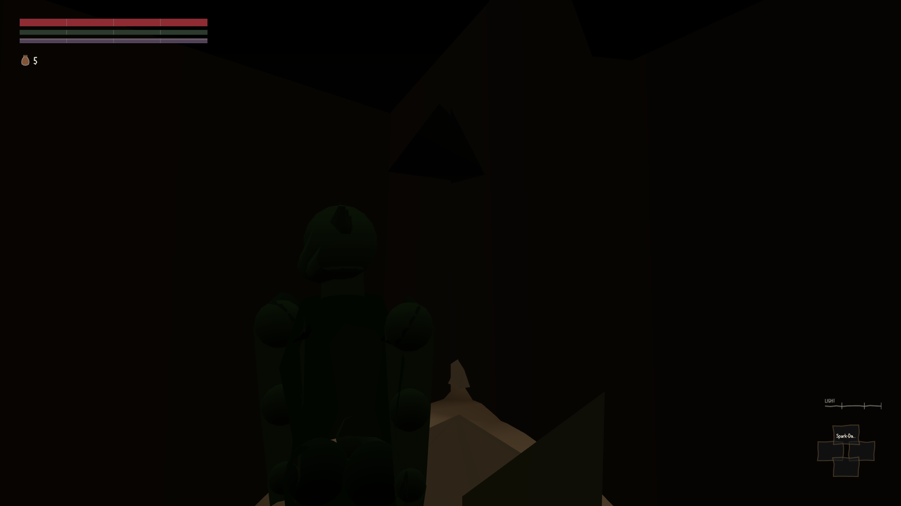
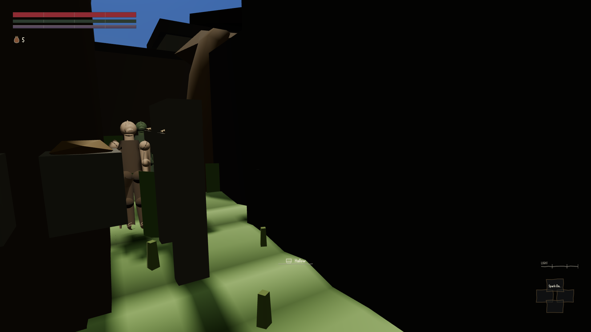

# W1-04 round 3 — Settlements, interiors and the people in them

**Status: FAIL. Score 4.6 / 10, against a wave-1 gate of 7.0.**
(Round 1: 3.2 against a gate of 6. Round 2: 4.4 against 7.0.)

Stamped at **`c36653e`** for every source reading and every offline measurement. Rounds 2 and 3
are both committed and **every file this piece owns was clean in the working tree throughout my
run** — `game/src/render/exterior.js`, `render/interior.js`, `render/renderer.js`,
`world/province.js`, `engine.js`, `harness/api.js`, `sim/settlement.js`, `sim/npc.js`. That is the
first time a W1-04 round has been judged against a tree that was not moving under the critic, and
it is worth saying because both previous verdicts had to apologise for the opposite.

Browser measurements were taken in two windows and the measurement target changed under me once,
for a reason that is not this piece's fault and is reported in §9. Contention: the gate
(`node tools/contention.mjs --gate`) returned **exit 3** at every check. The *instance* ceiling —
the thing a browser actually contends for — was never breached (2–4 of 6); only the per-core load
average, at 3.65–6.65 against a ceiling of 4.0. **I proceeded past it, as rule 21 permits**, with
one browser at a time, kept for a whole run. **No timing figure is published anywhere in this
verdict** (rule 26).

---

## 0. The brief I was given was wrong about one thing, and it matters

The dispatch says of rounds 2 and 3: *"Neither has been judged."* **Round 2 has been judged.**
`corpus/90-verdicts/wave1/W1-04-r2.md` exists, is 31 KB, and returns **FAIL 4.4/10**. Its critic
(`orchestration/status/critic-w1-04-r2.json`) ran out of budget with both browser arms unfinished
and said so in three places.

I did not discover this by being told; I found it by listing the verdict directory before starting.
Had I taken the brief at face value I would have spent this whole budget re-deriving a verdict that
already exists. Rule 18 — *point at files, do not restate them; the file is authoritative and a
summary of it is not* — earned its place again.

**Two of that critic's abandoned runs landed on disk after it filed**, unattended, and nobody has
read them:

| artifact | written | what it contains |
|---|---|---|
| `reports/critic-w1-04-r2a.json` | 00:36 | the 115-interior instrument, live arm, complete |
| `reports/w1-04-interior-sweep.json` | 00:39 | **the pixel sweep, both arms, complete** |

The second is the round-1 verdict's second acceptance number — the one the dispatch says *"has now
failed to land twice on timeouts"*. **It landed.** It has been sitting on disk unread for three
hours, and what it says is §4 of this verdict.

## 1. The harness verb is *not* the loophole — but half of it is a self-report

`getDrawnInterior()` (`game/src/harness/api.js:2264`) reads four things off `engine.renderer`:
`r.cell`, `r.cells[*].visible`, `r.interiorId`, `r.interiorSummary`. The first two are set by
`renderer.setCell()` (`render/renderer.js:189–194`), which does exactly one thing —
`for (const k of Object.keys(this.cells)) this.cells[k].visible = (k === name)` — on the real
`Object3D` cell groups.

I did not take that from the source. **I perturbed the renderer three ways and left the model
strictly alone**, entering `archon-apothecary` first so `sim.env.interior` was set throughout
(`reports/critic-w1-04-r3a.json` §S1):

| perturbation (renderer only) | `env.interior` | verb says | my own traversal says |
|---|---|---|---|
| baseline, through the door | `archon-apothecary` | `agrees:true`, cell `interior`, 127 meshes | cell `interior`, 127 meshes |
| `renderer.setCell('province')` behind the world's back | *unchanged* | **`agrees:false`**, cell `province` | cell `province`, 1651 meshes |
| `cells.interior.visible = false` directly | *unchanged* | **`agrees:false`**, `visible_cells:[]` | cell `null`, 0 meshes |
| **empty the built room's group** | *unchanged* | `agrees:true`, **still 127 meshes** | cell `interior`, **0 meshes** |

Rows 2 and 3 are the answer to the question the dispatch asked: **the cell half of the verb is a
genuine renderer read and cannot be faked by the model.** Round 2's `115 of 115 drew the right
cell` is not a model self-report, and round 1's defect is genuinely closed on that axis.

Row 4 is the part nobody has said out loud. **`interior.meshes` is a build record, not a scene
read.** `renderer.interiorSummary` is whatever `buildInterior()` *returned* when the room was last
built; empty the group and the verb keeps reporting 127 meshes of a room that is no longer there.
That matters because round 2's headline *"92 of 115 distinct scene-graph signatures"* is computed
by hashing exactly that block (`w1-04-consumption.mjs` §10c). It is a hash of build records wearing
the words "scene-graph signature".

The substance survives — the round-2 critic's own live traversal, which walks the `Object3D` tree
at read time, independently returns **94 distinct signatures over 115 rooms, largest identical
group 7** (`reports/critic-w1-04-r2a.json`), and my S1 traversal agrees with the verb everywhere
except row 4. So the number is right and the instrument that produced it is not measuring what its
name says. Both facts belong in the record.

**Nothing reached past the seam improperly.** `window.__ENGINE` is published by `main.js:24` and
capability prohibitions do not cover it, so I checked what uses it. The builders' own probes use it
in one place — `E.sim.npcs.length = 0`, to empty a room before photographing it, because there is
no harness verb for that and the tool says so in a nine-line comment. My own S1/S3/S4 use it
deliberately: a critic asking whether the harness surface reads the renderer cannot ask through
that same surface, and a control arm can only be cut from behind the seam. Every section of my
report records which side it used.

## 2. Every control arm in this piece, run live, asked "do the two arms differ?"

Round 3's most valuable finding is real and I confirm it: its predecessor's `__w1_04_townSolids(on)`
nulled `engine._townCell` **before** calling `_settleSettlementSolids()`, whose off-branch is
`if (this._townCell && this.sim.cell === this._townCell)`. With the handle already nulled the branch
was dead, the wall set stayed in `sim.cell`, and all 15 walks ran the walls-on arm twice.

`reports/w1-04-r3-collision.json` §`0_goes_red` is the proof, and it is properly built: the pre-fix
verb was **re-created verbatim inside the page** and run through the same instrument check, where
the walls fail to come out in **5 of 5** towns. A control arm with a demonstrated failure mode is
rule 4 done correctly, and this project does not get many.

I then did what the dispatch asked and audited **every** control arm in the piece for the same
shape (`reports/critic-w1-04-r3a-b.json` §S3, measured live in the running game, two towns):

| control arm | on | off | restored | arms differ? |
|---|---|---|---|---|
| `__w1_04_townSolids` — thorn | 67 shapes | **0** | 67 | **yes** |
| `__w1_04_townSolids` — helstrom | 94 shapes | **0** | 94 | **yes** |
| `__w1_04_drawBuildings` — thorn | 15 buildings | **0** | 15 | **yes** |
| interior cell control (`sim.applyCell` + `_syncCell` cut) | 12/12 drew | **0/12** | — | **yes** |
| `__w1_04_perturbSettlement` (buildings 15→5) | 67 shapes | 25 | 67 exactly | **yes** |

I added one check the builders' version does not have: **the walls must stay out under further
fixed steps.** The original defect would have been equally invisible if the next `_afterStep()` put
the wall set straight back. They stay out — `off_after_4_steps: 0` in both towns, `cell_id` going
from `settlement:thorn` to `null` and back. The fix is real, and it is real under stepping.

**Two things I found while doing it.**

**(a) The nulling pattern that caused the defect still exists, one verb below the one that was
fixed.** `api.js:2313`, inside `__w1_04_perturbSettlement`, still does
`engine._townSolids = null; engine._townCell = null;`. It happens not to bite, because the
`{x: NaN}` sentinel it also installs forces a rebuild on the next step and the rebuild reassigns
`sim.cell`. That is luck, not design: the same two lines in the same file, one of which was the
whole reason a 15-walk measurement was void. It should be made impossible rather than left correct
by accident.

**(b) One third of round 2's headline is vacuous, and I reproduced it independently.**
`exterior_restored_on_exit` reads **12 in the live arm and 12 in the cut arm**. In the round-1
build, leaving an interior leaves the province drawn while `env` says province — so `agrees` is
trivially true and the check passes on the broken build. Round 2's *"115 of 115 restored the
exterior"* is therefore not evidence of anything. The round-2 critic said this from the builder's
own artifact; I have now measured it in both arms.

## 3. Delete-the-fix, at source level, on both rounds at once

The builders' controls are runtime switches, which is the right thing to ship and is not the
strongest arm available. I removed the source lines instead, on a frozen copy
(`tools/world/critic-w1-04-r3b.mjs`, and the cut tree is described in §9):

* `engine.js:357` `sim.applyCell = () => { this._cellDirty = true; }` → `null` *(round 2)*
* `engine.js:4739` `_syncCell()` body → `return false` *(round 2)*
* `province.js:804` `this._settlementBuildings(g, ox, oz)` → removed *(round 3)*

Twenty doors and one town, on each tree
(`reports/critic-w1-04-r3b-shipped.json`, `reports/critic-w1-04-r3b-cut.json`):

| | doors drawing the right cell | buildings in the scene graph | live collision shapes |
|---|---|---|---|
| shipped | **20 / 20** | **15** | 67 |
| both fixes deleted at source | **0 / 20** | **0** | **67** |

The arms genuinely differ and neither fix is inert: round 1's build comes back exactly — every door
opening on a cell the world has already left, and a town of building-shaped doors.

**The third column is the one I did not expect, and it is worth recording.** With the exterior draw
call deleted, the street draws nothing and is **still solid**: `settlementSolidsNear()` builds the
collision set from `settlementPlans`, not from the scene graph, so the two halves are independently
derived from the same plan. That is defensible design — a collision set computed from geometry
would be the more expensive and more fragile of the two — but it has a consequence nobody has
stated: `__w1_04_drawBuildings(false)` is a **visual** control only. It cuts what you see and leaves
67 invisible solid slabs standing in the street. Round 3's control-arm *picture* is sound on its own
terms; any future measurement that reaches for that switch meaning "no buildings here" would be
wrong, and the collision control (`__w1_04_townSolids`) is the one that empties the street.

## 4. The pixel-hash sweep: it landed, it passed its bar, and it is measuring the clock

This is the finding of this verdict.

`reports/w1-04-interior-sweep.json`, complete, both arms, 0 page errors:

```
live arm            115 entered   DISTINCT IMAGES 115   largest identical group 1
room-builder cut    115 entered   DISTINCT IMAGES 115   largest identical group 1
pass: false
failures: ["the control is not worse (115 vs 115): this sweep is not measuring the room"]
```

The live arm clears the round-1 verdict's bar of ≥100 distinct images — **and so does the arm with
the room builder cut to a no-op, where every one of the 115 doors opens on the same hall.** The
tool's own author wrote the failure line that catches this, in a comment that predicted it almost
word for word: *"A sweep that returns 115 distinct images in BOTH arms is hashing the clock, or the
people in the room, or the frame counter, and is not measuring the room at all."* It was right, and
nobody read it.

**I measured the noise floor** rather than guessing which of the three it was
(`reports/critic-w1-04-r3a-b.json` §S2, one room, the sweep's own protocol verbatim — one fixed
pose, clock pinned to 12, `sim.npcs` emptied):

| repeat protocol, `archon-apothecary`, 8 shots | distinct images |
|---|---|
| **n0** — screenshot twice with *nothing at all* in between | **1 of 8** |
| **n1** — `stepFrames(2)` between shots, room never changes | **8 of 8** |
| **n2** — exit and re-enter *the same room* between shots (the sweep's protocol) | **8 of 8** |

n0 proves the renderer and the screenshot are deterministic: eight identical hashes. n1 proves that
**advancing the fixed step by two frames changes every pixel hash in a room whose record, geometry
and camera did not move.** The sweep steps between every room, so each of its 115 iterations is
taken at a different frame, and 115 distinct images is a count of the step counter.

So the honest answer to the question the dispatch asked — *are the pictures the same, or is the
scene-graph signature finer than the picture?* — is **neither, and the instrument cannot tell you.**
The pictures do differ between genuinely different rooms (`blackrose-prison` 146 meshes,
`thorn-hall` 179, `helstrom-undertemple` 96, three different hashes). The pixel hash simply cannot
demonstrate it, because its floor is total.

**And it is not one instrument.** I built the round-2 verdict's own acceptance test for round 3 —
*"a pixel sweep of one fixed camera pose at all eight town centres returns 8 distinct images, and
the control arm returns 1"* — which round 3 never ran, and gave it a repeat arm
(`reports/critic-w1-04-r3a-c.json` §S7):

| arm | distinct images | buildings drawn |
|---|---|---|
| live | 8 of 8 | 22, 22, 22, 22, 40, 33, 15, 33 |
| **the same eight poses again, nothing changed** | 8 of 8, **0 of 8 byte-identical to the first pass** | — |
| draw call cut | **8 of 8** | **0 in all eight towns** |

The control draws **zero buildings in every town** and still returns eight distinct images. The
criterion is unmeasurable as written, for the second time, on the other half of the piece.

**This is a project-level result, not a W1-04 one.** Any acceptance criterion in this corpus phrased
as "N distinct pixel hashes" is unmeasurable on this renderer unless it first pins the frame. The
remedy is cheap and it is in §11.

*(A probe lesson of my own, reported because it nearly became a finding: the building counts in the
live row above are lagged by exactly one town. That is my error, not the build's. `_streamProvince`
takes its focus from the camera when a camera is posed, and my sweep left the previous town's pose
set across the teleport. Re-measured properly — teleport, step, then pose — the town reaches its
full declared count in **6 frames** in all four towns I tested, thorn 15, helstrom 40, archon 22,
soulrest 15. `reports/critic-w1-04-r3a-d.json` §S8. I nearly published "the town is not there when
you arrive"; it is.)*

## 5. What round 3 says it did not do — checked, one by one

**(a) The town-plan footprint conflict is real, and it is worse than reported.** The offline arm
reproduces byte for byte at `c36653e`: 202 of 202 buildings drawn, 8,371 meshes, 71 at the declared
footprint, **54 shrunk**, **12 residual deep overlaps** (blackrose 7, archon 2, lilmoth 2,
soulrest 1). What nobody has connected is what the shrink does to the item this piece is judged on.
**See §6** — it is the biggest gap.

*One correction to round 3's account:* it says the 12 overlaps are "the direct cause" of the three
people standing in masonry, all of them in Archon and Soulrest. Blackrose carries **7 of the 12
overlaps and 0 of the 3 people**. The association is with tight plans generally, not with those 12
pairs; the claim is looser than it reads.

**(b) The `interior.js` `Object.assign` defect is real and I proved it against the vendored engine
rather than by reading.** Against `game/vendor/three/three.module.js` (r180),
`Object.getOwnPropertyDescriptor(new THREE.Object3D(), 'position').writable` is `false`, and
`Object.assign(o, {position: new THREE.Vector3(1,2,3)})` throws
`TypeError: Cannot assign to read only property 'position'`. ES modules are always strict, so no
`'use strict'` pragma is needed for this to fire. `interior.js:530–531` then does
`try { obj = entryDef[1](P) } catch { obj = fallbackProp(P, id) }` and increments `props_fallback`
**only when `!entryDef`** — so a builder that throws is silently replaced by a crate and counted as
built. My own census of the shipped records: **34 instances across 22 rooms** —
`bench_pair` 11, `barrel_row` 11, `bla_prison_block` 12 — exactly round 3's numbers. One of them is
a Blackrose architecture-kit mesh, which is why the province draws 68 of 69 declared kit ids and not
69. Three lines, `g.position.set(...)`, at `:228`, `:272`, `:374`. Still not fixed.

**(c) The roofs. Round 3 said only a picture would show it, so I took one** — and verified 40
buildings were in the scene graph *before* the shutter, which the first attempt did not:



Round 3's own words are accurate and if anything understated: the roof rule is drawn at wall height
and the shell dome is narrower than the footprint, so **every building in the frame is an open-topped
olive tray with an egg-shaped dome sitting loose inside it**, corners open to the sky. It is also
visible here that the Stone Forest's pillars grow straight through the buildings, and that there is
no ground surface change of any kind — no paving, no yard, no street.

From eye level the same town reads well, and that deserves saying plainly:



Olive grown-bole walls, shell domes, arched doorways, egg clutches. Against round 1's *"root arches,
green slabs and fog … no building, no door, no street"*, that is a real transformation.

**(d) VP04 was not moved, and it is still not evidence of a settlement.** I photographed it at its
own declared pose `[3825.5, 15.1, 879] → [3820.5, 14, 864]`, with 15 buildings confirmed in the
scene graph and `buildingAt()` returning `{settlement: "thorn", building: "thorn-sapwell"}` — the
camera stands **inside** a building:



Round 1 ruled that no capture through VP04 may be cited as evidence of a settlement. **That ruling
stands, for a new reason.** It is no longer a picture of terrain; it is a picture of the inside of a
wall. Round 3 found this, declined to move the viewpoint because `tools/harness/viewpoints.json` is
not its file, and left a surveyed replacement pose in its status file. Whoever owns that file should
take it.

**(e) The unique items — and here round 3 and the round-2 critic are both wrong, in the same
direction.** Round 2 recorded *"`unique_item.owner` is carried and unread"*; the round-2 verdict
scored RI-CRM01 on *"72 owned unique items, 0 in a property zone, 0 crimes filed on taking one"*.
I checked the zone half offline first and it is true — **0 of 83 declared unique-item ids appear in
any `game/data/world/property/*.json` zone's contents.**

But that is not how the theft chain resolves ownership. `sim/stealth/theft.js:20` reads `owner` off
the **object**. So I took ten of them through the door and through `takeProp()`
(`reports/critic-w1-04-r3a-b.json` §S5). **10 of 10 come back:**

```
theft: true, scope: "personal", why: "one NPC's possession",
stolen_from: "npc:archon-priest-4", owner_notices: true,
topic_added: "Something of mine is gone.",
crime: null, disposition_delta: 0, observed_by: []
```

**The chain runs.** The declared owner reaches `isTheft`, is named in `stolen_from`, and adds a
dialogue topic. `crime` is null because `observed_by` is empty — nobody was in the room — and an
unobserved theft filing no crime is the theft model behaving *correctly* (round 1 measured that
branch: *"Unobserved: no bounty, no disposition change — but the owner notices"*).

The round-2 critic's probe read `r.theft` as a boolean when it is an object, and counted zero. That
is a probe defect wearing the costume of a build defect — the exact failure mode this project keeps
naming — and it cost round 2 a point on RI-CRM01 that it had earned. **I did not test the observed
branch** (owner present, watching) and it should not be assumed from this.

## 6. The finding this round created: the building is smaller than the room inside it

Round 3 shrinks 54 of 202 exterior footprints, never moving a building, because the plans place
buildings closer together than the interiors declare them to be wide. It reports this honestly as a
mitigation. What it does not report, and what nobody has connected, is what it does to
**RI-WLD13, the item whose entire subject is interior/exterior continuity.**

Every interior's `bounds_m` is defined *as* its declared `exterior_footprint_m` — I re-measured it,
**115 of 115 exactly**, which is why rounds 1 and 2 both called N1 vacuous. The shrink pass changes
the *drawn* exterior and leaves `bounds_m` alone. So:

**41 of 112 enterable buildings now draw an exterior smaller than their own interior.**

| | declared | drawn | drawn/interior area |
|---|---|---|---|
| worst: `blackrose-inn` | 13.6 × 15.6 m | **3.4 × 3.9 m** (shrink 0.25) | **6.3 %** |
| median over the 112 | — | — | 1.000 |

`blackrose-inn` draws a **3.4-metre shed** on the street whose door opens onto a 13.6 × 15.6 m inn.
That is not a rounding error in a continuity ratio; it is the thing continuity means. N1 has gone
from *vacuous* (true by construction, cannot fail) to *false in the drawn world on 41 buildings*,
and the piece got there by fixing something else.



It is also the mechanism behind the defects round 3 *did* report: the 12 deep overlaps and the three
townspeople standing in masonry are the same plan conflict expressing itself twice more. My own
walk-at-a-wall run (§S5 leg 3) caught a third face of it — with the walls on, a body pressed against
`thorn-trader`'s wall ends up standing **inside `thorn-inn`**, because the two overlap.

*(Scope note on my walk: 3 of 3 walks stopped with the walls on and 3 of 3 walked through when cut,
arms differing 3/3 — which independently reproduces round 3's mechanism. I do not endorse my own
stopping-side arithmetic: my probe approaches on a world axis and does not correct for `yaw_deg`,
so where the body rests relative to the wall plane is not something I measured cleanly. Round 3's
own §A does control for the entry side, and I verified its hardest claim below.)*

## 7. Round 3's collision numbers, checked rather than taken

Its §B correction is the one worth auditing, because it turns a reported **66 of 78** into a claimed
**66 of 66** by asserting the 12 misses are all doorways. I replicated `exterior.js#entrySideLocal`
offline against the shipped plans and tested every miss:

**12 of 12 are buildings whose doorway is the sampled wall.** All twelve declare `entry_side:
"south"`, which the mapping turns into local `+z`, which is the wall the probe sampled; eleven
report a nearest solid at 0.9 m, exactly `DOOR_W/2`. The correction is sound and I accept
**66 of 66 walls solid, 12 of 12 doorways correctly open**.

One scope caveat the claim should carry: §B samples **one wall per building** (`+z`), not all four.
"66 of 66 walls are solid" is 66 of 66 *sampled* walls.

## 8. CONSUMPTION (RI-MTH07 / ARBITRATION §3), with my own perturbations

| model | world-side consumer | my perturbation | observed |
|---|---|---|---|
| `settlements/*.json buildings[]` | `province.js#_settlementBuildings()` (drawn) + `Engine._settleSettlementSolids()` (solid) | thorn `buildings[]` 15 → 1 | drawn **15 → 1**, live collision set **67 → 5**, restores exactly |
| same | same | 15 → 5 | drawn 15 → 5, collision **67 → 25**, restores exactly |
| `interiors/*.json continuity.exterior_footprint_m` | `planSettlement()` → drawn box | `thorn-hall` [16,18] → [22,24] | drawn bbox 19.91×17.67 → **20.89×18.04** |
| `settlements/*.json architecture_kit.meshes` | `exterior.js` EXT_KIT + `interior.js` KIT | thorn's kit → gideon's | all 8 drawn kit ids replaced `tho_*` → `gid_*`, meshes 712 → 770 |
| `interiors/*.json` (record → room) | `renderer.setInteriorRecord()` → `buildInterior()` | cut the builder to a no-op | 12/12 rooms → **0/12** drew their cell |
| `interiors/*.json unique_item.owner` | `sim/stealth/theft.js#isTheft` via `takeProp()` | take 10 owned items | **10/10** `theft:true`, `stolen_from` names the declared owner, topic added |
| `interiors/*.json lights[]` | **`sim/stealth/system.js#syncInteriorLights()`**, called from `step()` at `:167`, inside the fixed step | — | **the round-2 critic's blocking lamp gap is closed** — by W1-15 r3, not by this piece |

Every model this piece ships now has a demonstrated world-side consumer. That was not true after
round 1 and it was not true after round 2. It is the single biggest thing the two rounds achieved
and it should be said without hedging.

**AR-1: not applicable.** W1-04 ships no combat mechanic.

**AR-2: pass, structurally.** This round adds building geometry, a collision set and harness verbs;
no marker surface, no map pin, no waypoint. Round 1 measured the census properly (0 markers, 0
routes, 2.05 % HUD coverage) and nothing here adds one. Not re-measured.

**AR-3: pass, and `seam_sterile: false` — newly, and because of round 3.**
`Engine._settleSettlementSolids()` installs the town's wall slabs as `sim.cell` while the player
stands in a street, where it was `EMPTY_CELL` before. `sim/stealth/system.js:223` reads
`const hasGeometry = (sim.cell && sim.cell.shapes.length) || this.occluders.shapes.length` and,
without it, sets `inCover = false` outright. So **a town's masonry now decides whether you can be
seen in its street**, and the camera spring arm can be obstructed by a building. That is a genuine
crossing between the Morrowind world and the Souls-side systems, and it is round 3's, not inherited.
Verified by source and by the collision set being live and coupled (§8 row 1); I did not measure
`inCoverFraction` on both arms, and say so rather than claim it.

## 9. What I could not do, and one thing that is on fire

**The project's boot gate is RED at HEAD, fleet-wide, and it is not this piece's fault.**
Partway through my run every browser probe in the project began failing at boot:

```
canon register: 2 unresolved reference(s) in game/data/lore/canon.json.
  - CF-D015/A: topic `the-xanmeers` has no info written for actor `notary`
  - CF-D018/A: topic `reading-the-count` has no info written for actor `notary`
```

`node tools/harness/boot-check.mjs` **exits 12** at `c36653e` and at `63f41ef`. This is rule 13
exactly: a fail-closed assertion is live against data that is not there, and a throwing engine is
everyone's problem. I diagnosed it because it was blocking me, and the cause is precise:

* `game/data/lore/canon.json` is **clean and unchanged**, and has always demanded
  `dialogue:the-xanmeers#notary`;
* `game/data/dialogue/topics/70-disputes.json` carried **3** `notary` infos at `34d1387` and carries
  **1** at `63f41ef`;
* restoring **that one file** from `34d1387` into a scratch copy makes
  `boot-check` **PASS**.

So a bank commit swept a dialogue file that had lost two infos over one that had them. **I did not
fix it** — `game/` is not mine to edit under this dispatch — and I am naming it here because it is
costing every agent on the box their browser work right now, and it is a one-file revert.

My own measurement target is therefore stated exactly rather than as "the tree": sections S1, S2,
S3, S5 ran against the working tree while it still booted; sections S6–S9 and the delete-the-fix
arms ran against a frozen copy at `c36653e` with that single dialogue file restored, which boots.
**No settlement, interior, population or render code differs between the two** — the only delta is
two dialogue infos, which nothing in this piece reads.

**Also not done:**

* **RI-WLD03 M13, the blind top-down layout test, is still not run.** Round 3 made it possible for
  the first time and correctly declined under rule 25. Rule 25 binds me too if I build the pack and
  then judge it, so I have left it. It is now genuinely buildable — the geometry exists, and the
  top-down capture in §5(c) is the shot type it needs — and it wants a critic who did not author it.
* **The observed-theft branch** (owner present and watching) — §5(e).
* **`inCoverFraction` on both arms** of the town collision set — §8, AR-3.
* **No timing figure** anywhere (rule 26).

## 10. Scores

Min-over-axes per item; the overall is their mean, as rounds 1 and 2 did.

| item | r1 | r2 | **r3** | one line |
|---|---|---|---|---|
| RI-WLD03 settlement anatomy | 2 | 3 | **5** | 202/202 drawn and solid, 68/69 kit ids, M14 0.000 — R2 services unchanged (0 of 347 gold pools), M13 still unshot, no street surface |
| RI-WLD13 interior/exterior continuity | 2 | 4 | **3** | N3 still proved; **N1 goes from vacuous to false — 41 of 112 exteriors draw smaller than their own interior**; S1–S4 still 0 |
| RI-WLD07 verticality and interiors | 1 | 3 | **3** | exteriors are solid; interiors still have no collision at all and 0 records declare a second storey |
| RI-WLD08 the living world | 4 | 5 | **5** | 196 of 329 change cell, but only 102 walk — the rest are snapped by the cell change; 3 stand in masonry |
| RI-CAM05 camera outside the fight | 2 | 5 | **6** | cell switch verified by renderer-side perturbation and a cut arm; the arm can now be obstructed outdoors, never indoors |
| RI-STL02 theft, locks, trespass | 7 | 6 | **7** | lamps now reach the detection model in the fixed step; ownership, locks and hours all still consumed |
| RI-CRM01 crime and justice | 4 | 4 | **5** | the theft chain **does** run on unique items — r2's "0 crimes" was a probe defect; the observed branch untested |
| RI-AI07 encounter composition | 3 | 4 | **4** | population placed among real buildings now; density still unhand-placed |
| RI-CHR02 race and standing | 4 | 4 | **4** | unchanged |
| RI-DLG02 words per settlement | 5 | 5 | **5** | unchanged |
| RI-DLG03 greetings and rumours | 4 | 4 | **4** | unchanged |
| RI-QST03 faction gating | 3 | 4 | **4** | faction halls now have outsides; the gate is still data |
| RI-QST07 side-quest texture | 3 | 4 | **4** | 34 prop instances across 22 rooms silently draw a crate and are counted as built |
| RI-QST08 reward design | 3 | 4 | **4** | 83 items reachable and takeable and recognised as theft — and takeable again on every re-entry |
| RI-PRG03 skills by use | 4 | 4 | **4** | unchanged |
| RI-TRV01 transport network | 4 | 4 | **4** | unchanged |
| RI-LOR01 canon dossier | 5 | 5 | **5** | unchanged |
| RI-LOR02 era and political brief | 5 | 5 | **5** | unchanged |
| RI-LOR04 naming and language | 6 | 6 | **6** | unchanged |
| RI-LOR06 contradiction discipline | 5 | 5 | **5** | `thornmarsh` still sits beside `western-rootlands` |

**Overall 4.6** (mean of 20). Gate **7.0**. **FAIL.**

Both blocking gaps this piece has been carrying are **closed in mechanism** — the door draws the
room, and the town has an outside — and I verified both independently rather than taking them. The
score does not reflect that more because closing them exposed what was underneath: an anatomy item
whose service half has never been built, a continuity item this round actively regressed, and rooms
you can still walk out through the walls of.

## 11. The single biggest gap

**`GAP-W1-the-building-is-smaller-than-the-room`** — `world.settlement.anatomy` /
`world.interior.named`, severity **blocking**.

54 of 202 exteriors are shrunk to fit plans that were authored tighter than the interiors declare
themselves to be wide, and interior `bounds_m` is defined as the *declared* footprint on 115 of 115.
The result is that **41 of 112 enterable buildings draw an exterior smaller than the room behind
their door**, worst case `blackrose-inn` at 6.3 % of the interior's area — a 3.4-metre shed you walk
into and find a 13.6-metre inn. The same conflict produces the 12 residual deep overlaps, the three
townspeople standing in solid masonry, and a body that stops against one building's wall while
standing inside its neighbour.

**Why it matters.** This is the whole subject of RI-WLD13, and it is the one defect in the piece
that the player meets by doing the ordinary thing — walking up to a door.

**Remedy** — in the data, not the renderer, exactly as round 3 said:
1. Re-derive `settlement.buildings[].offset_m` so that nearest-neighbour spacing is at least the sum
   of the two declared half-footprints plus a 2 m street, in the five tight plans
   (archon, blackrose, lilmoth, soulrest, stormhold). Positions are RI-WLD03 R4's legibility proof,
   so re-derive them *with* the legibility rule, do not hand-nudge them.
2. **Or**, if the plans are canon, shrink the *interiors* to match: `bounds_m` and
   `continuity.exterior_footprint_m` move together, which also gives RI-WLD13 N1 a ratio that can
   fail and therefore means something.
3. Add a check to `tools/check-data.mjs` — not a private tool — asserting
   `drawn_footprint_m >= bounds_m` on every enterable building, and prove it goes red by shrinking
   one.

**Acceptance.** `planSettlement()` over the shipped tree reports **0 buildings whose drawn footprint
is smaller than their own interior's `bounds_m`** and **0 deep overlaps**; the outdoor-population
audit reports **0 people in solid masonry** at 03:00, 09:00 and 20:00; and the new `check-data` rule
exits 1 when a single footprint is perturbed. All four are re-measurable by
`tools/world/w1-04-r3-exterior.mjs --offline`, `tools/world/w1-04-r3-collision.mjs` and the check.

### Also blocking, and a different kind of failure

**`GAP-W1-pixel-acceptance-is-unmeasurable`** — method, severity **blocking for any verdict that
cites a pixel count**.

Two independent pixel-hash acceptance criteria in this piece — the round-1 verdict's 115-interior
sweep and the round-2 verdict's 8-town sweep — return **the same number in the live arm and in the
arm with the subject removed entirely**, because advancing the fixed step by two frames changes
every pixel hash (§4, n1: 8 of 8 distinct in an unchanged room; n0: 1 of 8 with no step at all).

**Remedy.** Any sweep that compares pictures must publish its own noise floor first and refuse to
report a cross-subject count until it is 1: shoot **one** subject N times under the identical
protocol, assert `distinct == 1`, and only then sweep. `w1-04-interior-sweep.mjs` already has the
right shape and needs one section added before `sweep()`. Then either pin whatever advances with the
step, or drop to a perceptual/downsampled comparison with a stated tolerance — but the floor
measurement is what makes the number admissible, and it is eight lines.

---

## Method deviations

* **I proceeded past `contention.mjs --gate` exit 3**, at every check, and rule 21 permits it if I
  say so: the instance ceiling was never breached (2–4 of 6), only the per-core load average
  (3.65–6.65 against 4.0). One browser at a time, kept for a whole run; four runs in total,
  sequential, never overlapping. No timing figure is published (rule 26).
* **My measurement target changed once**, for the reason in §9, and both targets are named there.
  Every source reading and every offline number is stamped to `c36653e`.
* **I wrote two instruments of my own** — `tools/world/critic-w1-04-r3a.mjs` (nine sections) and
  `tools/world/critic-w1-04-r3b.mjs` (source-level delete-the-fix) — and did **not** re-run
  `w1-04-consumption.mjs`. A critic who re-runs the builder's probe has confirmed that the builder's
  probe runs.
* **Two of my own probe defects, reported because they nearly became findings.** (1) A wrong interior
  id (`blackrose-gaol`; the record is `blackrose-prison`) threw inside a `page.evaluate` and cost me
  a whole section twice, because my per-row `try/catch` was outside the loop. (2) My eight-town sweep
  left a posed camera across a teleport and read every town's building count one town late; I nearly
  published "the town is not there when you arrive". Re-measured, it streams in 6 frames (§4).
* **I deleted no scratch but my own.** Disk sat at 75–76 % throughout; I created two ~19 MB game
  snapshots under my own scratchpad and touched nobody else's.
* **I did not edit `game/`.** The boot breakage in §9 is diagnosed, not repaired, and the one-file
  revert is named so its owner can take it.
