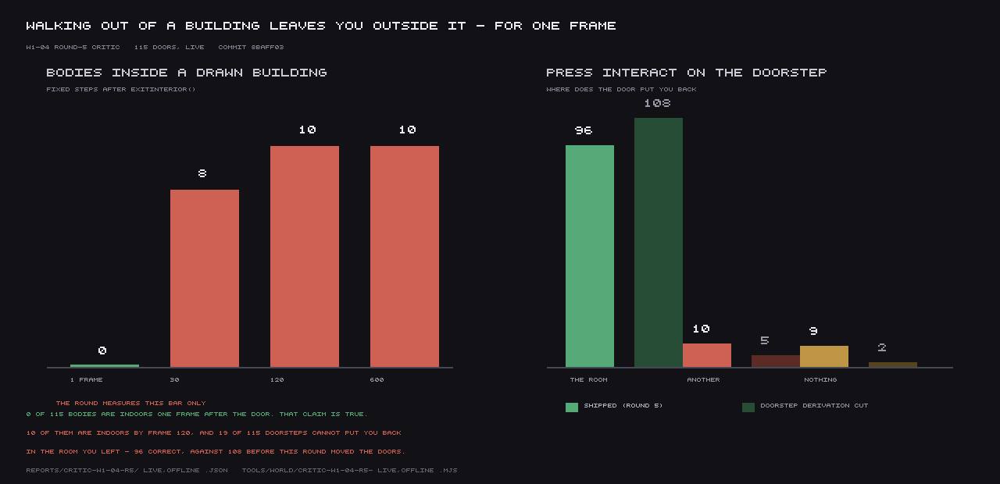

# W1-04 round 5 — Settlements, interiors and the people in them

**Status: FAIL. Score 4.8 / 10, against a wave-1 gate of 7.0.**
(Round 1: 3.2 against a gate of 6. Round 2: 4.4. Round 3: 4.6. Round 4: 4.7.)

Stamped at **`1fda355`** for every source reading and every measurement. `node
tools/contention.mjs --gate` returned **GO** at every check I made. **No timing figure is
published anywhere in this verdict** (rule 26). One browser for the live arm, launched once and
kept; the pictures went through the pooled capture daemon and launched nothing. I did not
`pkill` anything.

My instruments are `tools/world/critic-w1-04-r5-offline.mjs` (bare Node, `--self-break` watched
go red on both arms), `tools/world/critic-w1-04-r5-live.mjs` (one browser, `setRenderRate(0)`,
chunked in eights), `tools/world/critic-w1-04-r5-shots.mjs` and
`tools/world/critic-w1-04-r5-chart.mjs`. Their artifacts are
`reports/critic-w1-04-r5/{offline,live,shots}.json`.

---

## 0. The short version

**The headline is true and I reproduced it with my own instrument.** 115 doors, **0 bodies
inside a drawn building one frame after `exitInterior()`**, against a control of 113. The
doorstep derivation is real, the 2×2 is honest, the teardowns bite, and the lamp fix reaches an
enemy's alert meter — which I demonstrated, because the round only demonstrated it at a census.

**And the round measured the one frame at which its number is zero.**

1. **Half a second later, ten bodies are indoors.** The same 115 doors, read at 30, 120 and 600
   fixed steps instead of 1: **0 → 8 → 10 → 10**. The body is put down clear of every footprint,
   the solver slides it 0.5–8.9 m, and it comes to rest inside a neighbour. A doorstep is where
   you stand, not where you are for sixteen milliseconds.
2. **Re-entry got worse, and the round's own number for it is wrong.** The status file says "the
   door is back in reach from the doorstep on 106 of 115". `doorAt()` returns the **nearest**
   door of the town, and `stepSettlement()` hands *that* interior to `useDoor()`. Pressing
   `interact` on the doorstep — the real latch — puts you back in the room you left on **96** of
   115, into a **different building** on 10, and into nothing on 9. With this round's doorstep
   derivation cut it is **108 / 5 / 2**. The round moved 112 doors onto entry walls and put four
   pairs of them one metre apart.
3. **The prop count is measured by a predicate the round did not describe.** Its published
   definition says "reaches more than 0.6 m outside its own room's `bounds_m`". Its code computes
   something strictly weaker. Under the definition as written — which is also the round-4
   verdict's, at the same 0.6 m — the number at `1fda355` is **61 meshes in 49 rooms**, not 0.

The score moves 4.7 → 4.8. The round closed the blocking gap it was given, at the frame it chose
to look; min-over-axes then found the rest of the same object.

---

## 1. The aggregation, first (rule 9)

```
W1-04 consumption: 23/23 checks CONSUMED, 9 paths, 0 skipped.
exit 0
```

Row 10a is fixed and fixed for the right reason: it now establishes the street *at* the door
under test. `exterior_restored_on_exit == entered == 115`, and the cut arm still reads
`drawn_agrees 0 / exterior_restored 0`. The round-4 verdict's method gap
(`GAP-W1-a-street-signature-is-not-a-street-signature`) is **closed**.

---

## 2. The doorstep — reproduced, then pushed past

### It is true at one frame

My own sweep (`critic-w1-04-r5-live.mjs` L1), written off the harness surface rather than adapted
from the builder's tool: enter, step 2, `exitInterior()`, step **one** fixed frame, then
`whereAmI().pos` and `buildingAt()`.

| | |
|---|---|
| doors tested | **115** |
| bodies inside a drawn building at 1 frame | **0** |

Offline, independently (`critic-w1-04-r5-offline.mjs` D), over the shipped `planSettlement()` +
`applyInteriorBounds()`: **0 of 113** records with a settlement plan have a
`continuity.exterior_spawn` that satisfies `insideBuilding()`. `check-building-fits-room.mjs`
exits 0 and its `--self-break` — cutting **only** the doorstep leg — goes red at 112 of 112.

**The claim holds.** It is the first round of five in which walking out of a door does not put
you under the roof.

### It stops being true at frame 30

The round's bar is "one frame after the door", and it says so plainly. I read the same 115 doors
at 1, 30, 120 and 600 fixed steps.

| fixed steps after `exitInterior()` | bodies inside a drawn building |
|---|---|
| **1** | **0** |
| **30** | **8** |
| **120** | **10** |
| **600** | **10** |

Twenty-five bodies move more than 0.25 m between frame 1 and frame 600. Ten of them stop inside
a building and stay there — the position is stable from frame 120 on, so this is the collision
solver settling the body, not drift.

| room left | where the body is at 120 frames | moved |
|---|---|---|
| `archon-market` | inside **`archon-apothecary`** | 0.58 m |
| `gideon-house-0` | inside **`gideon-cellar`** | 0.61 m |
| `gideon-tollhouse` | inside **`gideon-apothecary`** | 0.53 m |
| `helstrom-house-10` | inside **`helstrom-house-10`** — the one it just left | **8.85 m** |
| `helstrom-house-11` | inside `helstrom-house-10` | 0.61 m |
| `helstrom-house-2` | inside `helstrom-warders` | 0.59 m |
| `helstrom-house-6` | inside `helstrom-house-2` | 0.53 m |
| `lilmoth-house-2` | inside `lilmoth-house-1` | 0.51 m |
| `lilmoth-market` | inside `lilmoth-smithy` | 0.50 m |
| `thorn-inn` | inside `thorn-trader` | 0.83 m |

These are the deep-overlap towns — the piece's oldest open gap — and I am **not** claiming the
round should have moved the buildings. I am claiming that "0 of 115" is a fact about frame 1,
that the round chose frame 1, and that the honest number at rest is 10.

### Re-entry: the half the round measured with the wrong predicate

The builder's warning is right — *"omit it and you get a doorstep you cannot re-enter from"* —
and its instrument records the right field and then rolls it up wrong.
`w1-04-r5-live.mjs#rollup()` counts `door_in_reach` **truthy**. But `doorAt()` scans every door
row of the town and returns the **nearest within `DOOR_REACH_M`**, and `stepSettlement()` then
calls `useDoor(sim, sim.door.interior)`. "A door is in reach" and "your door is in reach" are
different questions.

I asked the second one twice — offline by reimplementing `doorAt()` from the shipped constant,
and live by **pressing `interact`** through `queueInputs()`, the real latch. (`enterInterior()`
calls `useDoor()` directly and cannot fail this test, which is why I did not use it.) The two
agree exactly.

| from the doorstep, pressing `interact` | shipped | doorstep derivation cut |
|---|---|---|
| back in **the room you left** | **96** | **108** |
| into a **different building** | **10** | 5 |
| into **nothing at all** | **9** | 2 |

The ten wrong rooms, with the distance to the door that captured them:

`blackrose-house-0`→`blackrose-house-1` (0.50 m), `blackrose-inn`→`blackrose-warders-hall`
(0.50), `blackrose-market`→`blackrose-smithy` (0.50), `blackrose-rootpost`→`blackrose-clerk`
(0.50), `lilmoth-customs`→`lilmoth-yard` (1.56), `soulrest-boneyard`→`soulrest-pawn` (2.12),
`soulrest-court-steps`→`soulrest-market` (0.88), `soulrest-grey-hist`→`soulrest-court-steps`
(0.45), `thorn-hall`→`thorn-apothecary` (0.16), `thorn-house-0`→`thorn-gate` (0.46).

**Why this is new.** Moving 112 doors from building centres onto entry walls moved doors
*towards each other*. There are now **five pairs of doors within `DOOR_REACH_M` of each other**,
four of them exactly 1.00 m apart in Blackrose. Before this round the doors were at building
centres and could not collide like this. The round traded twelve working re-entries for a
correct doorstep, and did not notice because no instrument in this piece has ever asked the
door table a question.

**The 11 published as >2.6 m from their own door** are a fair and correctly-published residual,
and the builder's framing of them — "you step out, you take a step back, you are at the door" —
is right for the ones that are merely far. It is not right for the nine that reach **no** door
and the ten that reach **someone else's**, and those are not the same eleven.



---

## 3. The next blind set (attack B)

The round's own blind-spot finding is the best thing in it, and the general form of rule 11 is
**not** "is this field read" but "which records can this loop reach at all". Asked that way,
there is another one, and it is inside the fix for the first.

`applyInteriorBounds()`'s new orphan pass reads:

```js
const plan = planFor.get(rec.settlement);
if (!plan) continue;
out.orphans = (out.orphans || 0) + 1;
```

The `continue` is **before** the counter. Of the three orphans the round names,
`thorn-house-0` lives in `thorn`, which is a settlement document; **`barge-hold` and
`writ-house` both declare `settlement: "tidewrack"`, and there is no `tidewrack` document** —
the eight are archon, blackrose, gideon, helstrom, lilmoth, soulrest, stormhold, thorn. So the
pass that exists to handle the orphans skips two of the three, and its own count cannot say so.

Downstream, every offline enumerator in the piece inherits it:

| enumerator | reaches |
|---|---|
| the main loop over `plan.buildings` | 112 of 115 |
| `w1-04-r5-census.mjs` section D | **113** — and its headline reads "0 / 113" |
| `check-building-fits-room.mjs` (the round's new fail-closed assertion) | **112** |
| `applyInteriorBounds()`'s orphan pass | **113** |
| my `critic-w1-04-r5-offline.mjs` D | 113, and it **names the two it cannot reach** |
| the live sweep | **115** |

Only the live sweep sees `barge-hold` and `writ-house`. They happen to be fine — both land clear
of every footprint — but that is luck, not coverage: **the assertion this round shipped to stop
the defect coming back cannot see them**, and `doorAt()` cannot either, because a town with no
document has no door table (which is two of the nine no-reach doorsteps).

**And a second blind set, which is the one that cost this round.** Every instrument in five
rounds measures a doorstep against **buildings** — `insideBuilding()`, `buildingAt()`. Nothing
measures a doorstep against the **door table**. The defect in §2 is invisible to the census, to
the check, to the 2×2 and to the aggregation, and it is visible in one line of the builder's own
live artifact that its rollup collapses. A census over footprints cannot see a defect in a
reach table.

---

## 4. The lamps — right consumer, and one link further (attack C)

**`lightSourceCensus()` is not a parallel path, and I checked rather than assumed.**
`syncInteriorLights()` calls `this.light.addSource()`; `lightSourceCensus()` returns
`this.light.sources.filter(s => s.world)`; and the fixed step's own
`p.L = this.light.withTorch(this.light.sample(...))` samples **that same `LightField`**. One
object, three readers. The round verified at the right place.

**But a census is a number, not a behaviour**, so I went one link further and put an enemy in
the room (`critic-w1-04-r5-live.mjs` L4). Three arms, in one page, differing only in the lamps:

| arm | L at the body | V | world sources | **enemy alert** |
|---|---|---|---|---|
| lamps as the derivation leaves them | **1.00** | 1.276 | 8 | **100 — AGGRO** |
| every lamp in the room moved 60 m away | **0.04** | 0.05 | 8 | **80 — SUSPICIOUS** |
| lamps restored | **1.00** | 1.276 | 8 | **100 — AGGRO** |

Lamp position → `LightField` → `p.L` → `p.V` → `stepPerception()` → an entity's alert state,
inside the fixed step, reversibly. **That is consumption at an entity**, and it is a stronger
result than the round claimed for itself.

**Independent confirmation of the count.** I re-ran the *round-4 critic's* instrument
(`critic-w1-04-r4-offline.mjs`, which neither the builder nor I wrote for this round) at
`1fda355`: **C3 reports 0 authored lamps outside their room, in 0 rooms.** Round 4 measured 55.
The lamp fix is real under a third instrument.

**A probe defect of mine, reported because it nearly became a finding** (rule 4). My first L4 run
read `enemy_alert: 0, IDLE` in every arm and I nearly published "the lamp model reaches the light
field but not an entity". It was my probe: `stepPerception()` gates the sight channel on
`Math.abs(per.bearing_deg) > e.sight_cone_deg / 2`, and an enemy spawned with the default yaw is
facing away, so it fell through to hearing — and a still player makes no sound. The tool now aims
the enemy and gives the player a motion band, and says so in its header.

---

## 5. Delete-the-fix (attack D)

**The 2×2 is honest and I reproduced its corners with my own arms**, each from a fresh load of
the data:

| | doorsteps in a building | meshes out (round's predicate) |
|---|---|---|
| builder A shipped | 0 | 0 |
| builder B doorstep cut | 113 | 0 |
| builder C lamp clamp cut | 0 | 153 |
| **my doorstep-cut arm** | **113** | — |
| **my lamp-cut arm** | — | **153** |

Byte-agreement on both. **The shape is two independent fixes**, not two guards for one defect and
not an inert fix: each leg alone moves its own number and only its own number. The round labels
it correctly.

**The teardowns bite, verified by me, with real exit codes** (`INDEX.md` warns that a pipe hides
them, so these are unpiped):

* `w1-04-r5-census.mjs --self-break` — calls `buildInterior(rec)` with the wrong arity on purpose
  — **exits 1**, "115 room(s) traversed zero meshes", `PROBE FAILURE`. This is the correct answer
  to the exact failure the round-4 critic made and reported, and shipping the failure *as an
  armed assertion* is the right response to it.
* `check-building-fits-room.mjs --self-break` — **112 of 112 doorsteps inside a building** with
  only the doorstep leg cut.
* My own `critic-w1-04-r5-offline.mjs --self-break` goes red on both arms (112 doorsteps inside;
  6652 overhang / 4581 clearance meshes) and **exits non-zero if either arm stays green**.

**What the 2×2 has no column for.** Re-entry. Cutting the doorstep leg *improves* it, 96 → 108.
A 2×2 whose columns are chosen from the fix's own goals cannot report a regression the fix
caused in something it was not aiming at, and this one does not.

---

## 6. The prop count, settled (attack F)

**First, a correction to the round.** The status file says *"the verdict does not state its
tolerance"*. It does: W1-04-r4 §4(c) reads *"**292 meshes in 63 rooms** stand more than **0.6 m**
outside the room they are in — **113 prop meshes and 179 light fittings**"*. Same tolerance, same
0.6 m. So the tolerance is not the discrepancy.

**The discrepancy is the predicate**, and the two instruments implement different ones:

```js
// round-4 critic — OVERHANG: how far the box REACHES past the wall
const ox = Math.max(bx[0] - bb.min.x, bb.max.x - bx[1]);
const o  = Math.max(ox, oz);

// round-5 census — CLEARANCE: how far the whole box sits CLEAR of the room
const dx = Math.max(bx[0] - box.max.x, box.min.x - bx[1], 0);
const d  = Math.hypot(dx, dz);
```

`CLEARANCE ≤ OVERHANG` always, and `CLEARANCE` is **0 whenever the box still overlaps the room at
all** — a two-metre bench with 1.9 m through the wall scores zero. The round's *published
definition* — "a built mesh whose world **bounding box reaches** more than 0.6 m outside its own
room's `bounds_m`" — describes OVERHANG. Its *code* computes CLEARANCE.

I measured both, at `1fda355`, with all of round 5's fixes in
(`critic-w1-04-r5-offline.mjs` P):

| predicate | meshes | rooms | classes | worst |
|---|---|---|---|---|
| **OVERHANG** (the round's words, and the r4 verdict's) | **61** | **49** | `prop` ×61 | 0.95 m |
| **CLEARANCE** (the round's code) | **0** | 0 | — | — |

Confirmed by re-running the round-4 critic's own tool at `1fda355`: **61 in 49 rooms**.

**Which number stands.** Both, under their own predicate, and the round must say which it used:

* **`192 → 0` is true under CLEARANCE**, which the round did not describe.
* **`292 → 61` is true under OVERHANG**, which the round described and the r4 verdict used.

**And the fix is real either way**, which matters more than the arithmetic. All 61 residuals are
one object — `prop:hel_shell_roof`, a decorative interior roof shell in Helstrom, overhanging its
floor plate by 0.95 m, which is what a roof does. The **179 light fittings** that made up the
majority of the r4 count are gone to zero under *both* predicates, and `stair_narrow` /
`ladder_steep` running their treads along local `-z` is a genuine, well-diagnosed bug well
fixed. The defect is closed; the number published for it is wrong.

---

## 7. Is the derivation a second source of truth? (attack E) — **acceptable, with one condition**

The dispatch is right to ask, and right that this project has form: two soul ledgers, `magic.gold`,
a gold write bypassing its setter. This one is a different shape, and I checked rather than
reasoned by analogy.

**Every world-side reader goes through the derivation, and there is exactly one way in.**
`applyInteriorBounds()` has one production caller — `world/province.js:849`, inside
`setSettlements()`, called from `engine._boot()` at `engine.js:456` behind
`if (this.renderer.province)`. The two readers that matter both run after boot:
`sim/settlement.js#leaveInterior()` reads `continuity.exterior_spawn`, and
`SettlementSystem#doorAt()` reads `b.door` — and the round is right that the door must be written
**in place**, because the reach table is built in the constructor at `engine.js:324`, before
`setSettlements()` ever runs, and holds those arrays themselves.

**The save is clean.** `sim/state.js` stores `env.interior` (an id) and the body's position. It
does not serialise interior or settlement records, so there is no saved copy of a doorstep to
drift. Rule 7's failure mode does not apply here.

**The derivation is idempotent and reversible**, via `*_declared` stashes, and I exercised that:
my four arms each re-derive from the stash and land on the published numbers.

**The condition, and it is not cosmetic.** `tools/world/build-settlements.mjs:506` still authors

```js
exterior_spawn: [+b.door[0].toFixed(2), +b.door[1].toFixed(2), +(b.door[2] + 1.8).toFixed(2)],
```

— the doorstep as *1.8 m north of the centre door*, the exact defect this round exists to
correct. **The generator is a second definition of the doorstep and it is unrepaired.** Nothing
breaks today, because the derivation overwrites it at boot and the data files were correctly left
alone (they are claimed by W1-15-r3). But the project now holds two disagreeing definitions with
only one of them under test, and the untested one is the one that writes the file. That is the
same shape as the mirrored values, one step earlier in the pipeline.

**Verdict: acceptable for this round, blocking for the next.** Either the generator emits the
derived value, or it stops emitting `exterior_spawn` at all and the derivation becomes the only
author. A successor with those files free should do it, as the builder's own `what_i_did_not_do`
anticipates.

---

## 8. Four rounds untouched (attack G) — should they block?

| item | state | blocks? |
|---|---|---|
| **`inCoverFraction` on both arms** | Still open, fourth round. It reaches exactly one place outside `stealth/system.js`: `engine.js:8752`, `in_cover_fraction` in `getStealthState()` — **a harness readout, not a world consumer**. It remains the only unmeasured half of this piece's one AR-3 crossing. | **Blocks RI-STL02's ceiling, not the piece.** The model is W1-15's; W1-04 carries the crossing. It should be dispatched to whoever owns the detection model, not asked of this piece a fifth time. |
| **The observed-theft branch** | Still open, fourth round. Unobserved proved 10 of 10 in round 3. | **Blocks RI-CRM01 at 5.** It is cheap and it is inside this piece's scope. There is no defensible reason left for a fifth deferral. |
| **RI-WLD03 M13** (blind top-down layout) | Not run, **fourth** consecutive deferral, each time for the correct reason: rule 25 bars whoever took the captures, and that is now the builder, the round-4 critic and me. | **Blocks nothing here and is a process failure.** Four rounds have correctly declined it. It needs a dispatch of its own with an agent who authored no W1-04 capture. Deferring it a fifth time inside this piece would be the wrong answer to the right rule. |
| **The uncapped live 115-room distinctness sweep** | **It has been taken.** The round's own `w1-04-consumption.mjs` runs it: `rooms_read: 115, distinct_rooms: 100, largest_identical_group: 7`. The status file's `what_i_did_not_do` says it was not. | **Not blocking — but the answer is new and unpublished.** The offline count this piece has leaned on is 115 distinct; live, uncapped, it is **100**, with seven rooms sharing one signature. That is the sweep the round-4 verdict wanted, it was run, and nobody read it. |

---

## 9. The pictures (attack H) — and a finding about the gate

**`archon-market`'s interior: I got past the settle gate, and the picture is empty sky.** Refused
three times to the round-4 critic and four times to the builder (G3a/G3b, ambient motion). At 240
settle frames the daemon accepted mine and delivered a cloudless blue gradient — no room, no
walls, nothing. **I deleted it rather than publish it**, because a file named
`archon-market-inside` that shows sky is exactly the object this project keeps paying for.

That is worth stating as a finding in its own right: **the settle gate certifies that the world
stopped moving, not that anything is in front of the camera**, and empty sky satisfies it
perfectly. It refused three honest attempts at this room and passed a vacuous one. Nobody in five
rounds has photographed the inside of `archon-market`, and the reason is not that the room is
hard to settle.

**The camera standing on the doorstep looking back: refused, exactly as the builder reported.**
`G3b acceleration: d2=0.11169 against d1=0.03125 (rise 0.08044 > 0.005, ratio 3.57 > 1.5)`. I
would not soften the threshold either. Two consecutive agents cannot photograph that screen and
the round was right to say so and ship the 6 m view instead.

**A third shot of mine was near-black and I deleted it too** — the body at rest 120 frames after
the `thorn-inn` door, standing in unlit masonry. It is *consistent* with being under a roof and
it is not legible enough to carry the claim, so the claim is carried by the numbers in §2 and by
the chart, which is drawn from `reports/critic-w1-04-r5/{live,offline}.json` and not from
anything I typed.

---

## 10. CONSUMPTION (RI-MTH07 / ARBITRATION §3)

The aggregation demonstrates **23 of 23**, exit 0, including the two models this round newly
ships. I re-demonstrated the more interesting one myself, at an entity rather than at a census
(§4). The doorstep model's consumer is
`sim/settlement.js#leaveInterior()` → `placeBody()` → `sim.player.pos`, read back through
`whereAmI()` after a fixed step — and my §2 sweep is 115 independent perturbations of it.

**AR-1: not applicable.** W1-04 ships no combat mechanic.

**AR-2: pass, structurally.** This round adds a doorstep derivation, a lamp clamp and two prop
sign fixes. No marker surface, no map pin, no waypoint. Not re-measured; round 1 measured the
census properly and nothing here adds one.

**AR-3: pass, `seam_sterile: false`** — and this round strengthens it. Round 3's crossing stands
(a town's masonry becomes `sim.cell`, and `stealth/system.js:223` reads `sim.cell.shapes.length`
to decide whether cover exists). Round 4's stands (the join sizes the rooms the lamp model
lights). Round 5 makes the second one *demonstrable at an entity*: a decision made by the
settlement layout now moves a Souls-side enemy's alert state from SUSPICIOUS to AGGRO, live,
reversibly (§4). That is the crossing working, not asserted.

---

## 11. Scores

Min-over-axes per item; the overall is their mean, as rounds 1–4 did.

| item | r3 | r4 | **r5** | one line |
|---|---|---|---|---|
| RI-WLD03 settlement anatomy | 5 | 6 | **6** | unchanged: still no street surface of any kind, M13 unrun for a fourth round |
| RI-WLD13 interior/exterior continuity | 3 | 3 | **5** | 0 of 115 indoors at one frame, verified independently — but 10 by frame 120, and 19 of 115 doorsteps cannot put you back in the room you left, against 7 before this round |
| RI-WLD07 verticality and interiors | 3 | 3 | **3** | unchanged: no interior collision, 0 records declare a second storey |
| RI-WLD08 the living world | 5 | 5 | **5** | unchanged; 3 people still in masonry |
| RI-CAM05 camera outside the fight | 6 | 6 | **6** | unchanged |
| RI-STL02 theft, locks, trespass | 7 | 6 | **7** | the lamps are back inside their walls — 0 by three instruments — and I watched a lamp move an enemy's alert state; `inCoverFraction` still unmeasured |
| RI-CRM01 crime and justice | 5 | 5 | **5** | observed-theft branch untested for a fourth round |
| RI-AI07 encounter composition | 4 | 4 | **4** | unchanged |
| RI-CHR02 race and standing | 4 | 4 | **4** | unchanged |
| RI-DLG02 words per settlement | 5 | 5 | **5** | unchanged |
| RI-DLG03 greetings and rumours | 4 | 4 | **4** | unchanged |
| RI-QST03 faction gating | 4 | 4 | **4** | unchanged |
| RI-QST07 side-quest texture | 4 | 5 | **5** | `stair_narrow`/`ladder_steep` treads along local `-z` is a real bug well found and well fixed; the count published for it is measured by the wrong predicate |
| RI-QST08 reward design | 4 | 4 | **4** | unique items follow the shrink, 0 of 115 outside; still takeable again on re-entry |
| RI-PRG03 skills by use | 4 | 4 | **4** | unchanged |
| RI-TRV01 transport network | 4 | 4 | **4** | unchanged |
| RI-LOR01 canon dossier | 5 | 5 | **5** | unchanged |
| RI-LOR02 era and political brief | 5 | 5 | **5** | unchanged |
| RI-LOR04 naming and language | 6 | 6 | **6** | unchanged |
| RI-LOR06 contradiction discipline | 5 | 5 | **5** | unchanged |

**Overall 4.8** (mean of 20). Gate **7.0**. **FAIL.**

RI-WLD13 rises 3 → 5, which is the largest single-item move this piece has had since round 2 and
is deserved: the containment half is genuinely fixed and genuinely measurable. It does not carry
the item to 7 because min-over-axes finds the re-entry half of the same object *worse than it
was*, and because the frame the number was taken at is the only frame it holds at.

---

## 12. The single biggest gap

**`GAP-W1-the-doorstep-cannot-get-you-back-in`** — `world.interior.continuity` / RI-WLD13,
severity **blocking**.

Pressing `interact` on the doorstep you were just put on returns you to the room you left on
**96 of 115** doors. On **10** it opens a **different building** — four pairs of Blackrose doors
are now 1.00 m apart, and `thorn-hall`'s doorstep is 0.16 m from `thorn-apothecary`'s door. On
**9** it opens nothing. Before this round moved the doors onto entry walls, the same measurement
was **108 / 5 / 2**. Separately and by the same cause, **10 of 115 bodies are standing inside a
building 120 fixed steps after the door**, having been clear of every footprint at frame 1.

**Why it matters.** RI-WLD13 is interior/exterior continuity, and "the door I came out of is the
door I go back in by" is the other end of the object this round just fixed. A player meets it by
turning round.

**Remedy** — one predicate added to the search that already exists in
`applyInteriorBounds()`, and one bar moved:

1. **Derive the doorstep against the door table, not only against the footprints.** The ring
   search at `exterior.js:556-574` already walks candidates outward from the wall normal and
   rejects any point with `insideBuilding(plan, x, z, 0)`. Add the second rejection: the point is
   only standable if `doorAt(plan.id, x, z)` returns **this** interior. The door table must be
   built (or the same arithmetic run) over the *derived* doors, so this has to happen in a second
   pass after all doors in a settlement have moved.
2. **Measure at rest, not at frame 1.** The live acceptance should read `buildingAt()` at **120**
   fixed steps as well as at 1, and require 0 at both.
3. **Assert over 115 records, not 112 enterable plan buildings.** `check-building-fits-room.mjs`
   iterates `plan.buildings` and cannot see `thorn-house-0`, `barge-hold` or `writ-house`. Iterate
   `Object.keys(interiors)` and report the ones with no plan rather than skipping them. Fix the
   `if (!plan) continue` in the orphan pass so its own count is not blind to its own skips.

**Acceptance.** A live sweep of all 115 doors reports **0** doorsteps inside a drawn footprint at
both 1 and 120 fixed steps; pressing `interact` on the doorstep returns the body to **the room it
left on 115 of 115**; `check-building-fits-room.mjs` enumerates 115 records and its `--self-break`
goes red on both assertions. All three are re-measurable with
`tools/world/critic-w1-04-r5-live.mjs` and `tools/world/critic-w1-04-r5-offline.mjs --self-break`.

### Also blocking, and cheap

**`GAP-W1-the-generator-still-authors-the-centre-doorstep`** — `world.interior.continuity`,
severity **blocking for the next round**. `tools/world/build-settlements.mjs:506` emits
`exterior_spawn` as `door + 1.8 m in +z` off the centre door — the defect the derivation exists to
correct — so the project holds two definitions of the doorstep with only the derived one under
test. **Remedy:** the generator emits the derived value, or stops emitting `exterior_spawn` and
lets the derivation be the sole author. **Acceptance:** re-running the generator changes no
number in `critic-w1-04-r5-offline.mjs` D.

**`GAP-W1-the-prop-count-is-not-the-predicate-it-names`** — method, severity **major**.
`w1-04-r5-census.mjs` P publishes a number under a definition its code does not implement
(clearance measured, overhang described). **Remedy:** measure and publish both, as
`critic-w1-04-r5-offline.mjs` P does. **Acceptance:** the census reports 61 / 0 at `1fda355` and
names which predicate each belongs to.

---

## 13. What I could not do

Reported as plainly as what I did (rule 26).

* **The inside of `archon-market`.** The settle gate accepted my capture and delivered empty sky
  (§9). I deleted it. Five rounds, no picture.
* **A camera standing on the doorstep looking back.** Refused, `G3b`, same as the builder.
* **RI-WLD03 M13.** Rule 25 bars me: I attempted top-down-adjacent captures in this run. Fourth
  correct deferral; it needs its own dispatch.
* **`inCoverFraction` on both arms** and **the observed-theft branch** — I did not measure either.
  I established where `inCoverFraction` reaches (one harness readout) and no further.
* **I did not re-run most of the builder's probes.** I ran `w1-04-consumption.mjs` (rule 9 makes
  it mandatory), `w1-04-r5-census.mjs` and its `--self-break`, `check-building-fits-room.mjs` and
  its `--self-break`, and `w1-04-r5-deletefix.mjs` — the last only to compare its corner cells
  with my own arms. Every other number in this verdict came from an instrument I wrote or from the
  round-4 critic's, re-run at `1fda355`.
* **I did not measure whether the ten settling bodies are a collision-solver defect or a doorstep
  placement defect.** I measured that they settle indoors and that the position is stable. Which
  of the two owns it is the next agent's question and I am not asserting an answer.

## Method deviations

* **My first L4 arm was wrong and I nearly published it as a finding about the build** — the
  spawned enemy faced away, so its sight channel was gated off and its alert read 0 in every arm.
  Rule 4 caught it. Reported in §4 and in the tool's header rather than left out.
* **My first shot run reported all three captures as failures** because the daemon returns a path
  into its build-keyed cache and copying it to `docs/shots/` is the caller's job. Two of the three
  had in fact succeeded. Fixed, and then two of those were deleted for showing nothing (§9).
* **I set an entity's `yaw` through `window.__ENGINE`** in L4, which is the back door
  `INDEX.md` names. It is a probe fixture, not a measured quantity, and it is the only place I
  used it.
* **`node tools/contention.mjs --gate` returned GO at every check.** One browser for the live arm,
  launched once and kept, `setRenderRate(0)`. The pictures went through the pooled daemon.
* **I did not edit `game/`.**
