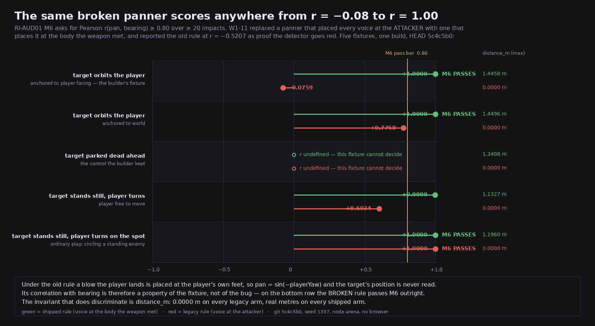

# W1-11 — Impact: hitstop, mass, material, audio — round 1

**Status: FAIL · 4/10 · gate 7 · judged at `5c4c5b0` (working tree dirty; see below)**
Machine-readable: [`W1-11-r1.json`](W1-11-r1.json) · artifacts: `artifacts/W1-11-r1/`

| Item | Native | Ladder | Why |
|---|---|---|---|
| `RI-AUD01` combat impact audio | 7 / 9 checks | **6** | M2 and M8 have no instrument |
| `RI-AUD02` web audio budget | 27 / 29 rows | **6** | 3 rows unreachable on a box with no audio device |
| `RI-WPN05` weapon feel | 25 / 100 | **2** | §E.2 hard fail: 63 clips teleport a weapon socket |
| `RI-CAM06` camera feel (2 rows in remit) | — | **4** | the shake channel this piece feeds has no consumer |

All frame counts below are `f@60`. Souls community figures are `t@30` and double (ARBITRATION S22);
no figure in this verdict is a bare frame count.

---

## What actually shipped, and it is good

I re-measured the two things the dispatch asked me to verify by my own perturbation rather than
by reading the report, and both hold.

**Hitstop freezes the world.** Landing `cgs_drowned_reaper` on a flesh dummy, the player's
`animFrame` sits at 57 from frame 59 through frame 71 — **exactly 12 f@60**, exactly RI-WPN05 §A's
heavy/flesh cell — and the victim holds to frame 76, exactly `attacker + 4`. Light/flesh holds 4,
ultra/water 4, and stone deflects at ×1.5 (light/stone 15 = `ceil(10 × 1.5)`, medium/stone 24).
Then the delete-the-fix: zeroing every cell of `hitstop.attacker` and `victim_delta` on a loaded
copy takes **28 of 35 cells to zero frames**. The freeze is driven by the data, not by a constant,
and the instrument goes red when the data is removed.
→ `artifacts/W1-11-r1/hitstop-census-shipped.json`, `hitstop-census-delete-the-fix.json`

**Material changes what you hear.** Same weapon, same seed, same script, six targets:

| target | class voiced | gain | recipe |
|---|---|---|---|
| flesh dummy | `hit_flesh_heavy` | 0.44614 | two bandpass transients over a 94.5 Hz body |
| shield dummy | `blocked` | 0.23346 | three lowpassed layers, **no high transient** |
| live blocker, guard **up** | `blocked` | 0.23346 | — |
| live blocker, guard **down** | `hit_flesh_heavy` | 0.44614 | — |
| flesh dummy, material forced → chitin | `hit_chitin_light` | 0.43158 | highpass + bandpass, 275 Hz |

That is §A C04's *"damped thud, absorbed — energy present but no high transient"* as written, and
raising the guard on the **same body** flips the class, so the voice tracks what the weapon met
rather than what the statblock says. Not a relabelled sample: a different synth recipe, 6 dB down.
→ `artifacts/W1-11-r1/material-changes-the-voice.txt`

The audio hook is also the right hook. `CombatSystem.step` drains `_audioPending` at the *end* of
the frame, after `resolve.js` has filled every field, in the same call stack as the geometry
decision — so RI-AUD01 §B's frame contract is true by construction rather than by scheduling luck.
M1's offset is p50/p95/p99/max **all 0** over 82 resolution events at HEAD, with 0 orphans and 0
`fired_on_anim_start`, and I reproduced the builder's committed 78-row `sample_id` sequence
byte-for-byte across two of my own runs at seed 1337 (M9).

The M3 calibration is a real piece of work: 48 variants ship a solved `norm_db` spanning −3.28
(`parried`, pulled down out of digital clipping) to +12.91 (`whiff`, lifted out of inaudibility),
and every class now carries §C's exact declared `peak_dbfs`. I did **not** re-render it — see the
honesty section — so it is recorded as carried.

---

## The biggest gap — `GAP-W1-m6-pan-correlation-passes-the-panner-it-was-built-to-catch`

The piece's headline artifact is a three-arm experiment: shipped panner `r = 0.9999`, the rule it
replaced `r = −0.5207` **on the same fixture**, still target `r = undefined`. The status file calls
it *"the strongest single artifact this piece produced"* and concludes `detector_goes_red = true`.

The −0.5207 is a property of that fixture, not of the rule.

Under the legacy rule a blow the *player* lands is positioned at the attacker, so `dx = dz = 0` and

```
pan = sin( atan2(0,0) − playerYaw ) = sin( −playerYaw )
```

The target's position is **never read**. So the correlation between that pan and the target's true
bearing is not a property of the bug at all — it is whatever the fixture's player-yaw history
happens to make it, and it is unconstrained on `[−1, +1]`.

I swept the fixture on the shipped code at HEAD. Same build, same seed, same 46-frame attack cycle,
same sabotage switch:

| fixture | shipped rule | **legacy rule** | legacy `distance_m` |
|---|---|---|---|
| target orbits, anchored to player facing *(the builder's)* | +1.0000 | **−0.0759** | 0.0000 m |
| target orbits, anchored to world | +1.0000 | **+0.7768** | 0.0000 m |
| target parked dead ahead *(the control)* | undefined | undefined | 0.0000 m |
| target stands still, player turns (player free to move) | +0.9999 | **+0.6034** | 0.0000 m |
| **target stands still, player turns on the spot** | +1.0000 | **+1.0000 — M6 PASSES** | 0.0000 m |

On the last row the **broken** rule scores a perfect correlation over 100 impacts with 99 distinct
pan values and a 70° bearing spread, and the shipped predicate
`detector_goes_red = (r === null || r < 0.8)` reports **green**. On the second row it comes within
0.03 of the bar. That last fixture is not exotic — it is a player circling a standing enemy, which
is what M6's own method text (*"correlate `audioLog.pan` against the enemy's bearing from the
player"*) invites a critic to build.

**The invariant that does discriminate is already in every log row and is not in the pass
condition.** `distance_m` is 0.0000 on all five legacy arms and 1.13–1.45 m on all five shipped
arms, because "the voice is at the listener" is a structural fact of the broken rule and does not
vary with the fixture at all.



### Why this is the gap and not a footnote

The shipped panner is **correct** — that is not in dispute, and the fix was real. What is broken is
the thing that certifies it, and a check that reports green on the exact anti-pattern the piece
exists to have removed is worse than no check: the next critic runs M6 the obvious way, gets
`r ≈ 1.0`, and banks a regression as a pass. RI-AUD02 **S6** explicitly delegates its own
non-self-report backstop to this measurement — *"the camera-orbit pan measurement, which cannot be
self-reported wrongly"* — so two items rest on it. And the sabotage switch
`setAudioPanSource('attacker')`, which exists precisely so a build cannot run the defect quietly,
is only as good as the predicate reading it. RULES rule 4: *a probe that cannot fail is worse than
no probe*, and this one cannot fail on a fixture a reasonable person would choose.

**Remedy (S).** Add `distance_m > 0` for player-landed impacts to P4's pass condition; run P4 over
at least two fixture geometries and require the shipped rule to pass **all** and the sabotaged rule
to fail **all**, rather than requiring one arm to go red; fold the sweep into
`tools/audio/impact-browser.mjs` so it runs where the real WebAudio panner does.
**Acceptance:** `node tools/audio/critic-m6-fixture-sweep.mjs` exits 0 with `LEGACY_NEVER_PASSES`
while the shipped rule passes every fixture. The tool exits 3 today, which is its own regression
test.

I also filed the corresponding bar amendment against RI-AUD01 §M6 (`corpus_extended`,
`sharper_discriminator`) and deliberately did **not** apply it: a critic must not edit the bar it is
scoring against in the same round.

---

## Why the biggest gap is not the mass defect

Because the mass defect is the **hard fail**, and that is a stronger statement than being the named
gap. It is why this verdict says FAIL.

`node tools/weapons/motion-census.mjs` at HEAD `5c4c5b0`, re-run rather than quoted:

- **63 clips exceed RI-WPN05 §E.2's 1.00 m per-frame socket step — the explicit HARD FAIL,
  "a teleport with a sword attached".** Worst ten: `whp_hist_bindings/r2` **2.5869 m**, then
  `cgs_drowned_reaper` at `r1.2` 1.524, `r2` 1.4545, `roll.r1` 1.4175, `r1.1` 1.3306,
  `2h.r1.1` 1.3106, `2h.r1.2` 1.3043, `2h.r2` 1.2659, `r2.follow` 1.2603, and
  `bow_chitin_recurve/plunge` 1.0715. Eight of the worst ten are the **baseline heavy greatsword** —
  1.26–1.52 m in one 60 Hz frame is 76–91 m/s of socket travel.
- Tip speed over 1.25× the tier band on **41.42%** of 606 clips (the builder measured 43.4% at
  `0b2d6ef`; it has moved two points, not been fixed).
- Bone-level pose step over 0.25 m on **17.16%** of clips, against a 2% bar. Arc nonconforming
  **3.96%**, against a 2% bar. Follow-through under band **7.59%**, 14 clips dead.

The builder's root cause is right and worth keeping: `game/src/combat/swing.js`'s
`calibrateYawGain` solves for the **declared arc over the active window alone**, and its objective
has no tip-speed, no continuity and no recovery term — so the one thing that is solved is the one
thing that passes.

It is not the *named* gap for one reason only: it already has a complete diagnosis, a named
successor and a written handover. `W1-MASS` reports `state: complete`, and the census at HEAD is
unchanged on every row — 606 clips, arc 3.96%, 63 socket hard fails, tip 41.42%, worst 155.22 m/s.
Naming it again tells the next builder nothing they do not already have in
`reports/W1-MASS-guard.json`. It is recorded as this verdict's only triggered hard fail, against
**W1-11's** declared `weapon.feel.mass`, so it cannot fall between two pieces.

---

## RI-AUD01 is 7 of 9, not 5 of 5

The item's native scale is **checks passed / 9**. `tools/analysis/audio-sync.mjs` reports
`checks_total: 5`, and the status file reads *"NODE RESULT (RI-AUD01): 5/5 checks pass"*. Adding
the browser's M3 gives seven. Two checks have no instrument at all:

- **M2 — blind class distinguishability.** `tools/blind/audio-pack.mjs` is still the
  absence-reporter written when audio did not exist. Run against the shipped build it now reports
  **UNCONFIRMED, exit 20**: *"the build and its own surface disagree about audio…
  Something has moved and the declaration was not updated."* That is TOOL-LOOP's own tripwire
  firing, and it was not answered. M2 is the item's stated bar — *"blindfold the critic and it must
  still score the fight"* — and the item is explicit that it exists because *"'sounds punchy' and
  'carries twelve distinguishable states' are unrelated properties, and only the second one is the
  bar."*
- **M8 — sparseness.** Nothing anywhere measures §D's three rows (concurrent non-combat voices and
  LUFS-S over exploration / combat / boss windows). `voicesPeak` is checked against RI-AUD02's caps,
  which is a different question.

Neither is a build defect and both are priced in at 7/9 → 6. But neither is expensive any more:
this build renders real 48 kHz stereo PCM through `OfflineAudioContext` (the builder proved it),
and a working WAV writer *and* an integrated-LUFS meter already sit in
`tools/blind/audio-pack-b2.mjs`, next door.

---

## Four smaller findings

**The delete-the-fix found the hitstop override.** Zeroing every §A cell left the seven `ranged`
cells still freezing (3/5/12/6/7/3/2 f@60). `game/src/combat/impact.js:110` lets a per-slot
`hitstop_f` table win over the class table, and four weapons use it across **102 slots** —
`bow_chitin_recurve`, `ghm_kings_ruin`, `hlb_saltcutter`, `spr_root_pike` — deviating from §A on
*every* material column. Three of them ship the **identical** table `10/13/19/15/17/8/3` across two
different weight tiers, which reads as a copy rather than a weapon identity. M1's tolerance is
±0 f@60. The override may well be right; what is wrong is that the code cites §A as the licence for
it — `grep -n 'ghm_kings_ruin\|impact row\|per-slot' corpus/12-weapons/RI-WPN05-weapon-feel-impact.md`
returns nothing. Filed as `AQ-W1-11-r1-01`.

**The camera-shake channel is authored, correct, and dead.** `resolve.js:378` writes
`e.shake_deg = imp.shake_deg` on every IMPACT event from a real table (0.25° × tier_index, ×1.5 on a
deflect) and nothing reads it. `game/src/sim/camera.js` has a careful shake — rotational only,
seeded, decaying, 12 frames hard, deliberately kept out of the rig basis so
`Σ|Δcamera.pos|` attributable to shake is 0 — and `triggerShake()` has **exactly one caller in the
tree**: `Engine.triggerCameraShake()` at `game/src/engine.js:5932`, whose own docstring calls it
*"RI-CAM06 M7's fixture"*. `game/src/save/state.js:432` already records *"Nothing in wave 1 calls
triggerShake()"*. This is RULES rule 5 verbatim — a correct, instrumented model that nothing in the
running world reads — and it means one of the three observables RI-WPN05 §F's Impact Legibility
Score is defined over produces no observation. Filed as `AQ-W1-11-r1-02`.

**Camera hitstop, by contrast, is right.** `camera.js:442` holds the rig on
`sim.hitstopUntil > sim.frame`, buffers the look delta rather than dropping it, and releases it at
line 463 on the first non-hitstop frame — and `sim.hitstopUntil` is written from the same §A numbers
the bodies hold on, so RI-CAM06's automatic fail *"hitstop that freezes the world but not the camera
(or vice versa)"* is avoided by construction.

**`weapon.feel.whiff` is declared and unmeasured** by either side this round. RI-WPN05 M4's exact
equality `total_on_hit − total_on_whiff == attacker_hitstop` is the only detector for "recovery
shortened on hit", which the item lists as failure mode #7 and predicts *will be proposed
sincerely*.

---

## What I could not do

Reported as plainly as what I did (RULES rule 26).

- **No browser was launched.** `pgrep -c headless_shell` was 12 at start and **24** during the M6
  work, `loadavg 13.52` on 4 cores — above AGENT-PROTOCOL's ~8 ceiling, and contention has already
  cost two pieces their headline numbers. Every figure in this verdict is a count, a rate, an
  integer frame count or a correlation. **No timing figure is claimed.**
- **M3 was not independently re-rendered.** The data side was re-derived at HEAD (all 12 classes
  carry §C's exact `peak_dbfs`; all 48 variants carry a solved `norm_db`) and the arithmetic holds
  by construction once `norm_db = −raw`, but the 48 raw peaks are the builder's measurement and are
  recorded as carried from `reports/runs/aud-impact-browser/browser-report.json` at `78aebc7`.
- **No blind pack was run**, and all three of RI-AUD01, RI-WPN05 and RI-CAM06 are `blind_pair: yes`.
  RI-AUD01's pack tool is an absence-reporter; RI-WPN05's and RI-CAM06's packs need screenshots.
  `self_audit.blind_done_where_required` is `false` with a note.
- **The M6 sweep ran in the node arena**, not the browser. `row.pan` is plain arithmetic in
  `impact-audio.js` and needs no `AudioContext`, so the shipped rule and the sabotage switch are
  exercised exactly as in the browser; only the WebAudio node graph is absent and no claim here
  depends on it. The target's position and the player's yaw are written by the probe rather than
  produced by locomotion — the same intervention the builder's own P4 uses — and the fully hands-off
  variant of the decisive fixture still reaches **+0.6034** on the broken rule.
- **RI-WPN05 M2 and M3 rest partly on W1-10-r3's censuses**, corroborated here by my own
  perturbation but not re-run in full.
- **RI-CAM06 is scored on two rows only** (M6 hitstop, M7 damage shake). The other seven belong to
  the camera piece and are recorded as `corpus_debt`, not as a zero against this builder.

---

## Path to ten

1. **Make M6 discriminate.** `distance_m > 0` in the pass condition, two fixture geometries, shipped
   passes all / sabotaged fails all. *(S)*
2. **Build the M2 instrument.** Slice the offline render into 600 ms clips, normalise, strip
   metadata, shuffle, one fresh judge per clip on the item's verbatim 12-way prompt. The WAV writer
   and the LUFS meter already exist in `tools/blind/audio-pack-b2.mjs`. *(M — 7/9 → 8/9)*
3. **Build the M8 instrument.** `voicesPeak` per context and integrated LUFS-S against §D's three
   rows, with W1-22's ambience beds live — a budget only ever approached from below has not been
   tested. *(M — 8/9 → 9/9, ladder 8)*
4. **Fire the camera shake from damage resolution**, both channels, and assert
   `Σ|Δcamera.pos|` attributable to shake is 0. *(S — unlocks RI-CAM06 M7 and makes ILS a
   three-channel measurement)*
5. **Run RI-WPN05 M4's whiff arithmetic** across all 15 classes. *(S — 15 native points, and the
   only guard on the trade model)*
6. **Resolve `AQ-W1-11-r1-01`** and bring the 102 overriding slots into conformance. *(S — 25 native
   points)*
7. **Fix mass.** Give `calibrateYawGain` a tip-speed and a continuity term, or move the arc / active
   window / tier declarations, until no clip exceeds §E.2's 1.00 m socket step and under 2% exceed
   1.25× the tier band. `reports/W1-MASS-guard.json` already names every slot with the `active_f` it
   would need and the arc it would be allowed, including the ~107 it says are unreachable by any
   gain. *(L — clears the hard fail)*

---

*Judged by a critic with fresh context who wrote none of the code under review. Every score rests on
a run: my own hitstop census and delete-the-fix, my own material perturbation, my own regeneration
of the RI-AUD01 run and `audio-sync` at HEAD, my own M9 double-run, my own motion census at HEAD,
and my own five-fixture M6 sweep. Nothing was committed.*
