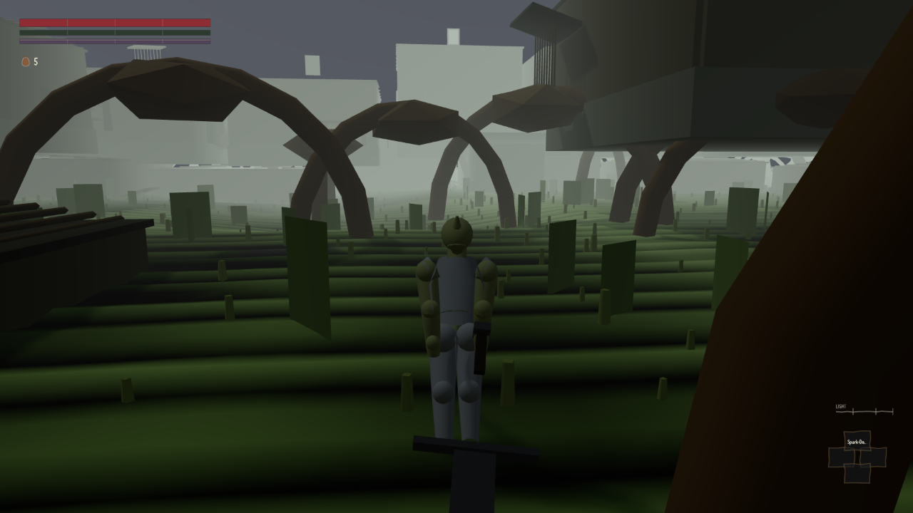

# W1-16 round 2 — progression and encumbrance

**Verdict: FAIL — 3 / 10, min over axes, against a wave-1 gate of 7.0.**
Judged at `5d88b7e`. Never judged before. Critic: fresh context, no involvement in the build.

The round set out to close one defect and closed it. `combat.player.equipLoadPct` — the input to
RI-CMB01's entire roll ladder — genuinely had no producer, and now it has one. I reproduced that
end to end with a working control and it is real work. The round then measured the ladder, the
stamina slopes, the road and the barge, wrote them all in `f@60`, tested the AR-1 guard rather than
asserting it, and reported four unread parameters against itself with a probe that exits non-zero
while they remain. Almost none of that is wrong.

It fails on one thing, and the thing is the sentence the whole round is built on.
**RI-PRG07 §2 reads `equipRatio = (weight of equipped weapons, shields, armour, talismans) /
maxLoad`. The producer sums inventory rows carrying a `slot`, and the weapon and shield the fight
actually holds are not inventory rows.** A character holding an ultra greatsword and a greatshield
has an equip load of **0.00%**. Swapping the heaviest weapon class the game declares onto the body
changes the number that decides the dodge by **zero to six decimal places**. The producer exists;
it is looking at the wrong hand.

And the set it *does* look at cannot be filled. Every wearable slot `carried.json` declares, each
at its heaviest, is **16.8 kg = 23.01%** — `LIGHT`. Not just `HEAVY` and `OVERLOADED`, which the
round reported honestly: **`MEDIUM` is unreachable by armour too.** The only object that crosses the
first cliff is an 11.5 kg maul dropped into the `right` slot, and `right` is precisely the slot whose
weight the fight does not use.

---

## What I ran

Two instruments of my own (RULES 22/23 — a probe that calls a function measures the function), plus
the builder's, unmodified.

| instrument | what it is | goes red? |
|---|---|---|
| `tools/harness/critic-w1-16-offline.mjs` | the real `Engine.prototype._recomputeEquipLoad` / `_recomputeBurden` / `_slotForItem` bound to a synthetic `this`, plus the shipped `equipTier`, `equipLoadMaxFor` and `roll.json`. No browser, no WebGL. | `--selftest` fails all nine checks |
| `tools/harness/critic-w1-16-live.mjs` | eight stepping probes in one browser | exits non-zero on any uncoupled probe |
| `tools/harness/prg-encumbrance.mjs` | the builder's own, re-run unmodified | reproduced: 26 parameters, 4 unread, exit 12 |

Gates at `5d88b7e`: `boot-check`, `check-data`, `check-content`, `check-quests` — all green.

**Contention.** `node tools/contention.mjs --gate` returned exit 3 at the start (9 browser
instances, load 4.70 per core) and again at the end. I did the entire offline half first. The gate
returned **exit 0 — GO** (5 instances, load 3.96/core) before any stepping work, and one browser was
kept for the stepping run; the screenshot went through the pooled capture daemon rather than a
browser of my own. **No timing figure appears anywhere in this verdict.** Every number below is a
fixed-step `f@60` frame count, a kilogram, a percentage, or metres covered over a declared frame
count — none of which contention can move.

---

## A. The roll ladder, and S22 in both directions — **9 / 10**

I did not diff the data against the probe's copy of the data. I rolled, at every cliff.

Thirteen loads of `arena_flat`, `setEquipLoad()` at each point, one roll each, the invulnerable run
read off the body frame by frame:

| load % | tier | startup | i-frames | window | recovery | total | stamina | runs |
|---:|---|---:|---:|---|---:|---:|---:|---:|
| 15 | `LIGHT` | 4 | **26** | f5–f30 | 22 | 52 | 22 | 1 |
| 29.99 | `LIGHT` | 4 | 26 | f5–f30 | 22 | 52 | 22 | 1 |
| **30.00** | `LIGHT` | 4 | 26 | f5–f30 | 22 | 52 | 22 | 1 |
| **30.01** | `MEDIUM` | 4 | **22** | f5–f26 | 34 | 60 | 26 | 1 |
| 50 | `MEDIUM` | 4 | 22 | f5–f26 | 34 | 60 | 26 | 1 |
| 69.99 | `MEDIUM` | 4 | 22 | f5–f26 | 34 | 60 | 26 | 1 |
| **70.00** | `MEDIUM` | 4 | 22 | f5–f26 | 34 | 60 | 26 | 1 |
| **70.01** | `HEAVY` | 6 | **10** | f7–f16 | 72 | 88 | 34 | 1 |
| 85 | `HEAVY` | 6 | 10 | f7–f16 | 72 | 88 | 34 | 1 |
| 99.99 | `HEAVY` | 6 | 10 | f7–f16 | 72 | 88 | 34 | 1 |
| **100.00** | `HEAVY` | 6 | 10 | f7–f16 | 72 | 88 | 34 | 1 |
| **100.01** | `OVERLOADED` | — | **0** | — | 120 | 120 | 40 | 0 |
| 120 | `OVERLOADED` | — | 0 | — | 120 | 120 | 40 | 0 |

**All figures `f@60`.** Every row is `RI-CMB01` §B exactly. Exactly **three** transitions and they
are at 30.00→30.01, 70.00→70.01 and 100.00→100.01 and nowhere else. The i-frames are **one
contiguous run** in every tier, never a flag: `combat/actor.js:201` is
`this.iframe = !!(m.iframes && f >= m.iframes[0] && f <= m.iframes[1])`, evaluated every fixed step
— `RI-CMB01` §C1 satisfied by the shape of the code, not by luck. Offline I swept `equipTier()` over
**12,000** hundredth-of-a-percent samples and found the same three cliffs and zero variance inside
every band, 50 samples per band (`RI-PRG07` method 2's zero-variance assertion).

**The S22 conversion, checked in both directions rather than restated.** For every roll and backstep
row I asserted two independent things: that the `f@60` count is exactly **2 ×** the `t@30` figure the
rebase doubled from (carried in `roll.json`'s own `was_pre_s22`), and — the check that actually
catches a halved or doubled window — that the row's declared **millisecond** column is the reading
at 60 Hz and *not* the reading at 30 Hz. `LIGHT` 52 f@60 = 867 ms, which is 30 Hz's 1733 ms only if
someone half-rebased. All sixteen rows pass both. `RI-CMB03`'s 42 f@60 regen pause is correctly
excluded from the rebase and correctly **not** doubled — the builder flagged this itself and it is
right.

One point off, and it is presentational: the builder publishes a `reference_t30` column that is our
own pre-rebase constructed values, not Souls figures. `MEDIUM` recovery "17 t@30" and `HEAVY`
recovery "36 t@30" are nobody's upstream number. The conversion is correct; the label invites the
next reader to think DS3 has a 36-tick fat-roll recovery.

## B. The anti-merge check — **9 / 10**

The most important thing in the round, and it holds. I re-took it independently, on one fixture, in
both directions:

| arm | carried | burden | burden tier | equipped | equip load | i-frames | window | recovery | total | roll tier |
|---|---:|---:|---|---:|---:|---:|---|---:|---:|---|
| A empty pack | 0.0 kg | 0.000000 | `UNBURDENED` | 0.0 kg | 0.00% | 26 | f5–f30 | 22 | 52 | `LIGHT` |
| B **460 kg in the pack** | 460.0 kg | **2.520548** | `IMMOBILE` | 0.0 kg | **0.00%** | **26** | **f5–f30** | **22** | **52** | **`LIGHT`** |
| C the same pack, five pieces **worn** | 476.8 kg | 2.612603 | `IMMOBILE` | 16.8 kg | **23.01%** | 26 | f5–f30 | 22 | 52 | `LIGHT` |

Arm B is `RI-PRG07` method 3 and its "How we lose" #1: forty mauls in the bag moved burden from 0 to
2.52 and left the dodge **byte-identical**. Reproduced exactly.

Offline, against the shipped methods, the same thing at the level of the arithmetic: doubling the
pack from 40 mauls to 80 moves `_recomputeBurden()` and leaves `_recomputeEquipLoad()` bit-identical,
and `_equipLoadMax()` is exactly `2.5 ×` `_equipCapacity()` — two divisors with two names, which is
the discipline that makes the merge hard to reintroduce. `RI-PRG07` §1's `maxLoad` grid reproduces on
all **48** published cells at **0.0000%** error, strictly increasing in both stats, and
`maxLoad(99) − maxLoad(60) = 58.5 = 1.50 × 39` exactly — uncapped, which is the item's one
non-negotiable.

Arm C is where the round's story starts to come apart, and it is not a defect in the separation
check: **the full wearable set does not leave `LIGHT`.** See §D.

## C. The producer reads the wrong hand — **3 / 10**

`RI-PRG07` §2, verbatim:

> `equipRatio = (weight of equipped weapons, shields, armour, talismans) / maxLoad`

`Engine._recomputeEquipLoad()` iterates `sim.inventory` and sums the `carried.json` weight of every
row carrying a `slot`. The weapon the fight swings is `combat.player.weaponId`, set by
`CombatSystem.setLoadout()` from `loadout.weapon`. It is not an inventory row. Neither is the shield.

Measured, live, one fixture:

| | weapon the fight holds | inventory `right` | equipped weight | equip load |
|---|---|---|---:|---:|
| at load, holding a garrison sword and a medium shield | `ssw_garrison_sword` | — | 0.0 kg | **0.000000%** |
| after equipping a bog-iron maul through the equip queue | **`ssw_garrison_sword`** | `bog-iron-maul` | 11.5 kg | 15.753425% |
| after `setLoadout({weapon:'ultra-greatsword', shield:'greatshield_xanmeer'})` | `ugs_golem_sword` | `bog-iron-maul` | 11.5 kg | **15.753425%** |

Read the last two rows together. Equipping a maul into the inventory's right hand adds 11.5 kg to the
roll ratio **and leaves the fight swinging the garrison sword**. Putting the heaviest weapon and the
heaviest shield in the game onto the body changes the ratio by **nothing, to six decimal places**.
There are two right hands: one that is weighed and one that fights, and they are different objects.
That is RULES 10 verbatim — *"two parallel implementations of one system is how this build had a
good detection model and a broken one at the same time"* — which is the rule this very round invoked
when it found the two sprint implementations. It found that one and walked past this one.

The weight is not missing. `game/data/weapons/classes.json` ships an `equip_weight` column on all
fifteen classes — Dagger 1, Straight sword 4, Halberd 9, Greatsword 12, Great hammer 16, **Ultra
greatsword 20**. `combat/moveset.js:187` copies it onto the move table. Nothing in `game/src` ever
reads it. I grepped every `.js` under `game/src` for the token: two hits, one a comment and one the
copy. It is a fifteen-row shipped model with **zero readers**, and it is the first term of the
formula this round exists to implement.

The shields are worse: `weapons/classes.json`'s `shields` block has `guard_angle_deg`,
`parry_capable`, `parry_anim_f`, `parry_active_f`, `slots` — and **no weight column at all**, while
`RI-PRG07` §4 declares Buckler 4, Kite shield 9, Greatshield 18.

*The bottom-right HUD readout, `default` state, `setLoadout({weapon:'ultra-greatsword',
shield:'greatshield_xanmeer'})`, rendered through the pooled capture daemon at
`game@df03085f961bada0`. The bar is empty and the label says `LIGHT`. Placed capture — evidence of
appearance only, S34(a).*

## D. Three of four tiers cannot be entered by dressing — **3 / 10**

The round reported this and reported it honestly: `HEAVY` needs 45.5 kg worn at the base sheet and
the shelf tops out at 28.3 kg, so it declined to invent weights. Declining was right. The number is
worse than reported.

`game/data/items/carried.json` has 44 rows. **Nine** carry a `slot`, across **five** slots:

| slot | heaviest row | kg |
|---|---|---:|
| chest | `shell-scale-hauberk` | 9.1 |
| legs | `legion-greaves` | 5.8 |
| feet | `wet-season-boots` | 1.1 |
| head | `rootweave-cowl` | 0.6 |
| waist | `silt-strider-silk-sash` | 0.2 |
| | **total** | **16.8** |

There is no shield row, no `left`-slot row, no talisman, no hands or arms slot. **16.8 kg is 23.01%
of the base sheet's 73 kg capacity — `LIGHT`.** I measured it, in arm C above: the full wearable set
rolls 26 i-frames.

So `MEDIUM` is not reachable by armour either. The only shipped object that crosses the 30% cliff is
the 11.5 kg `bog-iron-maul` occupying `right` — and `right` is the slot the fight does not read. The
builder's own headline arm (28.3 kg, 38.77%, `MEDIUM`) crosses the cliff **entirely on the strength
of a weapon that the character is not actually holding**.

`RI-PRG07`'s §5 six-build fixture — its own stated regression test for the 30% breakpoint, the one
that keeps the Fence at `MEDIUM` and the Shell-Warden at `HEAVY` — cannot be instantiated. The Fence
needs 30 kg equipped and the Shell-Warden 126. Method 7 (200 boss sims in plate) cannot be run by any
wave, because no legal character can wear plate. I record method 7 as **unmeasurable and excluded
from the min** rather than scoring it 0, because scoring an axis no wave can evaluate would fail this
item forever.

The remedy is not "invent weights". Counting the weapon class weight the game already declares moves
the base sheet from 43.5% to **56.62%** — most of the way to the `HEAVY` cliff on shipped data alone,
with no content invented. That is why §C is the biggest gap and this is its consequence.

## E. CONSUMPTION — **4 / 10**

The census is honest in shape and incomplete in fact. I reproduced it exactly: 26 parameters, 22 with
a named world-side consumer, 4 with none, `getBurden()` returning literal `null`s, probe exit 12. The
four named — `burden.fatigue`, `burden.sneak`, `burden.jump`, `equip_load.fall_damage_mult` — are
real and correctly reported, and making the probe fail while they remain is the right instinct.

I found two it does not enumerate. Both are on the **equip-load** side, which the round declared
"already coupled before this round".

**1. `weapons/classes.json equip_weight`** — fifteen rows, no reader anywhere in `game/src`. §C.

**2. `RI-CMB01` §B: "`OVERLOADED` additionally forbids sprinting and jump-attacks."** The
jump-attack half has a reader (`combat/moveset.js` returns `{slot: null, reason: 'overloaded'}` when
`ctx.roll_tier === 'OVERLOADED'`). The sprint half has none. Measured, with the null control that
makes it decisive:

| equip load | tier | sprint held | metres over 120 f@60 | stamina spent |
|---:|---|---|---:|---:|
| 15 | `LIGHT` | no | 6.400 | 0 |
| 15 | `LIGHT` | **yes** | **10.000** | 18 |
| 85 | `HEAVY` | yes | 10.000 | 18 |
| **120** | **`OVERLOADED`** | **yes** | **10.000** | **18** |

The button does something — 6.400 m becomes 10.000 m and costs 18 stamina. An `OVERLOADED` player
sprints exactly as far as a `LIGHT` one, for exactly the same stamina. The prohibition is not
implemented and it is not in the census. (`sim/player.js`'s sprint gate reads `worldDeny.sprint`,
`exhausted` and stamina; nothing on that path reads the equip-load tier. `RI-PRG07` §3's Overladen
**burden** denial does work — §G — but that is the other ratio and is deliberately inert in a fight,
so it cannot stand in for this.)

That is six unread of a corrected twenty-eight, and `ARBITRATION` §3 is explicit that a sample is not
an enumeration.

**One more, and it is a claim the source makes about itself.** `_recomputeEquipLoad()`'s header says:

> *"It applies its result as a DELTA rather than an assignment, so the feather effect's own additive
> offset survives untouched. An assignment here would have silently deleted a spell."*

On the **first** engagement after a scenario boundary `_equipLoadBase` is `null`, so `prev` is read
off the body — which already carries the offset — and the delta collapses to an assignment. Run
against the real `Engine.prototype._recomputeEquipLoad`: a live −10 offset, then one equip, and the
offset is gone; the spell's own `_undo` then subtracts it a second time and the load settles **10
points wrong and stays there**, because `base` never changes again and the guard is
`if (base !== this._equipLoadBase)`. `spells.json` ships Feather at magnitude **30** and Burden at
**40**, both wider than the whole `LIGHT` band, and **21 of the 49 shipped named states begin with
nothing equipped** and are therefore exposed. Reported honestly: **I could not land this live** —
`castNow('burden')` refused `not_attuned` on both states I tried even after `setWillpower(70)` and
every magic skill at 100, and I ran out of budget chasing the attunement gate. It is an offline
result against the shipped method, not a live one, and it is scored as such.

## F. Delete-the-fix — **9 / 10**

This is the best-built control I have seen in this project and it survives the attack the brief asked
for. `__breakW116()` writes and clears exactly one flag object on the engine; every off-branch reads
it as `this._w116Break && this._w116Break.<arm>`, which is null-safe, so the failure mode the brief
names — a teardown nulling a handle the off-branch tests for — is structurally impossible here.

I ran both arms myself, and I ran them in **both orders**, because a control that only differs when
the cut arm runs second is carrying state between arms rather than measuring code:

| | equip load before | equip load after 28.3 kg | i-frames | recovery | total | tier |
|---|---:|---:|---:|---:|---:|---|
| **fix present** | 0.00% | **38.767123%** | 26 → **22** | 22 → **34** | 52 → **60** | `LIGHT` → `MEDIUM` |
| **`producer,slots` cut** | **24.00%** | **24.00%** | 26 → 26 | 22 → 22 | 52 → 52 | `LIGHT` → `LIGHT` |

Identical in both orders. The old number returns exactly: the hardcoded **24.0**, and a roll that
28.3 kg of armour cannot move. The `slots` arm also reproduces the second half of the pre-round
defect — with it on, the equipped rows are `["bog-iron-maul@right"]` and nothing else, because all
six pieces went into the sword hand and each evicted the last; with it off they are all six, in
`chest`, `legs`, `head`, `feet`, `waist` and `right`. The switch reports `{broken:["producer","slots"]}`
and the teardown reports `{broken:[]}`. Not inert.

One point off because the arms are switches inside the shipped engine rather than a removal of the
code, so they prove the *hooks* are load-bearing rather than that the *implementation* is; the reason
given (29 files moving under a `git stash` on a shared tree, RULES 17) is a good one and I would have
done the same.

## G. The pin, and the two cross-piece defects — **8 / 10**

**The pin on the load path (item D) — verified on every path, not one.** `save/fight.js` always
writes a number into `fight.loadout.equip_load_pct`, so `_buildCombat` would read every load as a
scenario pin; `_restoreFightFromSave` clears it. I checked all four load paths that exist and asked
the RULES 7 question — not "is the number the same" (a pinned field re-serialises to what was saved
and passes forever) but **"does the producer still run"**, by taking a piece off after the load:

| path | load returned | equip load after | source after | undress moves it? |
|---|---|---:|---|---|
| `loadState('<named state>')` | — | 20.410958% | derived from equipped items | **20.410958 → 7.945205** |
| `saveRoundTrip()` | `hash_equal:false` | 20.410959% | derived from equipped items | **20.410959 → 7.945206** |
| `writeSave()` → `readSave()` | `{ok:true, gen:1, degraded:false}` | 20.410959% | derived from equipped items | **20.410959 → 7.945206** |
| `exportSave()` → `importSave()` | `{ok:true, frame:0, seed:1337}` | 20.410959% | derived from equipped items | **20.410959 → 7.945206** |

Nothing reads as pinned after any load. The clear is real and general. **I nearly shipped a vacuous
arm here and say so:** the first version called `readSave()`/`writeSave()` synchronously, and both are
`async` — the probe read the world back before the load had run and recorded a pass for a load that
never happened. It is async now.

**Q1, `setBurden()` was inert — confirmed fixed.** Set 0.95, stepped **180 f@60**, still exactly
0.95, `burden_source: "pinned by setBurden()"`, tier `OVERLADEN`. The builder's own travel and road
rows each carry the correct tier, so those figures are not contaminated by the defect they found.

**Q2, two parallel sprint implementations — confirmed fixed, tested the way it actually failed.** A
denial read only at the press gate expires on the frame the button went down. So: press sprint, run
40 frames, *then* become Overladen with the button still held.

| | metres after the transition | metres total |
|---|---:|---:|
| unburdened, button held through | **11.667** | 13.500 |
| overladen, button held through | **5.398** | 7.231 |
| overladen, fresh press | 4.685 | 4.685 |

The denial applies to a player who was already sprinting. That is W1-03's water clause as much as
this round's, and it is fixed at the place locomotion is decided.

**Found while doing it, and not this piece's:** `save/fight.js`'s `SKIP` set does not list `ai`, so
`saveActor(ctl)` serialises the live `SoulsAI` as a plain object and `loadActor` assigns it back over
the instance. On `arena_duel`, `saveRoundTrip()` then `stepFrames(4)` throws
**`this.ai.step is not a function`**. Every stepping probe after a save/load in any populated state
dies, while `boot-check` stays green because boot does not step — the exact shape RULES 15 warns
about, in a different file. `saveRoundTrip()` also reports `hash_equal:false` on every state I tried.
Both belong to whoever owns the save layer; recorded here so nobody re-derives them.

## H. AR-3 — not sterile

The crossing is real and runs both ways. Outward: what you pick up in the Morrowind half decides how
many frames you are invulnerable for in the Souls half. Inward: nothing you carry may touch the
fight, and the AR-1 guard that enforces it is **tested rather than asserted** — with burden pinned at
0.95 and a real hostile woken, every column reads its Unburdened value and the probe reports
`tested: true` separately from `passes`, because a guard that never entered a fight has not been
tested. A third crossing is the barge: a logistics decision paid for in world time on a network S7
protects. `seam_sterile: false`.

---

## Score

Min over axes, per `RI-PRG07`'s own declared aggregation.

| axis | score | why |
|---|---:|---|
| A — S22 and the ladder | 9 | every row exact in `f@60`, three cliffs, contiguous runs, conversion checked in both directions |
| B — ratio separation / AR-1 | 9 | 460 kg leaves the roll byte-identical; two divisors, two names; grid exact on 48 cells |
| C — the producer reads §2's set | **3** | the weapon and shield the fight holds contribute **0.00%**; `equip_weight` has no reader |
| D — tier reachability | **3** | the whole wearable shelf is 23.01% — three of four tiers reachable only by a pin |
| E — CONSUMPTION | 4 | census honest but missing two, both on the side declared already coupled |
| F — delete-the-fix | 9 | both arms differ in both orders, old number returns exactly, teardown observable |
| G — the pin and the load path | 8 | verified on all four load paths, with the right question asked |
| H — AR-3 | 8 | not sterile, guard tested not asserted |

**Overall 3 / 10. FAIL.** Published alongside, so the aggregation is not a hidden choice: the
reference-item weighted mean is **4** (`RI-PRG07` 2 × 0.6 + `RI-CMB01` 7 × 0.4).

No AR-1 failure and no AR-2 failure. This is *below bar with a named remedy*, not a void.

## The single biggest gap

**`GAP-W1-16-equip-load-cannot-see-the-thing-in-your-hands`** — `progression.equipment.encumbrance`,
**blocking**.

`_recomputeEquipLoad()` implements `RI-PRG07` §2 minus its first two terms. The weapon and shield the
fight holds contribute nothing to the ratio that chooses the roll, and the weight column that would
supply them is already in the tree with no reader. The consequence from the player's chair is that
the round's headline — *encumbrance now moves the roll from the world* — is true only of five
clothing slots that together cannot leave `LIGHT`, and false of the two objects a Souls player thinks
of first when they hear "equip load".

**Remedy, buildable, using only weights the game already declares:**

1. In `Engine._recomputeEquipLoad()`, add `this.combat.player.moves.equip_weight` (already carried by
   `combat/moveset.js:187`) and the shield's weight to `w`, alongside the inventory `slot` sum. Do
   not change the divisor: it is `_equipCapacity()` and that part is right.
2. Add a `weight` field to each row of `weapons/classes.json`'s `shields` block, from `RI-PRG07` §4:
   buckler 4, small 4, medium 9, greatshield 18, parry_tool 1.
3. Make `_finishEquipCommit()`, on a row whose slot resolves to `right` or `left`, call
   `setLoadout({weapon})` / `{shield}` so the hand that is weighed and the hand that fights are one
   object. This is the RULES 10 half and it is the half that stops the defect coming back.
4. Add `equip_load.weapon_weight`, `equip_load.shield_weight` and
   `equip_load.overloaded_denies_sprint` to `getBurden()`'s consumer table, and implement the third
   (`RI-CMB01` §B) at the same gate `worldDeny.sprint` uses.
5. Fix the first-engagement assignment: seed `_equipLoadBase` to the computed base on the frame the
   producer engages *before* applying any delta, so a live Feather or Burden offset survives.

**Acceptance:** `node tools/harness/critic-w1-16-live.mjs --probe parallel,oversprint` reports
`inventory_equip_changed_the_weapon_the_fight_swings: true`,
`swapping_the_fight_weapon_changed_the_ratio: true`, `an_OVERLOADED_player_still_sprints: false`,
and `coupled: true` on both probes; and
`node tools/harness/critic-w1-16-offline.mjs` passes C5, C6 and C7 — C7 meaning a legal character can
dress into `HEAVY` from shipped data with no weight invented.

**Targets:** `game/src/engine.js`, `game/src/combat/moveset.js`, `game/data/weapons/classes.json`.

## Secondary observations

- **21 of 49 named states begin at a hardcoded 24% equip load** with nothing equipped
  (`source: "engine default — nothing is equipped yet"`). The producer engages the moment anything is
  worn, so this is a residue rather than the old defect, but 24.0 is still the answer the game gives
  in nearly half its states.
- The builder's `reference_t30` column publishes our own pre-rebase constructed values as though they
  were Souls figures. The arithmetic is right; rename the column.
- `RI-CMB01` §B asks for a menu readout that changes colour at the fat-roll threshold. The HUD has an
  equip-load element; the pack screen shows the burden bar and no equip-load percentage. The builder
  named this rather than building it, correctly — it is `RI-UIX03`'s.
- Not this piece's, recorded so nobody re-derives them: `save/fight.js` `SKIP` omits `ai`, so any
  save/load with a hostile present makes the next fixed step throw `this.ai.step is not a function`;
  and `saveRoundTrip()` reports `hash_equal:false`.

## What I could not do

- **`RI-CMB01` M2, M3 and M4 were not re-measured.** The i-frame hit-offset sweep, root motion and
  uncancellability belong to W1-09/W1-10 and are not what this progression round changed. I verified
  the shape §C1 demands and the contiguity of the run at all four tiers, and nothing else.
- **The Feather defect is an offline result.** `castNow` refused `not_attuned`; the mechanism is
  demonstrated against the real `Engine.prototype` method with a synthetic `this`, not in a running
  fight. If the attunement gate turns out to make the spell unreachable in play, the defect is latent
  rather than live and the CONSUMPTION axis should move up by one.
- **`RI-PRG07` method 7** (Shell-Warden viability) is unmeasurable for the reason in §D and is
  excluded from the min rather than scored 0.
- **`run-all.mjs` was not run.** The gate was at or over its ceiling for most of the window and
  `run-all` launches many browsers; I ran the four offline gates and the builder's own probe instead.
