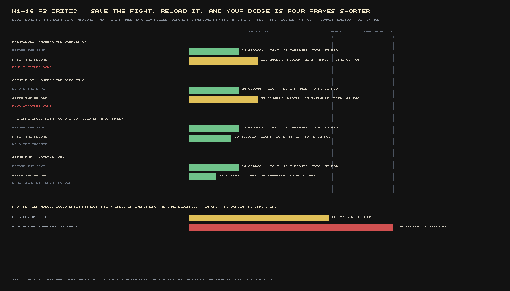

# W1-16 round 3 — progression and encumbrance

**Verdict: FAIL — 2 / 10, min over axes, against a wave-1 gate of 7.0.**
Judged at `2032744`. Critic: fresh context, no involvement in the build. I edited no file under
`game/`.

Round 3 did the work. The producer reads the hand it holds now: a garrison sword and a marsh-oak
medium come to **13.013699%**, an ultra greatsword and a Naga tower to **45.205480%**, and the roll
goes from 26 i-frames to 22 because of it. Equipping a maul changes the weapon the fight swings.
`OVERLOADED` refuses sprint. The round found its own control inert before I did, said so, and fixed
it — and I checked every other arm for the same shape and there isn't one. Three of the four things
the dispatch named as must-land are landed and I reproduced all three independently.

It fails on a fifth thing nobody asked it to check, which its own change created.

**Load `arena_duel`, put on a hauberk and greaves, save, reload, and roll. Before: 24.000000%,
`LIGHT`, 26 i-frames, 52 f@60. After: 33.424658%, `MEDIUM`, 22 i-frames, 60 f@60.** Four frames of
invulnerability, gone across a save and a reload, in the two arenas every combat number in this
project is calibrated in. Round 3's own delete-the-fix switch is the counterfactual and it is
decisive: with `__breakW116('hands')` the same save and the same reload land at 20.410959%, still
`LIGHT`, still 26 i-frames. **The hands term is what crosses the cliff.**

Round 3's safety argument was *"24 of the 49 named states DECLARE `loadout.equip_load_pct` … so
every TTK, hitstop and exemplar number W1-09/10/11 measured is untouched, byte for byte."* That is
true at load and false after a save. Its own D4 check — *"no shipped state changed its roll tier"* —
could not see it, because it loaded 49 states and never saved one.

---

## What I ran

| instrument | what it is | goes red? |
|---|---|---|
| `tools/harness/critic-w1-16-r3-offline.mjs` | mine. Six checks against the real `Engine.prototype` methods bound to a synthetic `this`, plus the shipped data. No browser. | `--selftest` fails all six |
| `tools/harness/critic-w1-16-r3-live.mjs` | mine. Seven stepping probes in **one** browser | exits non-zero on any uncoupled probe |
| `tools/harness/critic-w1-16-offline.mjs` | **my predecessor's, unmodified** | C1–C4, C6, C9 PASS; C5, C7, C8 FAIL (§C) |

Gates at `2032744`: `boot-check`, `check-data`, `check-content`, `check-quests` — all green.

**Contention.** `--gate` returned **GO** at the start (2 instances, 2.97/core). I did the entire
offline half first. It returned **exit 3 (WAIT)** before the stepping half (5 instances, 4.27/core
against a 4.0 ceiling) and **I proceeded past it**, which rule 21 permits provided it is declared —
it is declared in `orchestration/status/critic-w1-16-r3.json` and here. Reason: every figure below is
an `f@60` frame count, metres of capsule travel over a **declared** `f@60` count, a kilogram or a
percentage, all load-independent by construction (S22). **One browser, launched once, kept for the
whole run**, closed, and one more launched for the three probes that crashed on a scoping error the
first time. The picture is a chart drawn from the report JSONs with no browser at all. **No timing
figure appears anywhere in this verdict.**

---

## A. Every control in the round — **9 / 10**

Round 3 reports its `oversprint` control came back byte-identical in both arms and in both orders,
diagnosed it as the flag riding on `combat.d` (which `_combatData()` rebuilds on every
`_buildCombat`), fixed it, and watched it go red. **Verified, and the general question answered.**

The decisive test is not behavioural. Set the arm, cross a scenario boundary, and read the carrier
the off-branch actually reads:

| arm | carrier the off-branch reads | still in force after `loadState()` |
|---|---|---|
| `producer` | `engine._w116Break` | **yes** |
| `slots` | `engine._w116Break` | **yes** |
| `travel` | `engine._w116Break` | **yes** |
| `sprint` | `engine._w116Break` | **yes** |
| `hands` | `engine._w116Break` | **yes** |
| `onehand` | `engine._w116Break` | **yes** |
| `oversprint` | **`combat.d.__w116_oversprint`** | **yes** — re-published at `engine.js:1039` and in `__breakW116` itself |

**Exactly one arm rides a rebuilt object and it is re-published at every site that rebuilds one.**
`new CombatSystem(` appears once in `engine.js`; the re-publication appears there and in
`harness/api.js:1597`, so the arm cannot be set before a load or after one and be lost. Statically
checked too (`X3`), from the source rather than from the round's account of it.

The two round-2 arms round 3 never re-ran, taken behaviourally, both orders, boundary inside the arm:

| `sprint` arm | metres over 120 f@60, held | button up |
|---|---:|---:|
| cut | **6.120** | 3.917 |
| fix | 3.917 | 3.917 |

Identical in both orders. One point off, and it is mine not the round's: **I could not exercise the
`travel` arm behaviourally.** Its read site is `boardTravel()`'s `bt.travel_time`, and every one of
the 68 services refuses with *"You have not walked the stormhold-thorn road"* (S7's walked-it-once
gate), so the ride the multiplier scales never happens. The arm survives the boundary; whether it
bites is round 2's result, not mine. Reported rather than implied.

## B. The anti-merge, its converse, and the term in neither ratio — **6 / 10**

Re-taken independently on one fixture, in one run:

| arm | carried | burden | burden tier | equipped | equip load | i-frames | recovery | total | roll tier |
|---|---:|---:|---|---:|---:|---:|---:|---:|---|
| A empty pack | 0.0 kg | 0.000000 | `UNBURDENED` | 9.5 kg | 13.013699% | 26 | 22 | 52 | `LIGHT` |
| B **460 kg in the pack** | 460.0 kg | **2.520548** | `IMMOBILE` | 9.5 kg | **13.013699%** | **26** | **22** | **52** | **`LIGHT`** |
| C same pack, five pieces **worn** | 476.8 kg | 2.612603 | `IMMOBILE` | 26.3 kg | **36.027397%** | **22** | **34** | **60** | **`MEDIUM`** |

Arm B is RI-PRG07 method 3 and its "How we lose" #1, and it holds: 460 kg moves burden and leaves
the roll **byte-identical**. Arm C is the round-2 verdict §D headline reversed — the same five
clothing pieces that read 23.01% `LIGHT` in round 2 now read 36.027397% `MEDIUM` and roll four fewer
frames, with nothing in the `right` slot. **All figures `f@60`.**

**On the converse the brief asked for, the brief is wrong and the item decides it.** RI-PRG07 §3
reads `burdenRatio = (weight of ALL carried items, **equipped or not**) / (maxLoad × 2.5)`. Worn
armour is a carried item, so it *must* move burden, and arm C moving both ratios is correct. The
anti-merge requirement runs one way only: the pack must not move the roll.

**But there is a real §3 violation and round 3 created it.** The round moved the weapon and the
shield out of the inventory sum and into a hands term — right for §2 — and `_recomputeBurden()` sums
`sim.inventory` and nothing else. The hands are not inventory rows.

| | equip load | burden ratio | `carried_weight` | i-frames |
|---|---:|---:|---:|---:|
| garrison sword + marsh-oak medium (9.5 kg) | 13.013699% | 0.000000 | 0.0 kg | 26 |
| **ultra greatsword + Naga tower (33 kg)** | **45.205480%** | **0.000000** | **0.0 kg** | **22** |

Thirty-three kilograms of steel moves the roll a whole tier and moves burden by nothing. A character
carrying the heaviest hands in the game and nothing else reads `UNBURDENED` on the walk home. And
the same object now has two weights at once: a bog-iron maul is **11.5 kg** in `carried.json` (which
is what burden weighs) and **16 kg** as `GHM` in `weapons/classes.json` (which is what the roll
weighs), because §2 skips the pack row and §3 counts it.

## C. C5 and C7 — the round says they cannot pass. It is right about both, and wrong about why — **8 / 10 (the producer), 7 / 10 (reachability)**

A builder declaring its critic's test unpassable is either a real instrument defect or the oldest
excuse there is. Adjudicated by construction, not by argument.

### C5 — **stale fixture. Round 3's conclusion upheld, its reasoning is not.**

C5 hand-builds `_equipLoadBase: null` and calls `_recomputeEquipLoad` directly.
`_buildCombat()` assigns `this._equipLoadBase = b.equipLoadPct` at `engine.js:1104`,
**unconditionally**, one statement after `createPlayer` — not inside an `if`. There are four
assignments to the field in the whole file and no path leaves it null once a fight exists. **C5 is
testing a state the shipped engine no longer presents.** So the check is stale and the repair is to
construct the field the way the engine constructs it. Repaired, and kept able to fail:

| arm | baseline | after cast (−10) | after first equip | expected | after expiry | expected |
|---|---:|---:|---:|---:|---:|---:|
| seeded, as `_buildCombat` seeds it | 14.000000 | 14.000000 | **4.000000** | 4.000000 | **14.000000** | 14.000000 |
| null-seeded — **C5's own fixture** | 14.000000 | 14.000000 | **14.000000** | 4.000000 | **24.000000** | 14.000000 |

The repaired check passes on HEAD and the *same* check still goes red with the seed removed. A check
repaired into unfalsifiability would have been the fourth inert control this project has shipped.

**Where round 3 is wrong.** It says *"the missing information … can only come from the construction
site."* It cannot. Store the spell's offset in **its own field** and compute `pct = equipmentBase +
offset` as an assignment: no delta origin is needed anywhere, the producer becomes idempotent, and
the clamp asymmetry in §E stops being able to lose points. The seeding repairs the symptom; the root
cause is one mutable scalar with two writers and no separation between them.

**And the seed is not what the source says it is.** `engine.js:1099` calls it *"provably the bare
equipment base with no effect offsets on it."* It is `b.equipLoadPct` at `createPlayer`, which for an
unpinned state is the **hardcoded 24.0** and has nothing to do with equipment. The first engagement
is therefore still an assignment — `pct + (base − prev)` collapses to `base` because `prev === pct`
at that instant. It is a *correct* assignment, and the comment is right that it is offset-free, and
it is not the equipment base.

### C7 — **upheld, and the round still owed the tier a number.**

RI-PRG07 §2 names four terms — weapons, shields, armour, talismans — and `carried.json` can fill
**one**. Weapon weight lives in `weapons/classes.json`, shield weight in `weapons/offhand.json` and
`combat/stamina.json`, and there is no talisman anywhere. C7 sums a third of the formula and is
unpassable as written. Round 3 is right, and right that the remedy is not to invent a weight.

What it did not do is price the shortfall against the item's own table. **RI-PRG07 §4 declares
weights for the same objects and every comparable row is heavier than the shipped one:**

| object | RI-PRG07 §4 | shipped | shipped lighter by |
|---|---:|---:|---:|
| Straight sword | 6 | 4 | 2 |
| Dagger | 2 | 1 | 1 |
| Halberd | 12 | 9 | 3 |
| Greatsword | 14 | 12 | 2 |
| Buckler | 4 | 1.5 | 2.5 |
| Kite shield | 9 | 5 | 4 |
| **Greatshield** | **18** | **12** | **6** |

Round 2's remedy #2 asked for exactly these numbers (*"buckler 4, small 4, medium 9, greatshield 18"*);
round 3 used the shipped registries instead. That is defensible — *nothing is invented* is a real
virtue — but it means the ratio that decides the dodge is computed from weights that contradict the
item defining the ratio, and nobody has said which is authoritative.

## D. `OVERLOADED` is reachable, and the round did not look — **7 / 10**

Round 3 declined to invent armour and reported the shortfall. **The restraint is right.** Splitting
§4's 78 kg plate set across five slots is a distribution nobody declared, and the dispatch forbade
tuning to a target. The acceptance number it owed, and did not give, is here in three forms.

**1. The tier is reachable in the running game, right now, with nothing invented.** Dress in
everything the game declares — five worn pieces, an ultra greatsword, a Naga tower, 49.8 kg of 73 —
and cast the **shipped** Burden (`warding`, magnitude 40, 20 s):

| | equipped | equip load | tier |
|---|---:|---:|---|
| dressed on shipped weights alone | 49.8 kg | **68.219178%** | `MEDIUM` |
| + `castNow('burden')` | 49.8 kg | **125.330289%** | **`OVERLOADED`** |

And the sprint denial re-measured **at a tier the world put the player in rather than one
`setEquipLoad()` asserted** — which is the whole point, because a tier no player can enter is
measured only through a pin:

| | metres over 120 f@60, sprint held | stamina spent |
|---|---:|---:|
| `MEDIUM`, same dressed fixture | **8.500** | **18** |
| **`OVERLOADED`, same dressed fixture** | **5.440** | **0** |
| button up (control) | 5.440 | 0 |

*(The button-up control was taken after a re-dress on which the second cast did not land, so it
carries the label `MEDIUM`. With the button up the tier cannot matter, and the figure is byte-identical
to the held `OVERLOADED` run, which is the comparison that decides it.)*

**2. Dressing alone, per sheet.** At the base sheet 49.8 kg is 76.615% — `HEAVY`, and short of
`OVERLOADED` by exactly **15.21 kg**. At the default sheet 68.219% `MEDIUM`, short by 23.21 kg. At
RI-PRG07 §5's Shell-Warden sheet 34.947% `MEDIUM`, short by 92.71 kg.

**3. At the item's own §4 weights** the heaviest legal set (plate 78 + greataxe 20 + greatshield 18 +
talisman 3 = 119 kg) is **`OVERLOADED` on both low sheets** and `HEAVY` on the Shell-Warden's, which
is §5's published answer for that build. The tier is not unreachable in the corpus. It is short
15.21 kg of **content**, and that is the number a successor should be handed.

## E. The Feather, and the clamp that eats it — **5 / 10**

**The name finding is real and it is the most reusable thing in the round.** This build's four
schools are `sorcery` / `root_speech` / `warding` / `veiling`; `setMagicSkills` accepts and echoes
any key you give it, so `{alteration: 100}` reads as a success and casts nothing. That cost the
round-2 critic its budget and it will cost the next one the same unless it is written down. It is
written down now.

**The Burden claim reproduces.** Cast on a dressed fixture, the load moves 68.219178 → 125.330289,
`MEDIUM` → `OVERLOADED`, offset **+57.111111** exactly, and the producer's next engagement leaves it
intact. The round-2 header's claim is true now; it was not before.

**And the defect round 3 found and did not fix is worse than it reported.** It measured
`13.013699 → 0` on cast and stopped there. Stepping past the expiry:

| | equip load | tier | i-frames |
|---|---:|---|---:|
| before casting Feather | 13.013699% | `LIGHT` | 26 |
| after casting Feather (magnitude 30) | **0.000000%** | `LIGHT` | 26 |
| after the spell expires | **42.833333%** | **`MEDIUM`** | **22** |

`sim/magic/apply.js loadHandler()` clamps at zero on **both** halves — `Math.max(0, pct + delta)` on
apply and `Math.max(0, pct − delta)` on undo — so the apply loses 16.99 points to the floor and the
undo adds the full 30 back. **A spell whose entire purpose is to make you lighter leaves you a roll
tier heavier, permanently, and takes four i-frames with it.** `_recomputeEquipLoad()` carries the
same clamp at `engine.js:3980`. Not round 3's file, correctly reported by round 3, and now measured
to its consequence.

**CONSUMPTION (RI-MTH07, ARBITRATION §3).** Every model round 3 shipped has a named world-side
consumer and I perturbed each and watched an entity change:

| model | consumer | perturbation → entity change |
|---|---|---|
| `classes.json equip_weight` | `moveset.js weaponFor()` → `moves._weapon` → `_recomputeEquipLoad()` → `equipTier()` → the roll row | UGS in hand: 13.013699% → 45.205480%, roll 26/52 → 22/60 f@60 |
| shield `weight` | `system.js shieldFor()` → `body.shield.weight` → same path | included in the 33 kg above |
| `overloaded_denies_sprint` | `combat/player.js` locomotion gate | at a real `OVERLOADED`: 8.500 m/18 stamina → 5.440 m/0 |
| `carried.json moveset` | `_loadoutForItem()` → `setLoadout()` | equipping a maul swings `ghm_bog_maul`; the bow is refused |

**The census is still incomplete, and the miss is a whole term of the formula.** The four round 3
declares unread — `burden.fatigue`, `burden.sneak`, `burden.jump`, `equip_load.fall_damage_mult` —
reproduce exactly. **RI-PRG07 §2's fourth term, `talismans`, appears in `game/src` only inside two
comments quoting §2.** No slot, no weight column, no reader — and unlike `fall_damage_mult` it is not
even declared `null` in `getBurden()`'s consumer table, so the census does not count it as missing.
It is not hypothetical content: the build ships catalysts as first-class objects
(`magic/cast-classes.json catalysts`, `MagicSystem.setCatalyst`, `loadout.catalyst`), RI-PRG07 §4
prices a talisman/catalyst at 3 kg, and S19 makes two-handing one a combat stance. Add the hands'
absence from burden (§B) and that is **six** unread of a corrected thirty, on a round whose own
verdict is that a sample is not an enumeration.

## F. Delete-the-fix — **9 / 10**

The best half of the round, and the finding in it is worth more than the fix it protects. Round 3
watched its own control go inert, named the mechanism precisely, and reported it as the single most
useful thing in the round. It is right. I verified the diagnosis (§A), verified the repair, and found
no other arm with the shape.

The three headline arms differ in both orders, the cut arm reproduces round 2's world exactly
(`0.000000%` with an ultra greatsword and a Naga tower in hand; the maul equipped and the fight still
swinging `ssw_garrison_sword`), and the switch reports what it broke. Round 3 says which of RULES
#6's three shapes it has — a single fix, not two guards and not an inert one — which is what the rule
asks for. One point off because the arms remain switches inside the shipped engine rather than a
removal of the code, for the same good reason round 2 accepted.

## G. The pin, the load path, and four i-frames — **2 / 10**

Round 2's L4 pin ladder ran **in an emptied world**: it despawned every entity before saving,
because `save/fight.js`'s `SKIP` omitted `ai` and the next fixed step threw `this.ai.step is not a
function`. `W1-SAVE-AI` fixed that. So I re-took the ladder with a hostile on the floor — five paths
on `arena_duel`, five on `default`, all hostiles present through the save, nothing despawned. **No
path threw.** That half is clean and the fix is confirmed from outside its own piece.

What the emptied world was hiding is not the AI. It is that **round 2 measured the pin on `default`,
which does not pin.** `arena_duel` and `arena_flat` do — and every arena, camera fixture and
`wpn-loadout-*` state does, which is round 3's own stated reason the calibration is safe.

| state | worn | before the save | after `saveRoundTrip()` |
|---|---|---|---|
| `arena_duel` | — | 24.000000% `LIGHT` **26** i-frames, 52 f@60 | 13.013699% `LIGHT` 26, 52 |
| `arena_duel` | hauberk + greaves | 24.000000% `LIGHT` **26** i-frames, 52 f@60 | **33.424658% `MEDIUM` 22 i-frames, 60 f@60** |
| `arena_duel` | hauberk + greaves, **`__breakW116('hands')`** | 24.000000% `LIGHT` 26, 52 | **20.410959% `LIGHT` 26, 52** |
| `arena_flat` | hauberk + greaves | 24.000000% `LIGHT` **26** i-frames, 52 f@60 | **33.424658% `MEDIUM` 22 i-frames, 60 f@60** |

Read rows two and three together. The pin clears on every load path — round 2 verified that and
scored it 8/10 as a *good* thing, because a pinned field re-serialising forever is RULES #7's classic
failure. It was harmless while the derived answer was the clothing sum: 14.9 kg of 73 is 20.41%,
inside `LIGHT`, so nothing observable moved. **Round 3's hands term adds 9.5 kg, the sum lands at
33.42%, and the 30% cliff is on the wrong side of it.** The counterfactual is round 3's own switch and
it is unambiguous.

Three separate rules are in this one table.

- **RULES #7** — *audit the running world after a load, not the bytes.* `save/fight.js` writes
  `equip_load_pct: 24.0`, and after every load path the world answers 13.013699 or 33.424658. The
  field is written and **never read back**. It is also a third contributor to the long-standing
  `hash_equal: false`, alongside `death.last_grounded`.
- **Seam S23 / RI-CMB01** — the i-frame count is an in-fight number and RI-CMB01 owns it. A save and
  a reload changed it, in the two arenas W1-09/10/11 calibrate in. That is not an AR-1 leak (nothing
  Morrowind-shaped entered the fight) and it must not be scored as one; per S26 a defect is judged as
  a defect, at the severity its measured consequence deserves. Four i-frames on a fat-roll boundary
  is a great deal.
- **RULES #6's inert-control family, one level up.** Round 3's D4 check exists precisely to catch
  this — *"Every one of them must still land in the SAME ROLL TIER, or this round has silently moved
  W1-09/10/11's calibration"* — and it loads 49 states and saves none. A check that cannot reach the
  state it is guarding against is not a check.

## H. AR-3 — not sterile

The crossing is real and wider than round 2's. Outward: what you pick up **and what you put in your
hands** in the Morrowind half now decides how many frames you are invulnerable for in the Souls half
— measured, 26 → 22 on a weapon swap alone. Inward: nothing you carry may touch the fight, and the
guard is tested rather than asserted (460 kg, `IMMOBILE`, roll byte-identical). A third crossing is
the shipped Burden reaching `OVERLOADED` from the magic side. `seam_sterile: false`.

## I. What the player is told — **3 / 10**

`hist-sap-bow` declares moveset `bow`, which is neither a roster `weapon_id` nor one of
`moveset.js SPINE_ALIASES`' seven names, and none of the five shipped bows is a "Sapwood bow". Round
3 refused the equip rather than guessing. **The policy is right** — guessing would reproduce the
round-2 defect exactly, an object weighed as though held while the fight swings something else — and
I confirmed the bow is not weighed: `equipped_weight` is 9.5 kg before the press and 9.5 kg after.

The delivery is a silent no-op. Measured across the press:

| | equip load | weapon the fight swings | inventory slot | HUD toast |
|---|---:|---|---|---|
| before | 13.013699% | `ssw_garrison_sword` | — | `null` |
| after 40 f@60 | 13.013699% | `ssw_garrison_sword` | `null` | `null` |

`anything_the_player_could_see_changed: false`. The reason exists — it is on the `equip_end` event —
and it reads:

> `createPlayer: no moveset 'bow'. Known: 87 roster weapons (axe_bog_cleaver, axe_hatchet_pair, …)
> plus the aliases dagger, straight-sword, spear, axe, halberd, greatsword, ultra-greatsword.`

Nothing under `game/src/ui/` or `game/src/render/` reads `equip_end` or `.refused`. The shipped
player-visible channel exists and is not called: `engine.uiToast()` drives `ui/hud.js`'s E11 element,
which W1-21 built and which sat unreachable until someone gave it a way in. From the chair, you press
interact on a bow and the game does nothing and says nothing. Round 3's own words are *"reported, not
guessed at"* — it was reported to a probe. The remedy is one line beside `ev.refused = why`, and it
must not pipe that string: a raw exception listing 87 internal ids on the HUD is its own defect.

---

## Score

Min over axes, per RI-PRG07's own declared aggregation.

| axis | score | why |
|---|---:|---|
| A — every control in the round | 9 | one arm rides a rebuilt object and is re-published everywhere it must be; `sprint` differs in both orders; `travel` not exercised (mine, declared) |
| B — ratio separation / AR-1 | 6 | 460 kg leaves the roll byte-identical; the hands are in the equip ratio and in **neither** burden term, against §3's "equipped or not" |
| C — the producer reads §2's set | 8 | terms 1–3 land, measured live in both directions; term 4 (talismans) has no slot, no weight and no reader |
| D — tier reachability | 7 | three tiers by dressing, `OVERLOADED` reached with no pin via the shipped Burden; the restraint on armour is right and the shortfall is now priced |
| E — CONSUMPTION | 5 | four new models each demonstrated by perturbation; six parameters unread, one of them a whole §2 term the census does not count |
| F — delete-the-fix | 9 | the round found its own inert control, named the mechanism and fixed it; arms differ in both orders |
| G — the pin and the load path | **2** | a save and a reload move a pinned fight 24.000000% `LIGHT` → 33.424658% `MEDIUM`, **26 i-frames → 22**, in `arena_duel` and `arena_flat` |
| H — AR-3 | 8 | not sterile, wider than round 2's, guard tested not asserted |
| I — what the player is told | 3 | the refusal is correct and invisible; nothing a player can perceive changes |

**Overall 2 / 10. FAIL.** Published alongside so the aggregation is not a hidden choice: the
reference-item weighted mean is **5** (`RI-PRG07` 5 × 0.6 + `RI-CMB01` 5 × 0.4).

No AR-1 failure and no AR-2 failure. This is *below bar with a named, one-file remedy* — not a void,
and materially better work than round 2's. Three of the four must-lands are landed.

## The single biggest gap

**`GAP-W1-16-a-save-and-a-reload-change-your-roll-class`** — `progression.equipment.encumbrance`,
**blocking**.

`_restoreFightFromSave` clears `_equipLoadPinned`, and `save/fight.js` persists
`fight.loadout.equip_load_pct` and nothing ever reads it back. A scenario that declared its equip
load therefore keeps it across a `loadState()` and loses it across a save. Round 3's hands term makes
the recomputed answer land on the other side of the 30% cliff, so the loss is now visible as four
i-frames in the two arenas the project calibrates combat in. From the player's chair: quit during a
boss fight, resume, and your dodge is shorter.

**Remedy, and it is small.**

1. `game/src/save/fight.js` — persist the pin, not only its value: write
   `equip_load_pinned: !!engine._equipLoadPinned` beside `equip_load_pct`.
2. `Engine._restoreFightFromSave()` — restore both. A save that carries a pin comes back pinned, and
   `_equipLoadBase` is seeded from the restored value the same way `_buildCombat` seeds it, so the
   first post-load engagement is a delta and not an assignment.
3. Extend round 3's own D4 probe (`tools/harness/w1-16-r3-live.mjs --probe states`) to **save and
   reload each state and re-read the tier**, not only load it. The check was written for exactly this
   and could not reach it.

**Acceptance:** `node tools/harness/critic-w1-16-r3-live.mjs --probe pinfight` reports
`states_whose_ROLL_TIER_changes_across_a_save_and_reload: []` and
`equip_load_moved_across_the_save: false` on every pinned row — with the `__breakW116('hands')`
counterfactual row still present and still unchanged, so the arm has not been made vacuous. And
`node tools/harness/critic-w1-16-r3-offline.mjs` stays at six PASS with `--selftest` still failing
all six.

**Targets:** `game/src/save/fight.js`, `game/src/engine.js`, `tools/harness/w1-16-r3-live.mjs`.

## Secondary observations

- **`sim/magic/apply.js`'s clamp is a live defect with a measured consequence, not a note.** Feather
  at any load under its magnitude leaves the caster **heavier** when it expires: 13.013699% `LIGHT` →
  0% → **42.833333% `MEDIUM`**, 26 i-frames → 22. `_recomputeEquipLoad()` carries the same clamp at
  `engine.js:3980`. The clean repair is the one in §C: give the effect its own offset field instead
  of mutating the shared scalar, which removes the clamp asymmetry and the delta-origin state
  together.
- **The shipped shield and weapon weights contradict RI-PRG07 §4 at every comparable row**
  (greatshield 12 vs 18, kite 5 vs 9, buckler 1.5 vs 4, straight sword 4 vs 6). Round 3 chose the
  shipped registries and invented nothing, which is right; but the ratio that decides the dodge is
  now computed from weights that disagree with the item defining the ratio, and nobody has ruled
  which is authoritative. Worth a corpus round, not a builder's guess.
- **The `equip_load_consumers` table should carry `talisman_weight: null`**, so the census counts a
  term of its own formula that has no slot, no data and no reader.
- **`engine.js:1099`'s comment is wrong about what it seeds.** `b.equipLoadPct` at `createPlayer` is
  the hardcoded 24.0 for an unpinned state, not the equipment base. The arithmetic is right; the
  sentence will mislead the next reader.
- **`snapshot()` and `restoreState()` are not a pair.** `Engine.snapshot()` returns a trace record
  and `restoreState(blob)` calls `loadState(blob)`, which throws *"expected a named state (string) or
  an elder-souls/save@1 blob"*. Not a load path; I dropped it from the ladder rather than counting a
  throw as a result.
- **Not this piece's, confirmed fixed:** `W1-SAVE-AI` closed the `save/fight.js` `SKIP` defect. Ten
  load paths measured with hostiles on the floor and nothing threw. `hash_equal: false` survives, and
  `equip_load_pct` is now one of its causes.

## What I could not do

- **The `travel` delete-the-fix arm was not exercised behaviourally.** All 68 services refuse
  purchase under S7's walked-it-once gate, so the ride `bt.travel_time` scales never happens. The arm
  survives a scenario boundary (§A) and that is all I verified.
- **RI-CMB01 M2, M3 and M4 were not re-measured.** They carry 70 of RI-CMB01's 100 weight, belong to
  W1-09/W1-10, and are not what this round changed. Nothing in this FAIL rests on them.
- **RI-PRG07 method 7** (Shell-Warden viability, 200 boss sims in plate) remains **unmeasurable** and
  is excluded from the min rather than scored 0, for round 2's reason: no legal character can wear
  plate. §D now prices exactly how much content that needs.
- **`run-all.mjs` was not run.** The gate was at or over its per-core ceiling for most of the window
  and `run-all` launches many browsers. I ran the four offline gates (all green), both of my own
  instruments with their self-test arms, and my predecessor's offline instrument unmodified.
- **The roll ladder, the stamina slopes, the road and the barge were not re-measured.** Round 2
  measured them, round 3 changed nothing on them, and my predecessor's `C1`–`C4` still pass on HEAD.
