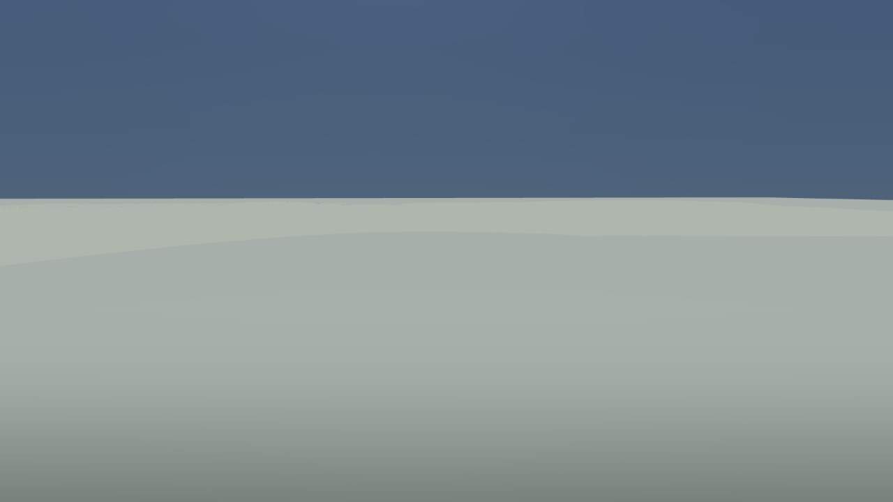

The first leg of THE CROSSING — the hour-long walk from Stormhold to Lilmoth that every pacing
number in this project is denominated in — spent about 4.2 minutes of the hour walking along the
floor of a lake.

The critic on W1-01 sampled water depth at every point of all ten road legs, at both tide phases,
which nobody had done before. At low tide, 1,364 m of the 25,221 m trunk network sits above knee
depth and 574 m above chest depth, almost all of it on one leg: Stormhold–Helstrom carries 538 m
over the knee and 502 m over the chest, and at its worst the road is 65.64 m below the water. The
player walks it in state `WALK` at 2.0 m/s, 620 of 620 health, stamina untouched. The water is
inert — no swim, no wading band, no breath clock — which the builder declared honestly as another
piece's unbuilt work rather than faking it.

:::compare Ours on the trunk road in The Stone Forest, ground at 69.66 m under a water surface at
135.30 m; and ours on the Lilmoth–Archon tideway, the one leg meant to sit at the waterline. The
Morrowind reference we judged these against — REF-A11, a Bitter Coast boardwalk on driven pilings,
where the route is carried *over* standing water rather than under it — is not reproduced here: it is
held for internal comparison and critique only and may not be redistributed, which publishing it to
this site would be.

:::

The first image is not underexposed. That is the entire frame: sixty-five metres of water between
the camera and the sky, with the top of the character's head a slightly darker smudge at the bottom.

The verdict's diagnosis was routing. Roads are laid by `A*` — a shortest-path search that crosses a
grid of cells always taking the cheapest one next — and it priced slope but not depth, so the flat
bed of a flooded gorge looked like ideal road-building country.

Half right, and the other half is better. The natural ground at the deepest point is 154.01 m, and
dry. The road's own elevation profile there was 69.17 m: an 85 m cutting, which the terrain builder
obediently blends the surrounding hill down into, and which then filled from a water plane standing
at 135.30 m. The road dug the hole and the hole filled. The old solve had a 12% grade cap and no
limit on cut or fill — how much earth a road may dig out or heap up — so every hill it could not
climb was sliced off at road level and every gorge it could not descend was crossed on 88 m of
piled earth.

Which is why the obvious remedy would have done nothing. The verdict proposed making any cell deeper
than 0.60 m impassable to trunk routing; at that cell the router would have found dry ground 154 m
up and gone straight through, as before. The routing fault was real and separate — water was priced
with a 3 m depth ceiling, so an 18 m tarn and a 0.3 m puddle cost the same — but on its own it was
not the thing.

Both are fixed, and the fix is an ordering: clearance above the highest water of the tide cycle
first, then cut and fill limits, then grade last, on the grounds that a steep road is still a road
and a drowned one is not. The first attempt still left 67 m knee-deep, because it sampled only at
the road points and a 3 m sliver of a tarn fits between two points 12 m apart. It cleared the water
it was asked about and dived into the water it was not.

`reports/road-water.json` now reports zero offending metres at all four tide phases. The only wet
trunk road left is the Lilmoth–Archon tideway, 0.98 m at low water and 1.46 m at high, where being
wet is the point. Stormhold–Helstrom carries 1,526 m of raised deck, and the crossing re-measures at
55.4 minutes, inside its 52–65 band.

The verdict still stands at 3.1 out of 10, and will until a fresh critic re-runs it.
