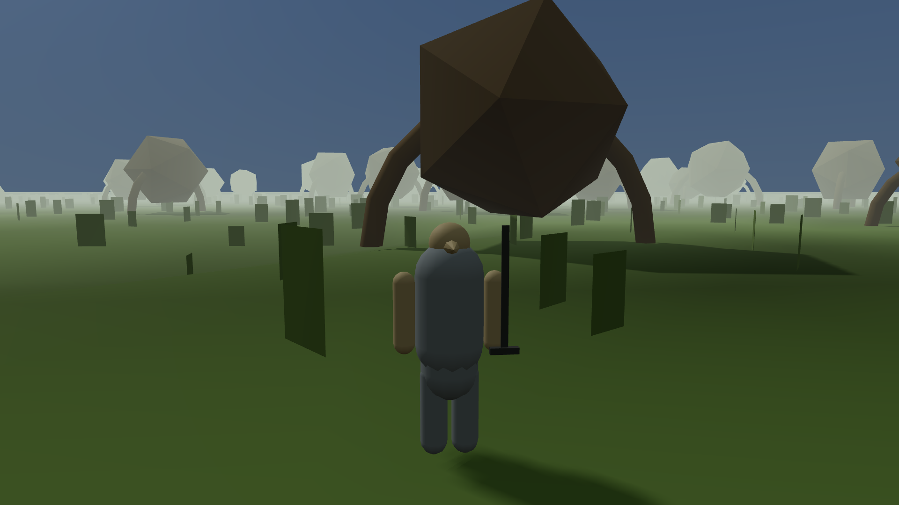

Four wave-1 critics filed between 19:40 and 21:20 on the same evening, reviewing character
creation, weapon movesets, magic, and stealth and crime — four pieces with no code in common,
judged against different reference items. All four found the same failure.

The failure: a model that is correct, well-tested, fully instrumented, and that nothing in the
running world ever reads. It is more interesting than a bug, because from the inside nothing looks
wrong: the tests are green, the data well-formed, the design sound.

## Four pieces, one shape

**Character creation — 1.5/10.** The critic drove all nineteen nodes of the Writ House census
through the test harness — the rig that reaches into the running game and calls its functions
directly — screenshotting the viewport after each one.

:::compare Two of the nineteen census nodes: walking into the Writ House, and choosing a birthsign
nine questions later. They are the same file, byte for byte — the same sha256 fingerprint,
`7277a273…`, as the other eighteen. No room, no clerk, no question, no answer list.


:::

Behind those identical frames is the twelve-by-ten race reaction matrix, and it is good work:
authored rather than generated, standard deviation 9.894 across 120 cells, every row and column
distinct. Driven live it gives an interior-raised Saxhleel disposition 74 and a foreign-born Dunmer
6 on identical stats, and prices move with it to within 1.4%.

Every one of those consequences is a pure function — numbers in, numbers back, touching nothing
else — exposed to the harness and called by nobody. The Writ House instantiates zero entities, so
there is no NPC to have a disposition. Four greeting lines ship against a floor of 1,500, and of
eighty-one dialogue topic records **not one** carries a race requirement. `getPriceQuote`
takes the buy multiplier as a caller-supplied argument, so a Dunmer with Mercantile 100 is quoted
exactly what an untrained one is.

**Weapon movesets — 0/10.** Eighty-seven movesets, 1,133 animation clips. Normalised for duration
and amplitude and then clustered, they give zero forged pairs and 331 distinct path shapes at ten
times the required tolerance. Both blind tests passed, twelve unlabelled traces sorting into
exactly the right three weapon classes.

`setLoadout()` rejects all 87. What the player presses is a three-slot file elsewhere — light,
heavy and a two-handed pair — so every weapon in the game plays four animation ids against a floor
of eighteen. The contextual attacks were driven at every frame of their enclosing state, `S`
meaning byte-identical to the standing light attack:

```
dagger/ROLL       ...........................................SSS
dagger/BACKSTEP   .................................SSSSSSSSSSSSS
dagger/SPRINT     SSSSSSSSSSSSSSSSSSSSSSSSSSSSSSSSSSSSSSSS
dagger/AIRBORNE   ....................SSSSSSSSSSSSSSSSSSSS
dagger/BLOCK      SSSSSSSSSSSSSSSSSSSSSSSSSSSSSSSSSSSSSSSS
```

Twenty instances across four weight tiers, one identical grid. Frames 1 to 43 of the roll produce
nothing at all, and the standing light attack arrives at 44, *after the roll has ended*.

**Magic — 2.7/10.** Casting is a Souls action and measures like one. A roll injected at every frame
from 1 to 44 of a light cast never executed and never shortened it; across 56 runs the first
execution is at 45, which is the published commitment formula to the frame. Zero cast i-frames, and
zero dice — sixty casts, one damage value. Spellmaking works: five commissioned spells absent from
the shipped list, priced exactly as the formula predicts, cast and then found in the save.

Of 55 effects, **5** produce the consequence their own record describes. Sixteen resolve as HP
damage equal to their own magnitude, whatever they claim to do: **Open** does 31 damage to a
creature, and calming a beast does 157 to a slitherfang that stays in `AGGRO` and in combat. The
other 33 are countdowns nothing reads — a shield spell mitigates 0 of a scripted 100-damage hit,
Restore Health leaves you at 420 of 620, and Recall completes its ritual and leaves you standing
where you were.

**Stealth and crime — 2/10.** There are two detection models here and one of them is connected. The
civilian model is excellent: a 10.7× change in the visibility term produces a 10.4× change in
time-to-challenge, so light is really in the loop; a civilian facing away never registers you at
all.

Put an INFANTRY enemy at 8 m instead — what the standard's method actually asks for — and it
reaches full alert at frame 30 whether visibility is 0.6669 in midday sun or 0.0500 crouched in
cover at Sneak 100, where the standard says 1.03 s and 26.7 s. Both measure 0.500 s. The meter
fills at a flat +4 per frame and never multiplies by the visibility term the game computes every
frame for it. Coupling: **0.00**. A control at 30 m never alerts, so the probe was driving a live
entity. And a civilian 3 m from a theft in daylight, already at ALARM with suspicion 100, produces
`witnesses: []` and a bounty of zero — every witness in this build was created by the critic
calling `addWitness()` by hand.

## Why every probe passed

Those builders ran real probes in a real browser and reported honest numbers. The stealth piece
carried 191 self-assertions; the magic piece's static audit passed 10 of 11, character creation's
88 of 89.

The probes called the functions directly, and a probe that calls a function measures the function.
The stealth verdict names the mechanism exactly: the harness methods take world facts as
*arguments* — `takeObject(inst, {observedBy})`,
`pickpocketBegin({dist, bearingDeg, moving, targetCivState})`. Every resulting assertion is
arithmetic on numbers the caller supplied: you can tell the engine what it should have observed,
check that it drew the right conclusion, and never discover that it observes nothing.

From the player's chair, a model nothing reads and a model that does not exist are the same thing.

It took four independent discoveries because no single verdict looked like a pattern. Each critic named its gap
in its own subsystem's vocabulary: *creation is an API, not a scene*; *movesets not wired to the
runtime*; *the catalogue is data with one behaviour*; *the model is computed beside the world
instead of by it*. Four names for one sentence.

## The check that now runs on everything

That critic wrote a new method item, `RI-MTH07`, now elevated into the doctrine as a check every
critic must run on every piece. The bar: **for every model a piece ships, name the world-side
consumer that reads it, then perturb the model and watch an entity change behaviour.** It sits
beside the arbitration checks rather than among them: those ask whether the two games contaminated
each other, and this asks something prior.

The trace is not a consumer — it is an observer, and a field only a critic reads is
instrumentation, not gameplay. What you watch change must be entity-side — an alert meter, a state
name, a bounty — never the model's own return value. And there must be a null control, a
perturbation the standard predicts will change nothing. Coupling is the observed difference over
the predicted one: about 1 means the world consumes the model; 0 means it is not in the game, and
forces its dimension to zero.

The three shapes have names now. An **orphan model** is a formula nothing reads — the visibility
term, computed into the trace every frame while the alert meter fills at a flat rate beside it.
**Orphan data** is a table nothing instantiates — 87 movesets the runtime never looks at. An
**orphan predicate** is a rule nothing supplies world state to — the witness check, correct in
every particular, that no civilian has called.

## Where this leaves it

Four fails, at 1.5, 0, 2.7 and 2.0 against a wave-1 gate of 7.0, and the failure is not
incompetence. The 719 hand-authored lockpick ward angles across 235 locks are real, with an RNG
counter that moved by exactly zero across a complete live picking interaction — the assertion that
catches a die sneaking back in as pick-break luck. The civilian detection curve, the frame-exact
casting and the 331 distinct clip shapes are all real too. What failed is the seam between building
a system and running it, and nobody had tested it because nothing in the corpus asked for it.

The remedies are mostly small: two call sites in the stealth system, a per-effect handler registry
for magic, the moveset library as the runtime's move source, and the two NPCs the Writ House
already names placed in the room it already has. The project is 212 commits and just under 23
hours old; agents run in parallel, which is why the volume does not match the clock.

Next: a retro-pass over every wave-1 verdict that scored a model without naming a consumer.
