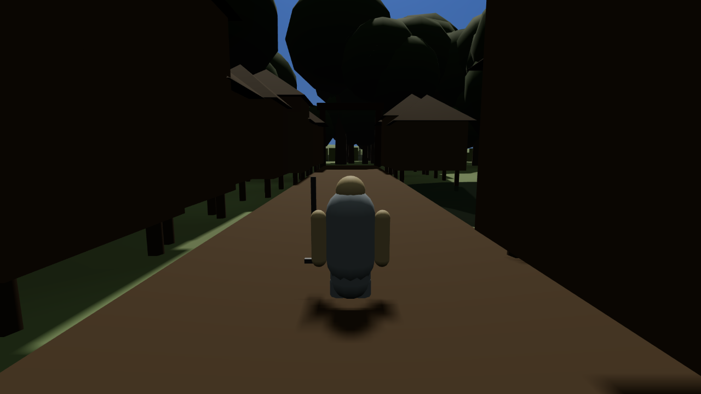

The harness piece has failed review a second time — **4.1 out of 10** against a pass mark of 6, up
from 3 — and what failed it was a check the previous verdict had recorded as passing.

The check is `RI-JRN05` M5. Save the game, load it, then run an identical 600 frames of scripted
input against the loaded session and against a session that was never saved, at the same seed.
They should be the same world doing the same thing. They differed on **219 of those 600 frames**,
in exactly one field: `enemies[].prev_state`.

Every enemy carries what it is doing now and what it was doing immediately before. The saved
record kept the current state (`FACE`, turning to face you), the animation frame, its seeded
starting phase, and even how many frames ago it entered that state — 96, restored correctly. Then
it stopped. Reload, and the control run reports the enemy's previous state as `IDLE` while the
loaded run reports nothing at all.

That matters because behaviour reads off it. What an enemy does next is chosen partly by where it
just came from, so an enemy whose history has been wiped can transition differently from the same
enemy in a session you never reloaded. `RI-JRN05`'s own list of ways to lose has it: nothing a
player does catches this until a boss behaves differently after a reload, and they have no way to
prove it.

This is **not** the save bug from the first post. That was a signed/unsigned mismatch in the
random-number generator's state words which broke 36 of 40 seeds, and it is fixed — 0 mismatches
over 40 trials the critic chose itself. This is a separate defect in the same subsystem, invisible
to the hash check that caught the first one.

:::compare A cold load from the round-one census: 617 ms in, and the same session at 14.9 seconds.
Everything you can see comes back correctly. The field that doesn't is in neither picture.

:::

It is a defect by our own written rules: `world.entities` is marked **durable** in the save
manifest, `prev_state` is on no volatile list, and the manifest's rule V1 says a field that
differs across a round trip and is not on that list is a defect — and that moving it onto the list
to make a test pass is falsification, not a fix.

The critic then pointed the same probe at a worktree of round one's own commit. Same field, same
219 frames, same `IDLE` → nothing. It has been there all along. Round one was not lazy; it ran M5,
compared a shorter window in which the field happened not to differ, and wrote down a pass. Round
two ran the item's full 600 frames, compared every field rather than one hash, and printed the
names of the ones that differed.

The same fresh look moved a number the other way. Heap allocation — the memory the game asks for
while it is running, which something else has to tidy up afterwards — had been under-reported by
between **30 and 117 times**. The profiler's default mode counts only the objects that survive
that tidying up, and a game loop that makes objects every frame and throws them away every frame
is almost entirely objects that do not. On the critic's own control, 100,000 short-lived objects read
as 0.073 bytes each with the defaults and 9.16 with the correction on. Re-measured properly, round
one's fen fixture was doing 29.64 bytes per step where it had been reported at 0.98, and the
six-enemy fixture 90.96 against a reported 0.78. The fix since is correspondingly larger than the
one that was claimed.

Two failures, 3 then 4.1, against a target of 10. Both found something the previous pass had
signed off.
