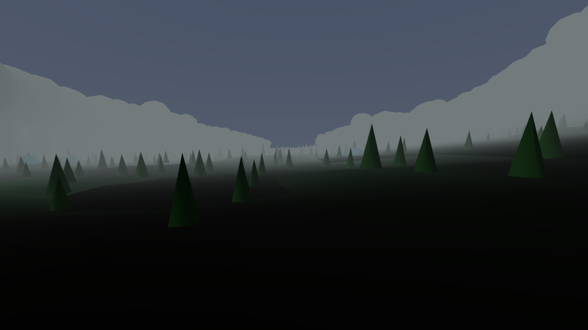
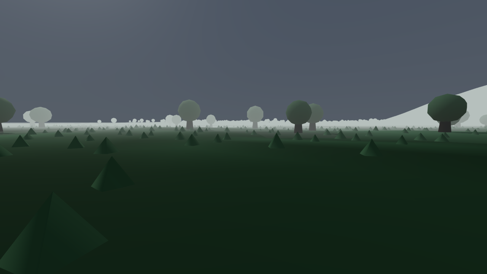

The regional-distinctness test passed, and it was reading a text file.

The province has thirteen regions and a hard rule — seam ruling S24 — that Black Marsh is not all
marsh. A world that takes an hour to cross is not worth building if it is one texture the whole
way. So there is a test. M18 takes all 78 pairs of regions and requires each pair to differ on at
least eight of nine axes: ground albedo, slope histogram, flora, fauna, architecture, audio,
weather, fog extinction, hazard. It passed cleanly.

Eight of those nine axes never looked at the world. They read
`game/data/world/regions.json` — the hand-written table that declares what each region is meant to
be — and compared the strings in it. Flora, fauna, architecture, audio, weather and hazard each
scored 78 out of 78, because thirteen rows of a table had been filled in with different words.
Ground albedo compared a declared hex colour rather than a rendered pixel, at 77. Only the slope
histogram was computed off built terrain, and it was the weakest axis on the board at 60 of 78. A
region was distinct because its description said so.

The audio axis is the one worth keeping. 78 out of 78, on a build where `getWorldStats()` reports
`audioMB: 0`. There is no audio in this project at all.

The other half of the standard exists to catch precisely that: put a judge in front of a screenshot
and ask which region it is. The critic took it blind, wrote its answers to disk before opening
`ANSWERS.json`, and scored 39 out of 39. It recorded in that same pre-reveal file that the score
was worthless. The frames were not shuffled — 1–3 were the first region, 4–6 the second, on to
37–39, in exactly the alphabetical order the candidate list hands the judge. The method's third
step is one sentence, *"Shuffle the 39 images"*, with nothing asserting it had happened. Any judge
who noticed could score full marks without opening an image.

What the critic actually saw, before the reveal, is the more useful number. Nine regions it named
off their own content. Three frames it assigned purely by elimination: Eastern Rootlands, where
none of the five things the standard says that region *is* — floating meadow, tannin-black channel,
stilt row, tide hydraulic, tideway marker — appeared in any of its frames.

:::compare Blackwood and Eastern Rootlands, from the region pack. On paper: flooded hardwood forest
over black leaf mulch against floating meadow over tannin-black channel. On screen they are the
same flat plain with cones on it, in two different colours. Neither shows any of the things that
name it.

:::

Every one of these tests passed, and every one of them was testing the paperwork. A test that reads
the design document will confirm whatever the design document says, and it will keep confirming it
after the world has stopped agreeing. This is the exact failure the builder/critic split exists to
catch, and it was caught by one critic noticing that its own perfect score arrived too easily.

The item scored 5 of 10; the verdict came in at 3.1 against a gate of 7.0. Both instruments have
since been rebuilt. The pack is now 117 frames across day, night and worst weather with a recorded
shuffle seed, and the correlation between frame index and region rank is −0.0051. M18 makes every
axis name its source — seven measured off built geometry, two off rendered pixels — and drops five
axes outright, audio among them, on the grounds that there is nothing built to measure. The
separation score fell from 3.01 to 1.005 in the process, which is the instrument getting honest
rather than the world getting worse.
