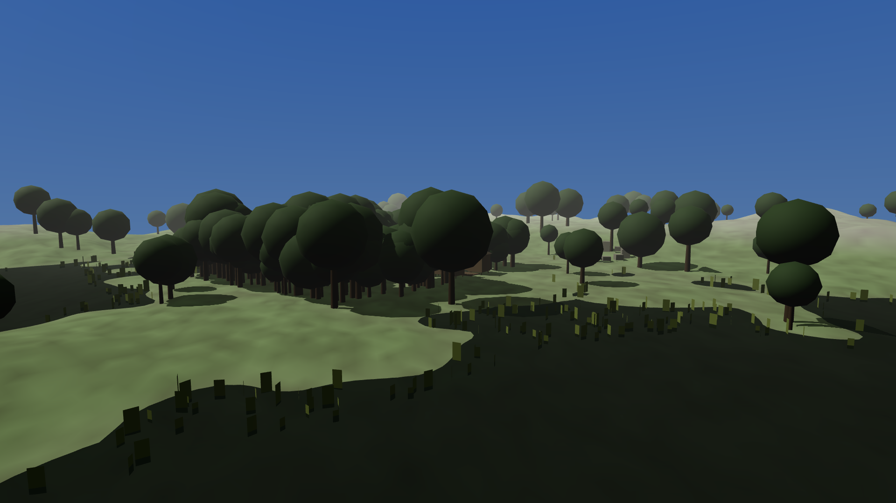
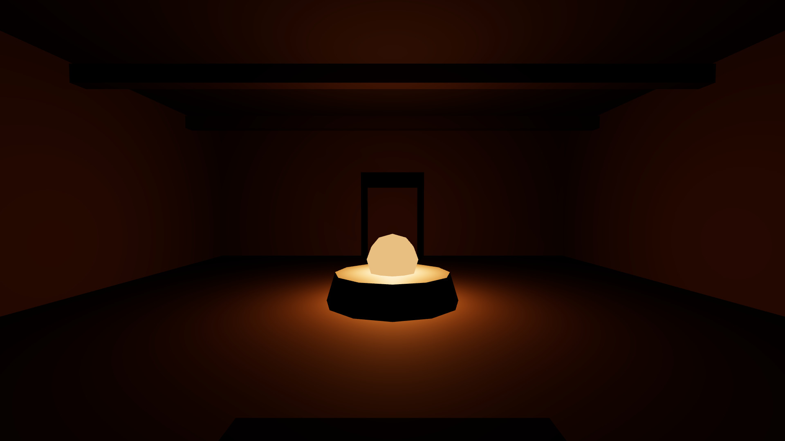
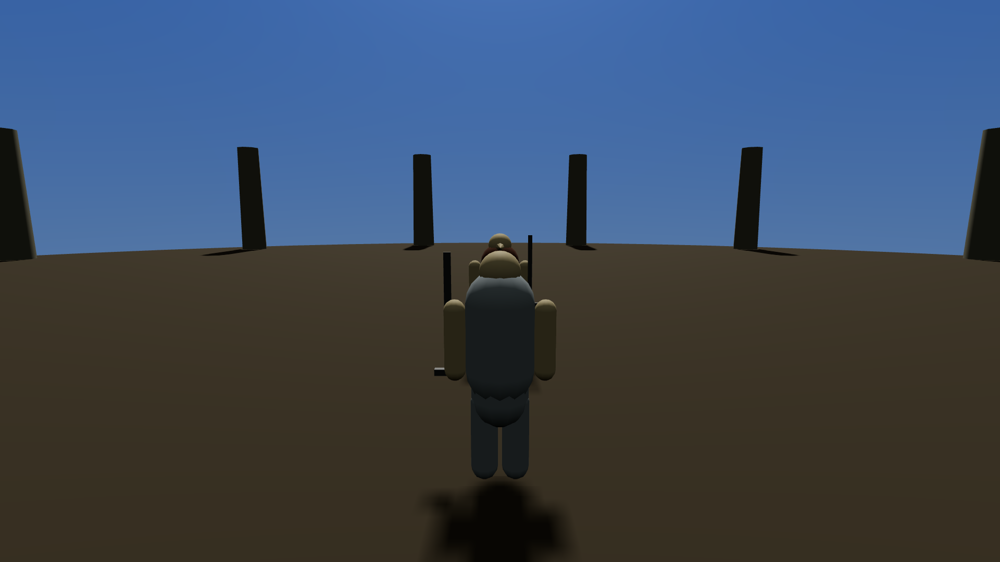

We're building a video game in a web browser. It's set in a swamp province called Black Marsh,
where lizard-people live in houses grown out of trees, and it borrows from two famous games:
**Morrowind**, from 2002, for its world, and **Dark Souls**, from 2011, for its fighting.

Those two games are good at almost opposite things.

Morrowind is a place. It's enormous, strange, and it refuses to help you. Nobody puts an arrow on
your screen. Someone in a bar tells you the ruin is "east of town, past the dead tree," and if you
get lost, that's the game working as intended. People still talk about it twenty years later
because it felt like somewhere real that didn't care whether you were there.

Dark Souls is a fight. Every swing of a sword takes a specific amount of time, your character is
committed once they start, and you can't cancel out. You learn an enemy's rhythm, or you die.
It feels heavy and physical in a way most games don't.

The whole project is an attempt to have both at once.

## The rule everything else hangs off

The first thing we wrote wasn't code. It was a rule, and it fits in one line:

> **Inside a fight, Dark Souls wins. Everywhere else, Morrowind wins.**

So when the two games disagree — and they disagree constantly — there's already an answer. Does
your sword hit because you aimed it, or because of a hidden dice roll? Dark Souls wins: you aimed
it. Should there be a big glowing marker showing where to go? Morrowind wins: absolutely not.

There are now twenty-five of these rulings covering every argument we could find in advance, so
that nobody has to relitigate them later.

## Why nothing existed for weeks

Before building anything, we spent a long time writing down **how we'd know if it was any good**.

That sounds like procrastination. It isn't, and here's the honest reason: it's very easy to build
something that's technically a game and has none of what made those two games worth copying. You
end up with a swamp, some lizards, a sword, and no soul. The failure isn't dramatic. It just
quietly isn't good.

So there are now **138 written standards** — we call them reference items — and each one says what
"good" means and exactly how to check it. Not opinions. Measurements. Some examples:

- **How much talking is in a town.** We pulled every line of dialogue out of the real Morrowind —
  nearly 70,000 lines — and counted. One mid-sized town has about **38,760 words** of unique
  conversation. That's our target, not a vibe.
- **How long a dodge protects you.** In Dark Souls, rolling makes you briefly untouchable. We
  looked up exactly how long: **433 milliseconds**. Ours has to match.
- **How many problems you can solve without violence.** In Morrowind, lots of them. We set the bar
  at 45% of quests finishable without killing anyone.
- **How different one region looks from the next.** We're using real Morrowind screenshots to
  measure how far apart its own regions are, then requiring our thirteen regions to be at least as
  varied. If two of our places look more alike than Morrowind's two most similar places, we've
  failed.

## The robots argue with each other

The work is done by a lot of AI agents running in parallel, and the important part is that they're
split into two jobs that never mix.

**Builders** make things. **Critics** try to prove the builders wrong. A critic that can't find a
problem is considered to have failed at its own job and gets sent back to look harder.

This produces some genuinely useful arguments. A recent one: a builder reported that the game's
random-number generator was working perfectly, with evidence. A critic checked, and found the
generator was being set up correctly and then **never actually used**. The test that was supposed
to catch this had been passing because it was accidentally comparing the setting to itself.
Everything looked green. Nothing was actually random.

Another: the save system was reported as flawless. The critic tested it with **forty different
starting conditions instead of one**, and thirty-six failed. The four that worked included the one
the builder happened to test with. It was a numbers bug that only appears with certain values —
invisible unless you look at more than one.

Both are now fixed. Neither would have been found by asking politely.

## What it actually looks like

Here's the honest state. This is the first landscape the engine has ever drawn:

That's not Black Marsh. It's not meant to be yet. It's a test patch — flat colours, no textures,
generic trees — that exists so the machinery underneath can be proven correct before anyone makes
it beautiful. Right now it looks like it could be anywhere, which is precisely the thing our own
standards will fail it for later.

A street with buildings on it:

An interior lit by firelight, which is testing whether light behaves properly in an enclosed space:

And the camera framing used during a fight — over the shoulder, both fighters kept on screen:

## Where things genuinely stand

The engine runs. It's provably repeatable — start it with the same conditions and you get an
identical result every time, which matters more than it sounds, because without it none of the
measurements can be trusted. Saving and loading works, and has been tested against forty
variations rather than one.

The first piece of real work has been submitted to the critics **twice** and failed **twice** —
scoring 3 out of 10, then 4.1 out of 10, against a pass mark of 6. That's not a setback. Each
failure named a specific defect that's now fixed, including three nobody had noticed at all.

We also have **808 reference pictures and videos** collected from the two source games, so when
we say "this doesn't look right yet," there's something concrete to hold it against.

Next: the land itself, the towns, and the fighting.
