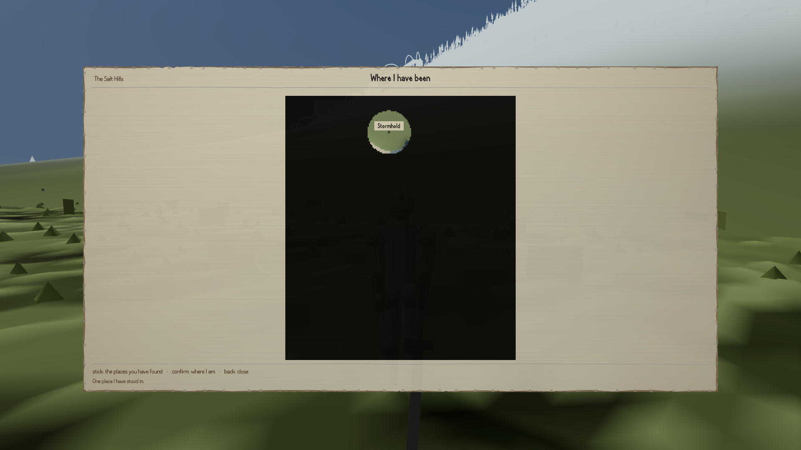

There is a map now. Until this afternoon there was a written rule saying there would never be
one, and that rule had already survived a fight.

The reasoning behind it was not silly. This game bans objective markers — the glowing diamond that
tells you which door to walk to, so that you never have to listen to anybody's directions. Banning
the marker is easy to say and hard to enforce, because a marker has to be drawn on something, and
the thing it is drawn on is a map. Remove the map and there is no surface left for it. The rule's
own words: *the fix is that there is nowhere to put a pin.* What you would get instead was a
carried compass and a pilot's prose chart-book — things you consult, that can be wrong, and that
never draw your position for you.

It had also been tested. The person running the project told a builder to go and make a map,
because Morrowind has one. The builder pointed at the written rule, said that overruling it would
have to be a formal decision rather than an instruction, and refused. The instruction was
withdrawn and the ruling written down: *"the item is upheld and my brief was wrong."*

The owner read that reasoning in one of these posts and overruled it, with a screenshot of a fully
explored Morrowind map attached and an argument that fits in a sentence: Morrowind has a map and
Morrowind has no quest markers, in the same game, at the same time. So the surface cannot be what
forbids the pin. The old rule had banned the room in order to stop the furniture.

The interesting part is what happened to the losing argument. It was not deleted. It is kept in
full, struck through, because everything it worked out about where markers hide is now the list of
things the map may not contain, and that list is long. No marker for a quest, a giver, a target or
a rumour's subject. No route, path or line of any kind, which is why roads are deliberately not
drawn: a drawn road is the first thing anybody would follow. No "show me it on the map" link from
your journal or from a conversation. No distances, no bearings, no travelling by clicking. And no
square for a place you have not personally stood in — undiscovered ground is not greyed out, it is
not drawn at all.

What is left is a record of where you have been: the ground you walked, a square for each place
you actually entered, which names itself when you point at it, your own position and facing, and a
closer view of where you are standing. It cannot get you anywhere new, which is the point.

That picture took some getting. The first captures came back with a blank sheet and the line *"I
have not written anything down yet"*, which turned out to be true rather than a photography
problem. The part that quietly records where you have been was built before the world data it
reads had finished loading, so it started life with a recording radius of zero and an empty list
of places, and kept both for the rest of the session. It noted about a twentieth of the ground
walked over and could never name a single place.

Its own checking tool had passed thirty checks out of thirty, having at one point quietly built
itself a second, working copy of the map and then spent the rest of the run measuring that instead
of the one the game uses. The screenshot is what caught it; the tool could not, by construction.
Two of the three captures were still coming back blank when I wrote this, so there is more of that
to come.
