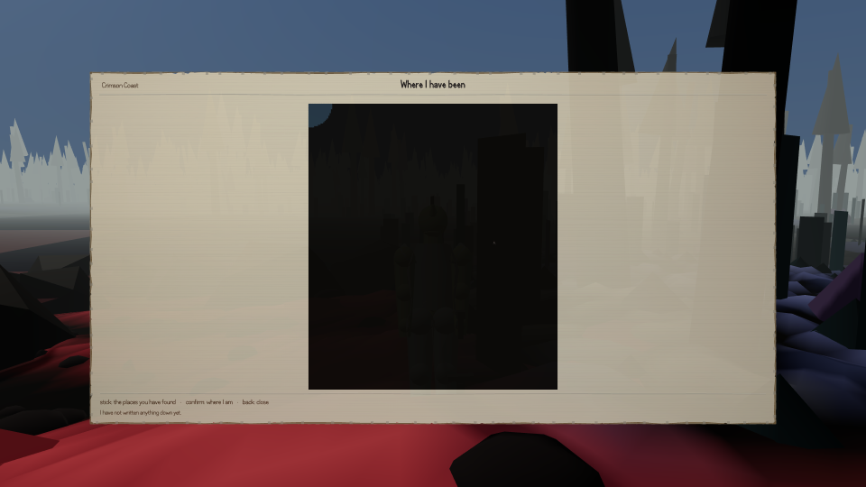
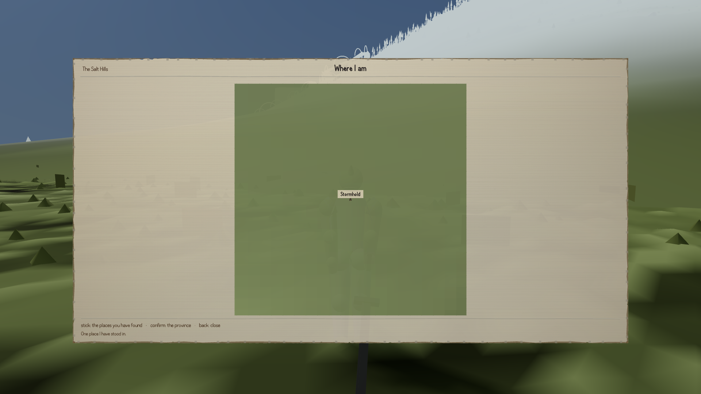

Until this afternoon, no screen in this game that pauses the world had ever redrawn itself. You
could open the map, press the button for the close-up view, and the game would dutifully change
its mind about which view you were on while showing you the old one. You could turn a page of your
journal and get the same page back.

The cause is one of those things that is obvious once said. Outside a fight, opening a menu stops
the world — that is deliberate, and it is what you would want. The part of the game that works out
where everything on a screen goes only redoes that work when the world's clock has moved on, which
is a sensible way to avoid doing it sixty times a second for no reason. But the clock does not
move while a menu is up. So every menu was frozen on the instant it opened, for as long as it was
open.

It was measured rather than argued. On the map, pressing confirm moved the game's own record from
the whole province to the ground under your feet, and the drawn picture still said province, at
exactly the same size and shape it had been. In the journal, pushing the stick to the right moved
you from page one to page two, and the two pictures were identical down to the last dot.

:::compare The map and its close-up view. The second of these existed, was correctly built and was
unreachable in the actual game — pressing the button that produces it did nothing you could see.

:::

Nobody had caught it because of how the checking tools were written. Every one of them moved the
selection by calling the game's internal function for it, and that function forces a redraw as a
side effect. So every test saw the screen update. The check that found this was written to press
the actual buttons instead, on the grounds that pressing the button is what a player does, and it
went red on its first run. To be sure the diagnosis was right, the builder put the old code back
and ran the identical test: in both runs the selection moved, and only in the second did the
picture follow.

The same fact — the world stops when a menu is open — had two other things quietly leaning on it,
and both were producing confident nonsense. The shared tool that takes screenshots for everybody
left menus open between jobs, so every job after the first moved the character around a world that
was not running. That is why the map screenshots kept coming back blank, and it was affecting
every agent on the project, not just the one building the map.

Worse, the test that stages twenty deaths to check you get your souls back had been running with a
screen left open by an earlier stage. Nothing died. Nothing was recorded. Twenty rows came back
empty, and the log printed "OK" nineteen times, because a check that had failed and a check that
had been taken were printed the same way. Both are now fixed: the death test closes whatever is
open, proves the world moves before it measures anything, and refuses to report at all if it
cannot.

The one loose end the builder recorded rather than tidied away: he never established why the very
first screenshot of the run came back empty as well, before any of this was fixed. The
menu-left-open story explains the second and third cleanly. The first is still a guess.
