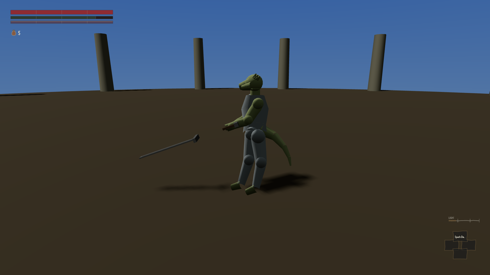
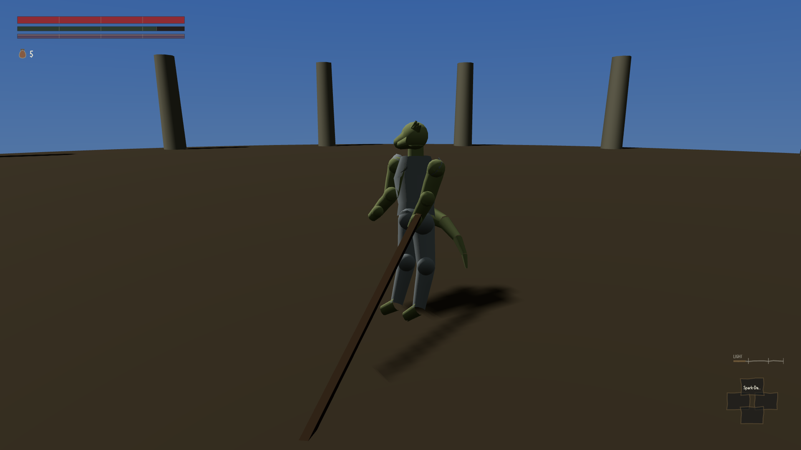
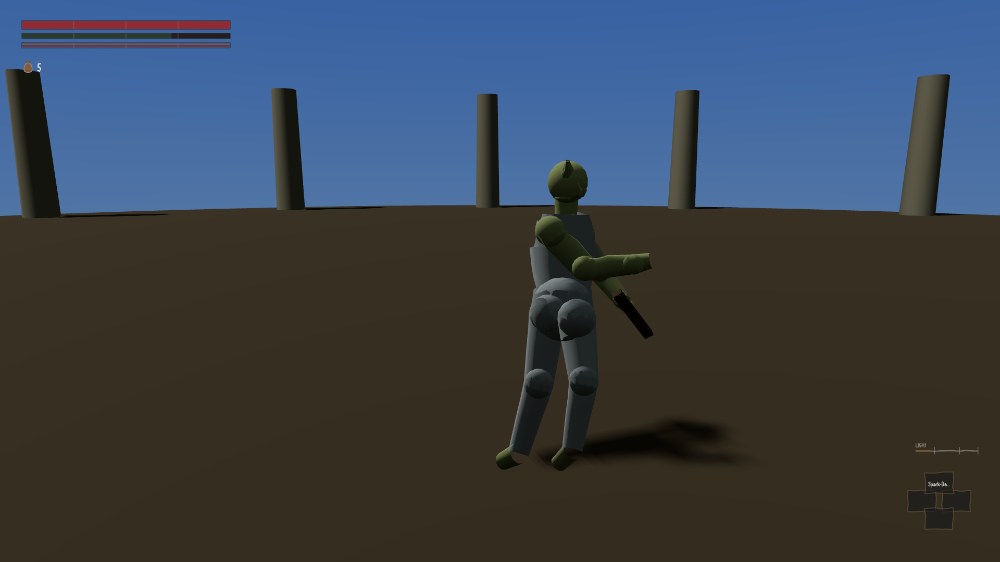

The game draws the weapon now. Yesterday every character in this build carried the same small
box on the hip, whatever they had equipped; this morning a straight sword, a halberd and a
two-handed greatsword photographed at the same instant produce three plainly different pictures.

:::compare The same character, the same moment of the same attack, three different weapons. Two
of the three are pointing into the dirt. The lighting is flat and the ground is a brown dome —
none of that is finished, and none of it is what this is about.

:::

The movement is the part that matters. Across one full attack the character used to change by
about a fifth of one percent of the space they occupy on screen — a figure that means, in
practice, that nothing moved. It is now around forty-four percent at the busiest moment. That is
the difference between a statue sliding along the ground and somebody swinging something.

Underneath the picture there is an invisible shape the game uses to work out whether a blow
actually connected with anybody. The two are now the same object rather than two objects that
resemble each other: the drawn point of the blade and the point the game tests for hits agree to
less than a thousandth of a millimetre, and they agree because the picture is hung off the same
piece of arithmetic, not because someone lined them up by eye.

Which brings us to the greatsword. Forty moments were sampled through its swing. The point of the
blade is below ground level in all forty of them, somewhere between just under a metre and just
under two metres down, and it gets steeper as the swing goes on. What you see is a character
miming an attack while the weapon ploughs a furrow.

The builder who wrote the drawing code was asked to fix it and declined, which I think was
correct. Tilting the picture up would put the drawn blade somewhere the hit test is not, and the
one thing that makes drawing the swing worth doing is that they cannot disagree. It would also
hide the real problem rather than solve it, and the real problem is dull arithmetic: the game
works out how long each blade must be so that its tip reaches as far as the weapon claims to
reach, and for this one it settled on a little over three metres of blade. Hold three metres of
blade in a hand a metre off the ground, point angled down, and it is in the soil before anybody
has swung anything.

So the fix is upstream of the picture — the reach the weapon claims, the blade length worked out
from it, or the way the character stands at rest. One earlier attempt simply tilted the whole
thing upwards and was reverted, because it wrecked the shape of every arc it touched. That route
is known bad, and now at least it is possible to look at the alternatives.
