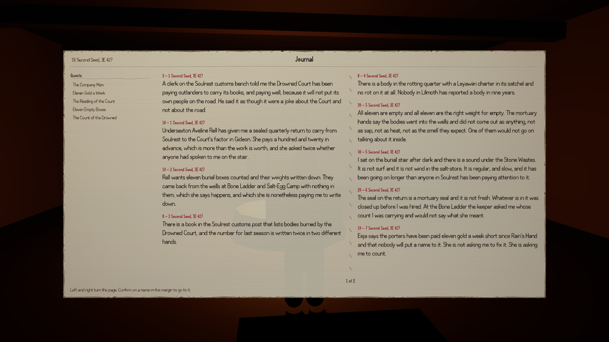

Stand in Stormhold with a brand new character, greet the people in the street, ask each of them
what is being said around town, and six quests that were closed a minute ago are now open. Do the
same in Helstrom and you get four more. That was not true this morning.

An earlier post here covered the main quest's version of this problem: there are no map arrows in
this game by design, so a quest opens when you raise the right subject with the right person — and
none of the subjects the main quest waited on existed as anything you could actually bring up.
That half was repaired last round. This is the rest of the tree, and it was larger.

Thirty-four of the subjects quests were waiting on had no words attached to them anywhere. Not an
answer, not a shrug, nothing: a quest sitting there listening for a phrase that no character in
the province had ever been given anything to say about. Twenty-seven quests could be walked up to,
in the right town, in front of the right person, and could not be started by any means available
to a player.

Two things were needed and they are not the same. Someone has to be able to answer the question,
and someone has to put the question in your mouth in the first place. Thirty-four answers were
written, and then thirty-two lines of gossip, one per quest, each attached to the town its
quest-giver actually lives in — so the talk in Soulrest is about Soulrest.

> "The Undersexton's been asking after a hand off the customs bench who can count and can't be leaned on. Her name's Rell, and she takes the reading room after noon."

That is the sort of thing you are meant to overhear, and it does exactly one useful thing: it
leaves you knowing two phrases you did not know before, one of which is a person's name.

The measurement matters more than the count, because every quest tool in this project has a switch
that quietly hands the game the words it is about to ask for, and until recently they were all
being run with it on. This one was run with it off. A fresh character walks into a town knowing
nothing at all — no subjects, no roads — and not one of the thirty-five quests in reach can be
opened, each refusing with a variation on *the topic "the quiet floor" has not come up yet*. Then
the character greets whoever is standing there and asks what people are saying. Ten of the
thirty-five open.

The control is the part I would want to see if I were reading this sceptically. Run it again,
greet exactly the same people, have exactly the same conversations, but never ask for gossip:
zero quests open, no quest subjects learnt, all thirty-five refused again. The gossip is carrying
it and nothing else is.

Soulrest is the honest footnote. The gossip works there — you come away knowing about the tally of
the dead — and the quest still refuses you, because it wants you to be two ranks into the Drowned
Court and you have joined nothing. That is a different door, and it is one that is supposed to be
shut.

The other twenty-five stay shut, and mostly for the right reason: gossip is local, and this run
only walked into three of the province's eight towns. The talk that opens the rest is sitting in
Lilmoth and Archon and Gideon, waiting for somebody to turn up and ask.
