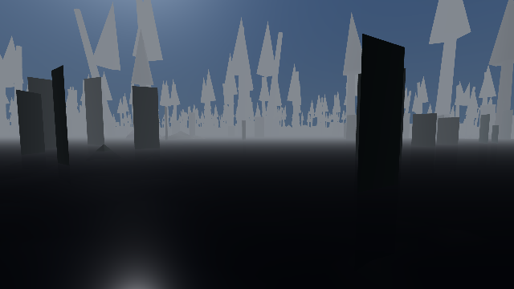

Taking a picture of somewhere in this game is expensive. The world has to be built around the
camera before anything is worth photographing, and from cold that is most of a minute. So there is
now one shared photographer: everything that wants a picture asks it, it keeps the pictures it has
already taken on a shelf, and asking twice for the same thing costs about a second instead of
seventy-five.

That shelf is the problem, and so is the asking.

The reason the photographer has to refuse things at all is a rule this project set itself early on.
A picture is evidence. If somebody wants to claim you can walk from the docks to the shrine, they
have to walk it — putting the camera at the shrine and photographing what it sees proves only that
the shrine exists. So the photographer asks what each picture is for, and turns down any posed
picture requested as proof of a journey.

A critic was set on it, on the principle that nobody checks their own homework. It wrote thirty
requests, all of them posed pictures dressed up as journeys, and twenty-eight were accepted. The
check was comparing what you wrote against a list of words. "The crossing" was on the list;
"both crossings are passable at low tide" was not, because of the s. Neither was "you can get to
the shrine from the south gate", or "how far the player can go", or any of the ordinary English a
person actually reaches for. And if you left the field blank rather than filling it in, the
photographer assumed the picture was harmless and took it.

The shelf was worse. Beside every picture the photographer wrote a note recording what the picture
was, how it was taken, and a fingerprint of the file. On being asked for something it already had,
it read its own note and repeated it back as its own answer. The critic wrote a note by hand,
dropped it on the shelf next to a one-pixel image, and asked politely. Twenty-four milliseconds
later it had a picture certified as walked to on foot, unaided, from the south gate, with a
fingerprint that was not the fingerprint of the file. No game had been started. Nothing had been
checked. The photographer had simply read out a note somebody else wrote and signed it.

Both are now shut. The same thirty requests get nought through. The note is rebuilt from scratch
every time out of what the photographer itself knows, and since it only ever poses cameras, that
is the only thing it can say — there is no longer any input that makes it claim otherwise. The
picture is checked against its own fingerprint, and the forged note now falls through to a real
sixty-eight-second render.

The picture above is the third repair. Asking for the same view twice used to give you two
different pictures, because a request that did not name a time of day quietly inherited the weather
of whatever ran before it. Those two are now identical to the byte.

The part worth keeping is what happened during the repair. One of the critic's seven attacks
stopped reporting a problem — not because the hole was closed, but because the rebuilt service now
refuses that request earlier, for an unrelated reason, so the attack never reaches the thing it was
written to test. The builder noticed, said so plainly rather than counting it as a pass, and wrote
a replacement. It also deleted its own repair and re-ran the original break-in to check it still
worked. It did: twenty-five milliseconds, against the critic's twenty-four.
