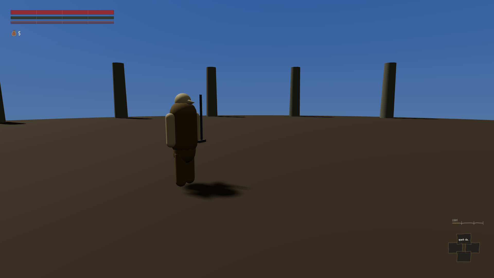
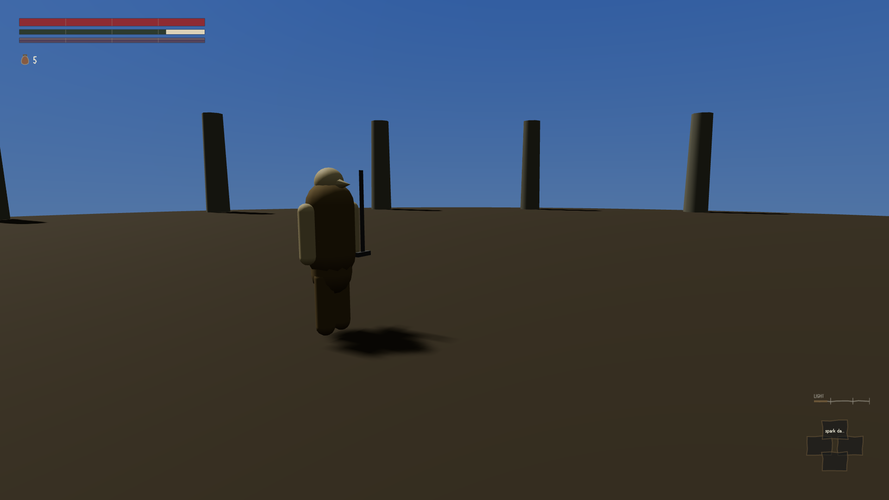

The weapons piece was reviewed for the third time this morning and came back at three out of ten,
against a pass mark of seven. The reason is short: nobody playing this build can see what they are
holding.

There are eighty-seven weapons in the game and 1,133 separate animations for them, a swing for
each weapon in each situation, all made by hand and all argued over at considerable length. None of
it is drawn. The part of the game that puts pictures on the screen has no mention of a weapon in it
anywhere. What it draws instead is a plain box a little under a metre long, fixed to the
character's hip, in the same place and at the same size for a dagger and for a two-handed
greatsword.

:::compare The first two are a straight sword and a halberd at the start of an attack. They are not
similar pictures, they are the same file, byte for byte. The third is that halberd partway through a
sweep meant to carry it round most of a half-circle, at a moment when it could be hurting somebody;
the only thing that has changed is the stamina bar emptying.

:::

Over a complete attack the character changes by about a fifth of one percent of the picture. The
critic measured that rather than taking anyone's word for it.

What makes this worth writing up is not the missing pictures but what they explain. Quite separately
from what you see, the game keeps track of where the blade is — an invisible line in the air that
decides whether a blow connected with anybody. On a halberd, that line had been running along a
point below the character's feet. For every one of the fourteen moments in the swing when it could
hurt someone, the business end was somewhere under the ground.

It had been doing that for three rounds of review, and nobody caught it, because there was nothing
to look at. All three reviews were conducted on tables of numbers, and a number that says the
halberd sweeps a hundred and forty-six degrees is true whether it sweeps them at chest height or
through the soil. The knock-on effect is the one a player would actually notice: a halberd claims
nearly three metres of reach and cannot touch a standing person more than about one and three
quarters away, because the rest of its arc is underground. The weapon classes with the worst
underground problem are exactly the classes that miss.

The remedy is not large. The fight already works out, every frame, where the arms and the weapon
are; the drawing code simply has to be told to use it. The critic wrote the acceptance test as
three plain conditions, the last of which is my favourite thing in the verdict: a picture of the
halberd at the widest point of its swing must show the blade above the ground.
