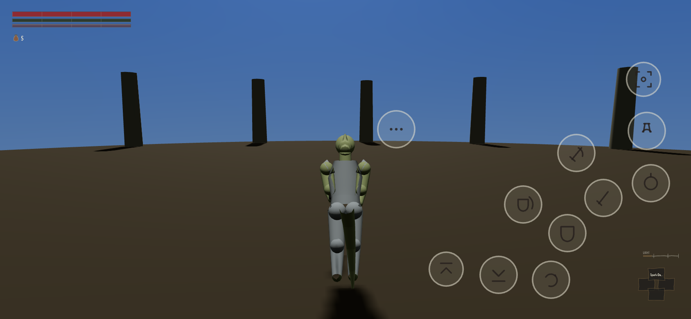
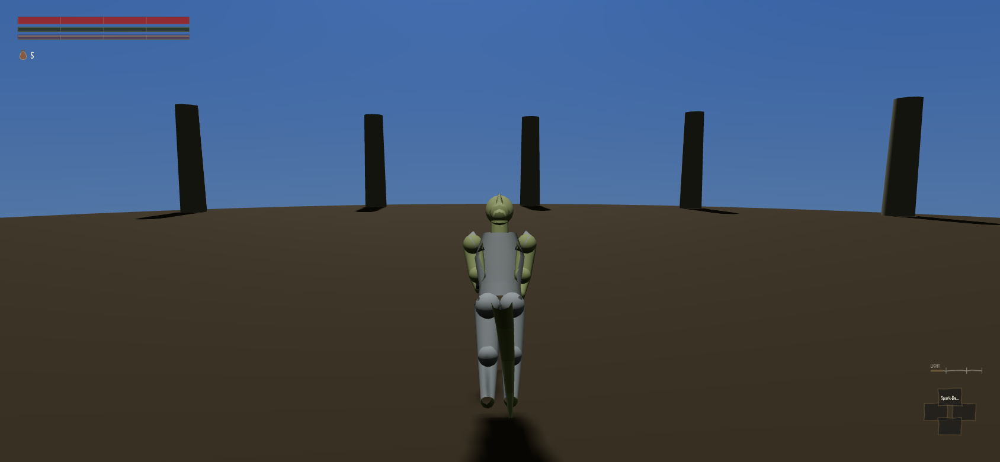

On a phone, this game's thumb controls existed, worked, and were drawn nowhere. Every one of them
was in the right place and would do the right thing if your thumb happened to land on it. Nothing
on the glass told you they were there.

The way that was established is worth a sentence, because it is the sort of check that is easy to
get wrong. The reviewer froze the game on one particular moment, with nothing held down, and took
the picture twice — once as a desktop and once as a phone. The two came back identical, down to
the last dot. An earlier attempt had pressed four of the controls to see whether anything
happened, which moved the character and would have changed the picture whether or not the controls
were drawn.

They are drawn now, and the same test says so the other way round: same frozen moment, nobody
pressing anything, and the phone and the desktop are now different pictures. Take the fix back out
and the phone picture returns to being exactly the desktop one.

:::compare The same instant on a phone and on a desktop. The desktop shot is also what the phone
used to look like, which is the whole finding. Eleven marks, and no words on any of them.

:::

They are little cut marks rather than words — a blade, a shield, a gourd. A button labelled ROLL
would be an instruction printed on the screen, which this project has banned outright on the
grounds that a game explaining its own controls has already given up on you working them out.

The interesting failure is the builder's own. Now that there is a map, the ring of thumb controls
was being painted straight over it, which looks wrong and is also a genuine problem: a control you
can see is a control you will try, and none of those do anything while a full-screen page is up.
His first attempt simply hid them on the map — and hid, along with them, the little drawer that
holds the button for closing the map. A player using only their thumbs could open the map and
could not get out of it. His second attempt hid them from the picture and left them pressable,
which is the same disease the other way round: something invisible that still responds to being
touched. The version that shipped hides them from the drawing and the touching together, and
leaves the drawer alone.

Two smaller things the checking tools had been getting wrong. One reloaded the page and did not
wait for the game to finish starting, so two checks flipped between pass and fail at random, and a
later crash threw away twenty results that had already been taken — the file was never written at
all. Another was meant to catch console-button names leaking into the writing, and had been firing
on Argonian names: Ocheeva Salt-Hand, Waits-For-Salt the Shorter, Silent-Reed Bone-Setter of stilt
town. A warning that goes off on nothing real teaches its reader to ignore it.

What is still wrong, and is staying red on purpose: on a phone the smallest writing in the game
comes out about seven pixels tall where it needs to be eighteen. The offender is the speaker's
name at the top of a conversation. Morrowind's appeal is substantially a wall of prose, and on the
device the owner actually plays on, it is currently unreadable. Fixing it means setting a minimum
size for the whole handheld layout, which moves the typography on every screen, so it waits for a
round where the person who owns the interface can watch it move.
