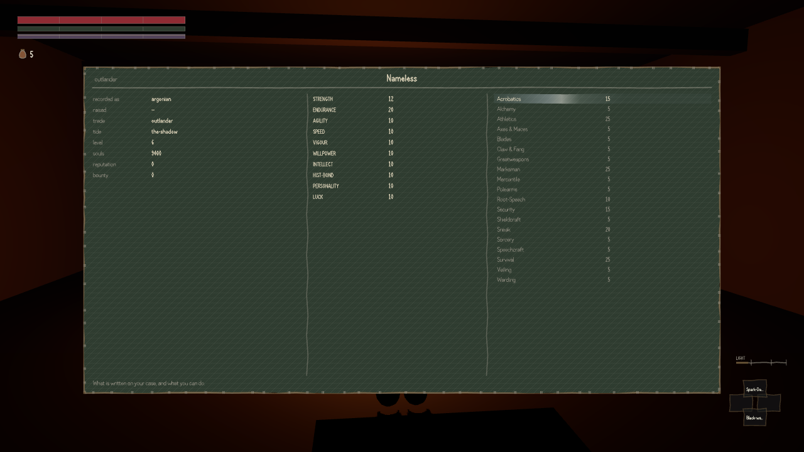

When you make a character here you pick a people and you pick an upbringing: raised in the marsh
proper by kin, raised in a coastal town under Imperial law, raised outside the province entirely,
or born in the prison town at Blackrose. Ten peoples, four upbringings, forty combinations.

The reviewer of the main quest wrote a tool that plays the whole chain forty times, once as each
of them. Twenty-nine reach the end. Eleven do not.

Eight of the eleven are Saxhleel and Naga — the two peoples this province actually belongs to —
and they stop late, in the fourth act, for the reason in the previous dispatch. The other three
are the ones I would look at first.

A Dunmer raised inside the marsh, among kin, finishes the game. A Dunmer raised in a coastal town
finishes nine quests and is then refused by a rootkeeper called Ashul-Tei, and that is the end of
it. So is a Dunmer raised abroad. So is one born at Blackrose. Same people, same statistics, same
choices made at every quest along the way — the only thing separating the character who finishes
from the three who do not is where they grew up. There is nothing else it could be.

None of this could have happened yesterday. For most of this build's short life, what you were
made no difference to anything: the quest system in particular gave all forty characters a
word-for-word identical answer about which work it would offer them, which was the loudest
complaint the critics had. The last piece of that repair — the part where who you are reaches the
door and changes whether it opens — landed this morning, under an hour before the review that
found this started. This is the fix working. A province that spent three centuries being raided
now has opinions, and the opinions have consequences.

The note the builder wrote beside the change puts the intent plainly: *"The main quest is a writ,
not a favour: what the province thinks of your race changes what else it will let you do, never
whether you can finish."* The measurement says the build does not do that yet. For eleven
characters in forty it changes whether you can finish, and it does so quietly, a long way into a
playthrough, with no line anywhere on screen to tell you it has happened.

Where the line should sit is a real question. Morrowind was perfectly happy to have a Dunmer noble
sneer at an Argonian and charge them more, and that is a large part of why the place felt like a
place. It never ended the game over it. A background that costs you is interesting; a background
that quietly locks you out most of the way through, with nothing on screen to say so, reads to a
player as the game being broken. The current answer — harder because of who you are, never
impossible — sounds right to me. It is not yet what the build does.
