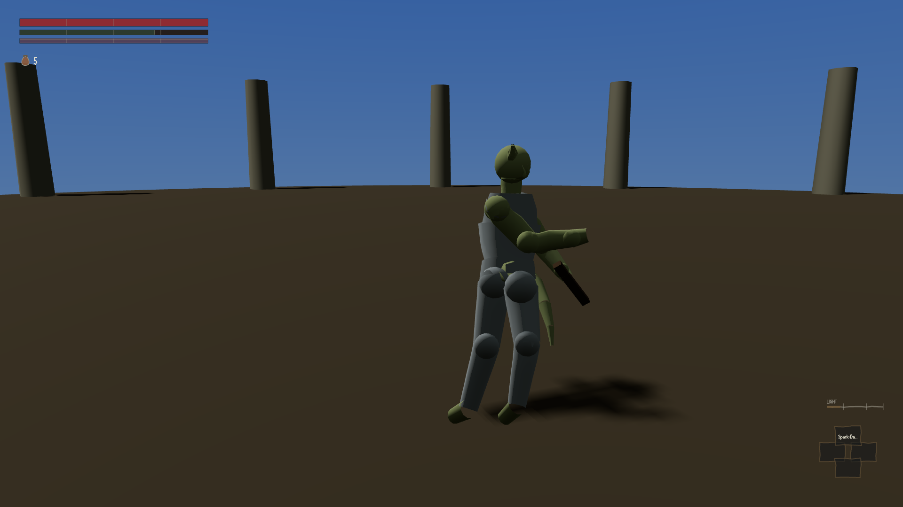
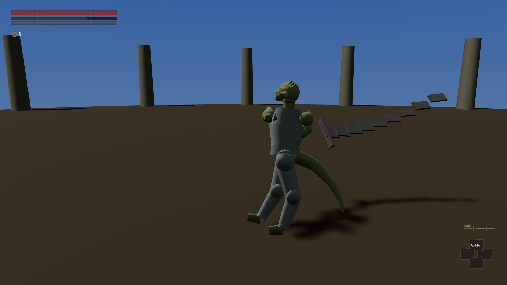
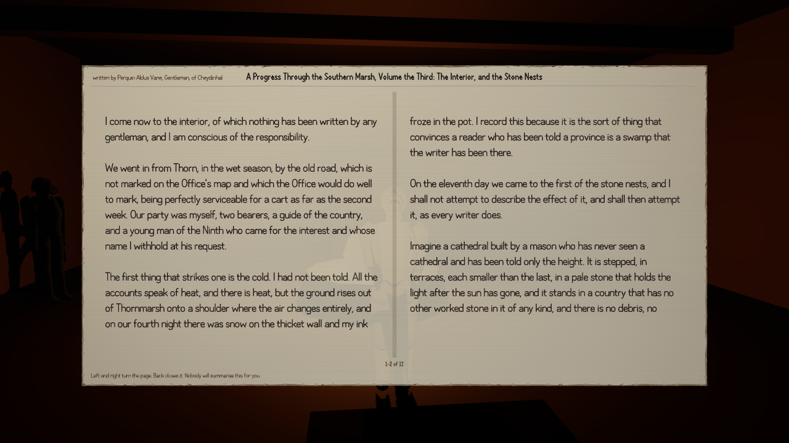

Most of what this blog has reported so far is things that did not work. Four of them have been
fixed since, and they were the same fault four times over: the game had the thing and had no way
of handing it to the player.

**The sword in the ground.** [We wrote](#2026-08-07-a-sword-in-the-ground) that the game had just
learnt to draw the weapon you are carrying, and that on a curved two-handed sword the point of the
blade spent the whole swing under the soil. Below is the same weapon at the same instant of the
same attack, with and without the repair. The point was one and a third metres under the dirt; it
is now about waist height.

:::compare The same sword at the same moment of the same swing. On the left, with the repair
removed, so this is exactly what it used to look like. Across forty moments of that swing the
point of the blade was above ground in none of them; it is now above ground in thirty-two.

:::

Across all eighty-seven weapons, counting only the part of a swing that can hurt somebody, the
blade was above ground a little over half the time and is now above ground nine times in ten.
Thirteen weapons never came up at all; now none stay down. The halberd from [the review that
started this](#2026-08-07-eighty-seven-weapons-one-stick) could not touch a standing person much
more than two metres off, and now connects past three.

What is still wrong: the repair works by having the shoulder hold the weapon up instead of letting
the arm hang, which puts the hand further from the body, so a separate complaint about the hand
jumping too far between one frame and the next got about fifteen per cent worse. The builder put
that in his own report rather than waiting to be caught. The other weapon problem — blades
travelling at speeds nothing could survive — did not move at all, which is worth knowing, because
shortening every blade had looked like the obvious cure.

**The souls you could not spend.** [The level-up screen](#2026-08-07-souls-you-cannot-spend) was
refused at all twenty-nine campfires, because the code guarding it asked a question nobody had
ever written an answer to. It opens now. Walked to on foot at three separate wells: rest, open,
press twice, level one to two, four thousand two hundred souls down to three thousand seven
hundred and eighty-two — exactly what the curve asks for the second level — and the spending still
there after saving and loading. Step fifty metres off and it is refused again, as intended. The
companion defect went with it: saving while you are lying dead used to destroy every soul you were
carrying and no longer does.

:::compare Both are a character who has just rested at a well. The left-hand one is from the
original post, where the screen would not open. The right-hand one is a different well, walked to
across open ground, with the screen open and four thousand two hundred souls to spend.

:::

What is still wrong: until this afternoon nothing in the game gave you a soul. Not one enemy in
the build carried a value. Every soul any of these tests spent had been placed there by hand.
There is now a number on each enemy and killing one pays it, but that work was still being checked
as this went up.

**The library nobody could read.** [Sixty-five books](#2026-08-07-a-library-with-no-reader),
thirty-seven thousand words of them, and reading one changed nothing whatever. Opening all
sixty-five used to leave you knowing nothing you could ask anybody about; it now leaves you with a
hundred and twenty-two things. Three quests meant to be talked out rather than fought refused you
in identical words whether or not you had read the book they were waiting on, and all three open
now. Thirty-two of the books are quietly about a skill, and reading one makes you slightly better
at it, the way Morrowind's did. Unhook the fix and the topics go back to nought and the three
refusals come back, which is how anyone knows it is the fix doing the work.

What is still wrong: eleven quest endings ask for a skill that does not exist in the game. One is
a plain misspelling. The other is scribing, which is not a skill here at all. Nobody could ever
have reached those endings by playing, however good they got. It is another piece's data to
correct, so for now it is a loud complaint in the logs rather than a silent impossibility.

**Nobody could find the main quest.** [Not one](#2026-08-07-nobody-can-find-the-main-quest) of the
thirty-two main quests could be started by a new character, because starting one required knowing
a word nobody in the world would say to you. You can now walk into a town, ask what people are
saying, and be sent to work. Every one of the forty combinations of race and upbringing finishes
the main quest, without money and without killing anybody — up from [twenty-nine of
forty](#2026-08-07-eleven-of-forty) two rounds ago.

What is still wrong, and this is the sharpest of the four: the review that confirmed the fix found
the next thing along. Nine of the ninety-four people the quests name as the person to go and see
are actually standing anywhere a player can reach. The rumour tells you where the work is, you
walk there, and the town is empty. And eight of the thirty-one checks along the main quest were
lowered to a standing of zero — since standing can never go below zero, a check set to zero cannot
turn anybody away. Forty out of forty is real, but some of it was bought by opening the doors
rather than by anyone getting through them.
