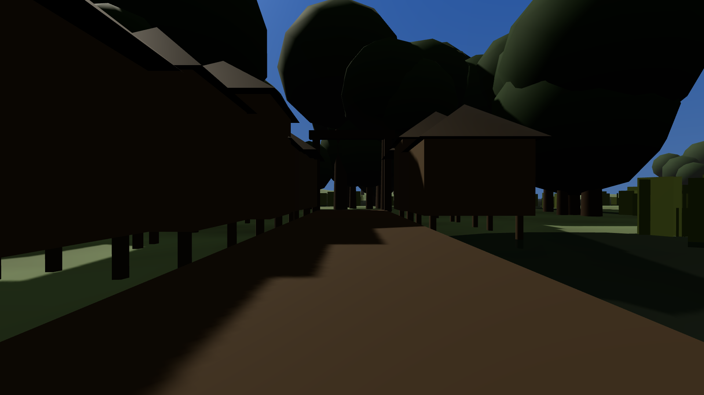

Boot the build, walk to Soulrest, stand in front of the undersexton who has the first quest of the
main chain. She has nothing for you. So does everybody else in the province: not one of the
thirty-two main quests can be started or advanced by playing.

The reason is a rule that is, in principle, exactly right. There are no arrows in this game and
there is no map. That was argued out properly and written down — the reasoning is that every
objective marker anybody has ever complained about has to live somewhere, and a map is the
somewhere, so the fix is that there is nowhere to put a pin. You find things by hearing about
them and going. A quest opens when you raise the subject with the right person.

The subjects do not exist. Of the thirty-two the main quest waits on, none exist as something you
can actually bring up in conversation as it is spelled; allow for a looser reading of the spelling
and you get three. Twenty-three of the thirty-two are only ever handed to you by the quest they
open, which is a door whose key is behind it. Five are handed out by nothing at all.

Nor is there anything to overhear. There is not one line of gossip anywhere in the game's dialogue
that names a single thing the main quest is about. Three of the quests carry a field listing the
people you are supposed to overhear it from, which is a lovely idea, and no part of the game reads
that field.

The build had a tool that plays the main quest end to end and it went green every time, because
that tool tells the game the words it is about to ask for, immediately before asking for them.
Every quest tool in the project does the same. To prove the tool could report a failure, the
builder shipped a deliberately broken version of it with that hand-feeding removed. Run against
the shipping game, the broken version stops at the very first quest with *"the topic 'the drowned
tally' has not come up yet"* and writes nothing at all in your journal. As the reviewer puts it:
against this build that is not a control, it is the measurement.

The saddest part is elsewhere in the same report. Every one of the thirty-two quests carries a
written direction to where you are meant to go, and they are the best writing in the piece —
*"from the Ladder keep the water on your left as far as Hollow-Reeds, then inland at the willows
to Gideon's market cross. Four days at a walking pace, more if you stop, and everyone on that road
can tell you where the Ladder is."* Thirty-two of those. Not one of them is drawn on screen
anywhere, spoken by anybody, or written into your journal. The check that guards them confirms
they exist and are long enough, and it reports full marks.

From a player's chair, a direction that is never shown is identical to a direction nobody wrote.
