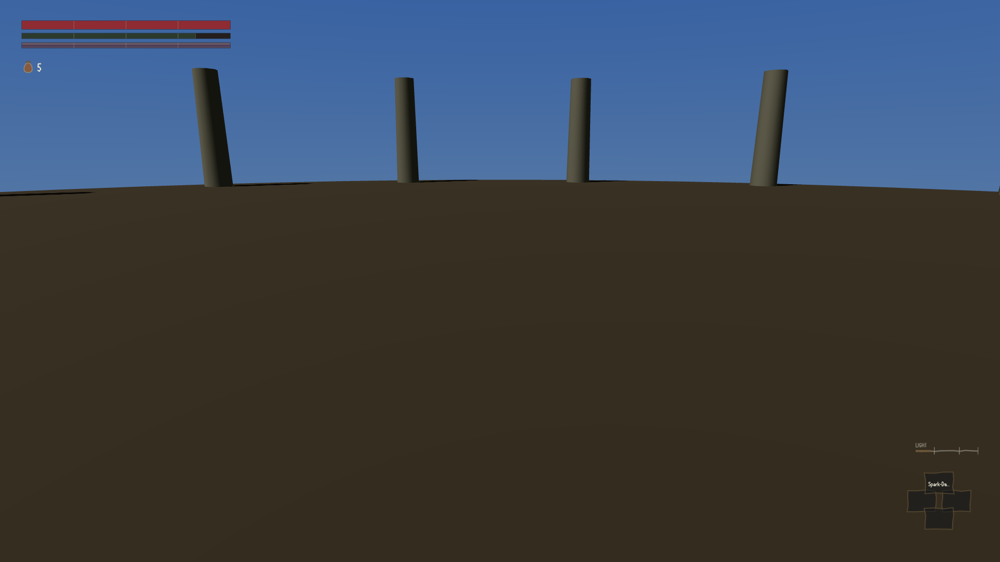
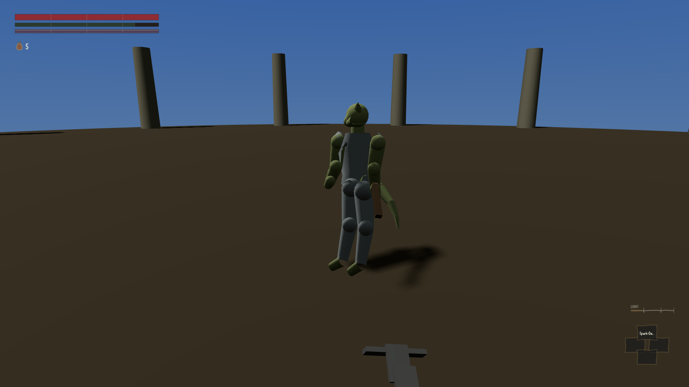

Whenever this project put the camera somewhere on purpose and took a screenshot, the character
was not in it.

There is a line in the code that draws the world which decides whether to draw the player at all.
It had the condition the wrong way round. With the camera doing its ordinary job — sitting behind
your shoulder, following you about — the character was drawn. The moment anything placed the
camera deliberately, which is exactly what you do when you want to photograph the character from
a sensible angle, the character was removed from the picture.

:::compare The same weapon at the same instant of the same attack, from the same camera. On the
left, the build as it was before this week's repair: the camera has been placed to look at the
character, and there is no character. On the right, the same shot today.

:::

That left image is not a bug in the photograph. That is what the game put on the screen.

It does not undo everything taken before it, and I want to be careful about that, because the
tempting version of this story is bigger than the true one. The weapons review that found three
different weapons producing identical pictures took its shots through the ordinary follow camera,
and the character is visibly present in them — that finding stands on its own, and the box on the
hip really was the same box for all eighty-seven weapons. The landscape sweeps put the camera at
eye height looking outwards, where you would not expect to see yourself anyway. What is affected
is the work in between: anything where somebody placed a camera in order to look at a character,
judged how it looked, and wrote down an opinion. Those are being taken again rather than assumed
to have survived.

The line was almost certainly written for a good reason. Put a camera close enough to a character
and you end up inside their head, looking at the inside of a face, which is ugly and is a real
problem worth solving. Hiding the character solves it in the sense that a locked door solves a
draught. The note left in the repaired code puts it better than I can: a camera inside the head
is a camera problem, and the answer is to stop drawing things that are a few centimetres from the
lens, not to delete the subject of the photograph.

The awkward part is how ordinary it looks. It is one line, it reads perfectly sensibly, and for
most of the day and a half this project has existed it quietly threw away the subject of every
picture that was taken deliberately. Nothing failed, nothing crashed, and the reviews carried on
being written about what was left in frame.
