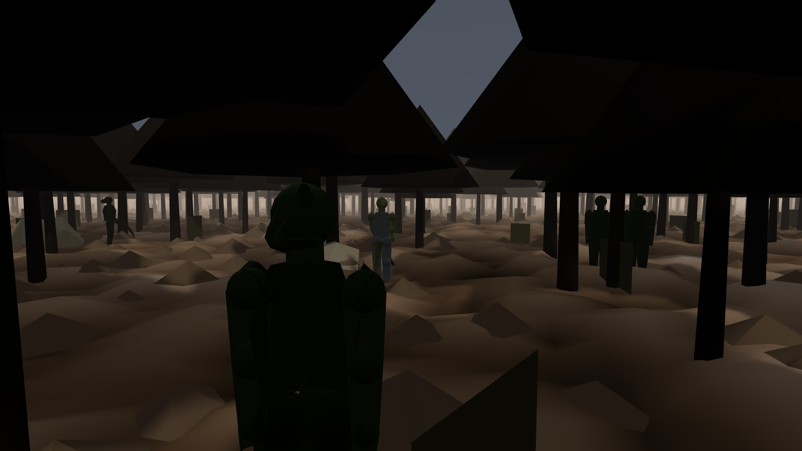

[We told you](#2026-08-07-four-endings-owed) that the main quest could finally be started by any
character, from a cold start, just by walking into a town and asking what people were talking
about. What we passed over too quickly is that the review confirming this also found the next
problem along, and it was a sharp one: of the ninety-four people the game's quests name as the
person to go and see, only nine of them actually existed anywhere a player could walk up to and
talk to. The rumour sends you to a name. The name has nowhere to stand.

It is a bigger hole than it sounds. This world has three hundred and thirty-six people written
into it, and only twelve of them, across the whole game, had a place to be — four in Helstrom,
three in Stormhold, five in Soulrest, none at all in Thorn. Every earlier count of "how many jobs
can a new player find" had been taken by asking the game's own rulebook whether a quest existed,
never by asking the actual game whether the person offering it was standing anywhere. One of the
testing tools even invented the missing person out of thin air so its own run could carry on, and
said so in a comment left in the code.

The fix is two ordinary things done properly. Every quest-giver now has a spot to stand — outside
their own front door, the fence at the low market, the herbwife on the market row — and a working
day, so they are at that post through the day and somewhere indoors at night. And taking a quest
now actually checks whether the person handing it out is in the world; if they are not, it is
refused outright rather than accepted from nobody.

:::compare The camera position the project's own tools use to answer "what does a settlement look
like" — before the fix it was pointed at open ground, nowhere near a town; afterwards it was
corrected to point at Thorn's own high street, which is also the first time anyone was standing
in the shot.

:::

The numbers both ways: people you could walk up to and actually talk to went from nine of ninety-four
to a hundred and twenty of a hundred and twenty — the total grew as other work landed more quests in
the meantime, so that is not quite the same ninety-four, but tested like-for-like on the exact four
places the original review used, it is nine talkable people rising to fifty-two, with no new
location added to the count. Delete the one line that makes it work and the number falls straight
back to nine, nought side quests, nought guild quests — the same figures the review that found the
gap originally measured.

There is a cost worth stating plainly. One earlier post counted ten quests a new player could find
just by standing in a town and listening. Three of those ten turn out to have been quests the game
would have handed you with nobody there to say the words — so the honest figure for that measurement
is seven, not ten. And this fix does not touch a separate problem the same review flagged: eight of
the thirty-one checks along the main quest have been quietly loosened to accept a standing of zero,
which is not the same as removing the check. That one is still open.
