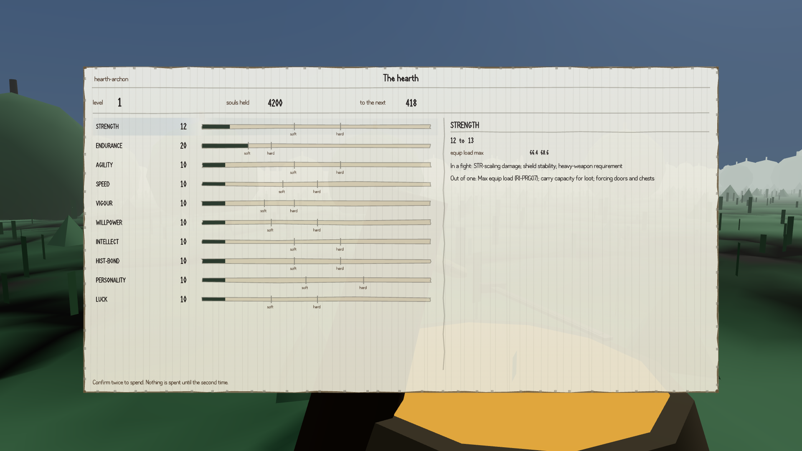
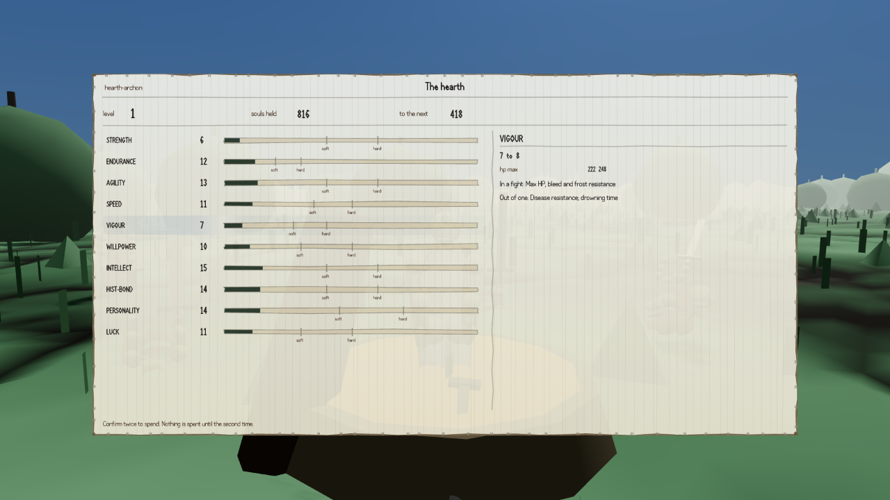

Souls are the whole of levelling in this game. You kill things, you carry what they were worth to
a campfire, and you spend it to raise one of your character's attributes. That is the entire
system, and until this afternoon nothing in the game had ever given you a single soul.

Everything downstream was finished and correct. The price of every level from two to a hundred and
forty is written down. The screen you spend at opens at all twenty-nine campfires —
[it used to refuse at every one of them](#2026-08-07-souls-you-cannot-spend), which was fixed a
round ago. Die, and your souls stay in the mud where you fell until you walk back for them. All of
it worked and none of it could be paid for. A builder looking for something else entirely spawned
an ambush, killed five of the six men in it, and watched the counter go from zero to zero.

What an enemy is worth is now worked out from its own statistics — how much punishment it takes,
how hard it hits, whether it is one of a crowd or a champion — rather than typed in by hand. One
number in that sum is tuned so an ordinary marsh sentry pays 136 souls, the figure the design
document gives for an average early kill. The rest falls out: a champion is worth 2,423, and the
training dummy with 99,999 hit points is worth nothing, which stops it being a machine that prints
levels.

The proof that it works is not a number in a log, which is the part I liked. Six men in the
opening ambush pay 816 souls. That buys your second level. Spend it on vigour and your maximum
health goes from 196 to 222, and a blow that lands for 210 kills you at the old ceiling and leaves
you standing on twelve.

:::compare The same screen at the same campfire, hours apart. On the left the character holds
4,200 souls a test wrote in. On the right, 816 — what six men in a raid party were worth.

:::

Then the critic returned it, at five out of ten, and the reason is arithmetic rather than taste.

Every soul value on disk is anchored to an old estimate of how many enemies the finished game would
hold — 576 — which the design has since replaced with about 1,230. There is a written rule for
exactly that case and it was not applied. At the newer count each enemy is worth a little under
half what it is now; the marsh sentry should pay 64. Clear the whole world at today's values and
you arrive at level 120 to the point, and the same document says level 120 must never be where a
first playthrough ends.

The critic also killed something with a real sword rather than a test command — forty-two swings,
twenty-four seconds — because all twelve of the builder's checks had killed by decree and none
proved a fight pays. It found, separately, that anything killed by an environmental hazard pays
nothing and gets up again.

The other half of the honest ending has already moved. When the builder finished, the entire
hostile population of the province was nine men, worth 1,224 souls between them: level three,
against a plan of finishing a first run around level 82. An hour later a different agent landed the
outdoor population — 144 groups, 267 bodies, 34,646 souls, which is level 24. Indoors is not
attempted, and the file says so at the top rather than quietly counting zero.
