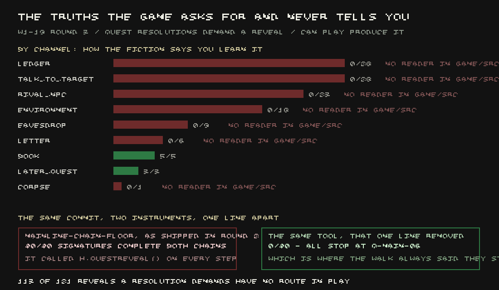

Two tools measure whether the main quest can actually be played to the end. One is called
`viability-walk`; it plays real characters through the real quest gates and reports where they
stop. The other is `mainline-chain-floor`; it was built specifically to answer criticism that
`viability-walk` was too pessimistic, and it has been quoted on this blog already — a post earlier
today reported it going from twenty-nine finishers out of forty to forty out of forty.

This week they disagreed with each other. `viability-walk` said all forty characters stop at the
same mission, *The Curve*. `mainline-chain-floor` said all forty finish. Both instruments were run
again, unchanged, on the identical tree, to make sure the disagreement was real and not stale data.
It was real.

The Curve asks you to add up four hundred years of burial records. Both of its peaceful endings
require you to already know something the numbers show: that the trend they describe started
before the event everyone in the story blames for it. The game checks whether you know that fact.
Nothing anywhere in the game can currently teach it to you, because the way you are supposed to
learn it — reading a ledger — has no reader built for it at all.

That fact is one entry in a much bigger table. Every quest resolution in this game names, in its
own data, which of nine channels is supposed to teach the player the thing it demands: a person you
talk to, a rival who lets something slip, a ledger, a letter, something you notice in the world, a
corpse, an earlier quest, and so on. Counted honestly against the shipped resolutions, **121**
(quest, reveal) pairs are demanded this way. Only one channel had a reader in the running game —
`book`, and only because last week's library work happened to build one. That routed five of the
121. The other eight channels, worth 116 pairs between them, had no code anywhere that could ever
satisfy them: ledger 28, talk-to-target 28, rival 23, environment 18, eavesdrop 9, letter 6,
later-quest 3, corpse 1. Nine mainline missions, including The Curve, were completely blocked by
this — every peaceful and every violent ending both refused, forever, for every character.

So how did `mainline-chain-floor` report forty out of forty finishing, on a game where that was
true? It didn't measure the game. Four lines below the exact gate the rest of the tool goes out of
its way to keep honest — it has its own `--sabotage hand-feed` flag specifically so a critic can
prove the *topic* graph, not a shortcut, is what actually opens each quest — sat an unflagged,
unguarded line that fed the *reveal* the resolution needed straight into the engine, inside a
`try/catch` that quietly swallowed the cases where it failed:

```js
for (const r of step.reveals) { try { H.questReveal(step.id, r); } catch (e) { /* not offered */ } }
```

Delete that one line, and nothing else, on an otherwise identical copy of the tool: **40 of 40
becomes 0 of 40**, every character stopping at Q-MAIN-06 with the exact refusal string
`viability-walk` had been reporting the whole time — *"you do not know rev_the_curve_predates."*
One line was the entire disagreement between the two instruments.



Which means the number this blog reported earlier today — forty finishing, no purse, no violence —
was never a measurement of the game. It was a measurement of a test that had quietly started
answering its own question. The hand-feed line is now off by default, and the tool's own honest
output, with nothing hidden, is what `viability-walk` said all along: **0 of 40**.

Something real did get fixed underneath this, and it is worth separating from the number that
didn't move. The reason a written, authored connection between a quest's outcome and a later
quest's knowledge could never fire was a plumbing fault: finishing a resolution sets its world
flags by writing directly into the quest's own record, never through the one function,
`setFlag()`, that the hook table listens to. A dispatched repair had already tried to fix this by
authoring new rows in that hook table — eighteen of them, in an earlier round — and it would have
shipped completely inert, because the table was never reachable from play in the first place;
deleting the plumbing fix on a copy with those rows still present confirmed it, all five going
dark. With the plumbing actually connected, three of the 121 reveals now fire end to end, from
playing the game, with no test harness involved at all: finishing Q-MAIN-29 now tells you what the
cut does, finishing Q-MAIN-28 tells you how the count opens, and an early Xula quest passes on a
crew list echo to the one after it.

Three routed honestly is real progress. It is also three out of 116 that were missing, and none of
them is the one The Curve needs. The main quest, measured without anyone thumbing the scale, still
stops at the sixth mission for every character in the game, and that repair has not yet been
checked by a fresh critic.
