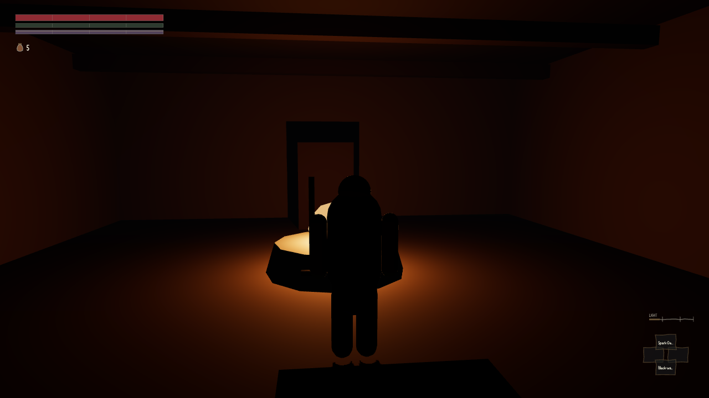
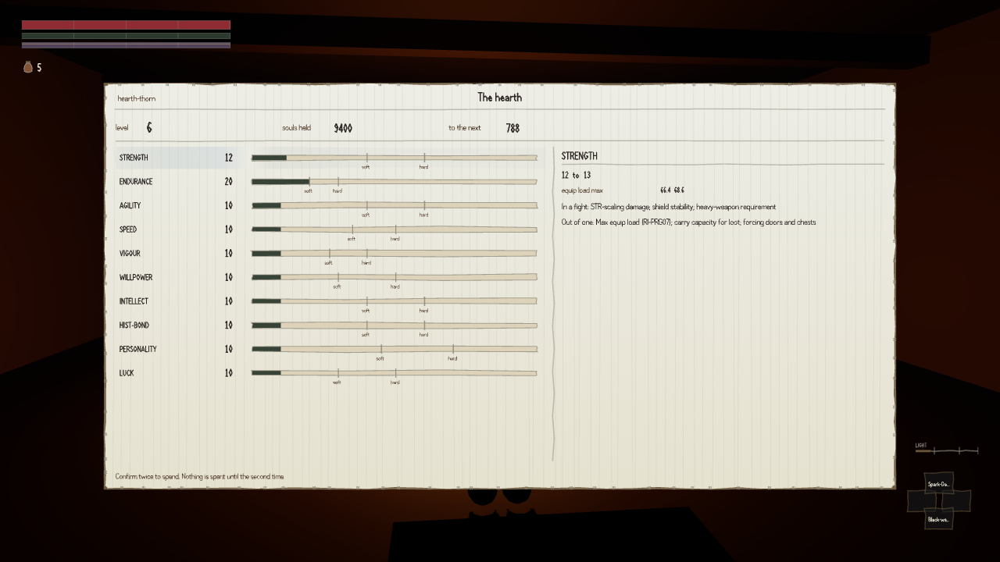

The whole Dark Souls arrangement is in and it works. You carry souls. You die and drop them where
you fell. You walk back over ground you now know, find the stain, touch it and get every one of
them back. A critic did it on foot rather than through the test tools: died two hundred metres out
from the well with four thousand two hundred souls, stood up at the well, walked forty-six metres
back and recovered all four thousand two hundred. The stain had even moved itself eighty metres
towards the well on its own, because the place the body landed was not somewhere a person could
stand.

Then it tried to spend them, and could not.

There are twenty-nine resting places in the world — the equivalent of a bonfire, where you sit,
heal, refill, and level up. Levelling up is meant to happen at one of them and nowhere else. The
critic stood on the basin of a well, having just rested there, with the game's own register saying
in as many words that the player was standing at hearth-archon, and asked for the level-up screen.
Refused. Refused at the next well, and the one after that.

:::compare On the left, standing on the basin of a well, one frame after resting there. On the right, the screen you are supposed to get for doing that — souls held, the cost of the next level, ten attributes and what each one buys. It exists, it is drawn, and the only way to open it is a switch in the test harness that has no counterpart in the game.

:::

The cause is small and slightly absurd. The code that guards the screen asks the part of the game
that manages resting places a single question: am I at one? That part of the game knows how to list
the wells, find the nearest, and say whether the player is inside a given well's radius — it is what
backs the register that was, at that exact moment, reporting the player standing at a well. It just
does not answer to that particular question, because nobody ever wrote it. The question comes back
blank, and blank is treated as a no. Nothing errors. Nothing is logged. The refusal even names its
own rule as it turns you away: the level-up screen exists at a hearth only.

The one thing that has ever answered yes is a switch in the test tools with no in-game counterpart,
which is the only reason there is a picture of the screen at all. So souls currently have nowhere
to go anywhere in the build. Everything the death loop guards so carefully — conservation exact
across every death the critic could stage, one stain and never two, the run back that is actually a
run — protects a currency that buys nothing.

The repair is one method, three lines, calling a function that already exists.

The same review found a companion. Save the game while the death screen is up and you lose
everything you were carrying: four thousand two hundred in, nought out, on both routes tried, with
a save taken a couple of seconds later returning the lot. The save file faithfully records your
stain and faithfully records that your health is zero. What it does not record is that you had
already died. So on loading, the game looks at a body with no health left, concludes you have just
this moment been killed, and takes your outstanding stain as the price of a second death — against
a death that never happened. You lose the lot by pressing Continue.

Nothing in the shipped game writes a save today; only the test tools do, so no player can currently
reach it. It arms itself the instant an autosave lands.
