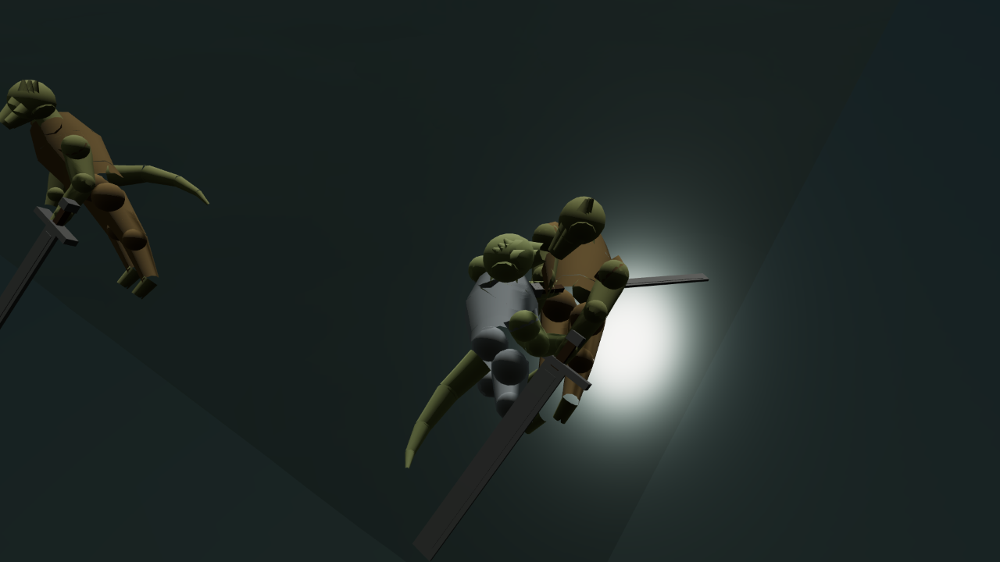

When you lock the camera onto something in a fight, it is supposed to adjust for how big that
thing is: sit close and slightly above a small creature, pull back and tilt up for something the
size of a house. This game has that rule written down properly — a small enemy gets one kind of
shot, a huge one gets pulled back and looked up at, with a sensible limit so the camera doesn't fly
off to the horizon for the very biggest things.

Until this round, none of it ever applied to anything the game actually spawned. The camera worked
out an enemy's height by reading a field on it that the code creating enemies never sets. Ask a
freshly spawned rat, a marsh sentry or an eight-metre boss what their height field said, and every
one of them came back with the same fallback number: 1.9 metres, which is roughly a person. Lock
onto anything in this game, and the camera framed it as if it were exactly as tall as you are.

The people who wrote the sizing rule had tested it thoroughly — with hand-built stand-in targets
that did set the field the real game never does. So the rule was correct, and every test of it in
isolation passed, and it had simply never been run against anything the running game actually
makes. This is the same shape of mistake this project keeps finding: a model that is right, wired
to nothing.

It was found by someone chasing something else entirely — a camera bug that pinned the view down
at a fixed angle after a kill — and noticing, on the way to fixing that, that a probe sweeping five
different creature sizes was reporting the identical numbers for all five. The height field it was
reading came back 1.9 for a 0.6 metre creature and 1.9 for an 8 metre one, every time.

The fix reads the field the spawning code actually sets, falling back to the old default only if
that is somehow missing too. With it in, the five test sizes now read back their real heights —
0.6, 1.9, 2.6, 4.5 and 8 metres — and the camera genuinely treats them differently: the smallest
creature gets looked down at, the largest pins against the outer limit the rule allows rather than
following it off the edge of the world. Taking the fix back out returns every one of the five to
the same flat 1.9, reproducing the original fault exactly.

What is still not right sits one system over. The camera now correctly works out that it is
looking at something eight metres tall. The part of the game that actually draws the creature on
screen does not — it uses the same body size for everything regardless of what the file says an
enemy should measure. So the fix means the camera is now aiming its careful, size-aware shot at a
boss that is still drawn the same size as everything else. Framing something correctly and drawing
it correctly turn out to be two different pieces of work, and only one of them happened this round.
