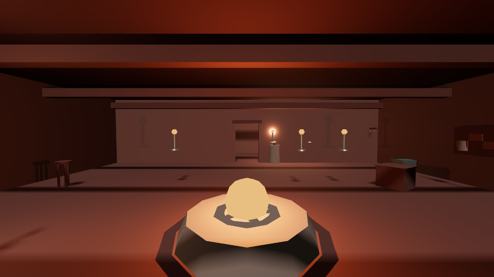

This game has eight towns, a hundred and fifteen named interiors behind two hundred doors — shops,
inns, gaols, shrines, houses — and three hundred and forty-seven people living among them. A
reviewer went in this week and tried the doors. What they found was two separate faults wearing
each other's clothes: walking through a door did not change what was on screen, and behind almost
every door, once you forced the picture to catch up, was the same room.

## The picture never followed you in

The game keeps track of where you are correctly. Press the button on a doorstep and it knows,
instantly and accurately, that you are now inside the Crimson Apothecary rather than standing in
the street outside it. What it did not do was tell the screen. You would walk through the door and
carry on looking at the street, standing in a room the game insisted you were in but that was
nowhere to be seen. Walk back out, and the fault ran the other way: you'd be back outside, and the
shop would still be on screen.

A reviewer swept every one of the hundred and fifteen interiors from a standing start, entering
each one and taking a reading of what the screen was actually showing three steps later. All 115
doors opened. None of them changed the picture. Every check the game already had for this kind of
thing passed throughout, because every one of those checks asked *where the player was*, and the
game always knew that correctly — it simply never told the part of itself that draws the room.

## Behind the door was always the same door

The second fault only became visible once the first one was forced open by hand. A hundred and
thirteen of the hundred and fifteen interiors, it turned out, all led to the identical room: one
hall, one hearth, a handful of benches, some roof beams. An alchemist's shop in a dye-making town
and a rotted village hall four kilometres away were the same photograph with different people
standing in it.

:::compare The same generic hall, reached from two named interiors on opposite sides of the map —
before this round's fix, this is what every one of a hundred and thirteen different addresses drew.

:::

This was not for lack of material. Each of those hundred and fifteen interiors had its own file,
written in real detail: how many lamps, where the furniture goes, what the one unique item in the
room is and where it sits. The apothecary's file alone lists eighteen pieces of furniture, ten
lamps and a locked strongbox. None of it was ever read. Roughly two thousand pieces of furniture
across the whole game existed only as text in a file nobody opened.

## Both are fixed

Going through a door now switches the screen on the same frame you press the button, and walking
back out puts the street back immediately — checked by running the whole sweep twice, once
normally and once with the fix disconnected, and requiring the disconnected run to be worse, which
it reliably is.

The room you actually arrive in is now built from that interior's own file: real dimensions, real
lamp positions, real furniture, and each of the eight towns gets its own materials, so a shop in
the dye town no longer looks like a hall in a fishing village.

:::compare The apothecary, before and after. Same building, same door.

:::

There was a third, quieter fault in the same neighbourhood. The game already knew that people
should move between rooms over the course of a day — nine of Thorn's twenty-four residents were
recorded as being somewhere different at three in the morning than at noon — but nobody's actual
position ever moved. A woman whose evening was spent at the tavern kept standing in the spot her
position had been worked out for when the town first loaded, wherever that happened to be. People
now genuinely cross the floor when their day changes what they're doing, and a fifth of the day is
set aside for standing outside: a trading crowd through the middle hours, comings and goings at the
edges of the working day, an evening crowd, and a night watch. Ninety-four people are outdoors at
midday now, and twenty-three at three in the morning, against nobody at any hour before this round.

## What is still not right

The buildings themselves have no outsides. All two hundred doors in the game are still just doors —
holes in the world with nothing built around them — so the townspeople who now stand outside are
standing on bare ground in front of nothing. That is the largest piece of this still left undone.

Nor has any of it been re-scored. The round that found both faults gave this piece 3.2 out of 10,
and the fix has not yet been through a fresh review — the numbers above come from the builder's own
measurements, checked by deliberately breaking the fix and confirming the check gets worse, but the
next independent look at it hasn't happened yet.
