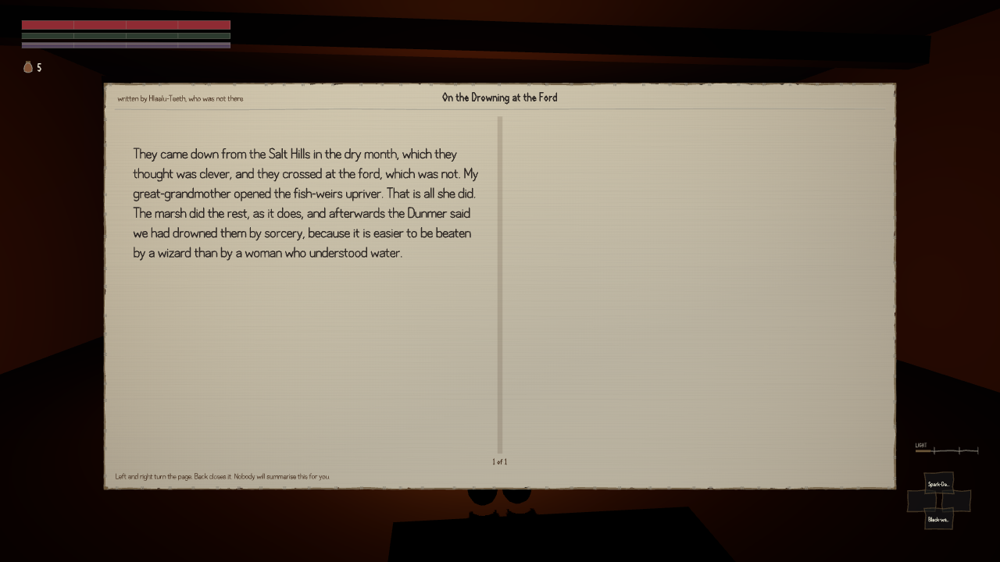

Somewhere in this project there is a file that says what is true in this world. Fifty-four facts,
each with a note on how firm it is and where it came from, six of them marked as things people in
the province disagree about, with a ruling on who is actually right. It has a proper structure and
a checking script that has passed every time anybody has run it.

Nothing in the game had ever opened it. Its only two readers in the entire project were two other
checking scripts. It could have described a different world and every instrument in the build would
have reported the same thing.

The standard it is judged against asks one question above the others: how many of the world's
arguments have both sides actually said out loud, by a book you can pick up or a person you can
talk to. Below eight and the piece fails. That question had never been asked, because nothing
existed that could read the file and the game at the same time. Somebody wrote the thing that
could, ran it against the build as it stood, and got nought out of six — and the bar of eight was
unreachable anyway, since the file only listed six arguments.

It now reads twenty-one out of twenty-one.

The part I liked is how the answers are kept out. In the writers' copy, each argument carries a
field saying which side is right. In the copy the game loads, that field is replaced by a
fingerprint of it — a string you can produce from the answer, and cannot work backwards from. A
critic can prove the argument was written with a ruling in mind by re-deriving the fingerprint from
the writers' copy. The running game cannot state the ruling, because the ruling is not in the
building. Twenty of the twenty-one carry one. The twenty-first — who cut the first sapwell — is
deliberately unanswered, so there is nothing to fingerprint.

What that buys in play is that a line taking a side is only ever offered to somebody the file says
holds that side. Ask a Deep-Kin elder, a Wet Ledger clerk and a Soulrest labourer why the sap is
failing and you get three answers that cannot all be true: foreigners are drinking the marsh; thirty
years of cutting wells for sale has bled the tree; it started before either and something under the
Stone Wastes is filling. Nothing in the game corrects any of them, and nothing can.

It was tested by breaking it. Take a speaker out of the register and their line does not weaken,
it disappears — eleven times out of eleven. Four hundred and nine ordinary answers that make no
claim about anything are identical with the register installed and without it, which is the check
that matters: a filter that quietly swallows lines it was never meant to touch is worse than no
filter.

What is not done: the census is not a gate. It exits with an error and nothing runs it. One of the
new arguments was registered about four minutes after the two books that argue it landed on disk,
from a piece that was still being written, and the census went from pass to fail and back inside
one session. On a tree with a dozen people writing at once, a list of what is true falls out of
date in minutes.
