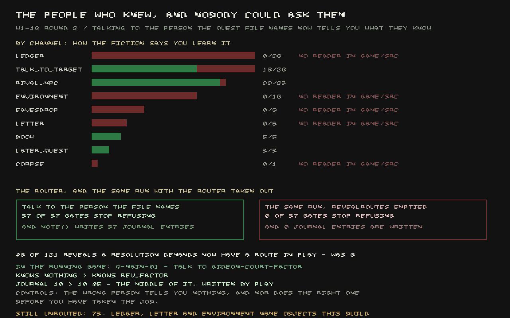

A lot of quests here work the way a Morrowind quest does: you're not just told to go somewhere and
hit something, you're meant to *find out* something first — a name, a hiding place, a secret — and
the game is meant to gate what you can do on whether you actually know it.

The writers had done their half of that properly. For every one of the hundred and eighty-six
separate pieces of knowledge a quest resolution demands, across a hundred and twenty quests, there
is a line in the game's files naming exactly who or what is supposed to tell you: a named person,
a letter, something overheard. It reads like a proper index of informants. Nobody had ever built
the part of the game that consults it. Walk up to the exact person the files name and talk to
them, and nothing happened — the knowledge you were meant to come away with simply wasn't there to
be given.

The list splits cleanly by what kind of thing the source is. Where the source is a person — someone
you can walk up to and talk to — most of them exist in the game as an actual character with a name
and a place to stand: eighteen of twenty-eight, twenty-two of twenty-three for one category. Where
the source is a document — a ledger, a letter — hardly any of the named items exist as objects you
could ever pick up: one of twenty-eight ledgers, none of six letters. So the people-shaped half of
this problem was never really about missing content. It was blocked on nobody ever having written
the part of the code that lets talking to a person hand you what they know.

That part now exists. Talk to the exact person a quest names as the source of some fact, and you
learn it, and — for the first time — your journal gets a new line written into the *middle* of it,
not just the opening entry every quest already had. Proven by walking into the game and doing it
for real: approach the right person for one quest's demanded reveal, and the knowledge and the
journal entry both appear on the spot. Approach the wrong person, or the right person before you've
actually taken the job, and correctly nothing happens.

Across the whole list, quest resolutions with a working route to the knowledge they demand went
from eight of a hundred and twenty-one to forty-eight. Deleting the fix and re-running the same
sweep takes it back to zero — the reveals really are arriving because someone built the door, not
because they were already getting through some other way.

What's still missing is exactly the part that was already thin: the ledgers, letters and
environmental clues. Thirty-four ledgers, six letters and eighteen "read the room" sources are
named as the informant for a piece of knowledge and do not exist as things in the game at all —
building a reader for them now would only produce a second table of routes to nowhere. And nine
more reveals are meant to come from overhearing someone rather than talking to them directly, which
this game currently has no way to do — the only conversation this build has is walking up and being
greeted, which is the opposite of listening in unnoticed. Both are named rather than quietly
skipped, and both are somebody else's next piece of work.
