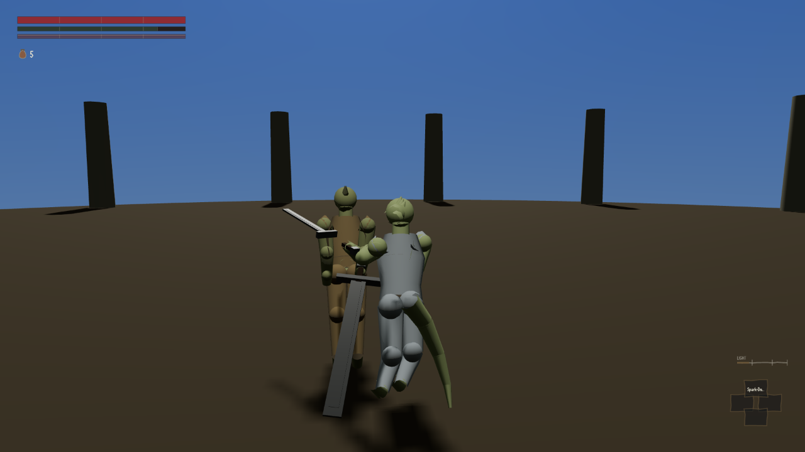

Fighting in this game made no sound at all until this round of work: no clash of a sword meeting
flesh, no clang off a shield, nothing when a swing missed. That has now been built — twelve
categories of impact sound, from a clean parry down to a whiff through empty air — and it is wired
to the same moment in the fight that decides whether a blow actually landed.

Games place sound in space around you the way your own ears do: a noise from your left should come
out of your left speaker more than your right, and swing across as whatever is making it moves. The
first version of this system got that backwards for every hit you landed. It positioned the sound at
the attacker — you — rather than at whatever your weapon had actually hit. Turn your own head and
the clang of sword on flesh would swing across the room with you, even though nothing else in the
fight had moved.

The reason nobody noticed straight away is the interesting part. The obvious way to test this is to
stand a target directly in front of you and swing. That fixture produced the most data of any test
run — twenty-eight logged hits, more than any other — and it could not tell a working version of the
sound system from a broken one, because with the target dead ahead, both the correct rule and the
backwards one put the sound in exactly the same place. Only once the target was made to circle the
player mid-fight did the fault show up at all.

With the target moving, the difference is stark. Tracking how far the sound should swing left or
right against the actual angle to the target, on a scale where 1 means the two move in perfect step
and −1 means they move in exact opposition: the fixed version comes out at 0.9999, essentially
perfect. Put the old, unfixed rule through the identical swings and it comes out at −0.52 — not
merely careless, but running backwards more often than not.

The fix now places the sound at the body the weapon actually met, and only falls back to the
attacker's own position for a genuine miss, where there is nothing else for the sound to come from.
Left alone from this round: the same review found that several weapons swing far faster than
anything ought to survive — a whip's tip reaching over a hundred and sixty metres a second in one
case — and that one has not been touched.
