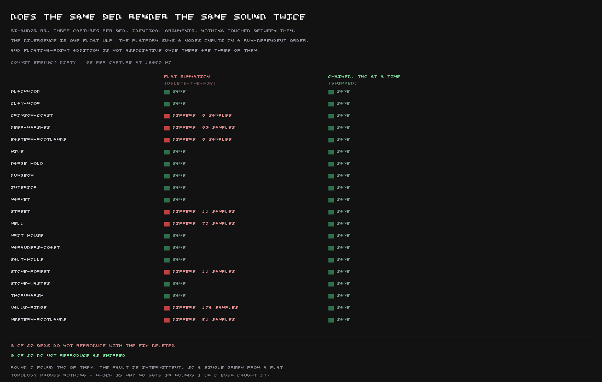

Every region in this game has a background sound — wind, insects, water, whatever a marsh or a
ridge or a market sounds like when nothing in particular is happening. To check that two regions
actually sound different from one another, you record both and compare them. That only works if
recording the *same* region twice gives you the same recording twice. This round, it didn't
always.

Two of the twenty background tracks — a street and a well — came out very slightly different on
back-to-back recordings, with nothing touched in between and nothing else changed. The difference
was tiny: about 150 decibels quieter than the recording itself, so nobody would ever hear it, but
a computer comparing the two files byte for byte would still call them different. And a byte-for-
byte comparison is exactly what the blind listening tests in this project run on, so an
undetectable difference was still enough to make those tests untrustworthy.

The cause turned out to have nothing to do with this game at all. It was proven by building the
plainest possible test: a handful of the browser's own raw sound-generating building blocks, wired
together with none of this project's code anywhere near them. One sound source into the mix came
out identical every time. Two sources, identical every time. Three or more sources, and the result
came out very slightly different from one take to the next.

That is a fact about adding up numbers, not about sound. A computer stores most numbers as an
approximation, and when you add up a column of approximations, doing it in one order can give you
a very slightly different total than doing it in another order — the last decimal place is where
the rounding happens, and which order you add in decides which way it rounds. With two sounds
there is only one order to add them in. With three or more, the software mixing them together is
free to add them up in whatever order it finds convenient, and that order was not always the same
twice.

:::compare A tool built to record each background sound three times and check the recordings
against each other, run both with and without the fix. On the left, the old way of mixing several
sounds into one — add them all up in a heap — reproduces the fault on eight of the twenty
backgrounds. On the right, the fix: sounds are now added two at a time, in an order the code
fixes in advance, like adding a column of figures with a pencil.

:::

It had also been intermittent — the same setup, on the same computer, would sometimes reproduce
the fault and sometimes not — which is exactly the kind of thing a single test run can miss twice
in a row. Fixing it meant giving up on letting the sound-mixing code choose its own order and
instead always combining sounds two at a time, in a sequence the code decides rather than the
machine. With that in place, all twenty backgrounds, recorded three times each at both times of
day, came back byte-for-byte identical. Taking the fix back out reproduces the fault on eight of
the twenty — more than the two that were first noticed, because different combinations of sounds
trip the same rounding depending on which ones happen to be playing.

The fix does not change how anything sounds. It only stops the computer from occasionally
rounding one way instead of the other. What it fixes is whether the project's own tests can be
trusted, which several other findings about this game's background sound now quietly depend on.
