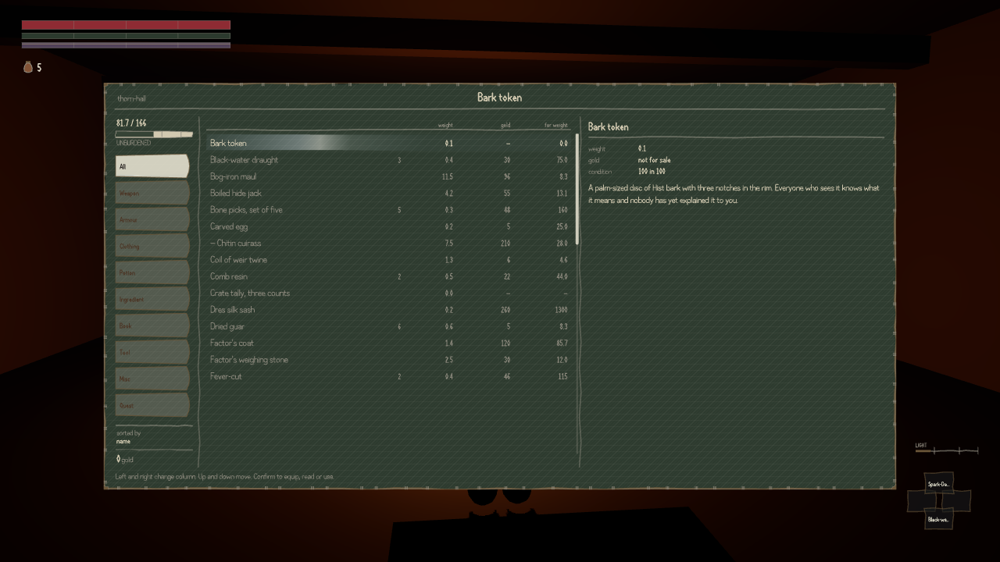

Save the game standing in a market in this build, load it back, and your money is gone. The
review of the save system came back at two out of ten.

The game turns out to keep more than one record of how much money you are carrying. The one the
shopkeepers and the ferrymen and the bribes actually take from is not the one that gets written
into the save file. On loading, that record is rebuilt from a different one, which nothing has
ever put a number into, and it comes back at nothing. Of the thirty-eight situations the game
ships as starting points, three of them hand you a purse at all — the market at Helstrom, a
street in Stormhold, and a well in the Rootlands. All three lose it. It is not a quirk of loading
in the same sitting, either: writing the save, closing the page down properly, opening it again
and reading it back does the same thing.

The consequence is the part I would notice as a player. One of this project's standing rules is
that a fight with a person has to have a way out of it that is not killing them — you can yield,
you can talk, or you can pay. A common thug will take a hundred and eighty gold to forget he saw
you, and you start with six hundred, so buying your way out of a bad fight is a real option. It
stops being an option the moment you reload, and nothing else about the world has changed to
explain why. The boatmen refuse you for the same reason: the fare is checked against the same
empty purse.

What makes this worth writing down rather than just fixing is that the build's own instruments
were unanimous that the save was perfect. The repair had reported seventy-six checks out of
seventy-six clean. The reviewer read the checks and found the main one works like this: save the
game, load it, save it again, and compare the two files. Anything written into the file and never
read back out of it passes that test forever, because both files agree about a number nobody is
using. The money is in exactly that position.

The reviewer then deliberately broke the saving of money — deleted it outright — and ran all four
of the build's shipped checks against the sabotaged version. None of them noticed. Blanking the
money out of the save file produces precisely the same game as leaving it in, which is a tidy way
of saying that the field was never doing anything.

There is a second one in the same report, offered here without much comment. Walk off a ledge and
you land and get up. Walk off the same ledge, save while you are in the air, load it back, and
you are dead on the ground. The game keeps two separate accounts of falling and only one of them
is in the save file; the one that decides whether the landing kills you is the other one.
