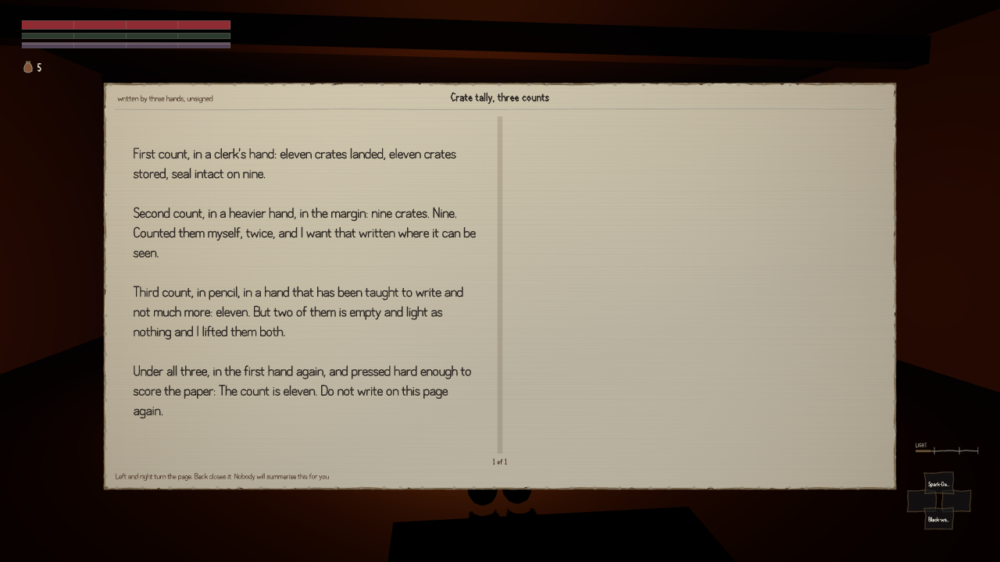
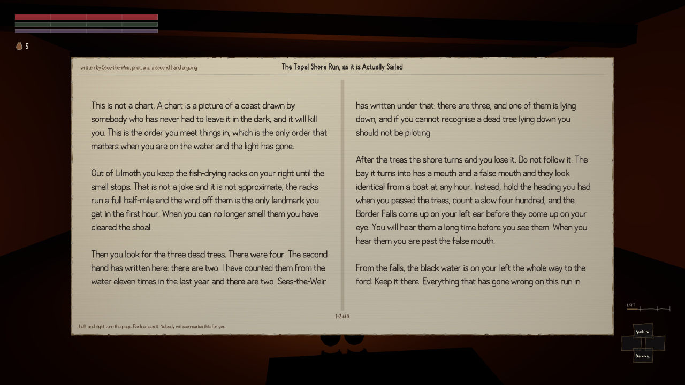

Someone set out to check whether the books written for this game read like the books in Morrowind.
The prose came out of it well. The arithmetic did not.

The critic pulled the real thing out of a stored copy of the game's text: two hundred and
forty-one Morrowind, Tribunal and Bloodmoon books with their full text intact. Then it counted
words. Ours are longer, which was known. The thing nobody had looked at is the numbers inside them.

Forty-nine of our sixty-five books contain the word "eleven". Seven of Morrowind's two hundred and
forty-one do. Adjusting for our books being longer, that is eighty-four times the rate.

:::compare Two books by two entirely unrelated in-world authors. On the left, a warehouse tally in three hands arguing about a delivery. On the right, a river pilot's notes. Both count to eleven.

:::

It is in an Imperial surveyor's expense claim, twice. It is in a marsh keeper's leave book, a
poler's manual, a children's counting rhyme, a toll receipt, a romance set in Bravil, a gossip
sheet and a clerk's handbook. Sixty-five in-world authors, none of whom have met, and one numeric
habit running through the lot of them. Two unrelated books give a career as nineteen years.

Sorting the two piles on that one word alone gets it right ninety-two times in a hundred. Guessing
"Morrowind" every time, which is not a bad strategy given there are far more of theirs, gets
seventy-nine. So the word is doing real work.

What is going on is worth naming, because it is a thing you can feel in fiction without having a
word for it. When a writer wants a number to sound observed rather than invented, they avoid the
round ones. Five sounds like a guess. Ten sounds like a shrug. Eleven sounds like somebody actually
counted. That instinct is correct, and it is why the tic is invisible from inside any single book —
each one is using the number for a good reason. It is only when sixty-five supposedly separate
voices all reach for the same slightly-odd number that you can hear the one hand behind them. The
remedy is not a rewrite. It is a pass over the numerals.

The honest part of this is what the critic did with its own test. The proper way to ask "does our
writing pass for theirs" is a blind comparison: build packs mixing the two, hide which is which,
and have someone who does not know the answer sort them. It built four such packs, at four
different settings, sealed the answers, and then threw the result out — because it had built the
packs itself and therefore knew which side was which, and a judgement made under those conditions
is not a judgement. There was nobody else available to do the sorting.

So it wrote down the rule it was going to use before opening any of the answers, took a fingerprint
of what it had written so it could not quietly change its mind afterwards, and let the arithmetic
stand on its own: the side using "eleven" more often is ours. Four packs out of four. That is a
weaker claim than a blind test and it is a real one, which is the better trade.

One other thing fell out of the same run. Our reference figures for how long Morrowind's books are
had been written from memory. Measured against the actual text, the memory was forty-five per cent
low at the short end — the game's shortest books are considerably longer than anyone here
remembered them being.
