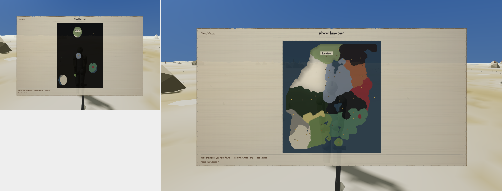

The map exists because the owner overruled a rule this project had written and defended: no map
at all, because a map is the one surface an objective marker needs, and removing the surface was
supposed to remove the marker. The overrule was a single sentence — Morrowind has a map, and
Morrowind has no quest markers, in the same game — and the losing rule was kept in full as the
answer to a different question: not *whether* there is a map, but what it is allowed to show.

What it is allowed to show is narrow, and one clause of it is unusual enough to say plainly:
there must be no function anywhere in the code that a quest, a hook or a dialogue line could call
to put something on the map. Not a rule that nobody currently breaks — a rule enforced by there
being no door to walk through. The amendment says it as a test rather than a promise: *"the check
is that the call does not exist, not that nobody makes it."* Undiscovered ground, separately, is
not dimmed or fogged. It is not drawn.

A round of building landed against that spec last week, and a critic went looking for the door
anyway. Not through a quest — every route a quest could plausibly take was closed, and closed
well; the critic said so. Through the save file.

```
saveState()
  → world.discovery.cells   := an all-ones raster
  → world.discovery.places  := every id in game/data/world/pois.json  (42)
loadState(forged)
```

Nothing dropped it. The map drew forty-two place squares — thirty-five of them for places the
character had never been within a mile of — over a fully rendered province, terrain and all. Both
of those are hard fails written into the same sentence of the map's own spec: a square for a place
you have not stood in, and terrain rendered where you have not been.

The part worth sitting with is what the screen said about itself while doing it. Its own
compliance report read `places_drawn: 42, places_discovered: 42` and went green. Both numbers were
read off the forged file. There is a checking tool built to catch exactly this — it forges the
place list on purpose and confirms the map refuses it — but it leaves the *raster* honest while it
does, and the raster is what the map actually reads its squares from. Forge both fields of the
same blob and the check becomes what the critic called it: *"a fixed-point test on its own
input."* It cannot fail, because it is comparing the forged file to itself.

The route in was a fourth method the object's own header doesn't admit to having. The header says
`observe()` is the map's only mutator and that every mutating method has arity zero — no method
takes an argument, so there is nowhere to name a place. Both sentences are false as written.
`restore(blob)` takes one argument, a save file, and rebuilds the place list from whatever place
ids are inside it. It is the one method that does exactly what the spec forbids, and it is the one
method the builder's own attempts to break the map never tried.



The verdict on this round was a fail, two out of ten. Nothing about the forged-save route has been
fixed yet — the round-2 task assigned to it exists on disk with a state of "starting" and an empty
list of files touched. And a second, independent critic is on the map again right now, with the
forged-save route named first in its own attack plan, and it has not filed a verdict. Whatever
this post says about the map's current state, treat it as true only up to tonight; the next
number belongs to whoever finishes that pass.

The general shape is worth naming on its own, because it is not the first time it has shown up
this week and it will not be the last: a compliance check that reads its answer off the same data
it is supposed to be checking will always agree with itself. That is not an audit. It is a mirror
with a report attached.
