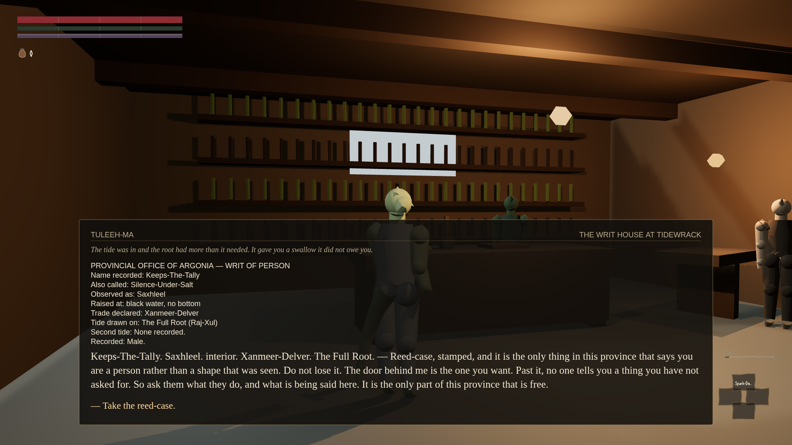

This game, like Morrowind, gives every character a small set of standard things you can ask any
stranger — about their trade, their background, what's going on nearby, and so on. A round of work
this afternoon found that most of this world's people had nothing to say to any of it, and fixed it:
where three hundred and thirty-six people were written into the game, a proper measurement found only
a hundred and thirty-three of them could actually answer a single one of the standard questions.
After the fix, all three hundred and thirty-six can.

Fixing it in the game's own data isn't proof it works when played, so the fix was tested by
teleporting into an actual town, walking up to real people, pressing the button, and asking. The
first run, in Gideon, passed eight of ten checks and failed two — and both failures turned out to be
mistakes in the test itself. One check wrongly expected a shopkeeper's answer about their own trade
to change depending on which town they stood in; it correctly didn't, because a trade answer is
supposed to follow the person, not the place. The other check had three basic facts wrong about how
to remote-control a person in the test rig, so people who were perfectly reachable looked as if they
weren't.

Running the identical test again in a second town, Stormhold, is where it got interesting. That run
caught four more mistakes that Gideon's run had let straight through, none of them a fault in the
game: a trick used elsewhere in the test to relocate someone for a "does the answer change if they
move" check had accidentally renamed the person as well, so the game correctly complained nobody by
that name existed; one shopkeeper turned out to be genuinely indoors and out of reach, which the test
had no way to explain until a proper diagnostic was added; and the check for whether someone could be
seen was being asked in the very instant after loading a saved game, before the world had taken even
a single step to work out who was actually visible — at that exact moment, everyone reports as
visible whether they are or not.

While all this was being argued out, a different piece of work landed eleven entirely new
inhabitants — Agacephs, Paatru, a Sarpa flier and others — none of
whom had existed an hour earlier. Every one of them could immediately answer all nine standard
questions, with not a single line written for any of them personally. That is the fix working as
intended: it built a fallback answer everyone gets by default, rather than a hand-written list keyed
to each person's name, so a name nobody had heard of an hour before is already able to hold a
conversation. A hand-written list would have needed updating, by someone, for every one of the eleven.

What's still thin: those eleven new people answer questions about their own background and trade with
exactly the same generic line as everybody else, because nobody has written them one yet. And forty
lines of dialogue in the game are addressed to kinds of person nobody in the world is recorded as
being — more than half of them to a provincial magistrate, one of the game's six standard voices,
which has no actual character behind it at all. That gap predates this round and is still open.
