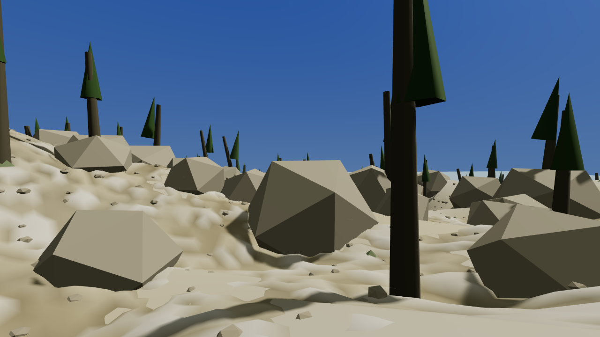
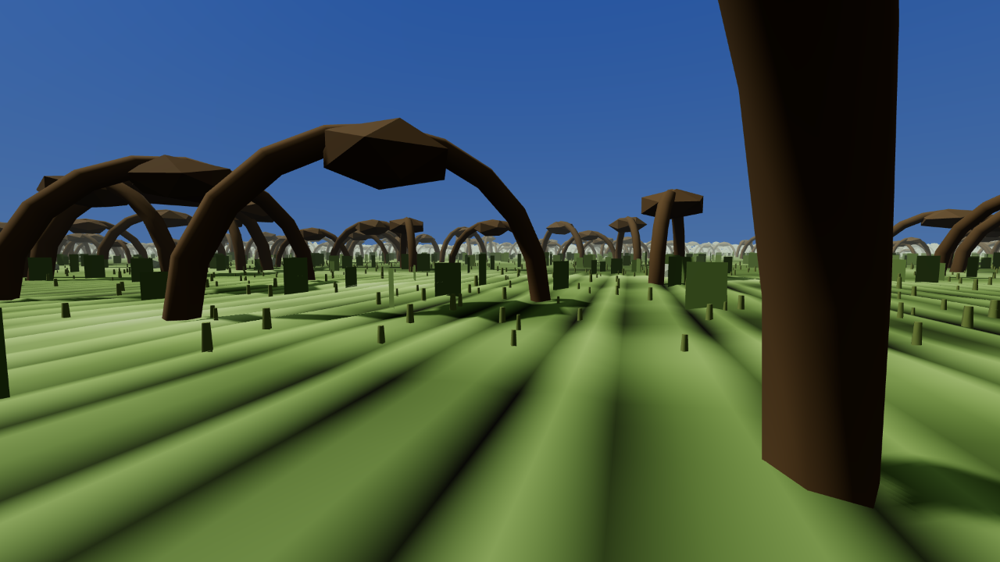

The world is too big to hold in memory at once, so it gets built in squares around wherever you
are and thrown away behind you. That is ordinary and every game of this size does it. What had
never been noticed here is that the building only happened when the game moved you somewhere
instantly. If you walked, nothing was built. About eight hundred metres out from wherever you had
last arrived, you walked off the end of what existed.

This was found by a reviewer who had been asked to look at something else entirely — the tool the
project uses to take screenshots — and who went through the code listing every place that asks for
ground to be built. There were four. Loading a new place asks for it. Teleporting asks for it. A
scripted walk asks for it, but only if it is specifically told to, which nothing in the game ever
does. And the screenshot tool asks for it. None of those four is the game running.

There was also a routine written specifically to do this every frame, sitting finished in the
file, with nothing anywhere in the project calling it.

Then it was measured. A character walked three kilometres at an ordinary pace and the ground was
checked underneath them thirty times along the way. For the first seven hundred and fifty metres
there was ground. After that there was not, and twenty of the thirty checks found nothing at all
beneath the character's feet.

The screenshot tool is why nobody caught it sooner. It asks for the ground itself, at the camera,
before every picture it takes. So every picture published from this project so far has been of a
world that existed, taken in a build where the world did not exist unless something asked for it.
The pictures looked fine. The running game was hollow.

The charter this whole thing is built to says the world takes about an hour to cross on foot. It
was not that the hour on foot was unmet. It could not be attempted.

It has since been fixed, and somebody walked the crossing. Stormhold to Helstrom to Blackrose to
Lilmoth, six and a half kilometres, fifty-five minutes at a walking pace, through salt hills and a
ridge and a stone forest and Blackwood and the deep marshes and out into the rootlands. The ground
was checked underfoot thirty-four times along the route and it was there every time.

:::compare Two points on that walk. The ridge is about four hundred metres in, which the old build
could still have shown you. The rootlands are nearly four kilometres in, and until this afternoon
nobody could have arrived there on foot. The lighting is flat and the shapes are simple; that is
where the art stands at the moment and it is not what these are for.

:::

Building terrain while the game is running is exactly where stutters come from, so the work is
spread thin rather than paid in a lump: never more than one square at a time, and never two frames
running. It can afford to be that slow. At walking pace you only cross into new squares once every
couple of minutes, and by then they have been under construction for the last six hundred metres.
