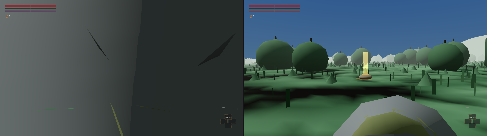
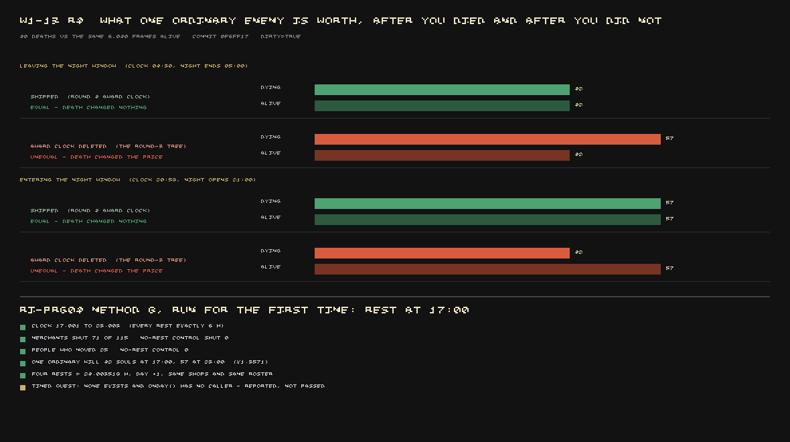
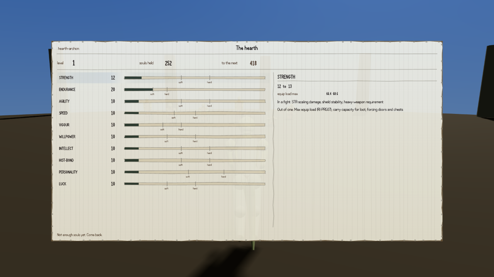

[We told you](#2026-08-07-souls-you-cannot-spend) the death loop worked: die, drop everything you
were carrying where you fell, walk back and pick it up. A reviewer had done it on foot rather than
through the testing tools, walked two hundred metres out and back, and got every soul returned.
What we didn't tell you is that later the same day, someone ran all thirty-seven separate checks on
that loop together, for the first time, instead of one at a time — and two of them turned red at
once. What came out of chasing those down is worth its own ending, in three parts.

## The mark that couldn't be seen — except it could

Running every check together rather than separately matters because some faults only show up when
one test's mess gets inherited by the next one. Here it found something that looked serious: the
glowing mark that holds your souls after you die was visible from only one of eight directions in
daylight, and three of eight in the dark. The whole recovery loop is a walk back to that mark. If
you genuinely couldn't see it from most angles, that's the worst thing wrong with this piece.

It turned out to be wrong about the game, and right about the test. The camera used to check
whether the mark could be seen was placed at head height above the *ground under the mark* rather
than the ground under the observer's own feet — and from one of the eight angles, that put the
camera's eye inside a boulder.

:::compare The same instant, the same dropped mark, two cameras. On the left, the old test's
camera — placed at head height over the wrong patch of ground — looking at the inside of a rock.
On the right, a camera placed properly, from where a player would actually be standing.

:::

Placed correctly, the mark reads from all eight directions, twelve metres out in daylight and six
in the dark — and deliberately drinking the mark and checking again confirms the test can still see
nothing when there's genuinely nothing there. One real fault was hiding in the same investigation:
dying twice in a row was leaving no mark on the ground at all, because the way the check was staging
a second death happened to put it right on top of the spot you'd respawn, so the pile — worth
nothing, since you hadn't picked anything up yet — was invisibly recovered the instant you stood up.
Fixed by making sure a staged second death happens somewhere you aren't about to walk straight back
onto.

## Dying was quietly worth money

The same deeper look tested something nobody had checked before: does resting at a campfire for six
hours actually do what it's supposed to? It does — seventy-one of a hundred and fifteen shops that
were open at five in the afternoon were shut by eleven that night, a quarter of the town's people had
moved to somewhere different, and an ordinary enemy was worth more to kill at night than in the day,
as intended. A version of the same test that stepped forward the same stretch of time *without*
resting changed none of it, which is what proves the rest is doing the work.

But dying is deliberately exempt from costing you any game time at all — you shouldn't lose a
quest's deadline because a boss killed you six times in a row — and the system that decides how many
souls a kill is worth had been reading the very same clock that death was correctly freezing. So the
frames you spend dead were quietly still counted as whatever time of day you died at. Die right
before night falls and keep dying, and every kill you make afterwards gets paid at the more generous
night rate for as long as you keep doing it. Measured directly: an ordinary kill that should pay
forty-two souls was paying fifty-seven — over a third more — purely from the timing of your deaths.

The fix gives souls their own clock, one that keeps ticking through a death instead of freezing, but
is properly reset whenever the real clock is set directly — a rest, or loading a save. With it in,
dying and staying alive for the same stretch of time now pay exactly the same, at both ends of the
day.

## Enemies that came back worth nothing, and a way to be paid forever

The last piece closes something [we told you](#2026-08-07-nothing-had-ever-given-you-a-soul) about
only from one side: that killing things now pays you souls at all. It turns out the system deciding
*whether it has already paid you* for a kill was checking the creature's name, not the actual body —
which sounds reasonable until you remember enemies respawn under the same name.

That one mistake produced two opposite symptoms. Kill five of six raiders at a roadside camp, walk
off and come back, and every one of them is standing there again at full health — including the
five you'd already killed — worth nothing, because the game recognised their names as already paid.
And separately, saving the game and reloading wiped the world's memory of who you'd killed while
leaving the souls system's memory untouched, which meant a save and reload could be used to farm the
same handful of bodies for souls indefinitely.

The fix tracks the actual body rather than its name: an untagged fight now pays the same amount both
times you're made to fight it in one sitting, a partly-cleared group correctly pays only for the
survivor when you finish it off, and the whole group only becomes payable again once you've properly
rested. Deleting the fix and re-running the same trials reproduces both original symptoms exactly.

What's still not right: a narrower version of the reload trick survives, tied to which bodies the
*world itself* remembers as dead rather than what they were worth. It's filed against the piece that
owns the world's memory of population, not this one, and is left deliberately failing rather than
quietly patched over here.
