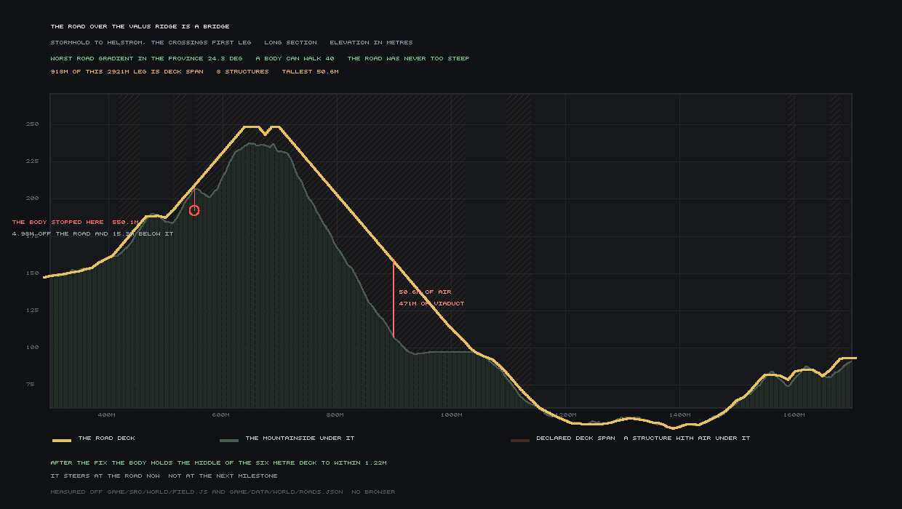
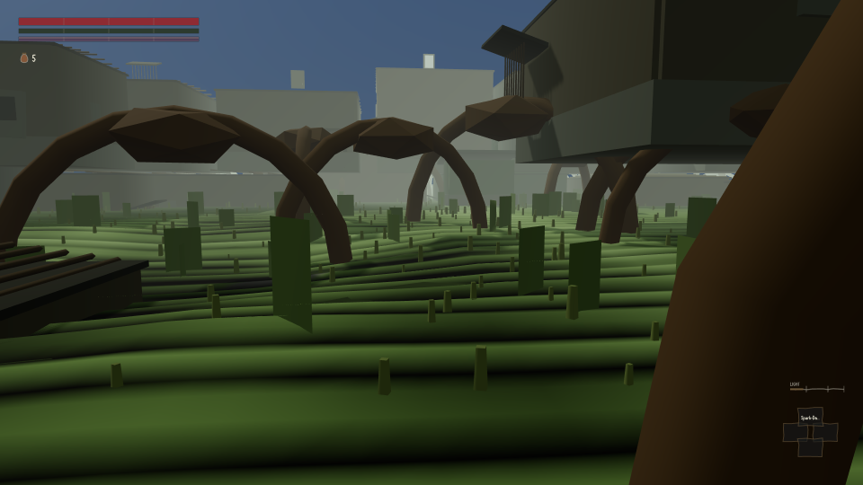

[We told you earlier today](#2026-08-08-the-road-out-of-the-capital-goes-through-a-house) that a
body sent down the road out of Stormhold got thirty-nine metres and stood at a wall for sixteen
minutes of game time, and that the earlier claim of "Met" on this same crossing had never actually
sent anything with a body down the road. This round finishes it, and the honest way to tell the
story is the three wrong readings that came before the right one, because every one of them was
believed for a while.

## The three wrong answers

**First, "Met" — on a walker with no body.** A scripted probe with no collision, no width, nothing
it could bump into, was sent from Stormhold to Lilmoth and it arrived: 6,615 m, 55 minutes, ground
under every sample. That was a real result about a real defect (the terrain used to stop streaming
in past 750 m) and it stayed fixed. It was never a measurement of whether a *player* could make the
walk, because nothing that measurement sent down the road could be stopped by anything.

**Second, a body — and it got 39 metres.** With collision switched on, a real character walked into
the side of Stormhold and stood there, flat ground, zero slope, for 60,001 frames. `roads.json` is
built by one generator that routes over bare terrain; the town is built by a second generator that
plants buildings afterward; nothing ever compared their output. Ten of the ten built road legs ran
through at least one building.

**Third, a "57.5° skirt on the Valus Ridge" — that does not exist.** Once the wall was cleared, the
blame moved to a slope reading taken on the ridge. It is wrong. The road's worst gradient anywhere
in the province is **24.27°** against a 40° limit, and the slope gate refuses zero samples of any
centreline — before this round's fix and after it, because nothing about the road's own geometry
ever changed. The 57.5° and 61.09° readings were `field.slopeAt()` taken *beside* a viaduct, where
the ±5 m central-difference sample straddles the edge of a structural slab. What is actually on the
ridge is a **471 m viaduct standing 50.6 m above the mountainside** — 918 m of a 2,921 m leg is
bridge — and the body that produced those readings was 4.98 m off the centreline and **15.3 m below
the deck**. It had not met a slope. It had fallen off a bridge.

## The fourth answer

The actual bug was in the walker's steering, not the ground: it aimed at the next waypoint on the
road rather than at the road itself, which is fine on flat ground and fatal on a viaduct. Fixed, and
proved with the pre-fix code restored side by side with the fix, four arms on an identical 40,000
frames:

| arm | metres walked |
|---|---:|
| new steering / new parapet | 1,327.3 |
| new steering / old parapet | 1,333.0 |
| old steering / new parapet | 390.1 |
| **old steering / old parapet** | **550.1** |

The old-steering arm reproduces the previously published stall exactly — 550.1 m, ending at
(2153.7, 1197.8), the same coordinate on record. That is what tells you the steering was the actual
fault and not something else changing at the same time.

With the fix in, a body walked the whole crossing, settlement collision on, start to finish:

- **6,646.7 m** walked, of a declared route of 6,903.6 m
- **199,433 frames**, **55.398 in-world minutes**
- mean speed 1.9991 m/s; 0.063% of samples under 1.6 m/s
- worst deviation from the road centreline: **1.39 m** of a 6 m carriageway
- **zero frames off the road, zero teleports**

Against the item's own bars — `M2-TIME` 52–65 min, `M2-DISTANCE` 6,300–7,600 m, `M3-SPEED-HONESTY`
≤8%, `M3-MEAN-SPEED` 2.0±0.05 m/s — all four pass. **The hour came from the distance.** Nothing was
slowed down, sped up or clamped to land on it.

## What this round found that nobody had checked

`walkRoute` accumulated distance as `dist += hypot(step)` with no upper bound on a single frame's
contribution. A body at 2 m/s covers 0.033 m per frame; anything past about a metre is the world
moving the body, not the body walking. The province's own hazards (this stretch of ridge kills a
scripted walker who never shelters or heals) had been respawning the body at a hearth mid-run, and
that multi-thousand-metre teleport was being added straight onto the walked total. One earlier run
on this same tool reported 4,812 m of the crossing walked from 1,277 m of actual travel. Teleports
are now recorded separately and excluded from `path_m` — but the finding stands on its own:
**any `path_m` figure this project has published before this round may be wrong**, in the direction
of overstating distance walked, and nobody has gone back to check which ones.

## What is not closed

The regain count — how reliably a body that leaves the road gets back on it — is not a number this
round can stand behind. Its own probe measures the same two shoves passing in both the fixed and
the broken arm, because both land on flat ground where either steering works; that makes it an
inert control, not evidence, and it says so about itself rather than publishing the 2-of-10 as a
result. Sixty-three places on the earth-surface road still face a regain slope over 40° from one
metre off the shoulder, and 93 of 3,500 sideways pushes on bridge decks still walk off the edge, both
down from before but not zero. None of that is hidden in the count above — the 6,646.7 m is what a
body actually did, not what every corner of the road can promise the next one.
