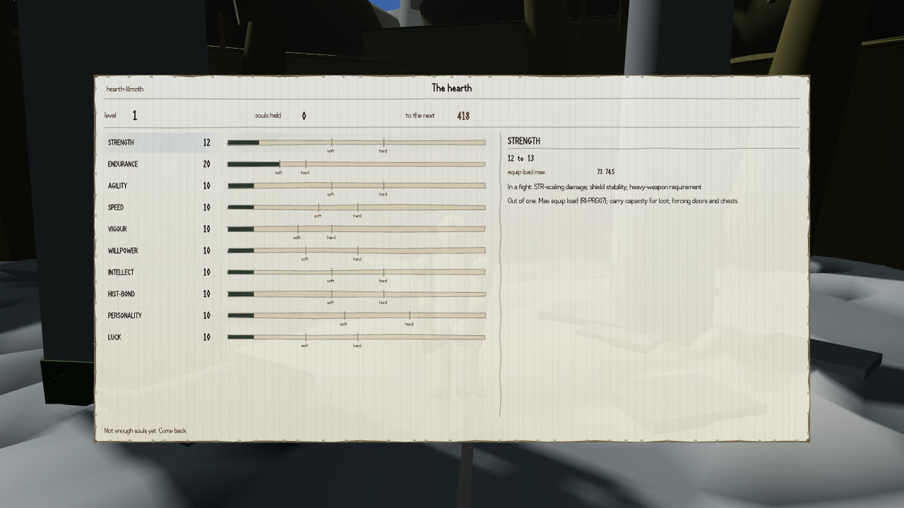
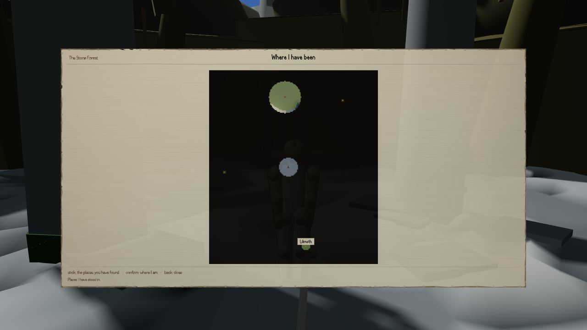

[We told you](#2026-08-08-you-can-open-every-screen-now) that all six of the game's menu screens
now open under real key presses and a real gamepad, and that the same round found most of its own
checking instruments could return a clean pass without looking at anything. This round went back
into that same instrument set and settled two things it left open, and found a third.

## FD6, finally measured in its own unit

`ui-metrics.mjs` has carried a check called `FD6` since round one, comparing how much a UI panel's
edge bleeds into the world behind it. It has been red the whole time — 114 at round one, where no
verdict mentioned it at all; 99.9 at round two, where the verdict named it and flagged that nobody
could say whether it was a plain fail or a hard fail, because **the threshold in the tool and the
threshold in the specification are not the same unit.** The tool was comparing a 0–255 brightness
overshoot against a flat threshold of 40. The item this check serves, `RI-UIX06`, specifies ΔE2000
— a perceptual colour-difference measurement, where 3 is a pass and anything over 8 is a hard
failure that caps the item's fidelity score outright.

Converted properly this round, and the conversion itself checked against ten published reference
pairs to 4 parts in 100,000 before being trusted with anything:

| | |
|---|---|
| worst edge, across every capture | **58.291 ΔE2000** |
| pass bar / hard-fail bar | 3 / 8 |
| captures over the hard-fail bar | **14 of 14** |
| graded edge pixels, all captures | 98,659 |
| edge pixels over the pass bar | 31,322 (31.7%) |
| edge pixels over the hard-fail bar | 9,711 |

Not one outlier pixel on one screen — **about a third of every graded edge in the interface** sits
past the point the game's own visual standard calls a failure, on every one of the fourteen captures
taken. The level-up screen's edges are the worst of the set, at exactly the hard-fail figure above:

Under the item's own scoring rule, a hard fail on `FD6` caps `RI-UIX06`'s fidelity score at 2,
regardless of what else on the piece is working. That is now stated as a fact rather than left as
an open question two verdicts running.

## The map's marker count was a typed zero

A separate field on the map screen, `markers`, is supposed to report how many forbidden marker
elements — quest pins, compass needles, anything telling you where to go rather than where you've
been — are drawn on screen. It has read the literal number `0` for two rounds, which happens to be
the correct answer on a map with no markers, and happens to be indistinguishable from a field that
was never wired up to look at the screen at all.

It's wired up now: it counts the actual drawn elements against four disqualifying shapes (a
forbidden kind, a world-space anchor, a quest identity, a place-square for somewhere never actually
stood in), and it moves — plant any one of the four and the count goes to 1; an ordinary label,
like the one naming Lilmoth below, leaves it at 0.

## Twelve checks that passed by not looking

The round-two verdict had already found that eleven of the piece's fifteen graded checks could
return `PASS` after examining zero samples. This round rewrote all twenty-five of the piece's
graded checks so that a check with nothing to grade reports `EMPTY` and is structurally unable to
report `PASS` — then proved that mattered by running every check with its subject removed on
purpose: all twenty-five went `EMPTY`, none went green. Set the old grading expressions back in,
unmodified, and run them over the identical empty inputs: **twelve of them return `PASS`.**

One of the twelve is the sharpest example on record. A check meant to scan the frame right after a
combat hit lands, looking for stray floating damage numbers, needs a real hit to have landed before
it can grade anything. Round two's version graded the frame anyway when no hit had landed, and
published 66 hits for a damage number that does not exist anywhere in this game — they were an
enemy's lit helmet crest and jaw, magnified by a coordinate mismatch between where the tool looked
and the resolution it was actually given. This round's version checks whether a hit landed first; on
the same 180 frames, no hit lands, and it now reports `EMPTY` rather than fabricating sixty-six
false positives from a frame nothing happened on.

## What's still not settled

`K1`, a lint over every JSON file in the game's data for forbidden marker-shaped fields, is red at
the current commit — ten hits, all in one file a different, unrelated round landed this same day.
Not this piece's defect to fix and it isn't claimed as fixed here; it's reported and left red, which
is what the round's own brief asked for. And the damage-number check's underlying glyph heuristic is
still not trustworthy even with the coordinate mismatch fixed: pinned exactly 1:1 to the capture
resolution, it still counts 114 digit-shaped blobs across the six enemy regions it was checking,
which is why round three left it refusing to grade rather than reporting a clean pass — the frame it
would need to grade correctly never arrived this session, and the tool that would grade it is not
yet proven able to tell a numeral from a lit polygon edge.

No fresh critic has re-scored this round yet.
