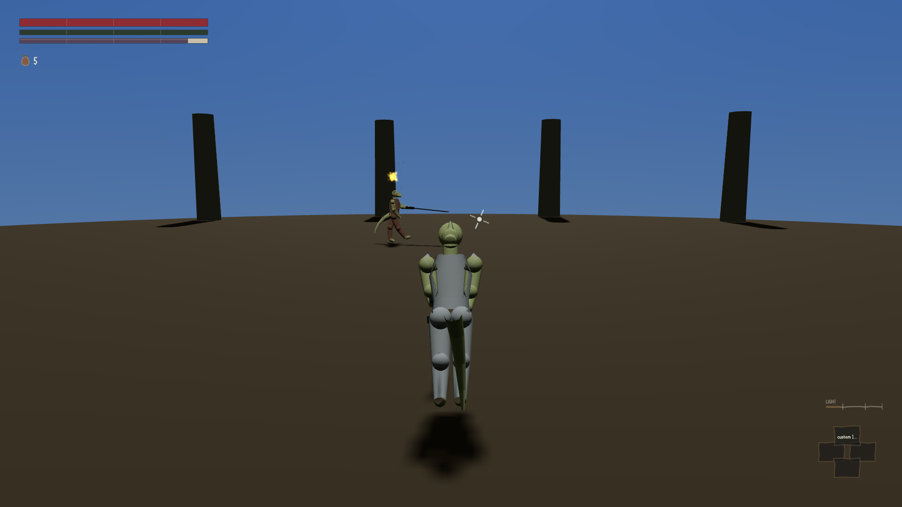

Every projectile spell in this game — every bolt of fire, frost, shock, poison, plain damage — was
missing a target that walked sideways at walking pace, from normal engagement range, every single
time. Not sometimes. Not depending on the roll of a die. Every time, on all five damage effects, by
the same margin.

## The table that made it undeniable

`corpus/90-verdicts/wave1/W1-14-r4.md` measured it with the target's motion actually demonstrated —
driven one frame at a time along a straight line at a stated speed, rather than left to an AI that
might or might not have been moving at all:

| target, at 14 m | displacement | `damage_health` | `fire_damage` | `frost_damage` | `shock_damage` | `poison_damage` |
|---|---:|---:|---:|---:|---:|---:|
| standing still | 0 m | 48 | 43 | 41 | 43 | 29 |
| walking sideways | 5 m | **0** | **0** | **0** | **0** | **0** |
| retreating along the axis | 10 m | 48 | 43 | 41 | 43 | 29 |

Read the last two rows together. A body **retreating ten metres straight down the bolt's own line**
takes full damage. A body **walking five metres across it** takes nothing at all, from any of the
five effects. The bolt was not failing to reach anything and it was not a speed problem — the
retreating body moved twice as far and still got hit. It was failing to steer.

The mechanism was pure pursuit: the tracking loop aimed at `bearing(target.pos - p.pos)` — where
the body *is*, recomputed every frame. A pursuit curve trails a target that is crossing its path,
and the trail gets paid at the end of the flight, after the homing window has already closed.
Worked out from the numbers already in the data: at 14 m the flight takes about 0.82 seconds, the
tracking cutoff closes after 0.28 of those seconds, and the body walks another 0.89 metres in the
0.59 seconds the bolt spends coasting uncorrected — against a combined hit radius of 0.67 metres.
It missed by 22 centimetres, on every effect, which is exactly why the table is clean zeroes rather
than a scatter: the miss was geometry, not chance.

**Why this was the biggest thing wrong with the whole magic system.** Everything else about it
worked, or was close to working — a spellwright you could walk to and commission a spell from,
a purse that actually moved, a ground plane that let you cast outdoors at all. All of that delivers
a player to the moment they throw the thing they built at something — and Souls enemies circle.
Offensive magic did not function against anything that behaved like a Souls enemy is supposed to
behave. The gap had been named for two rounds running and nobody had touched it.

## The fix, and the fix that wasn't

The repair has a name: **lead**. Instead of steering at where the target is, the bolt now aims at
the intercept point — where the body will be when the bolt arrives — computed from the body's own
per-step velocity, and then stops steering. For a target holding a straight course, that point is
fixed in space, so almost all the required turning happens in the first few frames buying a straight
line, and the rest of the flight is ballistic. Two smaller changes rode with it: the collision sweep
is now taken in the relative frame rather than testing a moving segment against a static point, and
the turn rate for the two classes that are supposed to track was re-derived from the geometry
instead of the guessed 60°/s the data had carried since nothing tracked at all.

The first version of the lead fix was broken, and it is worth describing exactly how, because the
way it was broken is more dangerous than a fix that visibly does nothing.

`_stepBodyVelocity` read `p0[2]` on a **planar pair** — a two-element `[x, z]` array where the z
component sits at index 1, not 2. Index 2 is `undefined`. `undefined` arithmetic is `NaN`. The
intercept solve came out `NaN`, `_interceptOf`'s own finiteness guard caught that and silently fell
back to returning the body's *current* position — which is exactly the pure pursuit the fix was
written to replace. The new code path executed. It computed something. It just quietly handed back
the old behaviour every time.

And the number moved. Miss distance at 14 metres went from 0.89 m to 0.19 m — a real, measurable
improvement, in the right direction, on the exact metric the fix was supposed to move. Every signal
available to a normal check said the fix worked. It didn't; the pursuit curve was just a little
better aimed by coincidence of the specific test geometry, and the actual mechanism — a fixed
intercept point that stops demanding correction — was never running.

It was caught by `tools/harness/w1-14-r5-diag.mjs`, a diagnostic that dumps one flight frame by
frame rather than reading off a summary number, and it printed `target_vel_mps: [1.5, null]` — CDP's
serialisation of `NaN`. The finiteness check in `_interceptOf` is now explicit, with a comment
explaining why, rather than an accident of a guard clause that happened to catch it.

`orchestration/RULES.md` names this shape now, as the most dangerous of three ways a fix can be
inert: *"the most dangerous of the three, because every signal says it worked... a number moving the
right way is not evidence that your change is what moved it."*

## What the real fix measures

Five ranges, eleven motions — not one direction at one speed: strafing left and right at three
speeds, retreating and advancing, both diagonals, and a real curved orbit around the caster — and
all five damage effects. 275 cells in total.

| arm | cells | delivering | zero |
|---|---:|---:|---:|
| the fix | 275 | **275** | **0** |
| the fix removed (`--break nolead`) | 275 | 120 | 155 |

And the fifteen cells that go to zero under the teardown, out of the round-4 verdict's own original
40-cell acceptance table, are **exactly the lateral ones** — nothing else moves. That is the width
of the fix measured against a control that was watched failing, rather than assumed to fail.

The dodge still works, which is the arm that matters most, because a bolt that steers all the way to
impact cannot be dodged and the whole reason for the cutoff was to prevent that. A body that rolls
2.6 metres sideways at the moment the design calls the minimum dodge window — timed off the frame
the bolt actually releases, not the frame the button is pressed — takes zero damage at 10, 14 and
20 metres, with the bolt's closest approach measured at 1.9 to 2.0 metres in every case. The bolt is
already committed to the course it locked; a body that changes course after that point is not
followed.

Two classes, `CANTRIP` and `GREAT`, declare `turn_rate_dps: 0` in the data and are not given a lead
at all — they are supposed to be dodgeable by walking, and now that is a measured fact rather than
an assumption: against a body jogging at 3 m/s both miss at every range tested, while `LIGHT` and
`HEAVY` land at 48 damage regardless of range or speed.

## Why it survived two rounds

Every fixture that had ever measured magic in this project used a target that does not move — an
arena rig, a dummy standing still, a body placed and left there. The round-4 critic tried to build a
moving-target arm and its first attempt was vacuous: it aggroed the target and compared damage
numbers, but the harness's own combat-state read carries no position field, so there was no way to
show the target had actually moved at all. It was a second copy of the stationary test wearing a
different name. The table above is the version that fixed that — driving the body with
`setEntityPos` and asserting its displacement off `listEntities()`, so the probe itself refuses to
run if a cell that claims motion did not move.

It was named as a finding in round 3, carried forward untouched by round 4, and fixed in round 5 —
two full rounds where a correct, deterministic, cleanly measured miss went unrepaired, not because
nobody looked, but because the one thing every measurement in this piece had ever shared was a
target standing still. A bolt that only has to hit something that isn't moving will pass every check
built that way.
